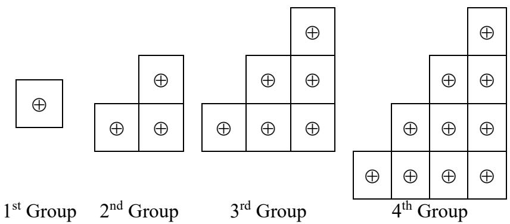
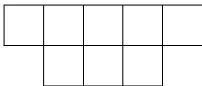
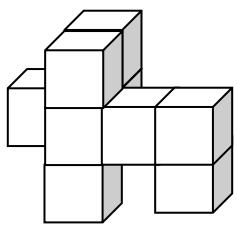
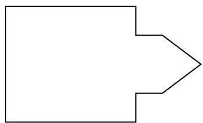
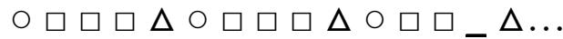
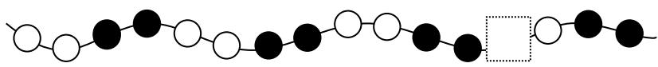
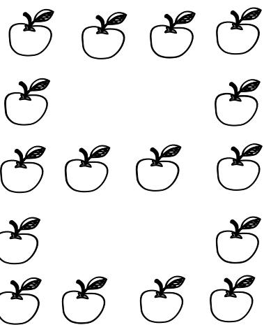

# Primary 1

Time allowed: 90 minutes 

## Question Paper

## Instructions to Contestants:

1. Each contestant should have ONE Question-Answer Book which CANNOT be taken away. 

2. There are 5 exam areas and 5 questions in each exam area. There are a total of 25 questions in this Question-Answer Book. Each carries 4 marks. Total score is 100 marks. No points are deducted for incorrect answers. 

3. All answers should be written on ANSWER SHEET. 

4. NO calculators can be used during the contest. 

5. All figures in the paper are not necessarily drawn to scale. 

6. This Question-Answer Book will be collected at the end of the contest. 

THIS Question-Answer Book CANNOT BE TAKEN AWAY. DO NOT turn over this Question-Answer Book without approval of the examiner. Otherwise, contestant may be DISQUALIFIED. 

Open-Ended Questions $( 1 ^ { \mathrm { s t } } \sim 2 5 ^ { \mathrm { t h } } )$ (4 points for correct answer, no penalty point for wrong answer) 

## Logical Thinking

1. If yesterday was Friday, which day of the week will the day after tomorrow be? 

2. What is the greatest possible number of Monday(s) among one month? 

3. A student needs to finish HKIMO Heat Round within 90 minutes. How many minute(s) is / are required for 10 students to finish HKIMO Heat Round altogether? 

4. According to the pattern shown below, what is the number in the blank? 

$1 \cdot 7 \cdot 1 3 \cdot 1 9 \cdot 2 5 \cdot 3 1 \cdot - \cdot \ \cdot \ \cdot \ \cdot \ \ \cdot \ \ \cdot \ \ \cdot \ \ \cdot \ \ \cdot \ \ \cdot \ \ \cdot \ \ \cdot \ \ \cdot \ \ \cdot \ \ \cdot \ \ $ 

5. According to the pattern shown below, how many  is / are there in the $1 0 ^ { \mathrm { t h } }$ group? 

Question 5

## Arithmetic

6. Find the value of $1 + 2 + 4 + 5 + 6 + 8 + 9$ . 

7. Find the value of $3 6 + 1 3 - 6$ 

8. Find the value of $5 - 5 + 5 - 5 + 5 - 5 + 5 - 5 + 5$ . 

9. What is the number that should be filled in the blank if the equation below is correct? 

$$
3 4 - \_ = 2 5
$$

10. If B is a 1-digit number, what is the value of B if the equation is correct? 

$$
1 \quad 2 \quad - \boxed {B} = \boxed {B}
$$

## Number Theory

11. Amy has 13 apples and John has 5 apples. How many apple(s) does Amy have to give John to make them to have the same number of apples? 

12. Fill the lines with ‘ + ‘ and ‘ – ‘ to make the equation below correct. (Write down the complete equation in the answer sheet) 

1 3 5 7 = 2 

13. Fill the lines with ‘ + ‘ and ‘ – ‘ to make the equation below correct. (Write down the complete equation in the answer sheet) 

1 2 3 4 5 = 3 

14. How many two-digit odd number(s) is / are there? 

15. Determine the result of $1 + 3 + 5 + 7 + 9 + 1 1 + 1 3 + 1 5 + 1 7 + 1 9 + 2 1$ is odd or even. 

## Geometry

16. How many square(s) is / are there in the figure below? 

Question 16

17. At least how many cube(s) is / are there in the figure below? 

Question 17

18. How many side(s) is / are there in the polygon below? 

Question 18

19. According to the pattern shown below, what is the figure in the space provided? 

Question 19

20. According to the pattern shown below, what is the figure in the space provided? 

Question 20

## Combinatorics

21. Which number below is the smallest? 

20180831 、 20180506 、 20180512 、 20180901 

22. Choose 2 digits, without repetition, from 1, 2, 7 and 9 to form two-digit numbers. How many different number(s) is / are there? 

23. According to the following numbers, how many odd number(s) is / are there? 

1, 1, 2, 4, 7, 13, 24, 44 

24. What is the smallest 3-digit number by choosing 3 numbers from 3, 6, 1 and 0? (Each number can only be used once) 

25. Ming would like to pick up all on the floor. What is the minimum distance that he needs to travel? ? The distance between adjacent is 1 metre. 

Question 25

## ~ End of Paper ~