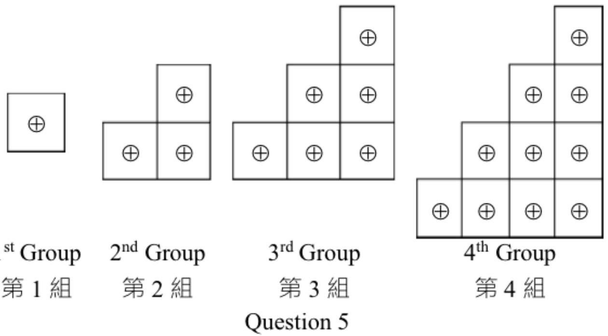
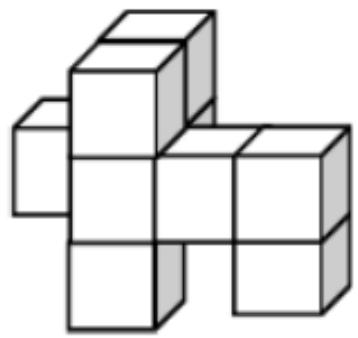
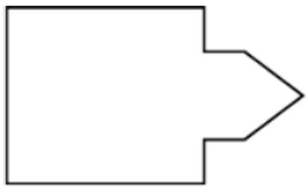
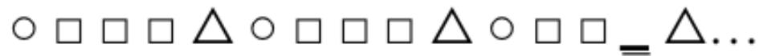
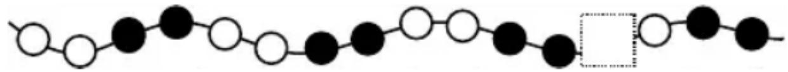
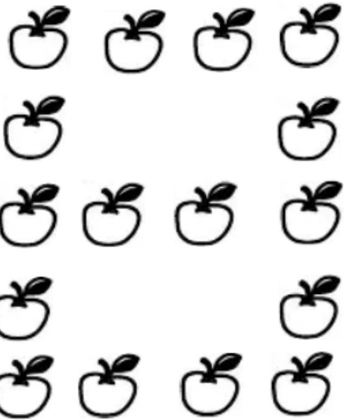

香港國際數學競賽初賽 2019

HONG KONG IN 

MATHEMATIC 

HEAT ROUND 2019 (HONG K 

# 小學一年級 Primary

Time allow 

模擬試題

Mock Paper 

考生須知：

Instructions to Contestants: 

本試題不可取走。

THIS Question-Answer Book CANNOT BE TAKEN AWAY. 

未得監考官同意，切勿翻閱試題，否則參賽者將有可能被取消資格。

DO NOT turn over this Question-Answer Book without approval of the examiner. 

Otherwise, contestant may be DISQUALIFIED. 

填空題（第1至25題）（每題4分，答錯及空題不扣分）

Open-Ended Questions ( $1^{st} \sim 25^{th}$ ) (4 points for correct answer, no penalty point for wrong answer) 

# Logical Thinking

# 邏輯思維

1. If yesterday was Friday, which day of the week will the day after tomorrow be? 

昨天是星期五，問後天是星期幾？

2. What is the greatest possible number of Monday(s) among one month? 

在一個月內，最多可以有多少個星期一？

3. A student needs to finish HKIMO Heat Round within 90 minutes. How many minute(s) is / are required for 10 students to finish HKIMO Heat Round altogether? 

1 名學生需於 90 分鐘內完成 HKIMO 初賽，問 10 名學生一共需多少分鐘內完成 HKIMO 初賽？

4. According to the pattern shown below, what is the number in the blank? 

按以下規律，求在橫線上的數字。

1 、7 、13 、19 、25 、31 、_ 、.... 

5. According to the pattern shown below, how many $\oplus$ is / are there in the $10^{th}$ group? 

按以下規律，問第 10 組有多少個 ⊕？

第5題

## Arithmetic

## 算術

6. Find the value of $1+2+4+5+6+8+9$ . 

求 $1+2+4+5+6+8+9$ 的值。

7. Find the value of $36+13-6$ . 

求 $36+13-6$ 的值。

8. Find the value of $5-5+5-5+5-5+5-5+5$ . 

求 $5-5+5-5+5-5+5-5+5$ 的值。

9. What is the number that should be filled in the blank if the equation below is correct? 

在以下算式填上甚麼數字會使算式正確？

$$
3 4 - \_ = 2 5
$$

10. If B is a 1-digit number, what is the value of B if the equation is correct? 

若 B 為 1 位數字，且以下算式正確，求 B 的值。

$$
1 \quad 2 \quad - \boxed {B} = \boxed {B}
$$

## Number Theory

## 數論

11. Amy has 13 apples and John has 5 apples. How many apple(s) does Amy have to give John to make them to have the same number of apples? 

艾美有 13 個蘋果，約翰有 5 個蘋果。要使兩人有相同數量的蘋果，艾美要給約翰多少個蘋果？

12. Fill the lines with ‘+’ and ‘-’ to make the equation below correct. (Write down the complete equation in the answer sheet) 

在橫線上填上加號或減號，使下列算式正確。（在答題紙上寫上完整算式）

1 ____ 3 ____ 5 ____ 7 = 2 

13. Fill the lines with ‘+’ and ‘-’ to make the equation below correct. (Write down the complete equation in the answer sheet) 

在橫線上填上加號或減號，使下列算式正確。（在答題紙上寫上完整算式）

1 ____ 2 ____ 3 ____ 4 ____ 5 = 3 

14. How many two-digit odd number(s) is / are there? 

問有多少個兩位奇數（單數）？

15. Determine the result of $1+3+5+7+9+11+13+15+17+19+21$ is odd or even. 

判斷1+3+5+7+9+11+13+15+17+19+21的結果是奇數（單數）還是偶數（雙數）。

## Geometry

## 幾何

16. How many square(s) is / are there in the figure below? 

請問下圖有多少個正方形？

<table><tr><td></td><td></td><td></td><td></td><td></td></tr><tr><td></td><td></td><td></td><td></td><td></td></tr></table>

Question 16

第 16 题

17. At least how many cube(s) is / are there in the figure below? 

下圖最少由多少個立方體組成？

Question 17

第 17 题

18. How many side(s) is / are there in the polygon below? 

下圖的多邊形有多少條邊？

Question 18

第 18 题

19. According to the pattern shown below, what is the figure in the space provided? 

按以下規律，橫線上的圖案應該是甚麼？

Question 19

第 19 题

20. According to the pattern shown below, what is the figure in the space provided? 

按以下規律，橫線上的圖案應該是甚麼？

Question 20

第20題

Combinatorics

組合數學

21. Which number below is the smallest? 

下列哪一個數的值最小？

20180831 、 20180506 、 20180512 、 20180901 

22. Choose 2 digits, without repetition, from 1, 2, 7 and 9 to form two-digit numbers. How many different number(s) is / are there? 

從 1、2、7、9 中選 2 個不可重複的數位組成兩位數。請問當中有多少個不同的數？

23. According to the following numbers, how many odd number(s) is / are there? 

求下列這些數中，有多少個奇數？〔奇數即是單數〕

1, 1, 2, 4, 7, 13, 24, 44 

24. What is the smallest 3-digit number by choosing 3 numbers from 3, 6, 1 and 0? (Each number can only be used once) 

從 3、6、1 和 0 選取 3 個數字組合成最小的三位數是多少？（每個數字只能用一次）

25. Ming would like to pick up all on the floor. What is the minimum distance that he needs to travel? 

The distance between adjacent $\bigcup$ is 1 metre. 

小明想把地上的全部拾起來，他最少要走多少米？每個相鄰之間相隔1米。

Question 25

## 第 25 题

~ 全卷完 ~
~ End of Paper ~