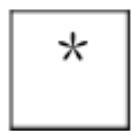
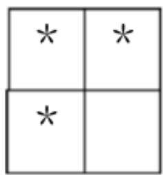
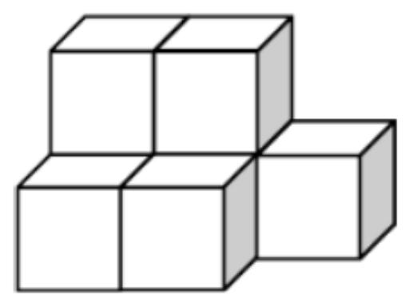
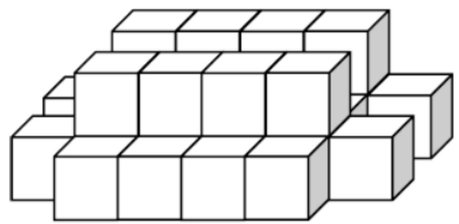
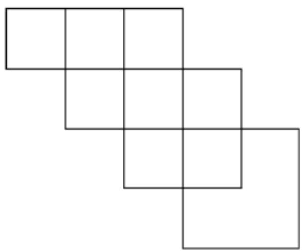
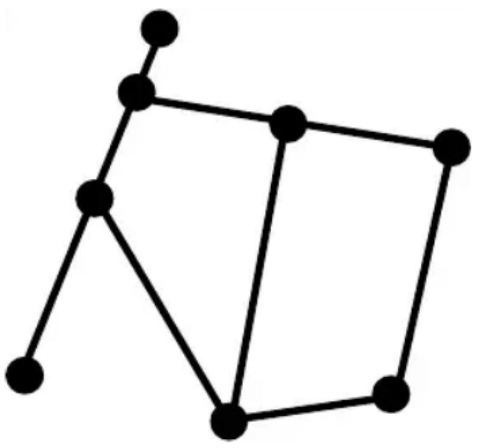
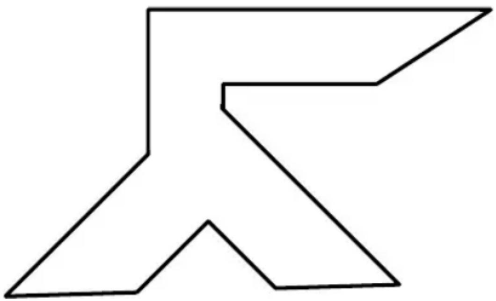
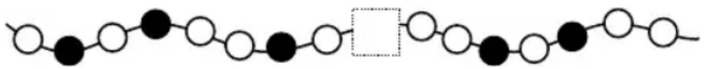

# Primary 1

Time allow 

## Question Paper

## Instructions to Contestants:

1. Each contestant should have ONE Question-Answer Book which CANNOT be ta 

2. There are 5 exam areas and 5 questions in each exam area. There are a total of 25 Question-Answer Book. Each carries 4 marks. Total score is 100 marks. No point incorrect answers. 

## Open-Ended Questions ( $1^{st} \sim 25^{th}$ ) (4 points for correct answer, no penalty point for wrong answer)

## Logical Thinking

1. According to the pattern shown below, what is the number in the blank? 

Berdasarkan pola di bawah ini, berapakah bilangan yang seharusnya ada pada “____”? 

9 ` 16 ` 23 ` 30 ` 37 ` 44 ` _ ` .... 

2. According to the pattern shown below, what is the English alphabet in the space provided? 

Berdasarkan pola di bawah ini, huruf apakah yang seharusnya ada pada “____”? 

Z ` C ` Y ` E ` X ` G ` W ` _ ` V ` .... 

3. 30 children form a column. There are 11 children in the front of Eric. How many child(ren) is / are behind him? 

30 anak membentuk sebuah barisan. Terdapat 11 anak di depan Eric. Berapa banyak anak ada di belakang Eric? 

4. 11 years ago, John was 5 years old. Mary is 9 years elder than Peter. How old is Mary now? 

11 tahun lalu, John berusia 5 tahun. Mary 9 tahun lebih tua dari Peter. Berapakah usia Mary sekarang? 

5. According to the pattern shown below, how many * is / are there in the 6 $^{th}$ group? 

Berdasarkan pola di bawah ini, berapa banyak * yang ada pada Kelompok 6? 

$1^{\mathrm{st}}$ Group Kelompok 1 

$2^{\mathrm{nd}}$ Group Kelompok 2 

<table><tr><td>*</td><td>*</td><td>*</td></tr><tr><td>*</td><td></td><td></td></tr><tr><td>*</td><td></td><td>*</td></tr></table>

$3^{\mathrm{rd}}$ Group Kelompok 3 

<table><tr><td>*</td><td>*</td><td>*</td><td>*</td></tr><tr><td>*</td><td></td><td></td><td></td></tr><tr><td>*</td><td></td><td></td><td>*</td></tr><tr><td>*</td><td></td><td>*</td><td>*</td></tr></table>

$4^{\text{th}}$ Group Kelompok 4 

Question 5
Soal no. 5 

## Arithmetic

6. Find the value of 11+27+24+13+29+36. 

Carilah nilai dari 11+27+24+13+29+36. 

7. Find the value of 19-36+47-21. 

Carilah nilai dari 19–36+47–21. 

8. Find the value of $7+9-6+7+9-6+7+9-6+7+9-6$ . 

Carilah nilai dari 7+9-6+7+9-6+7+9-6+7+9-6. 

9. What is the number that should be filled in the blank if the equation below is correct? 

Berapakah bilangan yang seharusnya ada pada “____” agar persamaan di bawah ini benar? 

$$
1 8 - \_ = 7
$$

10. If $A, B$ each represents different digit, what is the value of $B$ if the equation is correct? 

Jika A, B melambangkan angka berbeda, berapakah nilai dari B jika persamaan di bawah ini benar? 

$$
\begin{array}{r} {A B} \\ {+ A A} \\ \hline {7 2} \end{array}
$$

## Number Theory

11. By observing the numbers, which odd number is the greatest? 

Pada bilangan-bilangan di bawah ini, bilangan ganjil manakah yang terbesar? 

78 `63 `92 `86 `71 `62 `76 

12. The numbers below follow the arithmetic sequence, what is the $8^{\text{th}}$ number? 

Bilangan-bilangan di bawah ini mengikuti sebuah baris aritmatika, berapakah bilangan ke-8? 

64 ` 62 ` 60 ` 58 ` 56 ` ... 

13. A box of eggs has 12 eggs. Mum asks Mary to buy 30 eggs. Her neighbor asks her to buy 22 eggs. At least how many box(es) of eggs does Mary need to buy? 

Sekotak telur berisi 12 telur. Ibu meminta Mary untuk membelikan 30 telur. Tetangganya meminta dia untuk membelikan 22 telur. Setidaknya berapa kotak telur yang harus Mary beli? 

14. Eric has 77 coins and Peter has 15 coins. The total number of coins of between John and them is an odd number. Determine the number of John's coins is odd or even. 

Eric mempunyai 77 koin dan Peter mempunyai 15 koin. Jumlah koin keseluruhan yang dimiliki John, Eric dan Peter adalah ganjil. Tentukan apakah jumlah koin John ganjil atau genap. 

15. Determine the result of $1+3+4+6+7+9+10+12+13+15+16+18+19$ is odd or even. 

Tentukan apakah hasil dari 1+3+4+6+7+9+10+12+13+15+16+18+19 adalah ganjil atau genap. 

## Geometry

16. It is known that figure 1 is formed by 7 cubes. How many cube(s) is / are there in figure 2? 

Diketahui Bangun 1 terdiri atas 7 kubus. Berapa banyak kubus yang membentuk Bangun 2? 

Figure 1
Bangun 1

Figure 2
Bangun 2

Question 16 

Soal no 16 

17. How many square(s) is / are there in the figure below? 

Berapa banyak bujursangkar yang ada pada bangun di bawah ini? 

Question 17 

Soal no. 17 

18. How many line segment(s) is / are there in the polygon below? 

Berapa banyak ruas garis yang ada pada segibanyak di bawah ini? 

Question 18

Soal no. 18

19. How many interior angle(s) is / are there in the polygon below? 

Berapa banyak sudut dalam yang ada pada segibanyak di bawah ini? 

Question 19

Soal no. 19

20. According to the pattern shown below, what is the figure in the space provided? 

Berdasarkan pola di bawah ini, gambar apakah yang seharusnya ada di dalam kotak? 

Question 20 

Soal no. 20 

## Combinatorics

21. Which number below is the smallest? 

Bilangan manakah di bawah ini yang terkecil? 

20209542 ` 20206964 ` 20211643 ` 2021975 ` 20203195 

22. A 3-digit number is formed by choosing 3 numbers from 1, 3, 5 and 7. What is the difference between the largest and the smallest value? (Each number can only be used once) 

Sebuah bilangan 3-angka dibentuk dengan memilih dari antara 3 angka: 1, 3, 5 dan 7. Berapakah selisih antara bilangan terbesar dan bilangan terkecil? (Setiap angka hanya dapat digunakan satu kali 

23. Choose 3 digits, without repetition, from 1 to 9 to sum up. How many different 2-digit number(s) is / are there? 

Pilihlah 3 angka dari 1 sampai 9, tanpa pengulangan. Jumlahkan 3 angka tersebut sehingga membentuk bilangan 2 angka. Berapa banyak bilangan 2-angka yang dapat dibentuk? 

24. According to the following numbers, what is the difference between the number of even number(s) and odd number(s)? 

Pada bilangan-bilangan di bawah ini, berapa selisih antara jumlah (berapa banyak) bilangan genap dan bilangan ganjil? 

21, 33, 14, 36, 40, 19, 28, 4 

25. Choose 2 digits, without repetition, from 0, 1, 2, 5 and 7 to form 2-digit odd numbers. How many different number(s) is / are there? 

Pilihlah 2 angka, tanpa pengulangan, dari 0, 1, 2, 5 dan 7 untuk membentuk bilangan -bilangan ganjil 2-angka. Berapa banyak bilangan ganjil 2-angka yang terbentuk? 

~ End of Paper ~ 