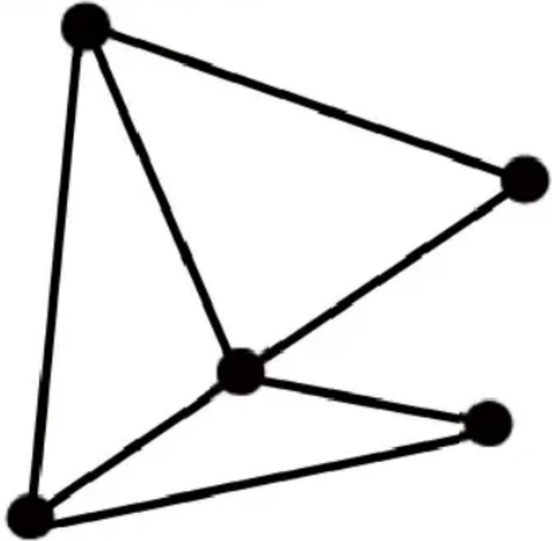

# 香港國際數學競賽初賽 2021 HONG KONG INTERNATIONAL MATHEMATICAL OLYMPIAD HEAT ROUN

## Primary 1 小學一年級

填空題（第1至20題）（每題3分，答錯及空題不扣分）
Open-Ended Questions ( $1^{st} \sim 20^{th}$ ) (3 points for correct answer point for wrong answer)

## Logical Thinking 邏輯思維

1. If tomorrow will be Wednesday, which day of the week before? 

明天是星期三，問四天前是星期幾？

2. Andy's father has 3 sons and Andy has 5 brother(s) and si many daughter(s) does Andy's father have? 

安迪的爸爸有3個兒子，而安迪有5個兄弟姐妹，問個女兒？

12. Mary has to biscuits and Peter has / biscuits. How many biscuit(s) does Peter have to ask Mary to give him to make Peter has 5 more biscuits than Mary? 

瑪麗有16塊餅乾，彼德有7塊餅乾。要使彼德比瑪麗多5塊餅乾，彼德要問瑪麗取多少塊餅乾？

## Geometry

## 幾何

13. How many line segment(s) is / are there in the polygon below?
下圖的多邊形有多少條線段？

Question 13

## 第 13 題

14. By observing the pattern, from left to right, what is the missing figure? 

觀察規律，從左至右數，消失的圖形是什麼？

## Question 14

## 第 14 題

19. Choose 2 digits, without repetition, from 5, 2, 9 and 6 to form 2-digit numbers. How many different number(s) is / are there? 

從 3、2、9、6 中選 2 個不可重複的數位組成兩位數。請問當中有多少個不同的數？

20. Choose 2 digits, without repetition, from 2 to 8 to sum up. How many different 2-digit number(s) is / are there? 

從 2 至 8 中選 2 個不可重複的數位相加。請問當中有多少個不同的兩位數？