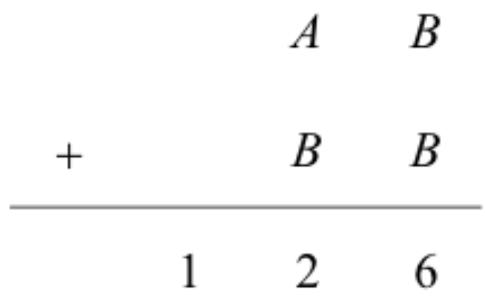
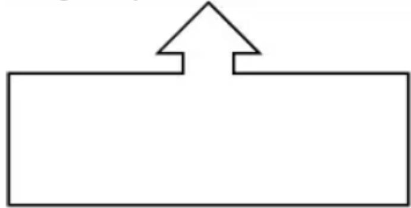
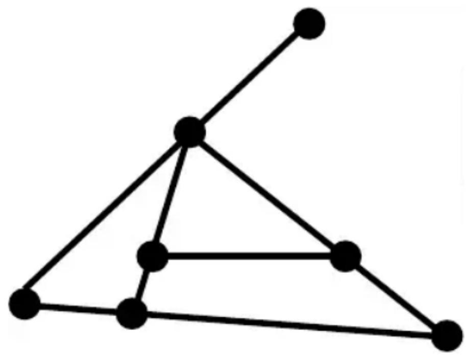
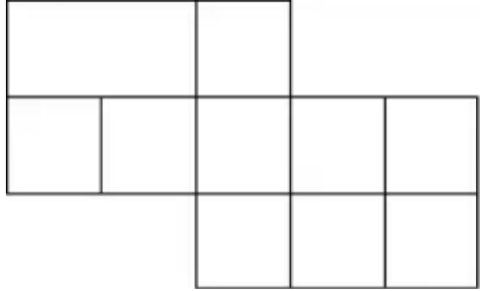
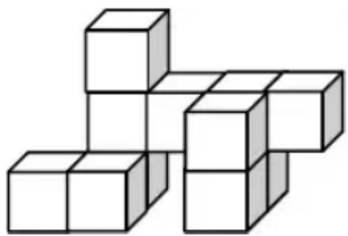

## 香港國際數學競賽晉級賽 2022

## HONG KONG IN

## MATHEMATIC

## SEMI-FINAL 2022 (HONG I)

## 小學一年級 Primary

Time allow 

## 試題

## Question Paper

## 考生須知：

## Instructions to Contestants:

1. 本卷包括 試題 乙份，試題紙不可取走。

Each contestant should have ONE Question-Answer Book which CANNOT be ta 

2. 本卷共 5 個範疇，每範疇有 5 題，共 25 題，每題 4 分，總分 100 分，答錯

填空題（第1至25題）（每題4分，答錯及空題不扣分）

Open-Ended Questions ( $1^{st} \sim 25^{th}$ ) (4 points for correct answer, no penalty point for wrong answer) 

# Logical Thinking

# 邏輯思維

1. According to the pattern shown below, what is the English alphabet in the space provided? Menurut pola yang ditunjukkan di bawah ini, apa abjad bahasa Inggris di tempat yang disediakan? 

D、K、E、L、F、M、G、_、H、.... 

2. According to the pattern shown below, what is the number in the space provided? Menurut pola yang ditunjukkan di bawah ini, berapa nomor di tempat yang disediakan? 

5、16、27、38、49、60、____、..... 

3. If $5^{th}$ March, 2022 is Tuesday, which day of the week will $13^{th}$ May, 2022 be? Jika tanggal 5 Maret 2022 adalah hari Selasa, tanggal 13 Mei 2022 hari apa? 

4. Anna was born when mum was 33 years old. If dad is 18 years elder than mum is, how old is dad when Anna is 30 years old?
Anna lahir saat ibu berusia 33 tahun. Jika ayah 18 tahun lebih tua dari ibu, berapa umur ayah ketika Anna berusia 30 tahun? 

5. 99 students form a column. There are 56 students in the front of Betty. How many student(s) is / are behind her?
99 siswa membentuk kolom. Ada 56 siswa di depan Betty. Berapa banyak siswa yang ada di belakangnya? 

## Arithmetic

## 算術

6. If A, B are digits from 1 to 9 and both are not the same, what is the value of A if the equation is correct? Jika A, B adalah angka dari 1 sampai 9 dan keduanya tidak sama, berapa nilai A jika persamaannya benar? 

## Question 6

## 第6題

7. Find the value of $12 + 44 + 38 + 6 + 50$ .
Tentukan nilai $12 + 44 + 38 + 6 + 50$ . 

8. Find the value of $3 + 5 + 2 + 3 + 5 + 2 + 3 + 5 + 2 + 3 + 5 + 2$ . 

Tentukan nilai $3+5+2+3+5+2+3+5+2+3+5+2$ . 

9. Find the value of 20-41+47-11.
Tentukan nilai dari 20-41+47-11. 

10. What is the number that should be filled in the blank if the equation below is correct? Berapa angka yang harus diisi jika persamaan di bawah ini benar? 

$$
1 9 - \_ = 1 2
$$

## Number Theory

數論

11. Fill the lines with ‘+’ and ‘-’ to make the equation below correct. (Write down the complete equation in the answer sheet)
Isi garis dengan ' + ' dan ' - ' untuk membuat persamaan di bawah ini benar. (Tuliskan persamaan lengkap di lembar jawaban) 

21 ____ 18 ____ 2 ____ 1 = 38 

12. The numbers below follow the arithmetic sequence, what is the 8th number? Bilangan di bawah ini mengikuti barisan aritmatika, berapakah bilangan ke-8? 

88、81、74、67、60、... 

13. By observing the numbers, which odd number is the greatest?
Dengan mengamati bilangan, bilangan ganjil manakah yang terbesar? 

55、28、98、102、59、88、100 

14. Bert has 86 masks and Antony has 22 masks. The total number of masks of between Bob and them is an even number. Determine the number of Bob's masks is odd or even. 

Bert memiliki 86 topeng dan Antony memiliki 22 topeng. Jumlah topeng antara Bob dan mereka adalah bilangan genap. Tentukan banyaknya topeng Bob ganjil atau genap. 

15. Edward has 21 apples and John has 7 apples. How many apple(s) should Edward give John so that they will have the same amount of apples? 

Edward memiliki 21 apel dan John memiliki 7 apel. Berapa banyak apel yang harus Edward berikan kepada John agar mereka memiliki jumlah apel yang sama? 

## Geometry

幾何

16. According to the pattern, from left to right, what is the figure represented by “?”? Menurut polanya, dari kiri ke kanan, gambar apa yang dilambangkan dengan “?”? 

▲、★、■、■、▲、★、■、■、■、▲、?、■、■、■、■、... Question 16 

第 16 题

17. How many edge(s) is / are there in the polygon below?
Berapa banyak rusuk yang ada pada segi-banyak di bawah ini? 

Question 17
第 17 題

18. Refer to the figure below, how many line segment(s) is / are there? Perhatikan gambar di bawah ini, ada berapa ruas garis yang ada? 

Question 18
第 18 題

19. How many square(s) is / are there in the figure below?
Berapa banyak persegi yang ada pada gambar di bawah ini? 

Question 19
第 19 題

20. At least how many cube(s) is / are there in the figure below?
Paling sedikit ada berapa kubus yang ada pada gambar di bawah ini? 

Question 20

第 20 題

# Combinatorics

# 組合數學

21. Which number below is the greatest? 

Angka manakah di bawah ini yang terbesar? 

20223456、20219999、20098317、20228966 

22. According to the following numbers, what is the difference between the number of even number(s) and odd number(s)? 

Berdasarkan bilangan-bilangan berikut, berapakah selisih antara banyaknya bilangan genap dan bilangan ganjil? 

33, 4, 55, 6, 77, 34, 86, 39 

23. Annie has 35 $1 coins, 14 $2 coins and 20 $10 coins. What is the maximum number of $20 notes she can exchange? 

Annie memiliki 35 koin $1, 14 koin $2, dan 20 koin $10. Berapa jumlah maksimum uang kertas $20 yang dapat dia tukarkan? 

24. A toy shop has 6 different toy cars. If George, Diana and Bella buy 1 toy car each, how many different combination(s) is / are there? 

Sebuah toko mainan memiliki 6 mobil mainan yang berbeda. Jika George, Diana, dan Bella masing-masing membeli 1 mobil mainan, berapa banyak kombinasi yang berbeda? 

25. A 3-digit number is formed by choosing 3 digits from 0, 1, 5 and 8. What is the difference between the largest and the smallest possible value of this number? (Each digit can only be used once) 

Suatu bilangan terdiri dari 3 angka yang dibentuk dengan memilih 3 angka dari 0, 1, 5 dan 8. Berapakah selisih antara nilai terbesar dan terkecil dari bilangan ini? (Setiap digit hanya dapat digunakan sekali) 

~全卷完~

~ End of Paper ~ 