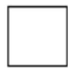
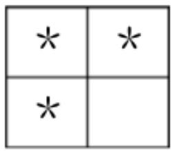
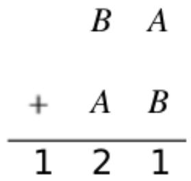
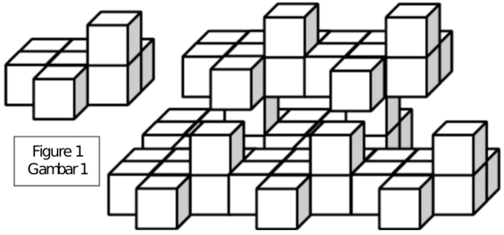
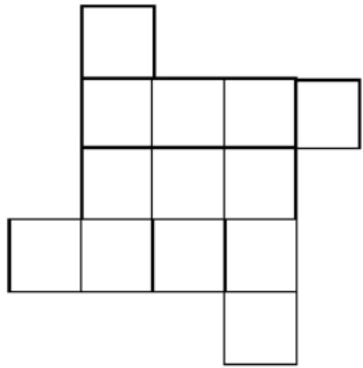
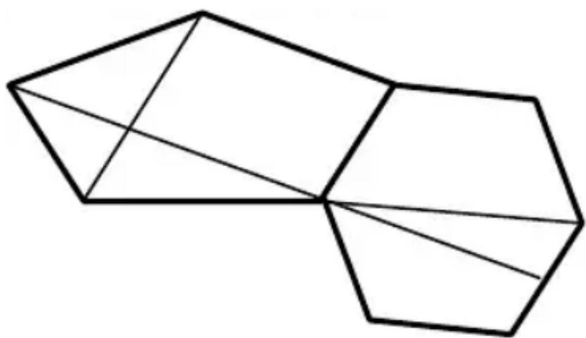
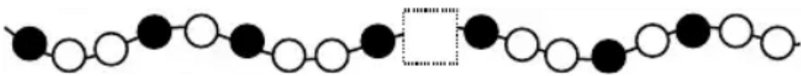
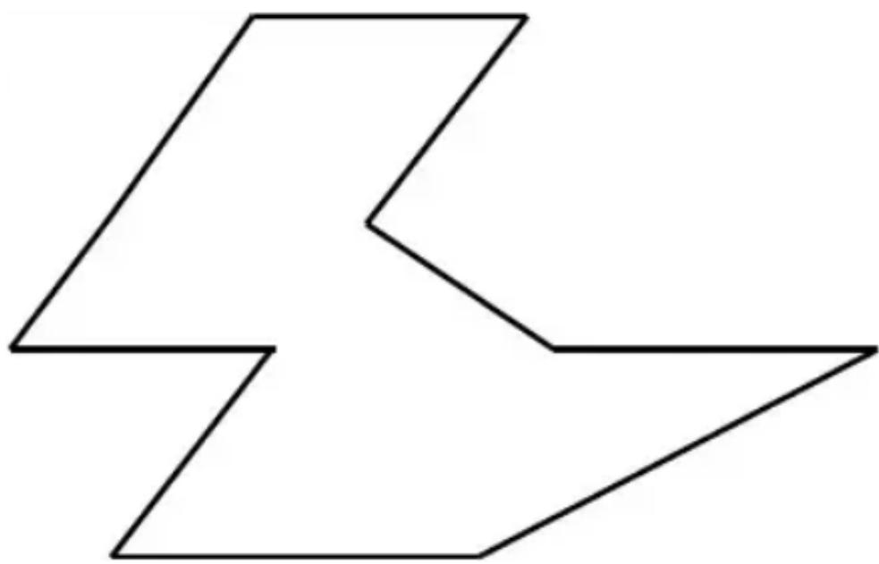

## 香港國際數學競賽晉級賽 2024

## HONG KONG IN

## MATHEMATIC

## HEAT ROUND 2024 (INDON)

# 小學一年級 Primary

Time allow 

## 試題

## Question Paper

考生須知：

Instructions to Contestants: 

THIS Question-Answer Book CANNOT BE TAKEN AWAY.
DO NOT turn over this Question-Answer Book without approval of the examiner.
Otherwise, contestant may be DISQUALIFIED. 

Open-Ended Questions ( $1^{st} \sim 25^{th}$ ) (4 points for correct answer, no penalty point for wrong answer) 

# Logical Thinking

1. According to the pattern shown below, what is the English alphabet in the space provided? Berdasarkan pola yang ditunjukkan di bawah ini, huruf apakah yg seharusnya mengisi “_”? 

Y、A、X、B、W、C、V、_、U、... 

2. According to the pattern shown below, what is the number in the blank? 

Berdasarkan pola yang ditunjukkan di bawah ini, angka berapakah yang seharusnya mengisi “_”? 

9、17、25、33、41、49、_、... 

3. 15 years later, John was 20 years old. Mary is 3 years younger than John. How old is Mary now? 

15 tahun yang akan datang, usia John 20 tahun. Mary 3 tahun lebih muda dari John. Berapa umur Mary sekarang? 

4. 42 children form a column. There are 25 children behind John. How many child(ren) is / are in front of him? 

42 anak berdiri dalam satu barisan. Ada 25 anak di belakang John. Berapa banyak anak yang ada di depannya? 

5. According to the pattern shown below, how many * is / are there in the 6th group? 

Berdasarkan pola yang ditunjukkan di bawah ini, berapa banyak * pada kelompok ke 6? 

<table><tr><td>*</td><td>*</td><td>*</td></tr><tr><td>*</td><td>*</td><td>*</td></tr><tr><td>*</td><td>*</td><td></td></tr></table>

<table><tr><td>*</td><td>*</td><td>*</td><td>*</td></tr><tr><td>*</td><td>*</td><td>*</td><td>*</td></tr><tr><td>*</td><td>*</td><td>*</td><td>*</td></tr><tr><td>*</td><td>*</td><td>*</td><td>*</td></tr><tr><td>*</td><td>*</td><td>*</td><td></td></tr></table>

1 $^{st}$ Group
Kelompok ke-1 

2 $^{nd}$ Group
Kelompok ke-2 

3 $^{rd}$ Group
Kelompok ke-3 

4 $^{th}$ Group
Kelompok ke-4 

Question 5
Pertanyaan 5 

## Arithmetic

6. Find the value of $48 + 82 + 36 + 64 + 18 + 52$ .
Tentukan nilai dari $48 + 82 + 36 + 64 + 18 + 52$ . 

7. Find the value of 15 - 54 +95 - 46.
Tentukan nilai dari 15 - 54 +95 - 46. 

8. Find the value of $6 + 7 - 3 + 6 + 7 - 3 + 6 + 7 - 3 + 6 + 7 - 3 + 6 + 7 - 3$ . Tentukan nilai dari $6 + 7 - 3 + 6 + 7 - 3 + 6 + 7 - 3 + 6 + 7 - 3 + 6 + 7 - 3$ 

9. What is the number that should be filled in the blank if the equation below is correct? 

Angka berapakah yang harus diisikan pada bagian yang kosong agar persamaan di bawah ini benar? 

$$
2 3 - \_ = 1 7
$$

10. If A, B represent different 1-digit numbers, B - A = 1 what is the value of B if the equation is correct? 

Jika A, B mewakili bilangan 1 digit yang berbeda, B-A = 1 berapakah nilai B jika persamaan berikut ini benar? 

Question 10
Pertanyaan 10

## Number Theory

11. By observing the numbers below, which odd number is the greatest? 

Dengan mengamati angka-angka di bawah ini, bilangan ganjil manakah yang terbesar? 

57、129、94、19、82、65、130 

12. The numbers below follow the arithmetic sequence, what is the 10th number? 

Angka-angka di bawah ini mengikuti deret aritmetika, berapakah bilangan ke-10? 

123、114、105、96、87、... 

13. Alice has 25 pen and Peter has 15 pens. How many pen(s) does Peter have to ask Alice to give him to make Peter has 8 more pens than Alice? 

Alice memiliki 25 pulpen dan Peter memiliki 15 pulpen. Agar Peter memiliki 8 pulpen lebih banyak dari Alice, berapa banyak pulpen yang harus diminta oleh Peter kepada Alice? 

14. Eric has 95 pens and Peter has 58 pens. The total number of pens among John and them is an odd number. Determine whether the number of John's pens is odd or even. 

Eric memiliki 95 pulpen dan Peter memiliki 58 pulpen. Jumlah pulpen yang mereka berdua miliki ditambah pulpen John adalah ganjil. Tentukan apakah jumlah pulpen yang dimiliki John ganjil atau genap. 

15. Determine the result of $1 + 4 + 5 + 6 + 8 + 10 + 10 + 11 + 13 + 14 + 16 + 17 + 19 + 21$ is odd or even. 

Tentukan hasil dari 1 +4 +5 +6 +8 +10 +10 +11 +13 +14 +16 +17 +19 +21 ganjil atau genap. 

## Geometry

16. It is known that figure 1 is formed by 8 cubes. How many cube(s) is / are there in figure 2? 

Diketahui bahwa gambar 1 dibentuk oleh 8 kubus. Berapa banyak kubus yang ada pada gambar 2? 

Figure 2
Gambar 2

17. How many square(s) is/are there in the figure below? 

Berapa banyak persegi yang ada pada gambar di bawah ini? 

Question 17
Pertanyaan 17

18. How many line segment(s) is/are there in the figure below? 

Berapa banyak segmen garis pada gambar di bawah ini? 

Question 18 

Pertanyaan 18 

19. According to the pattern shown below, what is the figure in the space provided? 

Berdasarkan pola yang ditunjukkan di bawah ini, gambar apakah yang seharusnya mengisi ruang yang disediakan? 

Question 19 

Pertanyaan 19 

20. How many interior angle(s) is / are there in the polygon below? 

Berapa banyak sudut dalam yang ada pada poligon di bawah ini? 

Question 20 

Pertanyaan 20 

## Combinatorics

21. Which number below is the smallest? 

Angka manakah di bawah ini yang merupakan angka terkecil? 

20230831、20236012、20240706、2024821、20203385 

22. A 3-digit number is formed by choosing 3 numbers from 1, 3, 7 and 9. What is the difference between the largest and the smallest values? (Each number can only be used once) 

Bilangan 3 digit dibentuk dengan memilih 3 angka dari 1, 3, 7 dan 9. Berapa selisih antara nilai terbesar dan terkecilnya? (Setiap angka hanya dapat digunakan satu kali) 

23. Arranging the following numbers in descending order (From the greatest to the smallest), find the value of 2nd smallest number. 

Dengan mengatur bilangan-bilangan berikut dalam urutan menurun (Dari yang terbesar ke yang terkecil), tentukan nilai bilangan terkecil ke-2. 

59, 67, 40, 82, 98, 76, 20, 14 

24. According to the following numbers, what is the difference between the number of even number(s) and odd number(s)? 

Berdasarkan bilangan-bilangan berikut, berapa selisih bilangan genap dan bilangan ganjil? 

4, 14, 28, 67, 75, 81, 521, 861 

25. Choose 2 digits, without repetition, from 1, 3, 4, 6 and 9 to form 2-digit odd numbers. How many different number(s) is / are there? 

Pilih 2 digit, tanpa pengulangan, dari 1, 3, 4, 6, dan 9 untuk membentuk bilangan ganjil 2 digit. Ada berapa banyak angka yang berbeda? 

~End of Paper ~ 