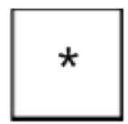
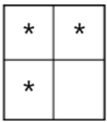
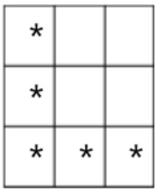
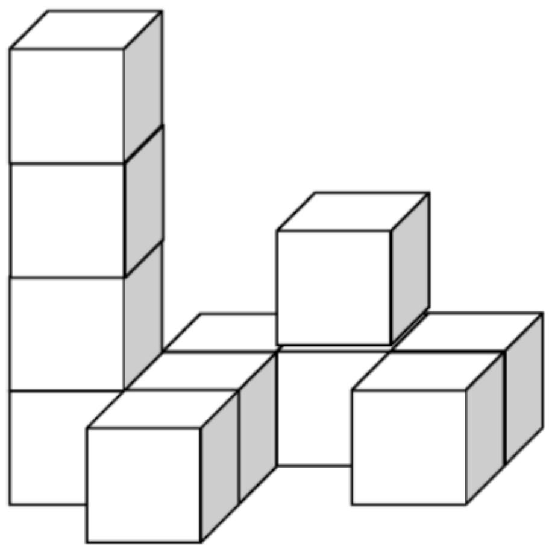
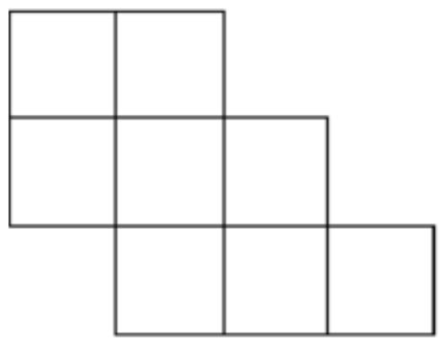
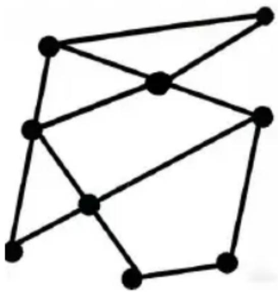
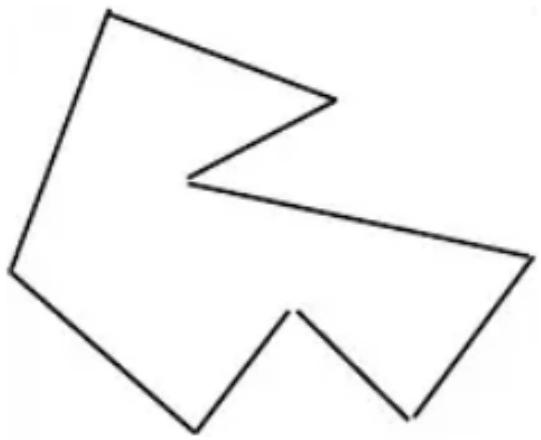

HONG KONG IN 

MATHEMATIC 

HEAT ROUND 2025 (INDON) 

Primary 1 

Time allow 

Question Paper 

Open-Ended Questions ( $1^{st} \sim 25^{th}$ ) (4 points for correct answer, no penalty point for wrong answer) 

## Logical Thinking

1. According to the pattern of the arithmetic sequence shown below, what is the number of question mark in the space provided? 

Berdasarkan pola barisan aritmetika yang ditunjukkan di bawah ini, angka berapakah yang seharusnya menempati bagian yang di wakili oleh tanda tanya ( ? )? 

2、_、8、_、_、17、_、? 

2. According to the pattern shown below, what should be the English letter filled in the blank? 

Menurut pola yang ditunjukkan di bawah ini, huruf apakah yang seharusnya menempati bagian yang kosong ( _ )? 

B、E、D、_、F、I、... 

3. 21 children form a column. There are 5 children in the front of Eric. How many child(ren) is/are behind him? 

21 anak membentuk sebuah barisan. Ada 5 anak di depan Eric. Berapa banyak anak yang berada di belakangnya? 

4. 12 years ago, John was 6 years old. Mary is 6 years elder than John. How old is Mary now? 

12 tahun yang lalu, John berusia 6 tahun. Mary 6 tahun lebih tua dari John. Berapa umur Mary sekarang? 

5. According to the pattern shown below, how many $*$ is/are there in the $7^{th}$ group? 

Berdasarkan pola yang ditunjukkan di bawah ini, berapa banyak * yang terdapat pada kelompok ke-7? 

<table><tr><td>*</td><td></td><td></td><td></td></tr><tr><td>*</td><td></td><td></td><td></td></tr><tr><td>*</td><td></td><td></td><td></td></tr><tr><td>*</td><td>*</td><td>*</td><td>*</td></tr></table>

$1^{\mathrm{st}}$ Group Ke-1 

$2^{nd}$ Group
Ke-2 

$3^{rd}$ Group
Ke-3 

$4^{th}$ Group
Ke-4 

## Arithmetic

6. Find the value of $16 + 22 + 34 + 41 + 17 + 55$ . 

Tentukan nilai dari 16+22+34+41+17+55 

7. Find the value of 23-38+50-5. 

Tentukan nilai dari 23–38+50–5 

8. Find the value of 1-2+3-4+5-6+7-8+9-10+11.
Tentukan nilai dari 1-2+3-4+5-6+7-8+9-10+11 

9. What is the number that should be filled in the blank if the equation below is correct? Angka berapakah yang harus diisi pada bagian yang kosong jika persamaan di bawah ini benar? 

$$
5 1 - \_ = 1 5
$$

10. If A, B represent different 1-digit numbers, what is the value of $A + B$ if the equation is correct?
Jika A, B mewakili angka 1 digit yang berbeda, berapakah nilai dari $A + B$ jika persamaannya benar? 

$$
\begin{array}{r} {B A} \\ {+ A B} \\ \hline {1 2 1} \end{array}
$$

Question 10
Pertanyaan 10 

## Number Theory

11. By observing the numbers, which even number is the greatest?
Dengan mengamati angka-angka tersebut, angka genap manakah yang terbesar?
58、66、77、80、99、97、71 

12. The numbers below follow the arithmetic sequence, what is the $9^{th}$ number?
Angka-angka di bawah ini mengikuti deret aritmatika, berapakah angka yang ke-9?
54、50、46、42、... 

13. A box of eggs has 7 eggs. Mum asks Mary to buy 13 eggs. Her neighbor asks her to buy 29 eggs. At least how many box(es) of eggs does Mary need to buy?
Sekotak telur berisi 7 butir telur. Ibu meminta Mary untuk membeli 13 butir telur. Tetangganya meminta Mary untuk membeli 29 butir telur. Setidaknya berapa kotak telur yang harus dibeli Mary? 

14. A large package contains 6 pieces of chocolate. Two small package contains 8 piece of chocolate. 3 pieces of extra chocolate will be given every time when 2 large packages and 2 small packages are bought together. If Peggy buys 4 large packages and 6 small packages, how many piece(s) of chocolate does she have?
Paket besar berisi 6 potong cokelat. Dua paket kecil berisi 8 potong cokelat. 3 potong cokelat ekstra akan diberikan setiap kali 2 paket besar dan 2 paket kecil dibeli bersamaan. Jika Peggy membeli 4 paket besar dan 6 paket kecil, berapa banyak potongan cokelat yang ia miliki? 

15. Determine the result of $1+2+3+4+\ldots+110+111$ is odd or even.
Tentukan hasil dari $1+2+3+4+\ldots+110+111$ adalah bilangan ganjil atau genap. 

## Geometry

16. At least how many square(s) can be seen if observing the figure below from the right? 

Setidaknya, berapa banyak persegi yang dapat dilihat jika mengamati gambar di bawah ini dari sebelah kanan? 

Question 16

Pertanyaan 16

17. How many square(s) is/are there in the figure below? 

Berapa banyak persegi yang terdapat pada gambar di bawah ini? 

Question 17

Pertanyaan 17

18. How many line segment(s) is / are there in the polygon below? 

Berapa banyak segmen garis pada poligon di bawah ini? 

Question 18
Pertanyaan 18

19. How many interior angle(s) is / are there in the polygon below? 

Berapa banyak sudut dalam yang terdapat pada poligon di bawah ini? 

Question 19
Pertanyaan 19

20. According to the pattern shown below, what is the Letter in the space provided? 

Berdasarkan pola yang ditunjukkan di bawah ini, huruf apakah yang seharusnya menempati bagian yang kosong ( _ )? 

CABCCABCCCA_ 

## Combinatorics

21. Which number below is the smallest? 

Angka manakah di bawah ini yang merupakan angka terkecil? 

20247654、2031097、20241225、202989911、20240604 

22. A 3-digit number is formed by choosing 3 numbers from 0, 3, 4 and 9. What is the difference between the largest and the smallest value? (Each number can only be used once) 

Angka 3 digit dibentuk dengan memilih 3 angka dari 0, 3, 4, dan 9. Berapa selisih antara nilai terbesar dan terkecil? (Setiap angka hanya dapat digunakan satu kali) 

23. Neo has 6 $1 and 4 $2 coins. At most how many $5 coin(s) can he exchange? 

Neo memiliki 6 koin $1 dan 4 koin $2. Paling banyak berapa banyak koin $5 yang bisa ia tukarkan? 

24. According to the following numbers, what is the difference between the number of even number(s) and odd number(s)? 

Berdasarkan angka-angka berikut, berapakah selisih antara banyaknya bilangan genap dan bilangan ganjil? 

25, 36, 17, 22, 11 16, 8, 31, 38 

25. Among the values of the following expressions, how many even number(s) less than 20 is / are there? 

Di antara nilai-nilai ekspresi berikut, berapa banyak bilangan genap kurang dari 20? 

9+6, 15+6, 49-31, 57-27, 9+13, 8+6, 38-26 

~End of Paper ~ 