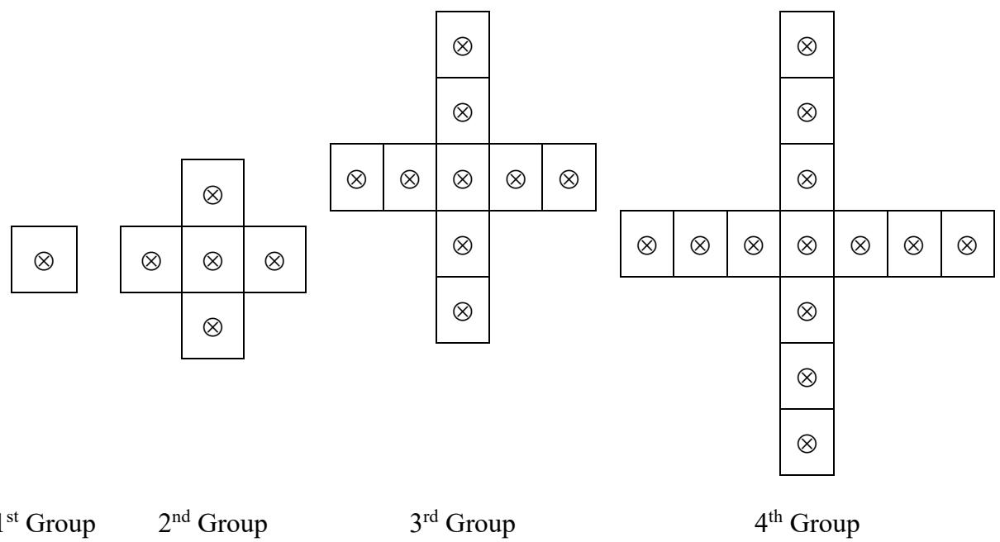
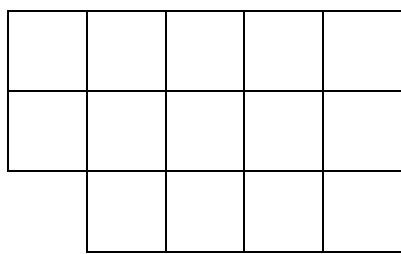
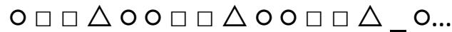
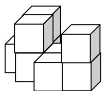

# Primary 2

Time allowed: 90 minutes 

## Question Paper

## Instructions to Contestants:

1. Each contestant should have ONE Question-Answer Book which CANNOT be taken away. 

There are 5 exam areas and 5 questions in each exam area. There are a total of 25 questions in this Question-Answer Book. Each carries 4 marks. Total score is 100 marks. No points are deducted for incorrect answers. 

3. All answers should be written on ANSWER SHEET. 

4. NO calculators can be used during the contest. 

5. All figures in the paper are not necessarily drawn to scale. 

6. This Question-Answer Book will be collected at the end of the contest. 

THIS Question-Answer Book CANNOT BE TAKEN AWAY. DO NOT turn over this Question-Answer Book without approval of the examiner. Otherwise, contestant may be DISQUALIFIED. 

Open-Ended Questions $( 1 ^ { \mathrm { s t } } \sim 2 5 ^ { \mathrm { t h } } )$ (4 points for correct answer, no penalty point for wrong answer) 

## Logical Thinking

1. If the day after tomorrow is Wednesday, which day of the week the day before yesterday is? 

2. 16 children form a column. Amy is the $7 ^ { \mathrm { t h } }$ position counting from the front. What is her position counting form behind? 

3. According to the pattern shown below, what is the number in the blank? 

$3 \cdot 2 8 \cdot 1 0 \cdot 1 5 \cdot 2 1 \cdot 2 8 \cdot \_ \cdot \cdot \cdot \cdot$ 

4. John goes home by taxi and he needs to pay $90. How much does he has to pay if he goes home by taxi with his father, mother and sister? 

5. According to the pattern shown below, how many $\otimes$ is / are there in the $1 2 ^ { \mathrm { t h } }$ group? 

Question 5

## Arithmetic

6. Find the value of $2 + 8 + 1 2 + 1 8 + 2 2 + 2 5 + 2 8 + 3 5$ . 

7. Find the value of $1 0 5 \div 3 - 1 0 5 \div 5 + 1 0 5 \div 7$ . 

8. Find the value of  22 19 16 13 10 7 4 1        . 

9. What is the number that should be filled in the blank if the equation below is correct? 

$$
\_ \times 4 5 = 4 0 5
$$

10. If A and B are different 1-digit numbers, what is the value of A if the equation is correct? 

$$
\boxed {A} \boxed {B} + \boxed {B} = \boxed {B} \boxed {4}
$$

## Number Theory

11. Amy has 73 apples and John has 39 apples. How many apple(s) does Amy have to give John to make them have the same number of apples? 

12. 4 students have 38 balloons in total. Two children have even number of balloons and one child has odd number of balloons. Determine the number of balloons of the remaining child. 

13. The numbers below follow the arithmetic sequence, what is the $1 1 ^ { \mathrm { t h } }$ number? 

$1 4 3 \cdot 1 3 9 \cdot 1 3 5 \cdot 1 3 1 \cdot 1 2 7 \cdot . . .$ 

14. How many 3-digit number(s) having the units digit 1 is / are there? 

15. Fill the lines with ‘ + ‘ and ‘‘ to make the equation below correct. (Write down the complete equation in the answer sheet) 

1 2 3 4 5 = 20 

## Geometry

16. How many square(s) is / are there in the figure below? 

Question 16

17. A prism has 9 faces, how many vertice(s) does this prism have? 

18. According to the pattern shown below, what is the figure in the space provided? 

Question 18

19. At least how many square(s) can be seen if viewing the figure below from top? 

Question 19

20. At most how many rectangle(s) can be formed by drawing 5 straight lines on a plane? 

## Combinatorics

21. After Amy gives 3 apples to Andy and 7 apples to Johnny, they will have equal number of apples. How many apple(s) did Amy have more than Johnny originally? 

22. What is the smallest 4-digit number by using 3, 5, 6 and 8 that is divisible by 5? (Each number can only be used once) 

23. Every 2 of the 6 children shake hand. How many times do they shake hands? 

24. How many odd number(s) is/are there in the following numbers from the 1st to the $3 0 ^ { \mathrm { t h } } ?$ 

1, 2, 3, 5, 8, 13,… 

25. Jack has 6$1 coins, 4 $2 coins and 2 $5 coin, how many way(s) can he buy for a souvenir cost $8 without any changes? 

~ End of Paper ~ 