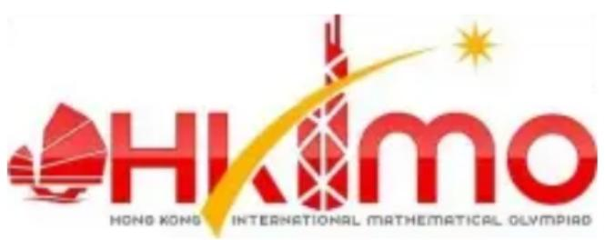
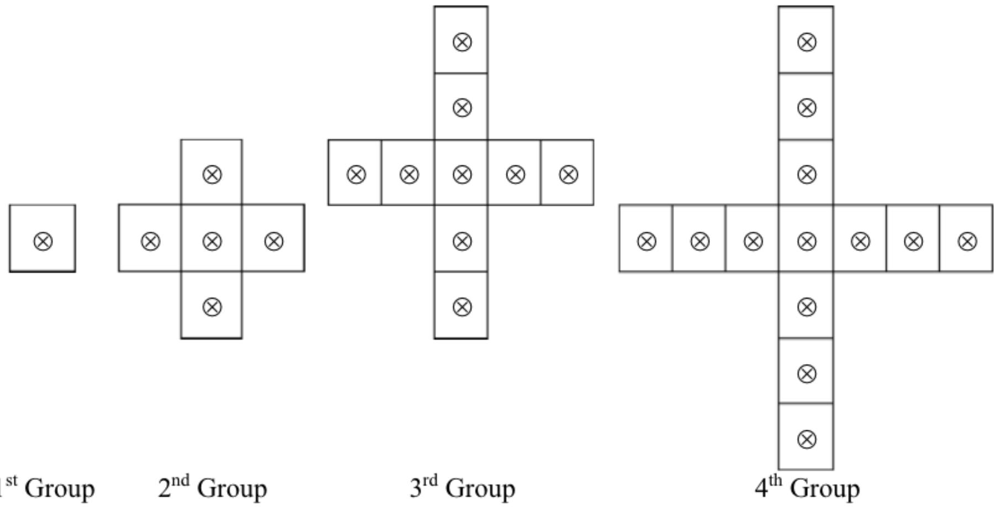
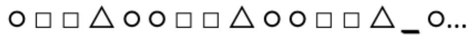
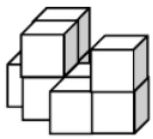

香港國際數學競賽初賽 2019

HONG KONG IN 

MATHEMATIC 

HEAT ROUND 2019 (HONG K 

# 小學二年級 Primary

Time allow 

模擬試題

Mock Paper 

考生須知：

Instructions to Contestants: 

## 本試題不可取走。

THIS Question-Answer Book CANNOT BE TAKEN AWAY. 

未得監考官同意，切勿翻閱試題，否則參賽者將有可能被取消資格。

DO NOT turn over this Question-Answer Book without approval of the examiner. 

Otherwise, contestant may be DISQUALIFIED. 

填空題（第1至25題）（每題4分，答錯及空題不扣分）

Open-Ended Questions ( $1^{st} \sim 25^{th}$ ) (4 points for correct answer, no penalty point for wrong answer) 

## Logical Thinking

## 邏輯思維

1. If the day after tomorrow is Wednesday, which day of the week the day before yesterday is? 

後天是星期三，問前天是星期幾？

2. 16 children form a column. Amy is the $7^{\text{th}}$ position counting from the front. What is her position counting form behind? 

16 個小孩排成一列，艾美站在前面數第 7 個，那麼她是後面數的第幾個？

3. According to the pattern shown below, what is the number in the blank? 

按以下規律，求在橫線上的數字。

3 、6 、10 、15 、21 、28 、_ 、.... 

4. John goes home by taxi and he needs to pay $90. How much does he has to pay if he goes home by taxi with his father, mother and sister? 

約翰乘坐的士回家需要付90元。若約翰和爸爸媽媽及妹妹一起乘的士回家，他需要付多少元？

5. According to the pattern shown below, how many $\otimes$ is / are there in the $12^{\text{th}}$ group? 

按以下規律，問第 12 組有多少個 ⊗？

第1組

第2組

第3組

第4組

Question 5 

第5題

## Arithmetic

算術

6. Find the value of $2+8+12+18+22+25+28+35$ . 

求 $2+8+12+18+22+25+28+35$ 的值。

7. Find the value of $105 \div 3 - 105 \div 5 + 105 \div 7$ . 

求 $105\div3-105\div5+105\div7$ 的值。

8. Find the value of $22-19+16-13+10-7+4-1$ . 

求 $22-19+16-13+10-7+4-1$ 的值。

9. What is the number that should be filled in the blank if the equation below is correct? 

在以下算式填上甚麼數字會使算式正確？

$$
\_ \times 4 5 = 4 0 5
$$

10. If A and B are different 1-digit numbers, what is the value of A if the equation is correct? 

若 A 和 B 為不同的 1 位數字，且以下算式正確，求 A 的值。

$$
\boxed{A}\boxed{B} +\boxed{B} = \boxed{B}\boxed{4}
$$

## Number Theory

數論

11. Amy has 73 apples and John has 39 apples. How many apple(s) does Amy have to give John to make them have the same number of apples? 

艾美有 73 個蘋果，約翰有 39 個蘋果。要使兩人有相同數量的蘋果，艾美要給約翰多少個蘋果？

12. 4 students have 38 balloons in total. Two children have even number of balloons and one child has odd number of balloons. Determine the number of balloons of the remaining child. 

4 個小孩一共有 38 個氣球。已知其中 2 個小孩有偶數個氣球，有 1 個小孩有奇數個氣球。判斷剩下的那個小孩有奇數還是偶數個氣球。

13. The numbers below follow the arithmetic sequence, what is the $11^{\text{th}}$ number? 

根據以下的等差數列，問第11個數是甚麼？

143、139、135、131、127、... 

14. How many 3-digit number(s) having the units digit 1 is / are there? 

有多少個三位數的個位數是1？

15. Fill the lines with ‘+’ and ‘×’ to make the equation below correct. (Write down the complete equation in the answer sheet) 

在橫線上填上加號或乘號，使下列算式正確。（在答題紙上寫上完整算式）

1 ____ 2 ____ 3 ____ 4 ____ 5 = 20 

## Geometry

## 幾何

16. How many square(s) is / are there in the figure below? 

請問下圖有多少個正方形？

<table><tr><td></td><td></td><td></td><td></td><td></td></tr><tr><td></td><td></td><td></td><td></td><td></td></tr><tr><td></td><td></td><td></td><td></td><td></td></tr></table>

Question 16

第 16 题

17. A prism has 9 faces, how many vertice(s) does this prism have? 

有一個柱體有9個面，問這個柱體有多少個頂點？

18. According to the pattern shown below, what is the figure in the space provided? 

按以下規律，橫線上的圖案應該是甚麼？

Question 18

第 18 题

19. At least how many square(s) can be seen if viewing the figure below from top? 

如果從上邊俯視下圖的立體，最少可以看見多少個正方形？

Question 19

第 19 题

20. At most how many rectangle(s) can be formed by drawing 5 straight lines on a plane? 

在平面上畫 5 條直線，最多可組成多少個長方形？

## Combinatorics

## 組合數學

21. After Amy gives 3 apples to Andy and 7 apples to Johnny, they will have equal number of apples. How many apple(s) did Amy have more than Johnny originally? 

當艾美把 3 個蘋果送給安迪及把 7 個蘋果送給強尼後，他們擁有的蘋果數目便一樣。問原本艾美比強尼多多少個蘋果？

22. What is the smallest 4-digit number by using 3, 5, 6 and 8 that is divisible by 5? (Each number can only be used once) 

利用 3、5、6、8 組成的四位數，當中能被 5 整除的最小是多少？（每個數字只能用一次）

23. Every 2 of the 6 children shake hand. How many times do they shake hands? 

6個小孩每2個人握1次手，他們共握了多少次手？

24. How many odd number(s) is/are there in the following numbers from the $1^{st}$ to the $30^{th}$ ? 

下面的數由第 1 個到第 30 個數之間，有多少個奇數？奇數即是單數

1, 2, 3, 5, 8, 13, ... 

25. Jack has 6$1 coins, 4 $2 coins and 2 $5 coin, how many way(s) can he buy for a souvenir cost $8 without any changes? 

積克有 6 枚 1 元、4 枚 2 元和 2 枚 5 元硬幣，如果一件紀念品的售價為 8 元，他有多少種方法付款購買而不須找贖？

~全卷完~

~ End of Paper ~ 