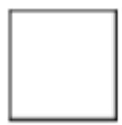
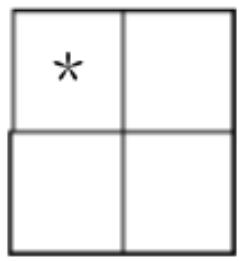
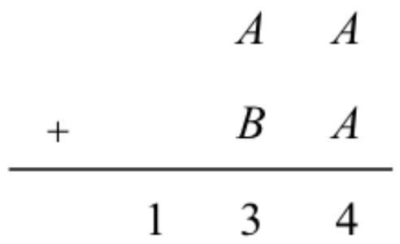
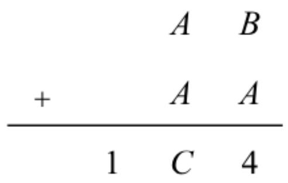
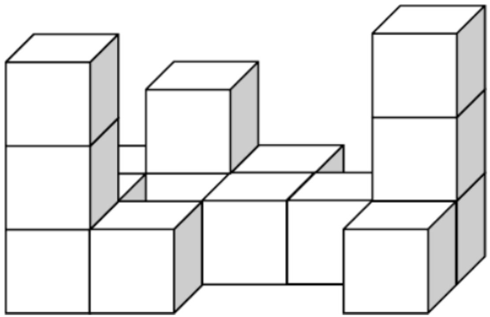
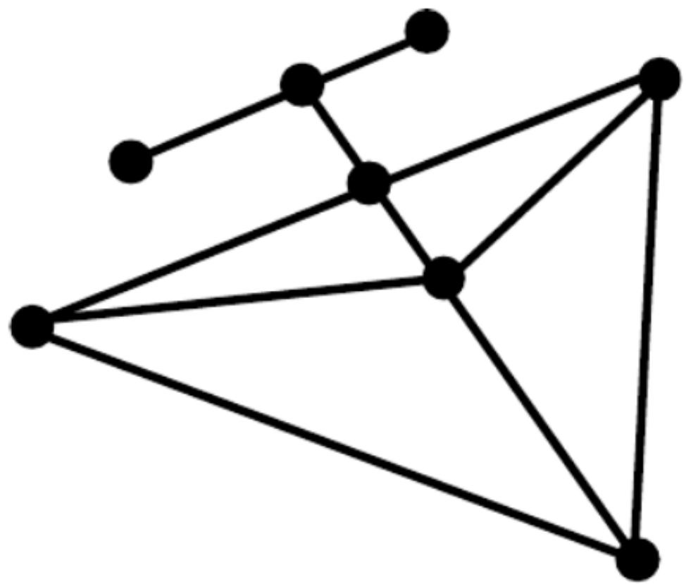
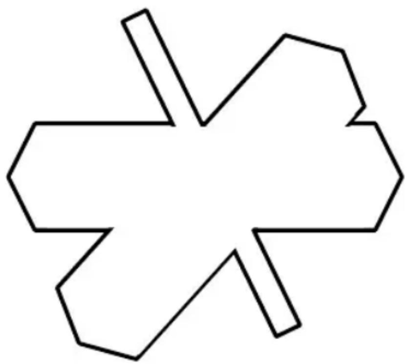
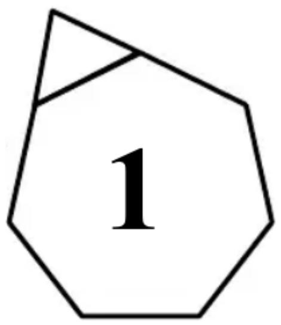
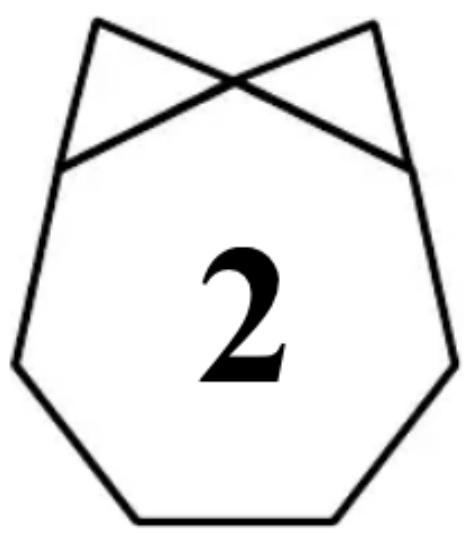
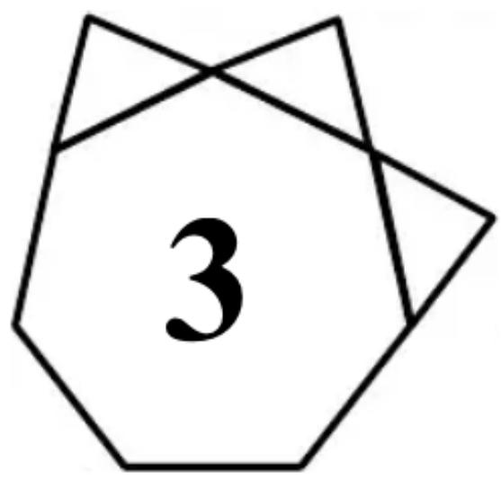

## Primary 2

Time allow 

# Question Paper

## Instructions to Contestants:

1. Each contestant should have ONE Question-Answer Book which CANNOT be ta 

2. There are 5 exam areas and 5 questions in each exam area. There are a total of 25 Question-Answer Book. Each carries 4 marks. Total score is 100 marks. No point incorrect answers. 

3. All answers should be written on ANSWER SHEET. 

4. NO calculators can be used during the contest. 

5. All figures in the paper are not necessarily drawn to scale. 

6. This Question-Answer Book will be collected at the end of the contest. 

THIS Question Answer Book CANNOT BE TAVEN AWAY 

## Open-Ended Questions ( $1^{st} \sim 25^{th}$ ) (4 points for correct answer, no penalty point for wrong answer)

## Logical Thinking

1. According to the pattern shown below, what is the number in the blank? 

Berdasarkan pola di bawah ini, berapakah bilangan yang seharusnya ada pada “____”? 

14 、18 、23 、29 、36 、44 、_ 、.... 

2. According to the pattern shown below, what is the English alphabet in the space provided? 

Berdasarkan pola di bawah ini, huruf apakah yang seharusnya ada pada “____”? 

Z ` y ` X ` x ` V ` w ` T ` _ ` .... 

3. Mary needs 30 minutes to finish 1 set of exercise and rest for 5 minutes. How many minute(s) does Mary need to finish 4 sets of exercise? 

Mary membutuhkan 30 menit untuk menyelesaikan 1 set latihan dan beristirahat selama 5 menit. Berapa menit yang dibutuhkan Mary untuk menyelesaikan 4 set latihan? 

4. If 16 $^{th}$ May, 2020 is Saturday, which day of the week will 19 $^{th}$ August, 2020 be? 

Jika tanggal 16 Mei 2020 adalah hari Sabtu, hari apakah tanggal 19 Agustus 2020? 

5. According to the pattern shown below, how many $*$ is / are there in the $9^{th}$ group? 

Berdasarkan pola di bawah ini, berapa banyak * yang ada pada Kelompok 9? 

$1^{\mathrm{st}}$ Group Kelompok 1 

$2^{\mathrm{nd}}$ Group Kelompok 2 

<table><tr><td>*</td><td>*</td><td></td></tr><tr><td>*</td><td>*</td><td></td></tr><tr><td>*</td><td></td><td></td></tr></table>

$3^{\mathrm{rd}}$ Group Kelompok 3 

<table><tr><td>*</td><td>*</td><td>*</td><td></td></tr><tr><td>*</td><td>*</td><td>*</td><td></td></tr><tr><td>*</td><td>*</td><td>*</td><td></td></tr><tr><td>*</td><td>*</td><td>*</td><td></td></tr><tr><td>*</td><td>*</td><td></td><td></td></tr></table>

$4^{\mathrm{th}}$ Group Kelompok 4 

Question 5 

Soal no. 5 

## Arithmetic

6. Find the value of $346 + 218 + 269 + 352 + 104 + 311$ . 

Carilah nilai dari 346+218+269+352+104+311. 

7. Find the value of $17 + 71 + 34 + 43 + 69 + 96$ . 

Carilah nilai dari 17+71+34+43+69+96. 

8. Find the value of $34 \times 11 + 17 \times 20 + 34 \times 4$ . 

Carilah nilai dari $34 \times 11 + 17 \times 20 + 34 \times 4$ . 

9. What is the number that should be filled in the blank if the equation below is correct? 

Berapakah bilangan yang seharusnya ada pada “____” jika persamaan di bawah ini adalah benar? 

$$
\_ \div 6 + 1 2 = 3 6
$$

10. If A, B represents different digits, what is the value of B if the equation is correct? 

Jika A, B melambangkan angka yang berbeda, berapakah nilai dari B jika persamaan berikut benar? 

## Number Theory

11. If $A, B$ and $C$ are different digits, determine $C$ is odd or even. 

Jika A, B dan C adalah angka berbeda, tentukan C adalah angka ganjil atau genap. 

12. 40 students have an even number of scores of mathematics test in total. For first 20 children, each has an odd number of score. For the following 19 children, each has an even number of score. Determine the number of scores of the remaining child is odd or even. 

40 murid mempunyai total skor matematika bilangan genap. 20 murid pertama masing-masing mempunyai skor bilangan ganjil. 19 murid berikutnya masing-masing mempunyai skor bilangan genap. Tentukan apakah skor anak terakhir adalah bilangan ganjil atau bilangan genap. 

13. A box of eggs has 8 eggs. Mum asks Mary to buy 44 eggs. Her neighbor asks her to buy 23 eggs. At least how many box(es) of eggs does Mary need to buy? 

Terdapat 8 butir telur dalam satu kotak. Ibu meminta Mary membelikan 44 butir telur. Tetangganya meminta dia membelikan 23 butir telur. Setidaknya berapa kotak yang harus Mary beli? 

14. Fill the lines with ‘ + ’ and ‘ - ’ to make the equation below correct. (Write down the complete equation in the answer sheet) 

Isilah “____” dengan ‘+’ dan ‘-’ agar persamaan di bawah ini menjadi benar. (Tulislah persamaan ini dengan lengkap pada lembar jawaban) 

8 ____ 9 ____ 7 ____ 2 = 12 

15. The numbers below follow the arithmetic sequence, what is the $10^{\text{th}}$ number? 

Bilangan-bilangan di bawah ini membentuk sebuah baris aritmatika, berapakah bilangan ke-10? 

266 ` 254 ` 242 ` 230 ` 218 ` ... 

## Geometry

16. A pyramid has 8 faces, how many edge(s) does this pyramid have? 

Sebuah piramida mempunyai 8 sisi, berapa banyak rusuk yang piramida itu punyai? 

17. At least how many square(s) can be seen if viewing the figure below from the top? 

Setidaknya berapa banyak bujursangkar terlihat jika melihat bangun ini dari atas? 

Question 17

Soal no. 17

18. How many line segment(s) is / are there in the polygon below? 

Ada berapa ruas garis pada segibanyak di bawah ini? 

Question 18

Soal no. 18

19. How many interior angle(s) is / are there in the polygon below?
Berapa banyak sudut dalam yang ada pada segibanyak di bawah ini? 

Question 19 

Soal no. 19 

20. By observing the pattern, from left to right, how many edge(s) does the $6^{th}$ figure have?
Berdasar pola di bawah ini, dari kiri ke kanan, berapa banyak sisi yang dipunyai bangun ke-6? 

Edge : 6 

Sisi : 6 

Edge : 7 

Sisi : 7 

Edge:8 

Sisi : 8 

Question 20 

Soal no. 29 

## Combinatorics

21. How many 3-digit even number(s) having the tens digit that is smaller than 7 is / are there?
Ada berapa banyak bilangan genap 3 -angka yang mempunyai angka puluhan yang lebih kecil dari 7? 

22. How many odd number(s) is / are there in the following numbers from the $7^{th}$ to the $23^{th}$ ? Berapa banyak bilangan ganjil yang terdapat pada suku ke-7 sampai dengan suku ke-23? 

$$
\begin{array}{l} 2, 4, 5, 6, 8, 9, 1 0, 1 2, 1 3, \dots \end{array}
$$

23. An ice-cream shop has 10 types of ice-cream. If randomly picking up 3 types, how many different combination(s) is / are there? 

Sebuah toko es krim mempunyai 10 jenis es krim. Jika secara acak kita memilih 3 jenis, berapa banyak kombinasi yang ada? 

24. After Mary gives 10 chocolates to Andy and takes 8 chocolates from Eric, they will have equal number of chocolates. How many chocolate(s) did Eric have more than Andy originally? 

Setelah Mary memberikan 10 coklat kepada Andy dan mengambil 8 coklat dari Eric, mereka mempunyai jumlah coklat yang sama. Berapa coklat yang dipunyai Erick lebih banyak dari Andy pada awalnya? 

25. A 3-digit number is formed by choosing 3 digits from 0, 3, 5, 6 and 8. What is the difference between the largest and the smallest value? (Each number can only be used once) 

Sebuah bilangan 3-angka dibentuk dari tiga angka dari 0, 3, 5, 6, dan 8. Berapa selisih antara nilai terkecil dan nilai terbesar? (Masing-masing angka hanya dapat digunakan satu kali) 

~ End of Paper ~ 