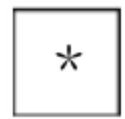
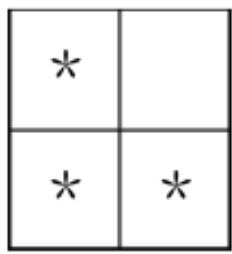
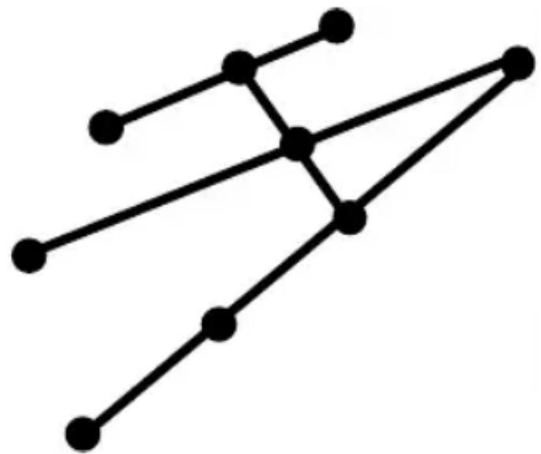
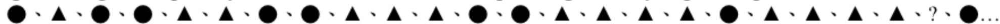
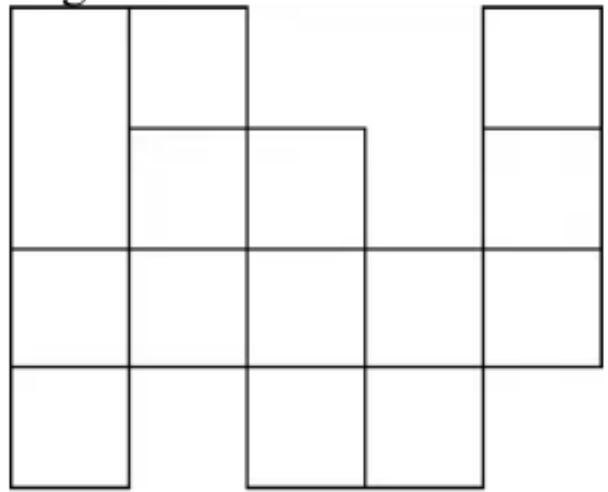

## 香港國際數學競賽晉級賽 2022

## HONG KONG IN

## MATHEMATIC

## SEMI-FINAL 2022 (HONG I)

## 小學二年級 Primary

Time allow 

## 試題

## Question Paper

## 考生須知：

## Instructions to Contestants:

1. 本卷包括 試題 乙份，試題紙不可取走。

Each contestant should have ONE Question-Answer Book which CANNOT be ta 

2. 本卷共 5 個範疇，每範疇有 5 題，共 25 題，每題 4 分，總分 100 分，答錯

填空題（第1至25題）（每題4分，答錯及空題不扣分）

Open-Ended Questions ( $1^{st} \sim 25^{th}$ ) (4 points for correct answer, no penalty point for wrong answer) 

## Logical Thinking

## 邏輯思維

1. According to the pattern shown below, what is the number in the space provided? 

Berdasarkan pola di bawah ini, berapakah bilangan pada tempat yang tersedia? 

12、15、17、20、22、25、_、.... 

2. If $21^{st}$ May, 2022 is Monday, which day of the week will $5^{th}$ August, 2022 be? 

Jika tanggal 21 Mei 2022 adalah hari Senin, tanggal 5 Agustus 2022 hari apa? 

3. 31 children form a column. There are 17 people in front of Betty. What is her position counting form behind? 

31 anak membentuk sebuah barisan. Ada 17 orang di depan Betty. Ada di posisi berapa Bety berdiri jika dihitung dari belakang? 

4. According to the pattern shown below, what is the English alphabet in the space provided? 

Menurut pola yang ditunjukkan di bawah ini, apa abjad bahasa Inggris di tempat yang disediakan? 

J、B、K、E、L、H、M、_、N、.... 

5. According to the pattern shown below, how many * is / are there in the $9^{th}$ group? 

Berdasarkan pola di bawah ini, berapa banyak * yang ada di kelompok ke-9? 

$1^{\mathrm{st}}$ Group 

$2^{\mathrm{nd}}$ Group 

<table><tr><td>*</td><td></td><td></td></tr><tr><td>*</td><td>*</td><td></td></tr><tr><td>*</td><td>*</td><td>*</td></tr></table>

$3^{rd}$ Group 

<table><tr><td>*</td><td></td><td></td><td></td></tr><tr><td>*</td><td>*</td><td></td><td></td></tr><tr><td>*</td><td>*</td><td>*</td><td></td></tr><tr><td>*</td><td>*</td><td>*</td><td>*</td></tr></table>

$4^{th}$ Group 

## Question 5

第 5 题

## Arithmetic

算術

6. Find the value of $321+191+279+64+999+56$ . 

Tentukan nilai 321+191+279+64+999+56. 

7. What is the number that should be filled in the blank if the equation below is correct? Berapa angka yang harus diisi jika persamaan di bawah ini benar? 

$$
\_ \div 3 + 3 1 = 3 4
$$

8. Find the value of $7 \times 3 + 5 \times 6 + 7 \times 12 - 12 \times 6$ .
Tentukan nilai $7 \times 3 + 5 \times 6 + 7 \times 12 - 12 \times 6$ . 

9. Find the value of $5-14+20-10+16-28+34-9+15$ .
Tentukan nilai dari $5-14+20-10+16-28+34-9+15$ . 

10. Find the value of $5+4\times3-(3+3)\div2+11$ .
Tentukan nilai $5+4\times3-(3+3)\div2+11$ . 

## Number Theory 數論

11. Fill the lines with ‘×’ and ‘-’ to make the equation below correct. (Write down the complete equation in the answer sheet)
Isi baris dengan '×' dan '-' untuk membuat persamaan di bawah ini benar. (Tuliskan persamaan lengkap di lembar jawaban) 

11 ____ 3 ____ 7 ____ 23 = 3 

12. Find the largest 3-digit even number without digital repetition.
Temukan bilangan genap 3 angka terbesar tanpa pengulangan digital. 

13. The numbers below follow the arithmetic sequence, what is the $13^{th}$ number?
Bilangan di bawah ini mengikuti barisan aritmatika, berapakah bilangan ke-13?
22、43、64、85、106、... 

14. Mary has 55 apples and George has 25 apples. How many apple(s) does George have to ask Mary to give him to make Georg has 22 more apples than Mary?
Mary memiliki 55 apel dan George memiliki 25 apel. Berapa banyak apel yang harus diberikan George kepada Mary agar Georg memiliki 22 apel lebih banyak daripada Mary? 

15. A box of masks has 23 masks. Mum asks Anna to buy 44 masks. Her neighbor asks her to buy 51 masks. At least how many box(es) of masks does Anna need to buy?
Sekotak topeng memiliki 23 topeng. Ibu meminta Anna untuk membeli 44 topeng. Tetangganya memintanya untuk membeli 51 topeng. Setidaknya berapa kotak masker yang harus Anna beli? 

## Geometry 幾何

16. A pyramid has 17 faces, how many edge(s) does this pyramid have? Piramida memiliki 17 sisi, berapa banyak sisi yang dimiliki piramida ini? 

17. How many line segment(s) is / are there in the polygon below? Berapa banyak ruas garis yang ada pada segi banyak di bawah ini? 

Question 17

第 17 題

18. By observing the pattern, from left to right, what is the missing figure? 

Dengan mengamati polanya, dari kiri ke kanan, berapakah gambar yang hilang? 

Question 18

第 18 题

19. How many square(s) is / are there in the figure below? 

Berapa banyak persegi yang ada pada gambar di bawah ini? 

Question 19

第 19 題

20. A prism has 36 vertices, how many edge(s) does this prism have? 

Sebuah prisma memiliki 36 titik sudut, berapa banyak rusuk yang dimiliki prisma ini? 

## Combinatorics

## 組合數學

21. Pick 6 from 10 children to take part in a running contest. How many different combination(s) is / are there? 

Pilih 6 dari 10 anak untuk mengikuti lomba lari. Berapa banyak kombinasi yang berbeda? 

22. What is the smallest 4-digit number by using 7, 1, 4 and 0 that is divisible by 3? (Each number can only be used once) 

挂口旦箔形与活安壁安，支社管处田且八机，挂冲10为古八机半地八机，支桥社管处田安上上机，组织器应物于从艺行八机。

Berapa bilangan 4 angka terkecil dengan menggunakan 7, 1, 4 dan 0 yang habis dibagi 3? (Setiap nomor hanya dapat digunakan sekali) 

23. 3-digit numbers are formed by choosing 3 numbers from 3, 0, 8 and 9. What is the difference between the largest and the smallest value? (Each number can only be used once) 

Bilangan 3 angka dibentuk dengan memilih 3 angka dari 3, 0, 8 dan 9. Berapa selisih antara nilai terbesar dan terkecil? (Setiap nomor hanya dapat digunakan sekali) 

24. There are 4 identical Chinese books, 7 identical English books and 5 identical Mathematics books. Now randomly picking up 3 books, if all 3 books are not the same, how many different combination(s) is / are there? 

Ada 4 buku bahasa Mandarin yang identik, 7 buku bahasa Inggris yang identik dan 5 buku Matematika yang identik. Sekarang mengambil 3 buku secara acak, jika ketiga buku tersebut tidak sama, berapa banyak kombinasi yang / ada? 

25. What is the minimum 4-digit odd number by using 5, 4, 3, 9 and 8? (Each number can only be used once) Berapa minimal 4 angka bilangan ganjil dengan menggunakan 5, 4, 3, 9 dan 8? (Setiap nomor hanya dapat digunakan sekali) 

~全卷完~

~ End of Paper ~ 