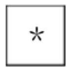
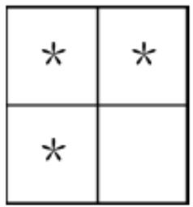
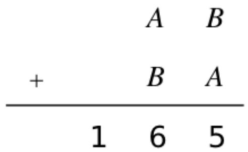
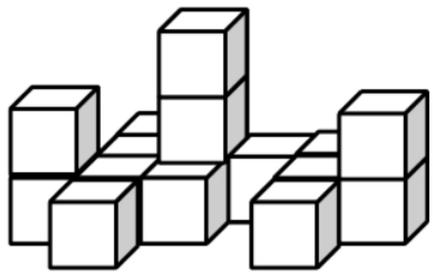
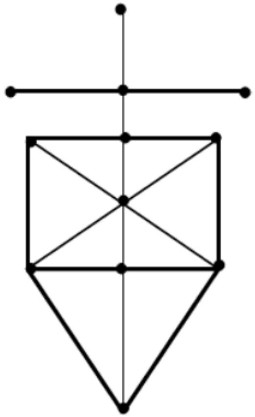
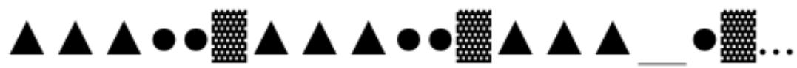
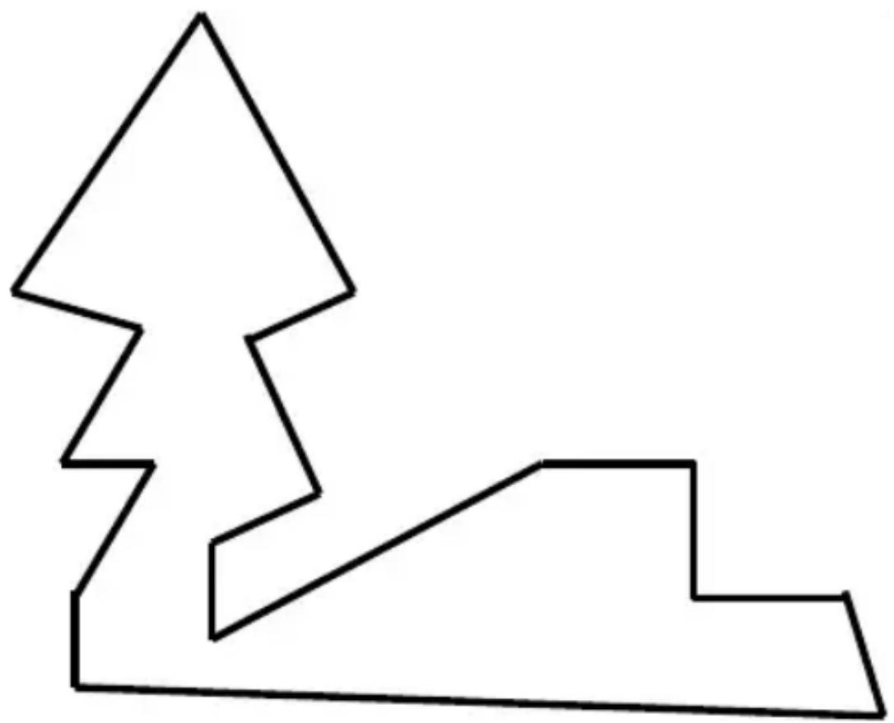

## 香港國際數學競賽晉級賽 2024

## HONG KONG IN

## MATHEMATIC

## HEAT ROUND 2024 (INDON)

# 小學二年級 Primary

Time allow 

## 試題

## Question Paper

考生須知：

Instructions to Contestants: 

THIS Question-Answer Book CANNOT BE TAKEN AWAY.
DO NOT turn over this Question-Answer Book without approval of the examiner.
Otherwise, contestant may be DISQUALIFIED. 

Open-Ended Questions ( $1^{st} \sim 25^{th}$ ) (4 points for correct answer, no penalty point for wrong answer) 

## Logical Thinking

1. According to the pattern shown below, what is the number in the blank? 

Berdasarkan pola yang ditunjukkan di bawah ini, angka berapakah yang seharusnya mengisi bagian “_”? 

2、4、8、16、32、64、_、... 

2. According to the pattern shown below, what is the English alphabet in the space provided? 

Berdasarkan pola yang ditunjukkan di bawah ini, huruf apakah yang seharusnya menempati bagian “_”? 

K、j、l、h、G、f、E、_、... 

3. Alice needs 6 minutes to travel from home to supermarket. She can bring at most 2 bags of rice at the same time. If she begins her journey at the supermarket, at most how many bag(s) of rice can she bring back home in 30 minutes? 

Alice membutuhkan waktu 6 menit untuk bepergian dari rumah ke supermarket. Dia bisa membawa paling banyak 2 karung beras sekaligus. Jika dia memulai perjalanannya dari supermarket, paling banyak berapa karung beras yang bisa dia bawa pulang dalam waktu 30 menit? 

4. If 16 $^{th}$ April, 2023 is Sunday, which day of the week will 23 $^{th}$ September, 2023 be? 

Jika 16 April 2023 adalah hari Minggu, hari apa tanggal 23 September 2023? 

5. According to the pattern shown below, how many $*$ is/are there in the $10^{th}$ group? 

Berdasarkan pola yang ditunjukkan di bawah ini, berapa banyak * pada kelompok ke 10? 

1 $^{st}$ Group
Kelompok ke-1 

2 $^{nd}$ Group
Kelompok ke-2 

<table><tr><td>*</td><td>*</td><td>*</td></tr><tr><td>*</td><td>*</td><td></td></tr><tr><td>*</td><td>*</td><td></td></tr></table>

3 $^{rd}$ Group
Kelompok ke-3 

<table><tr><td>*</td><td>*</td><td>*</td><td>*</td></tr><tr><td>*</td><td>*</td><td>*</td><td></td></tr><tr><td>*</td><td>*</td><td>*</td><td></td></tr><tr><td>*</td><td>*</td><td>*</td><td></td></tr><tr><td>*</td><td>*</td><td>*</td><td></td></tr></table>

$4^{\text{th}}$ Group Kelompok ke-4 

Question 5
Pertanyaan 5 

## Arithmetic

6. Find the value of 234 + 756 + 144 + 856 + 244 + 566. 

Tentukan nilai dari 234 +756 +144 +856 +244 +566. 

7. Find the value of $25 + 52 + 14 + 41 + 97 + 79 + 91 + 19$ . 

Tentukan nilai dari 25 +52 +14 +41 +97 +79 +91 +19. 

8. Find the value of $70 \times 40 + 70 \times 50 + 35 \times 20$ . 

Tentukan nilai dari 70 ×40 +70 ×50 +35 ×20. 

9. What is the number that should be filled in the blank if the equation below is correct? 

Berapakah angka yang harus diisi pada bagian yang kosong jika persamaan di bawah ini benar? 

$$
\_ \div 1 3 - 2 1 = 3 2
$$

10. If A, B represent different 1-digit numbers, what is the maximum value of B if the equation is correct? 

Jika A, B mewakili bilangan 1 digit yang berbeda, berapakah nilai maksimum B jika persamaannya benar? 

Question 10
Pertanyaan 10

## Number Theory

11. 95 students have an odd number of scores of mathematics test in total. For first 55 children, each has an even number of score. For the following 39 children, each has an odd number of score. Determine the number of scores of the remaining child is odd or even. 

Jumlah hasil ujian Matematika dari 95 siswa adalah ganjil. Untuk 55 anak pertama, masing-masing memiliki skor genap. Untuk 39 anak berikutnya, masing-masing memiliki skor ganjil. Tentukan jumlah nilai anak yang tersisa ganjil atau genap. 

12. Alice has 61 coins and Peter has 271 coins. How many coin(s) does Alice have to ask Peter to give her so that they have the same amount of coins? 

Alice memiliki 61 koin dan Peter memiliki 271 koin. Berapa banyak koin yang harus diminta Alice kepada Peter agar keduanya memiliki jumlah koin yang sama? 

13. Fill the lines with ‘ + ’ and ‘ - ’ to make the equation below correct. (Write down the complete equation in the answer sheet) 

Isi baris dengan ' + ' dan ' - ' untuk membuat persamaan di bawah ini benar. (Tuliskan persamaan lengkapnya di lembar jawaban) 

$$
9 \_ 3 \_ 5 \_ 7 = 4
$$

14. The numbers below follow the arithmetic sequence, what is the $15^{\text{th}}$ number? 

Angka-angka di bawah ini mengikuti deret aritmetika, berapakah angka ke-15? 

386、375、364、353、342、... 

15. Find the smallest 4-digit even number without digit repetition. Temukan bilangan genap 4 digit terkecil tanpa pengulangan digit. 

## Geometry

16. A pyramid has 26 edge, how many face(s) does this pyramid have?
Sebuah piramida memiliki 26 rusuk, berapa banyak sisi yang dimiliki piramida ini? 

17. One unit square is one square face of a small cube. At least how many unit square(s) can be seen if viewing the figure below from the top?
Satu persegi satuan adalah satu sisi persegi dari sebuah kubus kecil. Setidaknya, berapa banyak persegi satuan yang dapat dilihat jika melihat gambar di bawah ini dari atas? 

Question 17

18. How many line segment(s) is / are there in the figure below?
Berapa banyak segmen garis yang terdapat pada gambar di bawah ini? 

Question 18
Pertanyaan 18

19. According to the pattern shown below, what is the figure in the space provided? 

Berdasarkan pola yang di tunjukkan di bawah ini, gambar apakah yang seharusnya mengisi bagian - " _ " ? 

Question 19

20. How many interior angle(s) is / are there in the polygon below? 

Berapa banyak sudut dalam yang ada pada poligon di bawah ini? 

Question 20
Pertanyaan 20

Combinatorics

21. How many 3-digit even number(s) having the hundreds digit that is smaller than 5 is/are there? 

Berapa banyak bilangan genap 3 digit yang memiliki angka ratusan yang lebih kecil dari 5? 

22. How many even number(s) is/are there in the following numbers from the $1^{\text{th}}$ to the $20^{\text{th}}$ ? 

Berapa banyak bilangan genap yang terdapat pada angka-angka berikut ini dari tanggal 1 hingga 20? 

2, 3, 3, 4, 5, 6, 6, 7, 8, 9, 9, 10, 11, 12, 12, 13... 

23. A candies shop has 16 different types of candies. If randomly picking up 3 different types, how many different combination(s) is / are there? 

Sebuah toko permen memiliki 16 jenis permen yang berbeda. Jika secara acak mengambil 3 jenis yang berbeda, ada berapa kombinasi yang berbeda? 

24. After Alice gives 5 candies to Mark and takes 10 candies from David, they will have equal number of candies. How many candy(es) did David have more than Mark originally? 

Setelah Alice memberikan 5 permen kepada Mark dan mengambil 10 permen dari David, mereka akan mendapatkan jumlah permen yang sama. Berapa banyak permen yang dimiliki David lebih banyak dari Mark pada awalnya? 

25. A 3-digit number is formed by choosing 3 numbers from 0, 2, 3, 8 and 9. What is the difference between the largest and the smallest value? (Each number can only be used once) 

bilangan 3 digit dibentuk dengan memilih 3 angka dari 0, 2, 3, 8 dan 9. Berapa selisih antara nilai terbesar dan terkecilnya? (Setiap angka hanya dapat digunakan satu kali) 

~End of Paper ~ 