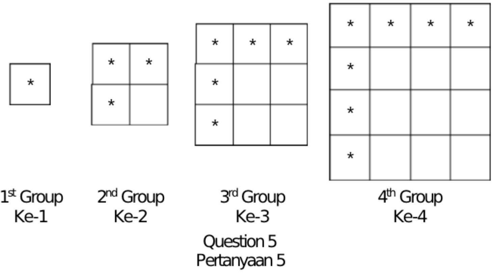
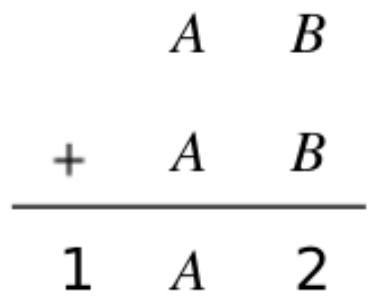
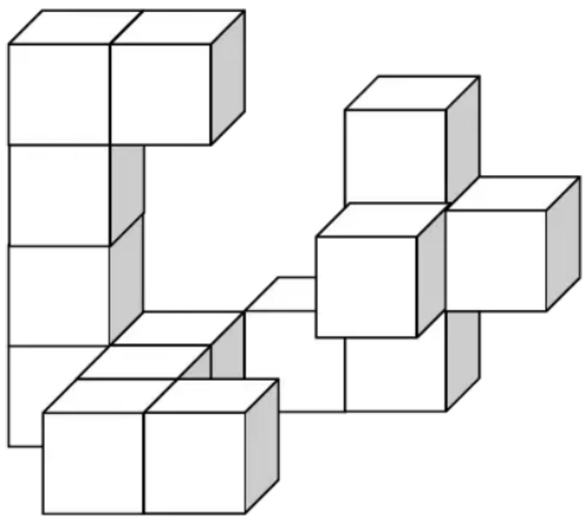
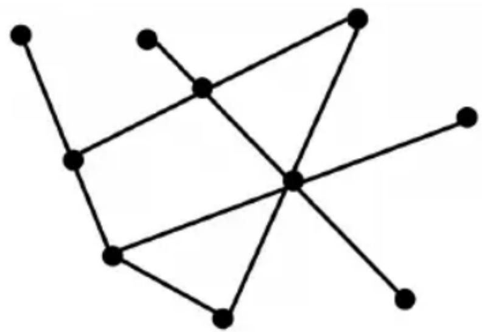
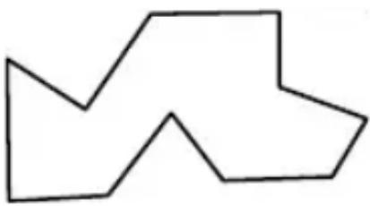
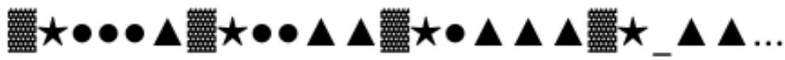

HONG KONG IN 

MATHEMATIC 

HEAT ROUND 2025 (INDON) 

Primary 2 

Time allow 

Question Paper 

Open-Ended Questions ( $1^{st} \sim 25^{th}$ ) (4 points for correct answer, no penalty point for wrong answer) 

## Logical Thinking

1. According to the pattern shown below, Find the value of $A + B$ . 

Berdasarkan pola yang ditunjukkan di bawah ini, tentukan nilai dari $A+B$ . 

88、85、81、76、70、A、B 

2. According to the pattern shown below, what is the English letter in the space provided? 

Berdasarkan pola yang ditunjukkan di bawah ini, huruf apakah yang seharusnya menempati bagian yang kosong ( _ )? 

F、C、H、E、J、G、L、_、.... 

3. Mary needs 20 minutes to draw 1 drawing and rest for 6 minutes. How many minute(s) does Mary need to draw 6 drawings? 

Mary membutuhkan 20 menit untuk menggambar 1 gambar dan beristirahat selama 6 menit. Berapa menit yang dibutuhkan Mary untuk menggambar 6 gambar? 

4. If 24 $^{th}$ July, 2024 is Wednesday, which day of the week will 24 $^{th}$ July, 2025 be? 

Jika tanggal 24 Juli 2024 adalah hari Rabu, hari apa tanggal 24 Juli 2025? 

5. According to the pattern shown below, how many $*$ is/are there in the $99^{th}$ group? 

Menurut pola yang ditunjukkan di bawah ini, berapa banyak * yang terdapat dalam kelompok ke-99? 

## Arithmetic

6. Find the value of 111+222+333+444+555+666. 

Tentukan nilai dari 111+222+333+444+555+666 

7. Find the value of 11+15+22+30+36+42+13+26+39 

Tentukan nilai dari 11+15+22+30+36+42+13+26+39 

8. Find the value of $3 \times 12 + 5 \times 12 + 2 \times 12$ . Tentukan nilai dari $3 \times 12 + 5 \times 12 + 2 \times 12$ 

9. Fill the lines with ‘+’ and ‘-’ to make the equation below correct. (Write down the complete equation in the answer sheet)
Isi garis dengan ‘+’ dan ‘-’ agar persamaan di bawah ini menjadi benar. (Tuliskan persamaan lengkap di lembar jawaban) 

$$
8 \_ 1 4 \_ 5 \_ 7 = 2 4
$$

10. If A, B represent different 1-digit numbers, what is the value of $A + B$ if the equation is correct?
Jika A, B mewakili angka 1 digit yang berbeda, berapakah nilai dari $A + B$ jika persamaannya benar? 

Question 10
Pertanyaan 10 

## Number Theory

11. What is the smallest 3-digit number that is divisible by 21? Tentukan bilangan 3 digit terkecil yang habis dibagi 21? 

12. 20 students have an even number of scores of sleeping competition in total. For first 10 children, each has an odd number of score. For the following 6 children, each has an even number of score. Determine the number of scores of the remaining children is odd or even.
Total 20 siswa memiliki jumlah nilai kompetisi tidur yang genap. Untuk 10 anak pertama, masing-masing memiliki jumlah nilai ganjil. Untuk 6 anak berikutnya, masing-masing memiliki nilai genap. Tentukan jumlah nilai anak yang tersisa ganjil atau genap. 

13. A box of eggs has 24 eggs. Mum asks Mary to buy 77 eggs. Her neighbor asks her to buy 13 eggs. At least how many box(es) of eggs does Mary need to buy?
Sekotak telur berisi 24 butir telur. Ibu meminta Mary untuk membeli 77 butir telur. Tetangganya meminta Mary untuk membeli 13 butir telur. Setidaknya berapa kotak telur yang harus dibeli Mary? 

14. Determine whether 123456 could be divisible by 6. (Write down Y for Yes & N for No)
Tentukan apakah 123456 dapat dibagi 6. (Tuliskan Y untuk Ya & N untuk Tidak) 

15. The numbers below follow the arithmetic sequence, what is the $11^{th}$ number?
Angka-angka di bawah ini mengikuti deret aritmetika, berapakah angka ke-11?
222、206、190、174、158、... 

## Geometry

16. A pyramid has 14 vertices. How many edge(s) does this pyramid have? 

Sebuah piramida memiliki 14 titik sudut. Berapa banyak rusuk yang dimiliki piramida ini? 

17. At least how many square(s) can be seen if viewing the figure below from the top? 

Setidaknya, berapa banyak persegi yang dapat dilihat jika melihat gambar di bawah ini dari atas? 

Question 17

Pertanyaan 17

18. How many line segment(s) is / are there in the polygon below? 

Berapa banyak segmen garis yang terdapat pada gambar di bawah ini? 

Question 18

Pertanyaan 18

19. How many interior angle(s) is/are there in the polygon below? 

Berapa banyak sudut dalam yang terdapat pada poligon di bawah ini? 

Question 19 

Pertanyaan 19 

20. According to the pattern shown below, what is the figure in the space provided? 

Berdasarkan pola yang ditunjukkan di bawah ini, gambar apakah yang seharusnya menempati bagian yang kosong ( _ )? 

## Combinatorics

21. Neo has 16 $1, 4 $2 and 6 $5 coins. At most how many $10 note(s) can be exchange? 

Neo memiliki 16 koin $1, 4 koin $2, dan 6 koin $5. Paling banyak berapa banyak uang kertas $10 yang bisa ia tukarkan? 

22. How many even number(s) is / are there from 99 to 999? (Include the first number and the end number) 

Berapa banyak angka genap yang ada dari 99 hingga 999? (Sertakan angka pertama dan angka terakhir) 

23. There are 3 ways from the zoo to the train station. There are 2 ways from the train station to the cinema. However, at the same time, there is 1 direct way from the zoo to the cinema. There are 3 ways from the cinema to the playground. How many different way(s) is / are from the zoo to the playground respectively? 

Ada 3 cara dari kebun binatang ke stasiun kereta. Ada 2 cara dari stasiun kereta ke bioskop. Namun, pada saat yang sama, ada 1 jalan langsung dari kebun binatang ke bioskop. Ada 3 jalan dari bioskop ke taman bermain. Ada berapa cara yang berbeda dari kebun binatang ke taman bermain? 

24. After Mary gives 7 pieces of chocolate to Andy and takes 13 pieces of chocolate from Eric, they will have equal number of chocolates. How many piece(s) of chocolate did Eric have more than Andy originally? 

Setelah Mary memberikan 7 potong cokelat kepada Andy dan menerima 13 potong cokelat dari Eric, mereka akan memiliki jumlah cokelat yang sama. Berapa potong cokelat yang dimiliki Eric lebih banyak dari Andy pada awalnya? 

25. A 3-digit number is formed by choosing 3 numbers without repetition from 0, 2, 2, 4, 5, 6 and 9. What is the difference between the largest value and the smallest value? (Each number can only be used once) 

bilangan 3 digit dibentuk dengan memilih 3 angka tanpa pengulangan dari 0, 2, 2, 4, 5, 6, dan 9. Berapa selisih antara nilai terbesar dan nilai terkecil? (Setiap angka hanya dapat digunakan satu kali) 