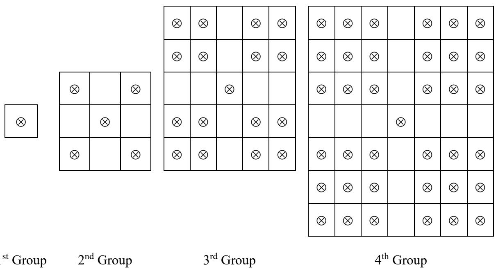
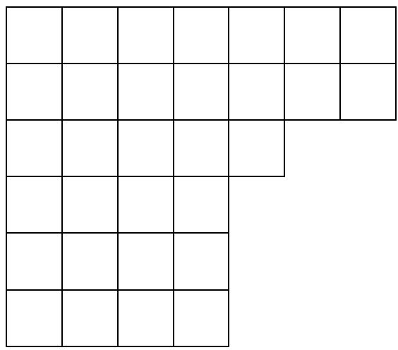
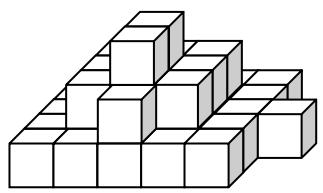
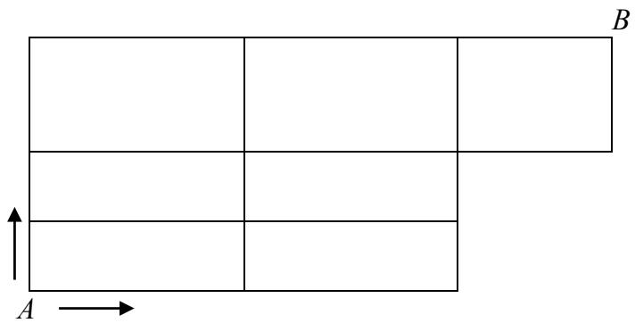

# Primary 3

Time allowed: 90 minutes 

## Question Paper

## Instructions to Contestants:

1. Each contestant should have ONE Question-Answer Book which CANNOT be taken away. 

2. There are 5 exam areas and 5 questions in each exam area. There are a total of 25 questions in this Question-Answer Book. Each carries 4 marks. Total score is 100 marks. No points are deducted for incorrect answers. 

3. All answers should be written on ANSWER SHEET. 

4. NO calculators can be used during the contest. 

5. All figures in the paper are not necessarily drawn to scale. 

6. This Question-Answer Book will be collected at the end of the contest. 

THIS Question-Answer Book CANNOT BE TAKEN AWAY. DO NOT turn over this Question-Answer Book without approval of the examiner. Otherwise, contestant may be DISQUALIFIED. 

Open-Ended Questions $( 1 ^ { \mathrm { s t } } \sim 2 5 ^ { \mathrm { t h } } )$ (4 points for correct answer, no penalty point for wrong answer) 

## Logical Thinking

1. What is the value of the number to represent “?” in the following table? 

<table><tr><td>1</td><td>1</td><td>2</td></tr><tr><td>2</td><td>3</td><td>8</td></tr><tr><td>3</td><td>5</td><td>18</td></tr><tr><td>4</td><td>7</td><td>?</td></tr><tr><td>5</td><td>9</td><td>50</td></tr></table>

2. According to the pattern shown below, how many triangle(s) is / are there from the $1 ^ { \mathrm { s t } }$ to the $9 9 ^ { \mathrm { t h } }$ symbol counting from the left? 

$\circ \triangle \triangle \ v \circ \triangle \triangle \ v \circ \triangle \triangle \ v \circ \triangle \triangle \triangle \ v . . .$ 

3. The age of Samuel 9 years ago is equal to the age of Joseph 2 years later. How much Samuel is older than Joseph when Joseph is 25 years old? 

4. A tree is planted every 15m in a street from one end. The street is 255m long. How many trees are there in the street? 

5. According to the pattern shown below, how many  is / are there in the $1 0 ^ { \mathrm { t h } }$ group? 

Question 5

## Arithmetic

6. Find the value of $2 + 4 + 6 + 8 + 1 0 + 1 2 + 1 4 + 1 6 + 1 8$ . 

7. Find the value of $8 1 \times 1 6 + 2 7 \times 5 2$ . 

8. Find the value of $1 6 \times 6 2 5 \times 4 \div 2 5$ . 

9. Find the value of  2018 2017 2016 2015 2014 ... 2002 2001 2000         . 

10. Find the value of $1 2 5 8 + 3 6 9 + 7 4 2 + 6 4 1$ . 

## Number Theory

11. Define the operation symbol $a \oplus b = b \times a - a - b$ , find the value of  (16 9)  . 

12. The sum of A and B is 2018. The difference between A and B is 902. Given A is larger than B, find the value of A. 

13. The numbers below follow the arithmetic sequence, what is the sum of the $9 ^ { \mathrm { t h } }$ term and the $1 4 ^ { \mathrm { t h } }$ term? 

$1 2 \cdot 1 5 \cdot 1 8 \cdot 2 1 \cdot 2 4 \cdot . . .$ 

14. A three digit number has remainder 5 when divided by 9. What is such number that is closest to 400? 

15. The sum of 3 consecutive odd numbers is 69. Find the smallest of the odd numbers. 

## Geometry

16. How many square(s) is / are there in the figure below? 

Question 16

17. A pyramid has 2018 edges, how many face(s) does this pyramid have? 

18. 9 squares which perimeters are 48cm form a larger square. What is the perimeter of the larger square? 

19. At least how many square(s) can be seen if observing the figure below from the top? 

Question 19

20. At most how many intersection point(s) are there by drawing 5 straight lines on a plane? 

## Combinatorics

21. After Amy gives 10 apples to Andy and 7 apples to Johnny, they will have equal number of apples. How many apple(s) did Johnny have less than Amy originally? 

22. Choose 3 digits from 1, 3, 4, 5, 9 to form 3-digit numbers. How many number(s) that can be divisible by 5 is / are there? (repetitions of digits are allowed) 

23. Numbers are drawn from the 27 integers 1 to 27. At least how many number(s) is / are drawn at random to ensure that there are two numbers whose difference is divisible by 4? 

24. At least how many of 37 children that was/were born in the same month? 

25. If Andy goes from point A to point B, each step can only move up or move right. How many way(s) is / are there? 

Question 25

## ~ End of Paper ~