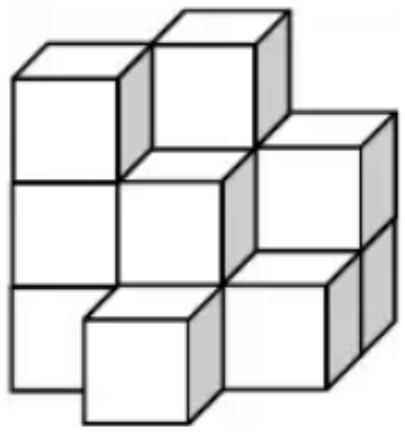

## 香港國際數學競賽初賽 2019

## HONG KONG IN

## MATHEMATIC

## HEAT ROUND 2019 (HONG K

## 小學三年級 Primary

Time allow 

## 試題

## Question Paper

考生須知：

Instructions to Contestants: 

本試題不可取走。

THIS Question-Answer Book CANNOT BE TAKEN AWAY. 

未得監考官同意，切勿翻閱試題，否則參賽者將有可能被取消資格。

DO NOT turn over this Question-Answer Book without approval of the examiner. 

Otherwise, contestant may be DISQUALIFIED. 

填空題（第1至20題）（每題3分，答錯及空題不扣分）

Open-Ended Questions ( $1^{st} \sim 20^{th}$ ) (3 points for correct answer, no penalty point for wrong answer) 

# Logical Thinking

# 邏輯思維

1. According to the pattern shown below, what is the number in the blank? 

按以下規律，求在橫線上的數字。

1、1、2、4、7、13、_、.... 

2. Tomorrow will be Saturday. Which day of the week will 124 days later be? 

明天是星期六，124天後是星期幾？

3. The age of Alice 8 years later is equal to the age of Peter 3 years ago. How old is Peter when Alice is 20 years old? 

愛麗絲 8 年後的年齡與彼德 3 年前的年齡相等。當愛麗絲 20 歲時，彼德多少歲？

4. 52 students line up where Alice is the $25^{\text{th}}$ starting from the front. How many student(s) is / are behind her? 

52名學生排成一線，由前面數起愛麗絲是第25名，有多少名學生在她身後？

## Arithmetic

## 算術

5. Find the value of 107+211+118+332+393+189. 

求 $107+211+118+332+393+189$ 的值。

6. Find the value of $92 \times 23 + 23 \times 108$ . 

求 $92 \times 23 + 23 \times 108$ 的值。

7. Find the value of $101 \times 11 \times 333 \div 3$ . 

求 $101\times11\times333\div3$ 的值。

8. Find the value of 20+19+18+17+16+15+14+13+12+11-10-9-8-7-6-5-4-3-2-1. 

求 $20 + 19 + 18 + 17 + 16 + 15 + 14 + 13 + 12 + 11 - 10 - 9 - 8 - 7 - 6 - 5 - 4 - 3 - 2 - 1$ 的值。

# Number Theory

## 數論

9. Define the operation symbol $a \otimes b = (a + b) \times a$ , find the value of $(4 \otimes 7)$ . 

定義運算 $a \otimes b = (a + b) \times a$ ，求 $(4 \otimes 7)$ 的值。

10. Alice and Peter have 111 candies in total. Alice has 17 candies more than Peter. How many candies does Alice have? 

愛麗絲和彼德共有 111 粒糖果，愛麗絲比彼德多 17 粒糖果，問愛麗絲有多少粒糖果？

11. The numbers below follow the arithmetic sequence, what is the sum of the $8^{\text{th}}$ term and the $11^{\text{th}}$ term? 根據以下的等差數列，求第 8 項及第 11 項之和。

5、8、11、14、17、... 

12. What is the difference between the largest and the smallest 3-digit multiple of 17? 最大與最小的能被 17 整除的三位數相差多少?

## Geometry

## 幾何

13. How many square(s) is / are there in the figure below?
請問下圖有多少個正方形？

<table><tr><td></td><td></td><td></td><td></td><td></td></tr><tr><td></td><td></td><td></td><td></td><td></td></tr><tr><td></td><td></td><td></td><td></td><td></td></tr><tr><td></td><td></td><td></td><td></td><td></td></tr><tr><td></td><td></td><td></td><td></td><td></td></tr></table>

Question 13

## 第 13 题

14. A pyramid has 27 faces, how many vertex(s) does this pyramid have? 有一個錐體有 27 個面，問這個錐體有多少個頂點？

15. A square whose sides are 36cm long is cut into 9 squares of side length 12cm. What is the difference in perimeters between 9 small squares and the larger square? 

1 個邊長為 36 厘米的正方形被切成了 9 個邊長為 12 厘米的正方形，求小正方形的周界之和與大正方形周界之差。

16. At least how many square(s) can be seen if observing the figure below from the right? 如果從側右面觀察下圖的立體，最少可以看見多少個正方形？

Question 16

第 16 题

# Combinatorics

## 組合數學

17. After Alice takes 10 peanuts and 8 peanuts from Peter and Mary respectively, they will have equal number of peanuts. How many peanut(s) did Mary have more than Alice originally?
當愛麗絲在彼德和瑪麗中拿走 10 顆和 8 顆花生後，他們擁有的花生數目便一樣。問原本瑪麗比多愛麗絲多少個花生？

18. Choose 3 digits from 1, 3, 5, 7, 8 to form 3-digit numbers. How many number(s) that can be divisible by 2 is / are there? (The repetition of digits is allowed)
從 1、3、5、7、8 中選 3 個數位組成三位數。請問當中有多少個是 2 的倍數？（數位可以重覆）

19. Numbers are drawn from the 34 integers 1 to 34. At least how many number(s) is / are drawn at random to ensure that there are two numbers whose product is divisible by 3?
在 1 至 34 這 34 個整數中最少任意選出多少個數，才必定有兩個數之積能被 3 整除？

20. 28 students are either wearing L, M or S size uniforms. At least how many student(s) is / are wearing the same size of uniforms?
28 個學生穿上了大、中、小碼校服，至少有多少名學生穿上相同碼的校服？

~全卷完 ~

~End of Paper ~ 