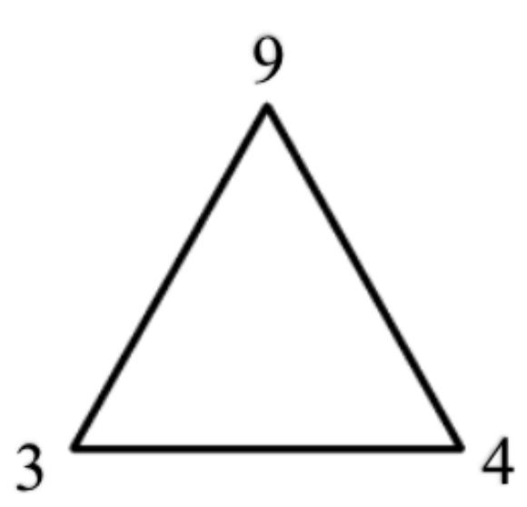
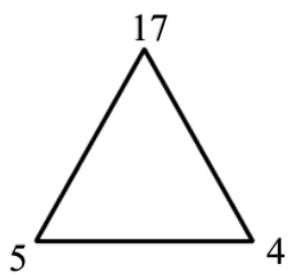
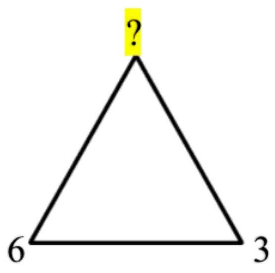
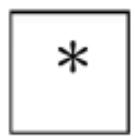
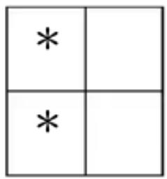
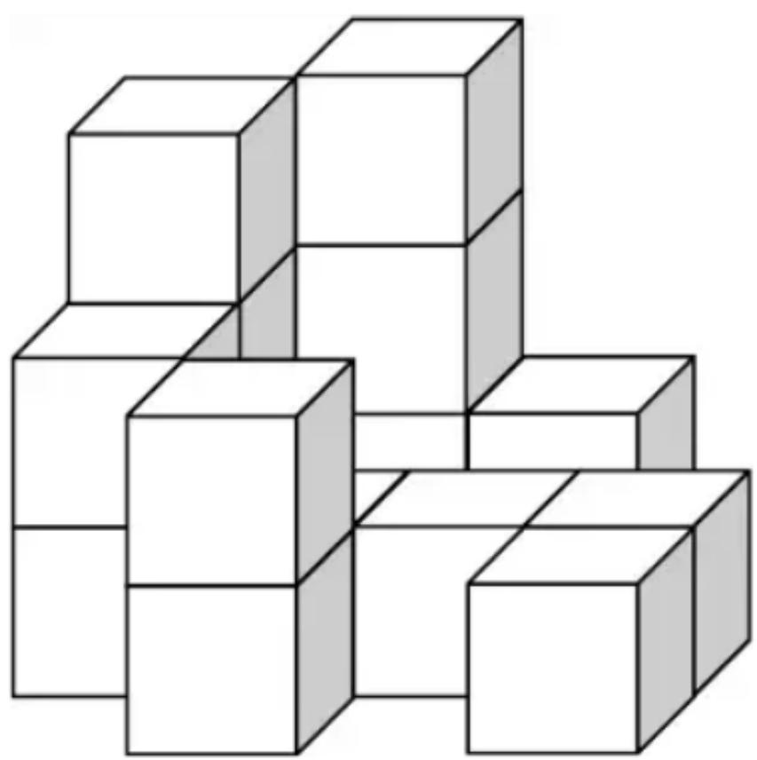

# Primary 3

Time allow 

## Question Paper

## Instructions to Contestants:

1. Each contestant should have ONE Question-Answer Book which CANNOT be ta 

2. There are 5 exam areas and 5 questions in each exam area. There are a total of 25 Question-Answer Book. Each carries 4 marks. Total score is 100 marks. No point incorrect answers. 

## Open-Ended Questions ( $1^{st} \sim 25^{th}$ ) (4 points for correct answer, no penalty point for wrong answer)

## Logical Thinking

1. According to the pattern shown below, what is the English alphabet in the space provided? Pada pola di bawah ini, huruf apakah yang seharusnya ada pada “____”? 

B、D、G、K、P、_、.... 

2. If 13 $^{th}$ April, 2020 is Monday, which day of the week will 11 $^{th}$ February, 2020 be? Jika tanggal 13 April 2020 adalah hari Senin, hari apakah tanggal 11 February 2020? 

3. Mary needs 30 minutes to finish a set of exercise and rest for 5 minutes. At most how many set of exercise(s) can Mary finish in 4 hours?
Mary membutuhkan 30 menit untuk menyelesaikan 1 set latihan dan beristirahat 5 menit. Berapa set paling banyak yang dapat diselesaikan Mary dalam 4 jam? 

4. According to the pattern shown below, what is the number in the blank? Berdasarkan pola di bawah ini, berapakah bilangan yang ditandai dengan ‘?’? 

Question 4 

Soal no. 4 

5. According to the pattern shown below, how many $*$ is / are there in the $13^{th}$ group? 

Berdasarkan pola di bawah ini, berapa banyak * ada pada Kelompok 13? 

<table><tr><td>*</td><td>*</td><td></td></tr><tr><td>*</td><td>*</td><td></td></tr><tr><td>*</td><td></td><td></td></tr></table>

<table><tr><td>*</td><td>*</td><td>*</td><td></td></tr><tr><td>*</td><td>*</td><td>*</td><td></td></tr><tr><td>*</td><td>*</td><td></td><td></td></tr><tr><td>*</td><td>*</td><td></td><td></td></tr></table>

$1^{\mathrm{st}}$ Group Kelompok 1 

$2^{\mathrm{nd}}$ Group Kelompok 2 

$3^{\mathrm{rd}}$ Group Kelompok 3 

$4^{\text{th}}$ Group Kelompok 4 

Question 5 

Soal no. 5 

6. Find the value of $642 + 847 + 283 + 194 + 388 + 126$ . 

Carilah nilai dari 642+847+283+194+388+126. 

7. Find the value of $480 \div 2 + 480 \div 4 + 480 \div 8 + 480 \div 12 + 480 \div 24$ . 

Carilah nilai dari $480 \div 2 + 480 \div 4 + 480 \div 8 + 480 \div 12 + 480 \div 24$ . 

8. What is the number that should be filled in the blank if the equation below is correct? 

Berapakah bilangan yang seharusnya ada pada “____” agar persamaan di bawah ini benar? 

$$
\_ \div 3 \times 7 - 7 = 1 4
$$

9. Find the value of $47 \times 21 + 18 \times 42 + 17 \times 21$ . 

Carilah nilai dari $47 \times 21 + 18 \times 42 + 17 \times 21$ . 

10. Find the value of $11 \div 7 + 26 \div 7 + 38 \div 14$ . 

Carilah nilai dari $11 \div 7 + 26 \div 7 + 38 \div 14$ . 

11. Define the operation symbol $a \otimes b = (a - b) \times (a + 2 \times b)$ , find the value of $(149 \otimes 49)$ . 

Jika didefinisikan $a \otimes b = (a - b) \times (a + 2 \times b)$ , carilah nilai dari $(149 \otimes 49)$ . 

12. Fill the lines with ‘×’ and ‘+’ to make the equation below correct. (Write down the complete equation in the answer sheet) 

Isilah “____” dengan ‘×’ dan ‘+’ untuk membuat persamaan di bawah ini benar. (Tulishlah persamaan ini dengan lengkap pada lembar jawaban) 

9 ____ 8 ____ 5 ____ 7 = 56 

13. If $A, B$ and $C$ are 1 to 9 and all digits are not the same, find the value of $A$ . 

Jika A, B dan C adalah angka berbeda dari 1 sampai 9, carilah nilai dari A. 

A B
+ A A C
D B 8 

14. The numbers below follow the arithmetic sequence, what is the sum of the $10^{th}$ term and the $12^{th}$ term? 

Bilangan-bilangan di bawah ini mengikuti sebuah baris aritmatika, berapakah jumlah suku ke-10 dan suku ke-12? 

11、17、23、29、35、... 

15. What is the difference between the largest and the smallest 3-digit multiple of 35? 

Berapakah selisih antara bilangan 3-angka kelipatan 35 terbesar dan terkecil? 

16. At least how many square(s) can be seen if viewing the figure below from the right? 

Setidaknya ada berapa banyak bujursangkar yang terlihat jika bangun ini dilihat dari kanan? 

Question 16

Soal no. 16

17. A pyramid has 36 faces, how many edge(s) does this pyramid have? 

Sebuah piramida mempunyai 36 sisi, berapa banyak rusuk yang piramida itu punyai? 

18. How many square(s) is / are there in the figure below? 

W: 1, 4, 1, 4, 1, 6, 10, 1, 1, 2, 6, 1, 4, 1, 4, 1, 6, 1 

Berapa banyak bujursangkar yang ada pada gambar di bawah ini? 

<table><tr><td></td><td></td><td></td><td></td><td></td></tr><tr><td></td><td></td><td></td><td></td><td></td></tr><tr><td></td><td></td><td></td><td></td><td></td></tr><tr><td></td><td></td><td></td><td></td><td></td></tr></table>

Question 18 

Soal no. 18 

19. A square whose sides are 36cm long is cut into 9 squares of side length 12cm. What is the difference in perimeters between 4 small squares and the larger square? 

Sebuah bujursangkar dengan panjang sisi 36 cm dipotong menjadi 9 bujursangkar dengan panjang sisi 12 cm. Berapa selisih antara keliling 4 bujursangkar kecil dan bujursangkar besar di awal? 

20. How many rectangle(s) with “*” is / are there in the figure below? 

Berapa banyak persegipanjang yang mengandung “*” yang ada pada gambar di bawah ini? 

<table><tr><td></td><td></td><td></td><td></td><td>*</td><td></td></tr><tr><td></td><td></td><td></td><td></td><td></td><td></td></tr><tr><td></td><td></td><td></td><td></td><td></td><td></td></tr></table>

Question 20 

Soal nomor 20 

## Combinatorics

21. How many 3-digit odd number(s) less than 400 is / are there without repetition of digits? 

Ada berapa banyak bilangan ganjil 3-angka yang lebih kecil dari 400 yang tidak mempunyai pengulangan angka? 

22. After Mary gives 28 chocolates to Andy and takes 16 chocolates from Eric, they will have equal number of chocolates. How many chocolate(s) did Mary have more than Andy originally? 

Setelah Mary memberi 28 coklat kepada Andy dan mengambil 16 coklat dari Eric, mereka mempunyai jumlah coklat yang sama. Berapa banyak coklat yang Mary punyai lebih banyak dari Andy pada awalnya? 

23. Numbers are drawn from 29 integers 15 to 43. At least how many number(s) is / are drawn at random to ensure that there are two numbers whose product is divisible by 4? 

Bilangan diambil secara acak dari 29 bilangan dari 15 sampai 43. Setidaknya berapa bilangan yang harus diambil untuk memastikan bahwa ada dua bilangan yang hasil kalinya dapat dibagi 4? 

24. 77 citizens are either wearing yellow, red, blue or black gloves. At least how many citizen(s) is / are wearing the same colour of gloves? 

77 orang menggunakan sarung tangan kuning, merah, biru atau hitam. Setidaknya ada berapa orang yang menggunakan sarung tangan dengan warna yang sama? 

25. Choose 3 digits from 9, 7, 0, 2, 3 and 6 to form 3-digit numbers. How many even number(s) greater than 400 is / are there? (The repetition of digits is allowed) 

Pilihlah 3 angka dari antara 9, 7, 0, 2, 3 dan 6 untuk membentuk bilangan 3 -angka. Berapa banyak bilangan genap yang lebih besar dari 400 yang dapat dibentuk? (Pengulangan angka diperbolehkan) 

~ End of Paper ~ 