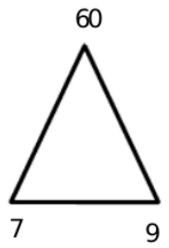
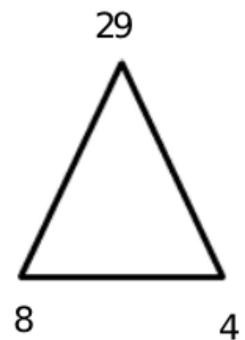
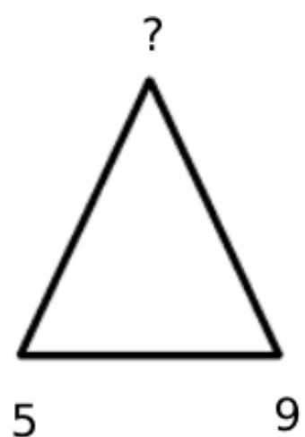
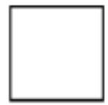
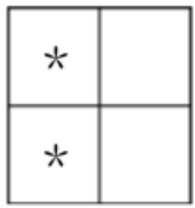
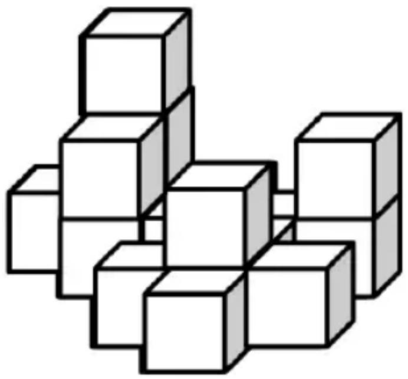

## 香港國際數學競賽晉級賽 2024

## HONG KONG IN

## MATHEMATIC

## HEAT ROUND 2024 (INDON)

# 小學三年級 Priman

Time allow 

## 試題

## Question Paper

考生須知：

Instructions to Contestants: 

THIS Question-Answer Book CANNOT BE TAKEN AWAY.
DO NOT turn over this Question-Answer Book without approval of the examiner.
Otherwise, contestant may be DISQUALIFIED. 

Open-Ended Questions ( $1^{st} \sim 25^{th}$ ) (4 points for correct answer, no penalty point for wrong answer) 

## Logical Thinking

1. According to the pattern shown below, what is the number in the blank? 

Berdasarkan pola yang ditunjukkan di bawah ini, angka berapakah yang seharusnya mengisi bagian “_”? 

3、6、11、18、27、38、_、... 

2. If 27 $^{th}$ September, 2023 is Wednesday, which day of the week was 1 $^{st}$ July, 2023? 

Jika tanggal 27 September 2023 adalah hari Rabu, hari apakah tanggal 1 Juli 2023? 

3. A street is 750m long. Now we plant trees every 25m on one side of street only. How many trees have been planted along the street? 

Sebuah jalan memiliki panjang 750m. Di salah satu sisi jalan akan ditanami pohon dengan jarak 25m. Berapa banyak pohon yang ditanam di sepanjang jalan tersebut? 

4. According to the pattern shown below, what is the missing number? 

Berdasarkan pola yang ditunjukkan di bawah ini, angka berapakah yang hilang? 

Question 4
Pertanyaan 4

5. According to the pattern shown below, how many $*$ is / are there in the $14^{th}$ group?

Berdasarkan pola yang ditunjukkan di bawah ini, berapa banyak * pada kelompok ke 14 ?

<table><tr><td>*</td><td>*</td><td></td></tr><tr><td>*</td><td>*</td><td></td></tr><tr><td>*</td><td>*</td><td></td></tr></table>

<table><tr><td>*</td><td>*</td><td>*</td><td></td></tr><tr><td>*</td><td>*</td><td>*</td><td></td></tr><tr><td>*</td><td>*</td><td>*</td><td></td></tr><tr><td>*</td><td>*</td><td>*</td><td></td></tr><tr><td>*</td><td>*</td><td>*</td><td></td></tr></table>

1 $^{st}$ Group
Kelompok ke-1 

2 $^{nd}$ Group
Kelompok ke-2 

3 $^{rd}$ Group
Kelompok ke-3 

$4^{\text{th}}$ Group Kelompok ke-4 

Question 5
Pertanyaan 5 

## Arithmetic

6. Find the value of $657 + 233 + 123 + 127 + 267 + 343$ . Tentukan nilai dari $657 + 233 + 123 + 127 + 267 + 343$ . 

7. Find the value of $1350 \div 3 + 1350 \div 5 + 1350 \div 15 + 1350 \div 9 + 1350 \div 30$ . Tentukan nilai dari $1350 \div 3 + 1350 \div 5 + 1350 \div 15 + 1350 \div 9 + 1350 \div 30$ . 

8. What is the number that should be filled in the blank, if the equation below is correct? Angka berapakah yang seharusnya mengisi bagian ____ jika persamaan di bawah ini benar? 

$$
\_ \times 5 \div 7 + 6 = 8 1
$$

9. Find the value of $91 \times 17 + 23 \times 34 - 37 \times 17$ .
Tentukan nilai dari $91 \times 17 + 23 \times 34 - 37 \times 17$ . 

10. Find the value of $13 \div 19 + 40 \div 38 + 62 \div 19$ .
Tentukan nilai dari $13 \div 19 + 40 \div 38 + 62 \div 19$ . 

## Number Theory

11. Define the operation symbol $a \otimes b = (a + b) + (a \times b - 3)$ , find the value of $112 \otimes 81$ .

Diketahui simbol operasi $a \otimes b = (a + b) + (a \times b - 3)$ , tentukan nilai dari $112 \otimes 81$ . 

12. Fill the lines with ‘×’ and ‘+’ to make the equation below correct. (Write down the complete equation in the answer sheet)
Isi baris dengan '×' dan ' + ' untuk membuat persamaan di bawah ini benar. (Tuliskan persamaan lengkapnya di lembar jawaban) 

$$
8 \_ 7 \_ 4 \_ 9 = 9 2
$$

13. If A, B and C are the digits chosen from 1 to 9 and all digits are not the same, find the value of A.
Jika A, B, dan C adalah angka yang dipilih dari 1 hingga 9 dan semua angka tidak sama, tentukan nilai A. 

$$
\begin{array}{r} A \quad C \\ + \quad A \quad C \quad C \\ \hline B \quad 5 \quad 2 \end{array}
$$

Question 13 

14. The numbers below follow the arithmetic sequence, what is the sum of the $15^{th}$ term and the $30^{th}$ term? Angka-angka di bawah ini mengikuti deret aritmetika, berapakah jumlah suku ke-15 dan suku ke-30? 

13、25、37、49、61、... 

15. What is the difference between the largest and the smallest 3-digit positive integral multiple of 29? Berapa selisih antara bilangan bulat positif tiga digit terbesar dan terkecil yang habis dibagi 29? 

## Geometry

16. How many square(s) is / are there in the figure below? Berapa banyak persegi pada gambar di bawah ini? 

<table><tr><td></td><td></td><td></td><td></td><td></td><td></td><td></td></tr><tr><td></td><td></td><td></td><td></td><td></td><td></td><td></td></tr><tr><td></td><td></td><td></td><td></td><td></td><td></td><td></td></tr><tr><td></td><td></td><td></td><td></td><td></td><td></td><td></td></tr></table>

Question 16
Pertanyaan 16

17. At least how many square(s) can be seen if viewing the figure below from the right?
Setidaknya berapa banyak persegi yang dapat dilihat jika melihat gambar di bawah ini dari kanan? 

Question 17
Pertanyaan 17

18. A pyramid has 55 faces, how many edge(s) does this pyramid have?
Sebuah piramida memiliki 55 sisi, berapa banyak rusuk yang dimiliki piramida tersebut? 

19. A square whose sides are 80cm long is cut into 100 squares of side length 8cm. What is the difference between the perimeter of the larger square and the sum of the perimeters of the 64 small squares? Sebuah persegi dengan panjang sisi 80cm dipotong menjadi 100 persegi dengan panjang sisi 8cm. Berapa selisih antara keliling persegi yang besar dan jumlah keliling dari 64 persegi kecil? 

20. How many rectangle(s) with “*” is / are there in the figure below? 

Berapa banyak persegi panjang dengan " * " yang ada pada gambar di bawah ini? 

<table><tr><td></td><td></td><td></td><td></td><td></td><td></td></tr><tr><td></td><td></td><td></td><td>*</td><td></td><td></td></tr><tr><td></td><td></td><td></td><td></td><td></td><td></td></tr><tr><td></td><td></td><td></td><td></td><td></td><td></td></tr></table>

Question 20
Pertanyaan 20

## Combinatorics

21. How many 3-digit even number(s) less than 500 is/are there? 

Berapa banyak bilangan genap 3 digit yang kurang dari 500? 

22. After Mary gives 48 chocolates to Andy and takes 25 chocolates from Eric, Andy has ten more chocolates than Mary. How many chocolate(s) did Mary have more than Andy originally? 

Setelah Mary memberikan 48 cokelat kepada Andy dan mengambil 25 cokelat dari Eric, Andy memiliki sepuluh cokelat lebih banyak dari Mary. Berapa banyak cokelat yang dimiliki Mary lebih banyak dari Andy pada awalnya? 

23. Numbers are drawn from 40 integers 30 to 69. At least how many number(s) should be drawn at random to ensure that there are two numbers whose product is divisible by 9? 

Bilangan diambil dari 40 bilangan bulat 30 hingga 69. Setidaknya berapa banyak bilangan yang harus diambil secara acak untuk memastikan bahwa ada dua bilangan yang hasil kalinya habis dibagi 9? 

24. 50 customers are either choosing 4 candies. For the type of candy which is chosen by most customers, at least how many customer(s) is / are choosing that same type of candy? 

50 pelanggan memilih 4 permen. Untuk jenis permen yang dipilih oleh sebagian besar pelanggan, setidaknya berapa banyak pelanggan yang memilih jenis permen yang sama? 

25. Choose 3 digits from 1, 3, 7, 2, 8 to form 3-digit numbers. How many number(s) that is / are the multiple of 2 is / are there? (The repetition of digits is not allowed) 

Pilih 3 digit dari 1, 3, 7, 2, 8 untuk membentuk bilangan 3 digit. Berapa banyak bilangan yang merupakan kelipatan 2 (Pengulangan angka tidak diperbolehkan) 

~End of Paper ~ 