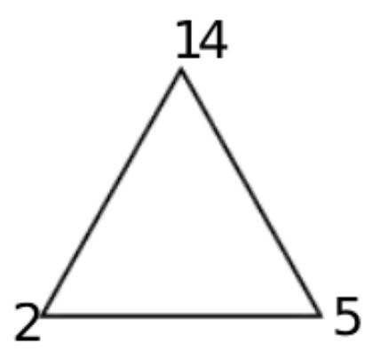
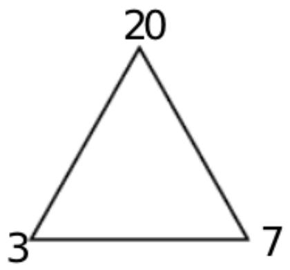
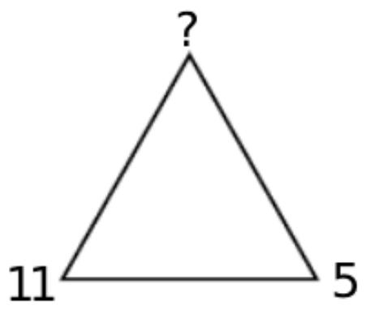
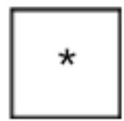
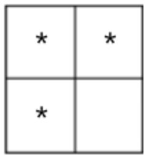
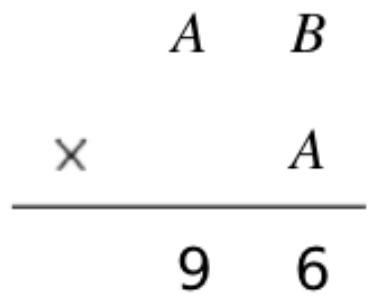
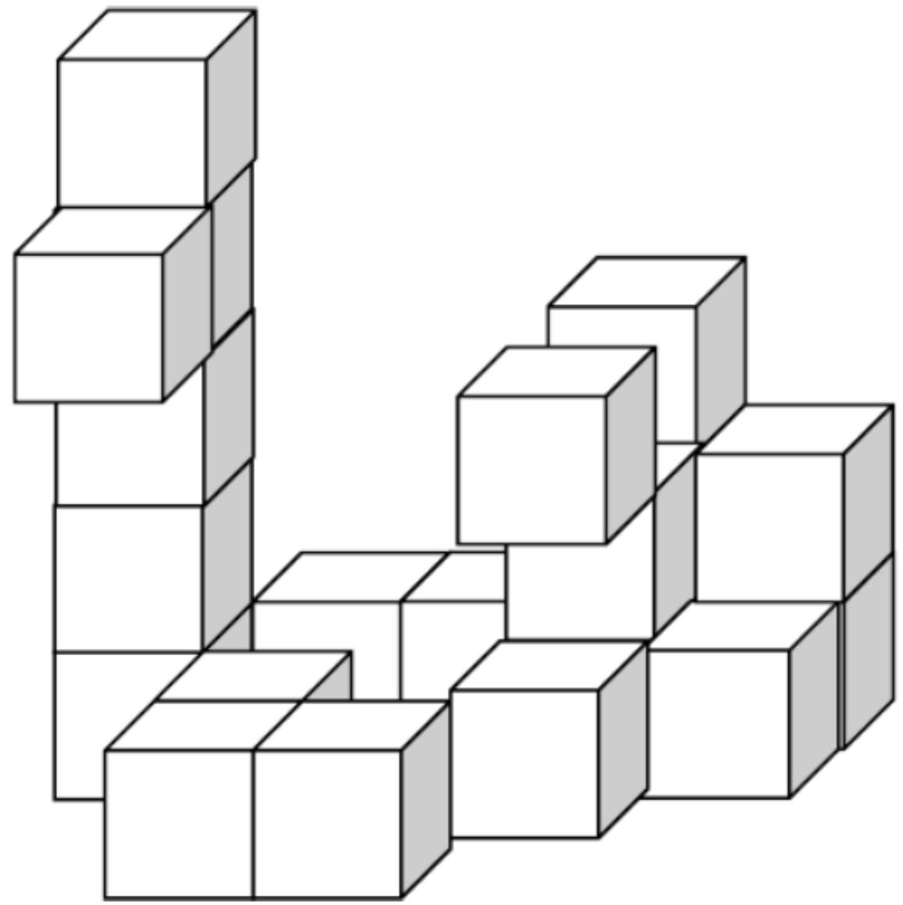
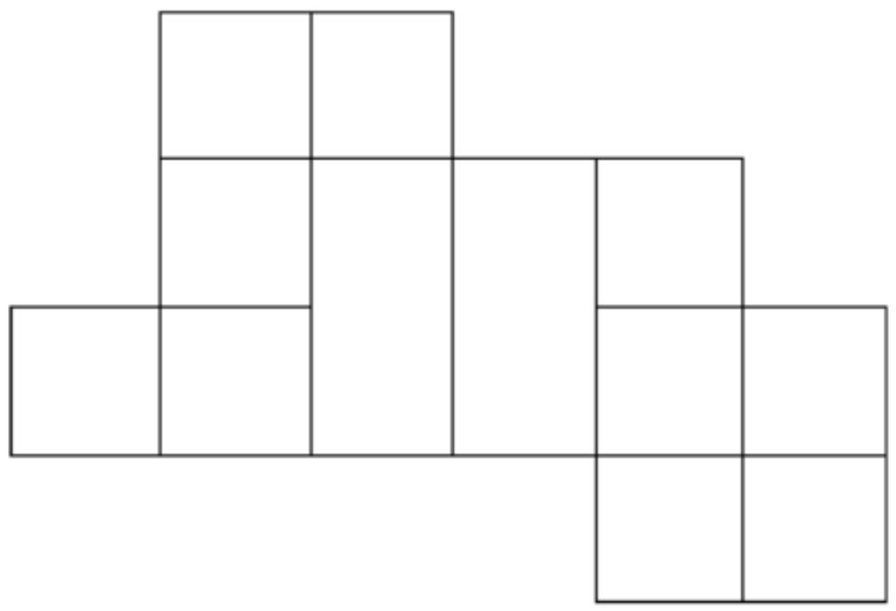

HONG KONG IN 

MATHEMATIC 

HEAT ROUND 2025 (INDON) 

Primary 3 

Time allow 

Question Paper 

Open-Ended Questions ( $1^{st} \sim 25^{th}$ ) (4 points for correct answer, no penalty point for wrong answer) 

## Logical Thinking

1. According to the pattern shown below, what is the English alphabet in the space provided? 

Berdasarkan pola yang ditunjukkan di bawah ini, huruf apakah yang seharusnya menempati bagian yang disediakan ( _ )? 

C、A、F、D、H、_、.... 

2. If 9 $^{th}$ July, 2025 is Wednesday, which day of the week will 28 $^{th}$ Feb, 2025 be? 

Jika 9 Juli 2025 adalah hari Rabu, hari apa tanggal 28 Februari 2025? 

3. Mary needs 15 minutes to draw 1 drawing and rest for 5 minutes. At most how many drawing(s) can Mary draw in 3 hours and 30 minutes? 

Mary membutuhkan waktu 15 menit untuk menggambar 1 gambar dan beristirahat selama 5 menit. Paling banyak berapa banyak gambar yang dapat digambar Mary dalam waktu 3 jam 30 menit? 

4. According to the pattern shown below, what is the missing number? 

Menurut pola yang ditunjukkan di bawah ini, angka berapakah yang hilang? 

Question 4
Pertanyaan 4

5. According to the pattern shown below, What is the difference between the number of * in group 30 and 99?

Berdasarkan pola yang ditunjukkan di bawah ini, Berapakah selisih antara jumlah * pada kelompok 30 dan 99?

<table><tr><td>*</td><td>*</td><td>*</td></tr><tr><td>*</td><td></td><td></td></tr><tr><td>*</td><td></td><td></td></tr></table>

<table><tr><td>*</td><td>*</td><td>*</td><td>*</td></tr><tr><td>*</td><td></td><td></td><td></td></tr><tr><td>*</td><td></td><td></td><td></td></tr><tr><td>*</td><td></td><td></td><td></td></tr><tr><td>*</td><td></td><td></td><td></td></tr></table>

$1^{\text{st}}$ Group Ke-1 

$2^{nd}$ Group
Ke-2 

$3^{rd}$ Group
Ke-3 

$4^{th}$ Group
Ke-4 

Question 5
Pertanyaan 5 

## Arithmetic

6. Find the value of 111+333+555+777+999-222-444 

Tentukan nilai dari 111+333+555+777+999-222-444 

7. Find the value of . $320 \div 2 + 320 \div 4 + 320 \div 8 + 320 \div 16 + 320 \div 32$ 

Tentukan nilai dari $320 \div 2 + 320 \div 4 + 320 \div 8 + 320 \div 16 + 320 \div 32$ 

8. What is the number that should be filled in the blank if the equation below is correct? 

Angka berapakah yang harus diisi pada bagian yang kosong jika persamaan di bawah ini benar? 

$$
- - - - \div 1 3 \times 7 - 9 = 1 7 3
$$

9. Find the value of $19 \times 63 + 39 \times 59 - 21 \times 20$ . 

Tentukan nilai dari 19×63+ 39×59- 21×20 

10. Find the value of $1-3+5-7+9-\ldots-71+73$ 

Tentukan nilai dari 1-3+5-7+9-...-71+73 

## Number Theory

11. Define the operation symbol $a \otimes b = (a - b) \times (3 \times a + 2 \times b)$ , find the value of $56 \otimes 34$ . 

Diberikan simbol operasi $a \otimes b = (a - b) \times (3 \times a + 2 \times b)$ , tentukan nilai dari 56⊗34 

12. What is the smallest 3-digit even number that is divisible by 3, 5 and 13? 

Berapakah bilangan genap 3 digit terkecil yang habis dibagi 3, 5, dan 13? 

13. If A and B are 1 to 9 and all digits are not the same, find the value of A - B. 

Jika A dan B adalah 1 sampai 9 dan semua angka tidak sama, tentukan nilai dari A-B. 

Question 13
Pertanyaan 13

14. The numbers below follow the arithmetic sequence, what is the sum of the $11^{th}$ term and the $14^{th}$ term? 

Bilangan-bilangan di bawah ini mengikuti deret aritmetika, berapakah jumlah suku ke-11 dan suku ke-14? 

2、5、8、11、14、... 

15. Liam has 22 eggs and Bella has 38 eggs. How many egg(s) does Bella have to give Liam to make the number of eggs of Liam is 4 times of that of Bella? 

Liam memiliki 22 butir telur dan Bella memiliki 38 butir telur. Berapa banyak telur yang harus diberikan Bella kepada Liam agar jumlah telur Liam menjadi 4 kali lipat dari jumlah telur Bella? 

## Geometry

16. At least how many square(s) can be seen if viewing the figure below from the right? 

Setidaknya, berapa banyak persegi yang dapat dilihat jika melihat gambar di bawah ini dari kanan? 

Question 16

Pertanyaan 16

17. A prism has 40 vertices. Find the difference between the number of edges and the number of faces of this prism. 

Sebuah prisma memiliki 40 titik sudut. Tentukan selisih antara jumlah rusuk dan jumlah sisi prisma ini. 

18. How many square(s) is / are there in the figure below? 

Berapa banyak persegi yang terdapat pada gambar di bawah ini? 

Question 18

Pertanyaan 18

19. A square whose sides are 16 cm long is cut into 8 rectangles. Find the maximum value of the perimeters of each small rectangle. 

Sebuah persegi dengan panjang sisi 16 cm dipotong menjadi 8 persegi panjang. Tentukan nilai maksimum keliling setiap persegi panjang kecil. 

20. How many rectangle(s) with “*” is / are there in the figure below? 

Berapa banyak persegi panjang dengan tanda “*” yang terdapat pada gambar di bawah ini? 

<table><tr><td></td><td></td><td>*</td><td></td></tr><tr><td></td><td></td><td></td><td></td></tr><tr><td></td><td></td><td></td><td></td></tr></table>

Question 20
Pertanyaan 20

## Combinatorics

21. How many 3-digit odd number(s) less than 400, larger than 200 is / are there without repetition of digits? Berapa banyak bilangan ganjil 3 digit kurang dari 400, lebih besar dari 200 yang ada tanpa pengulangan angka? 

22. After Melo gives 44 chocolates to Andy and takes 23 chocolates from Eric, they will have equal number of chocolates. How many chocolate(s) did Melo have more than Andy originally? 

Setelah Melo memberikan 44 cokelat kepada Andy dan menerima 23 cokelat dari Eric, mereka akan memiliki jumlah cokelat yang sama. Berapa banyak cokelat yang dimiliki Melo lebih banyak dari Andy pada awalnya? 

23. Numbers are drawn from 33 integers 11 to 43. At least how many number(s) is / are drawn at random to ensure that there are two numbers whose product is divisible by 3 or 5? 

Bilangan diambil dari 33 bilangan bulat 11 hingga 43. Setidaknya berapa banyak angka yang diambil secara acak untuk memastikan bahwa ada dua angka yang hasil kalinya habis dibagi 3 atau 5? 

24. Peter has 9 $10 notes, 7 $20 notes and 4 $100 notes, at most how many souvenir(s) can he buy for a souvenir costed $88? 

Peter memiliki 9 uang kertas $10, 7 uang kertas $20, dan 4 uang kertas $100. Paling banyak berapa banyak suvenir yang bisa ia beli dengan harga $88? 

25. Numbers are drawn from 45 integers 6 to 51 at random. At least how many number(s) do we need to draw to ensure that there are two chosen numbers whose sum is 80? 

Bilangan diambil dari 45 bilangan bulat 6 sampai 51 secara acak. Setidaknya berapa banyak angka yang harus diambil untuk memastikan bahwa ada dua angka terpilih yang jumlahnya 80? 