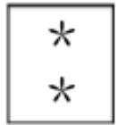
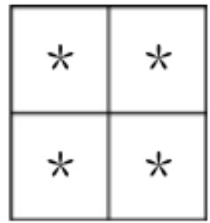
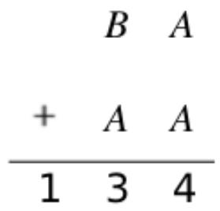
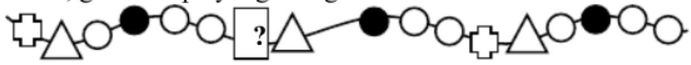
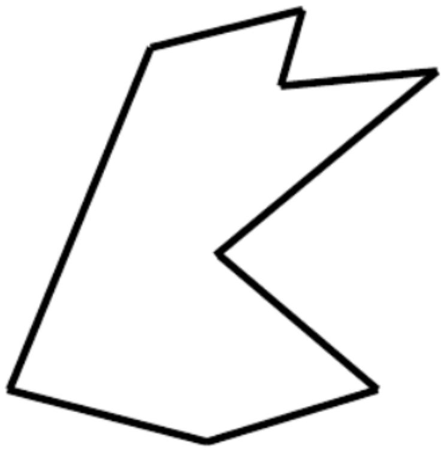
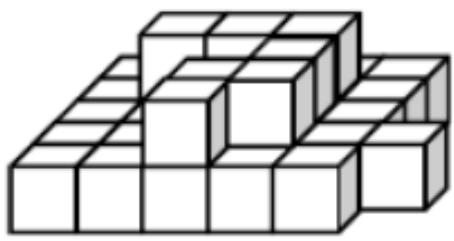
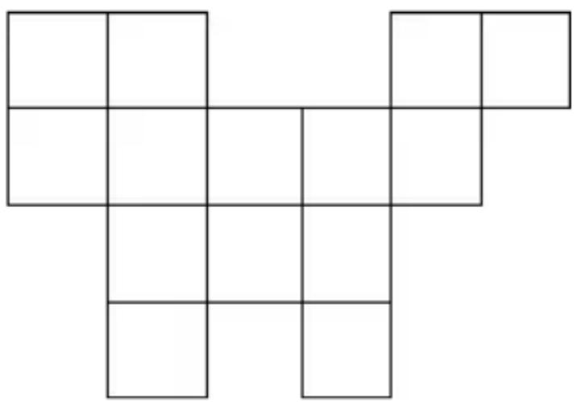
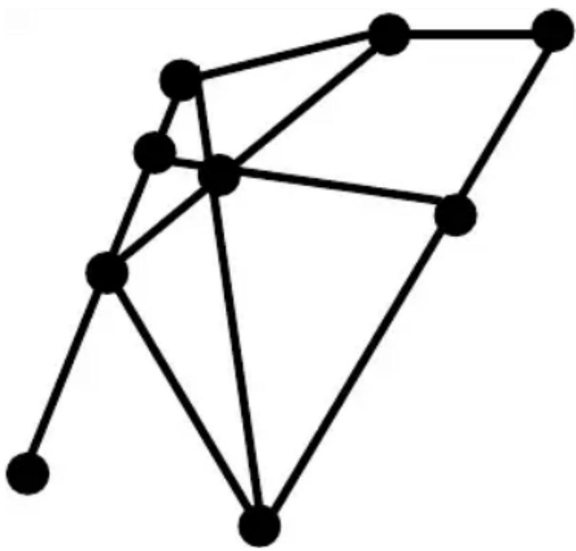

## 香港國際數學競賽晉級賽 2023

## HONG KONG IN

## MATHEMATIC

## SEMI-FINAL 2023 (HONG K

# 小學一年級 Primary

Time allow 

## 試題

## Question Paper

考生須知：

Instructions to Contestants: 

本試題不可取走。

THIS Question-Answer Book CANNOT BE TAKEN AWAY. 

未得監考官同意，切勿翻閱試題，否則參賽者將有可能被取消資格。

DO NOT turn over this Question-Answer Book without approval of the examiner. 

Otherwise, contestant may be DISQUALIFIED. 

填空題（第1至25題）（每題4分，答錯及空題不扣分）

Open-Ended Questions ( $1^{st} \sim 25^{th}$ ) (4 points for correct answer, no penalty point for wrong answer) 

# Logical Thinking

## 邏輯思維

1. According to the pattern shown below, what is the number in the blank? 

Berdasarkan pola berikut, bilangan berapa yang mengisi “____”? 

3、11、19、27、35、43、_、... 

2. According to the pattern shown below, how many $*$ is / are there in the $6^{th}$ group? 

Berdasarkan pola berikut, ada berapa * pada kelompok ke-6? 

<table><tr><td>*</td><td>*</td><td>*</td></tr><tr><td>*</td><td>*</td><td></td></tr><tr><td>*</td><td></td><td></td></tr></table>

<table><tr><td>*</td><td>*</td><td>*</td><td>*</td></tr><tr><td>*</td><td>*</td><td></td><td></td></tr><tr><td>*</td><td></td><td></td><td></td></tr><tr><td>*</td><td></td><td></td><td></td></tr></table>

1 $^{st}$ Group Kelompok 1 

2 $^{nd}$ Group
Kelompok 2 

3 $^{rd}$ Group
Kelompok 3 

Question 2
Pertanyaan 2 

$4^{\text{th}}$ Group Kelompok 4 

3. According to the pattern shown below, what is the English alphabet in the space provided? 

Berdasarkan pola berikut, huruf aoa yang seharusnya mengisi “____”? 

A、F、D、K、H、P、L、_、P、... 

4. 41 children form a column. There are 25 children behind Emily. How many child(ren) is/are in front of her? 

41 anak membentuk sebuah kolom. Ada 25 anak di belakang Emily. Ada berapa anak di depan Emily? 

5. 20 years ago, Melo was 6 years old. Niki is 8 years younger than Melo. How old is Niki now? 

20 tahun yang lalu, Melo berusia 6 tahun. Niki berusia 8 tahun lebih muda dari Melo. Berapa usia Niki sekarang? 

## Arithmetic

## 算術

6. What is the number that should be filled in the blank if the equation below is correct? 

Bilangan berapa yang seharusnya mengisi “____” jika persamaan berikut benar? 

$$
2 3 - \_ = 6
$$

7. If A, B represent different 1-digit numbers, what is the value of B if the equation is correct? Jika A, B mewakili bilangan 1-angka berbeda, berapa nilai B jika persamaan berikut benar? 

Question 7
Pertanyaan 7

8. Find the value of $36+52+55+45+64+18$ . 

Carilah nilai dari 36+52+55+45+64+18. 

9. Find the value of 18-37+53-22. 

Carilah nilai dari 18-37+53-22. 

10. Find the value of $9+6-5+8+7-5+21+14-5+13+12-5+31+29$ . 

Carilah nilai dari 9+6-5+8+7-5+21+14-5+13+12-5+31+29. 

## Number Theory

## 數論

11. Richard has 88 books and Peter has 55 books. The total number of books among John and them is an odd number. Determine whether the number of John's books is odd or even. 

Richard memiliki 88 buku dan Peter memiliki 55 buku. Jumlah buku antara John dan mereka adalah bilangan ganjil. Tentukan apakah jumlah buku John ganjil atau genap? 

12. Determine the result of $3+4+7+8+11+12+15+16+17$ is odd or even. 

Tentukan hasil dari 3+4+7+8+11+12+15+16+17 adalah ganjil atau genap/ 

13. By observing the numbers, which odd number is the greatest? 

Dengan mengamati bilangan, manakah yang merupakan bilangan ganjil terbesar? 

30、31、53、98、39、52、92、41 

14. The numbers below follow the arithmetic sequence, what is the $7^{\text{th}}$ number? 

Bilangan berikut adalah barisan aritmatika, berapa bilangan ke-7? 

83、79、75、71、... 

15. Niki has 25 red pockets and Steven has 9 red pockets. How many red pocket(s) does Steven have to ask Niki to give him to make Steven has 4 more red pockets than Niki? 

Niki memiliki 25 kantong merah dan Stevan memiliki 9 kantong merah. Berapa kantong merah yang harus Steven minta pada Niki agar Steven memiliki 4 kantong merah lebih banyak dari Niki? 

## Geometry

## 幾何

16. According to the pattern shown below, what is the figure in the space provided? 

Berdasarkan pola berikut, gambar apa yang mengisi “?” ? 

Question 16 

Pertanyaan 16 

17. How many interior angle(s) is / are there in the polygon below? 

Ada berapa sudut dalam pada segi-banyak berikut? 

Question 17 

Pertanyaan 17 

18. At least how many square(s) can be seen if observing the figure below from the right? 

Ada berapa persegi yang dapat silihat jika mengamati gambar berikut dari kanan? 

Question 18 

19. How many square(s) is / are there in the figure below? 

A da berapa persegi pada gambar beri kut? 

Question 19

Pertanyaan 19

20. How many line segment(s) is/are there in the figure below? 

A da berapa ruas gari s pada gambar beri kut? 

Question 20

Pertanyaan 20

Combinatorics 

組合數學

21. According to the following numbers, what is the difference between the number of even number(s) and odd number(s)? 

Berdasarkan bilangan berikut, berapa selisih antara banyaknya bilangan genap dan bilangan ganjil? 

13, 18, 89, 73, 32, 46, 101, 72 

22. Choose 2 digits, without repetition, from 0, 2, 6, 5 and 9 to form 2-digit even numbers. How many different number(s) is / are there? 

Pilihlah 2 angka, tanpa pengulangan, dari 0, 2, 6, 5 dan 9 untuk membentuk bilangan genap 2-angka. 

Berapa banyak bilangan yang berbeda? 

23. Which number below is the smallest? 

Dibawah ini, bilangan manakah yang terkecil? 

20239542、202100864、20231118、20230721、20237520 

24. A 3-digit number is formed by choosing 3 numbers from 0, 3, 6 and 8. What is the difference between the largest and the smallest values? (Each number can only be used once) 

Sebuah bilangan 3-angka dibentuk dengan memilih 3 bilangan dari 0, 3, 6 dan 8. Berapa selisih antara nilai terbesar dan nilai terkecil? (Setiap bilangan hanya dapat digunakan satu kali) 

25. Arranging the following numbers in descending order (From the greatest to the smallest), find the value of $2^{nd}$ greatest number. 

Berdasarkan bilangan berikut dalam urutan menurun (dari terbesar ke terkecil), carilah nilai bilangan terbesar ke-2. 

68, 90, 37, 19, 56, 73, 21, 9 

~全卷完 ~

~End of Paper ~ 