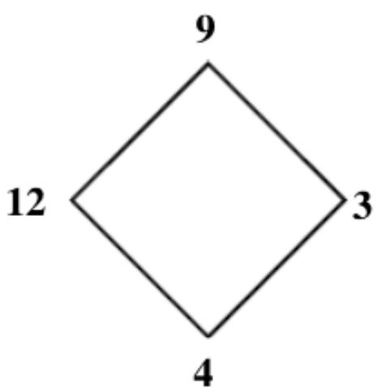
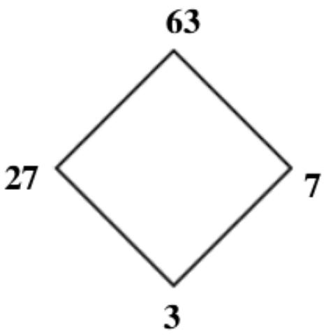
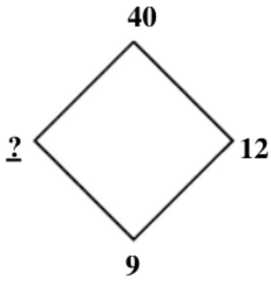
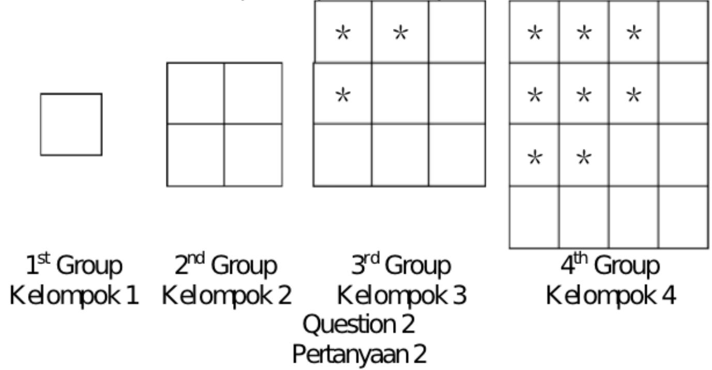
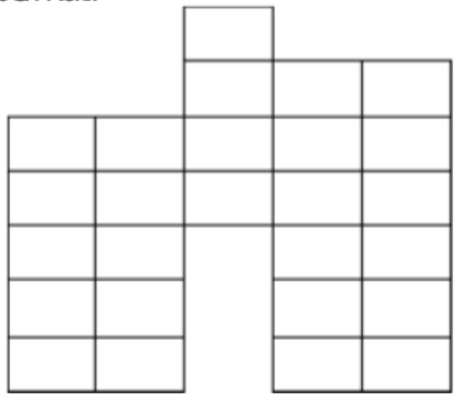
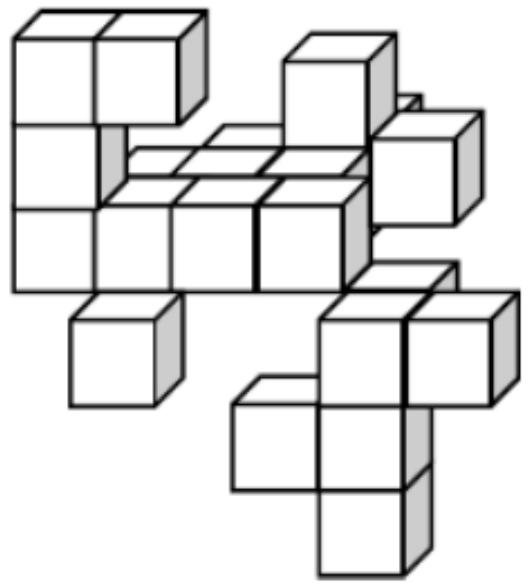

## 香港國際數學競賽晉級賽 2023

## HONG KONG IN

## MATHEMATIC

## SEMI-FINAL 2023 (HONG K

# 小學三年級 Priman

Time allow 

## 試題

## Question Paper

考生須知：

Instructions to Contestants: 

本試題不可取走。

THIS Question-Answer Book CANNOT BE TAKEN AWAY. 

未得監考官同意，切勿翻閱試題，否則參賽者將有可能被取消資格。

DO NOT turn over this Question-Answer Book without approval of the examiner. 

Otherwise, contestant may be DISQUALIFIED. 

Open-Ended Questions ( $1^{st} \sim 25^{th}$ ) (4 points for correct answer, no penalty point for wrong answer) 

## Logical Thinking

1. According to the pattern shown below, what is the number in the blank? 

Berdasarkan pola dibawah ini, bilangan berapa pada “?” ? 

Question 1
Pertanyaan 1

2. According to the pattern shown below, how many $*$ is / are there in the $16^{th}$ group? 

berdasarkan pola dibawah ini, ada berapa * pada kelompok ke-16? 

3. According to the pattern shown below, what is the number in the blank? 

Berdasarkan pola dibawah ini, bilangan berapa pada “____”? 

1、1、3、7、13、21、_、… 

4. If 4 $^{th}$ June, 2023 is Tuesday, which day of the week was 1 $^{st}$ March, 2023? 

Jika 4 Juni 2023 adalah hari Selasa, hari apa pada 1 Maret 2023? 

5. A street is 860m long. Now we plant trees every 20m. How many trees have been planted along the street? 

Panjang suatu jalan adalah 860m. Sekarang kita menanan pohon setiap 20m. Ada berapa pohon yang ditanam di sepanjang jalan? 

## Arithmetic

6. Find the value of $58 \times 29 + 19 \times 87 + 17 \times 145$ . 

Carilah nilai dari 58×29+19×87+17×145. 

7. Find the value of $17 \div 13 + 31 \div 13 + 8 \div 26$ . 

Carilah nilai dari 17÷13+31÷13+8÷26. 

8. Find the value of 352+721+87+929+648+279. 

Carilah nilai dari 352+721+87+929+648+279. 

9. Find the value of $720 \div 3 + 720 \div 9 + 720 \div 12 + 720 \div 36 + 720 \div 144$ . 

Carilah nilai dari 720÷3+720÷9+720÷12+720÷36+720÷144. 

10. What is the number that should be filled in the blank if the equation below is correct? 

Berapa bilangan yang harus di isikan pada “____” jika persamaan berikut ini benar? 

$$
\div 5 \times 6 - 1 3 = 8 9
$$

## Number Theory

11. The numbers below follow the arithmetic sequence, what is the sum of the $9^{th}$ term and the $14^{th}$ term? Bilangan dibawah ini merupakan barisan aritmatika, berapajumlah suku ke-9 dan suku ke-14? 

13、20、27、34、41、... 

12. What is the difference between the largest and the smallest 3-digit multiple of 23? 

Berapa selisih antara 3-angka terbesar dan terkecil kelipatan 23? 

13. Define the operation symbol $a \otimes b = (a - b) \times (a + 2 \times b)$ , find the value of $(86 \otimes 12)$ . 

Diketahui simbol operasi $a \otimes b = (a - b) \times (a + 2 \times b)$ , carilah nilai dari $(86 \otimes 12)$ . 

14. Fill the lines with ‘×’ and ‘+’ to make the equation below correct. (Write down the complete equation in the answer sheet) 

Isilah “____” dengan ‘×’ and ‘+’ agar persamaan dibawah ini benar. (Tulis persamaan lengkapnya di lembar jawaban) 

8 ____ 2 ____ 3 ____ 6 = 34 

15. If A, B, C and D are the digits chosen from 1 to 9 and all digits are not the same, find the value of A. Jika A, B, C dan D adalah angka yang dipilih dari 1 hingga 9 dan semua angkanya tidak sama, carilah nilai dari A. 

$$
\begin{array}{r} {A A} \\ {+ A A C} \\ \hline {D B 5} \end{array}
$$

## Geometry

16. A square whose sides are 63 cm long is cut into 64 squares of side length 6cm. What is the difference between the perimeter of the larger square and the sum of the perimeters of the 64 small squares? Sebuah persegi yang panjang sisinya 63 cm di potong menjadi 64 persegi dengan panjang sisi 6cm. Berapa selisih antara keliling persegi besar dan jumlah keliling dari 64 persegi kecil? 

17. How many rectangle(s) with “*” is / are there in the figure below? Ada berapa persegi panjang dengan “*” pada gambar berikut? 

<table><tr><td></td><td></td><td></td><td></td><td></td></tr><tr><td></td><td></td><td></td><td>*</td><td></td></tr><tr><td></td><td></td><td></td><td></td><td></td></tr></table>

Question 17
Pertanyaan 17

18. How many square(s) is / are there in the figure below? Ada berapa persegi pada gambar berikut? 

Question 18
Pertanyaan 18

19. At least how many square(s) can be seen if viewing the figure below from the right? Berapa banyak persegi yang dapat dilihat jika melihat gambar berikut dari kanan? 

Question 19
Pertanyaan 19

20. A pyramid has 41 faces, how many edge(s) does this pyramid have? 

Sebuah piramida memiliki 41 sisi, berapa banyak rusuk pada piramida tersebut? 

## Combinatorics

21. 73 students are either wearing XL, L, M or S size uniforms. For the uniform size which is chosen by most students, at least how many student(s) is / are wearing that same size of uniforms? 

73 siswa memakai seragam ukuran XL, L, M atau S. Untuk ukuran seragam yang dipilih oleh sebagian besar siswa, ada berapa siswa yang memakai seragam dengan ukuran yang sama? 

22. Choose 3 digits from 0, 3, 4, 5, 7, 9, 8 to form 3-digit numbers. How many number(s) that is / are the multiple of 5 is / are there? (The repetition of digits is not allowed) 

3 angka dipilih dari 0, 3, 4, 5, 7, 9, 8 untuk membentuk bilangan 3-angka. Ada berapa bilangan kelipatan 5? (Pengulangan angka tidak diperbolehkan) 

23. How many 3-digit odd number(s) less than 500 is / are there without repetition of digits? 

Ada berapa bilangan ganjil 3-angka yang kurang dari 500 tanpa pengulangan angka? 

24. After Mary gives 21 chocolates to Andy and takes 29 chocolates from Eric, they will have equal number of chocolates. How many chocolate(s) did Mary have more than Andy originally? 

Setelah Mary memberi 21 coklat kepada Andy dan mengambil 29 coklat dari Eric, mereka akan memiliki jumlah coklat yang sama. Berapa banyak coklat yang dimiliki Mary lebih banyak dari Andy semula? 

25. Numbers are drawn from 21 integers 35 to 55. At least how many number(s) should be drawn at random to ensure that there are two numbers whose product is divisible by 3? 

Bilangan diambil dari 21 bilangan bulat 35 hingga 55. Berapa banyak bilangan yang harus diambil secara acak untuk memastikan ada dua bilangan yang hasil kalinya dapat dibagi 3? 

~End of Paper ~ 