## SECTION ONE - (3 point problems)

1. The higher the step on the podium, the higher the rank of the runner. Who finished third? 

(A) A 

(B) B 

(C) C 

(D) D 

(E) E 

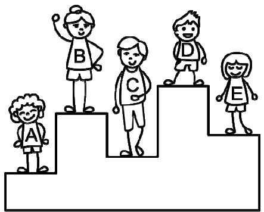

2. In the pictures, each dot stands for 1 and each bar stands for 5. For example, stands for 8. Which picture stands for 12? 

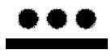

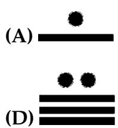

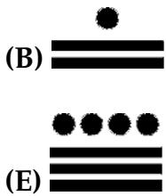

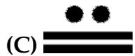

3. Sus puts three cubes on the table. On top of those he puts two cilinders. On top of these he puts another cube. Which of the following figures corresponds to Sus's construction? 

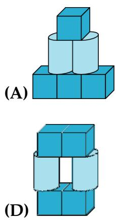

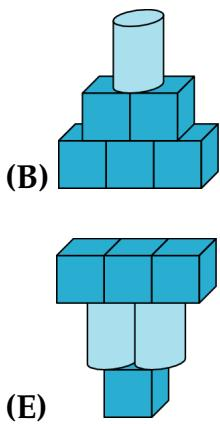

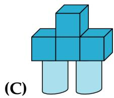

4. There are two holes in the cover of a book. When the book is open, it looks like this: 

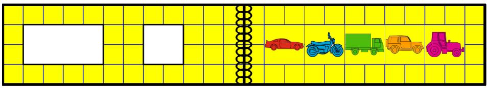

Which pictures does Olaf see through the holes when he closes the book? 

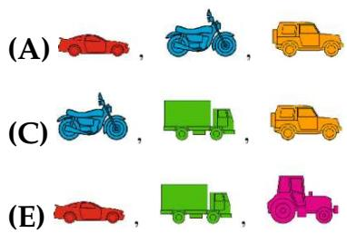

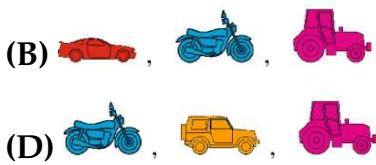

5. Karina cuts out one piece like this from the sheet. 

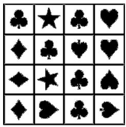

Which piece can she get? 

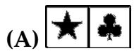

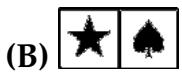

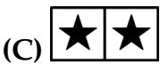

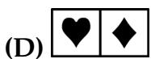

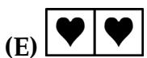

6. Three people walked across a field of snow wearing muddy shoes. In which order did they do this? 

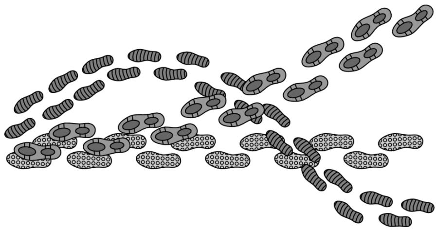

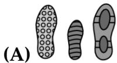

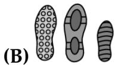

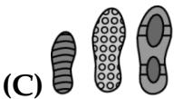

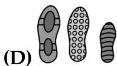

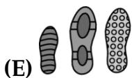

7. Pia makes shapes with the connected sticks shown in the picture. 

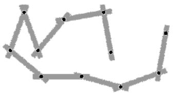

Which of the following shapes needs more sticks than RRia has? 

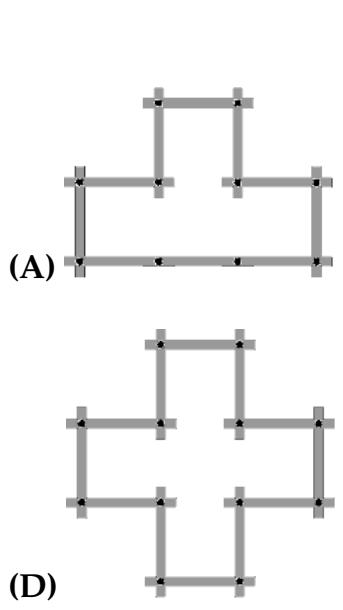

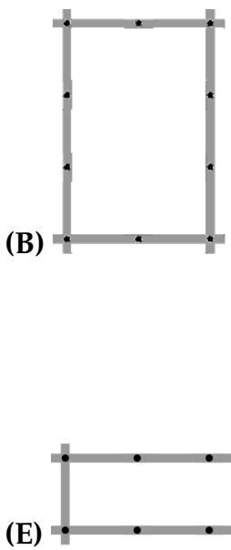

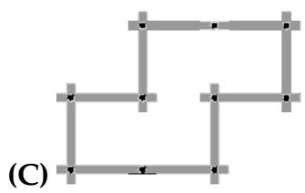

8. What number should replace the question mark when all the calculations are completed correctly? 

(A) 4 (B) 5 

(C) 6 (D) 7 

(E) 8 

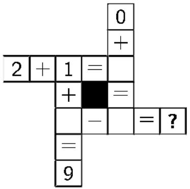

## SECTION TWO- (4 point problems)

9. Linda pinned up 3 photos in a row on a cork board using 8 pins. 

Peter wants to pin up 7 photos in the same way. How many pins does he need? 

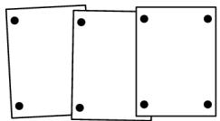

(A) 14 (B) 16 

(C) 18 (D) 22 

(E) 26 

10. Dennis wants to remove one cell from the shape: 

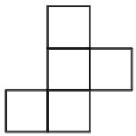

How many of the following shapes can he get? 

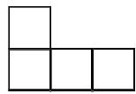

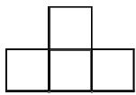

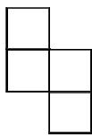

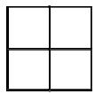

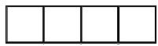

(A) 1 (B) 2 

(D) 4 (E) 5 

(C) 3 

11. Six strips are woven into a pattern as shown. 

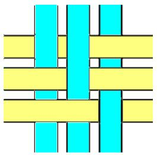

What does the pattern look like from the back? 

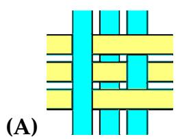

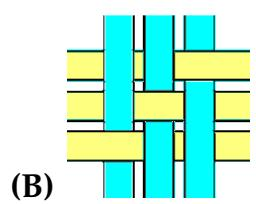

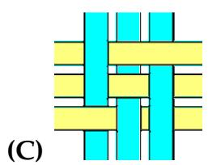

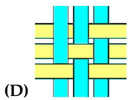

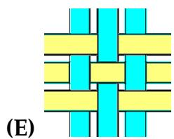

12. The weight of dog toy is a whole number. How much does one dog toy weigh? 

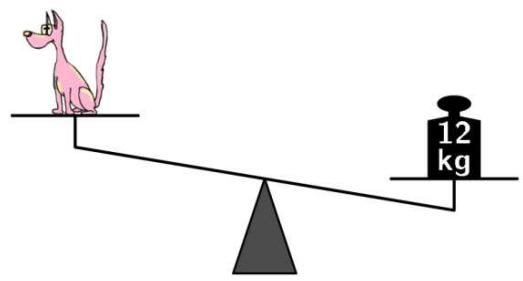

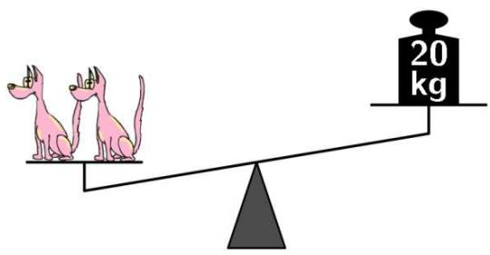

(A) $7 k g$ 

(B) $8 \ : k g$ 

(D) 10 kg 

(E) 11 kg 

(C) 9 kg 

13. Sara has 16 blue marbles. She can trade marbles in two ways: 3 blue marbles for 1 red marble or 2 red marbles for 5 green marbles. What is the maximum number of green marbles she can get? 

(A) 5 

(B) 10 

(C) 13 

(D) 15 

(E) 20 

14. Steven wants to write each of the digits 2, 0, 1 and 9 in one of the boxes of the sum. 

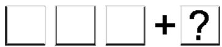

He wants to get the largest possible answer. Which digit could he write instead of the question mark? 

(A) Either 0 or 1 

(B) Either 0 or 2 

(C) Only 0 

(D) Only 1 

(E) Only 2 

15. A full glass of water weighs 400 grams. An empty glass weighs 100 grams. 

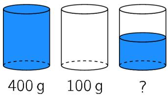

How many grams does a half--full glass of water weigh? 

(A) 150 

(B) 200 

(C) 225 

(D) 250 

(E) 300 

16. 

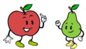

Together we cost 5 cents. 

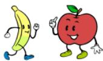

Together we cost 7 cents. 

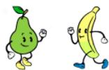

Together we cost 10 cents. 

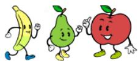

How much do we cost together? 

(A) 8 cents 

(B) 9 cents 

(C) 10 cents 

(D) 11 cents 

(E) 12 cents 

## SECTION THREE - (5 point problems)

17. Each shape stands for a different number. The sum of the three numbers in each row is shown to the right of the row. 

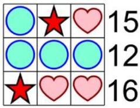

Which number does the 

stand for? 

(A) 2 

(B) 3 

(C) 4 

(D) 5 

(E) 6 

18. Anna used 32 small white squares to frame a 7 by 7 picture. How many of these small white squares does she need to frame a 10 by 10 picture? 

(A) 36 

(B) 40 

(C) 44 

(D) 48 

(E) 52 

19. The pages of a book are numbered 1, 2, 3, 4, 5 and so on. The digit 5 appears exactly 16 times. What is the maximum number of pages this book could have? 

(A) 49 

(B) 64 

(C) 66 

(D) 74 

(E) 80 

20. A hallway has the dimensions shown in the picture. A cat walks on the dashed line along the middle of the hallway. 

How many metres does the cat walk? 

(A) 63 

(B) 68 

(C) 69 

(D) 71 

(E) 83 

21. In a park there are 15 animals: cows, cats and kangaroos. We know that precisely 10 are not cows and precisely 8 are not cats. How many kangaroos are in the park? 

(A) 2 

(B) 3 

(D) 8 

(E) 10 

(C) 4 

22. Mary has 9 small triangles: 3 of them are red, 3 are yellow and 3 are blue. She wants to form a big triangle by putting together these 9 small triangles so that any two triangles with an edge in common are different colours. Mary places some small triangles as shown in the picture. 

Which of the following statements is true after she has finished? 

(A) 1 is yellow and 3 is red 

(B) 1 is blue and 2 is red 

(C) 1 and 3 are red 

(D) 5 is red and 2 is yellow 

(E) 1 and 3 are yellow 

23. One of five children Alek, Bartek, Czarek, Darek and Edek has eaten a cookie. 

Alek says: "I haven't eaten a cookie." 

Bartek says: "I have eaten a cookie." 

Czarek says: "Edek hasn't eaten a cookie." 

Darek says: "I haven't eaten a cookie." 

Edek says: "Alek has eaten a cookie." 

Only one child lies. Who has eaten the cookie? 

(A) Alek 

(B) Darek 

(D) Bartek 

(E) Edek 

(C) Czarek 

24. In a fantastic city, there are ostriches and camels, who live and dress just like humans. Each of them ordered a set of footwear and a hat. The shoemaker made 16 pairs of red shoes for the ostriches and 40 blue shoes for the camels. How many hats were made? 

(A) 26 

(B) 28 

(C) 14 

(D) 24 

(E) 56 