## $30^{\text{th}}$ INTERNATIONAL KANGAROO MATHEMATICS CONTEST 2020

## KSF - Problems Ecolier (Class 3 & 4)

Time Allowed: 120 minutes 

## SECTION ONE - (3 point problems)

1. A mushroom grows every day. Mary takes a picture of the mushroom each day from Monday to Friday. Which of these pictures was taken on Tuesday? 

(A)

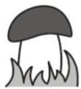

(B)

(C)

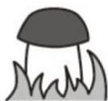

(D)

(E)

2. Which piece completes the pattern? 

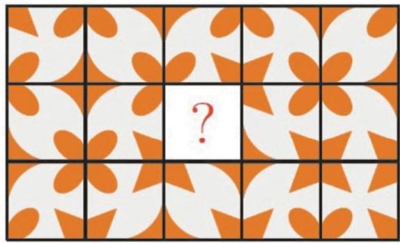

(A)

(B)

(C)

(D)

(E)

3. Tysger shades all the squares in the grid where the result is 20. Which shape does he get?

<table><tr><td>16 + 4</td><td>19 + 1</td><td>28 - 8</td></tr><tr><td><eq>2 \times  {10}</eq></td><td>16 – 4</td><td><eq>7 \times  3</eq></td></tr></table>

(A)

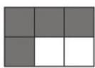

(B)

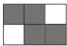

(C)

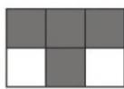

(D)

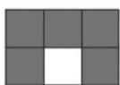

(E)

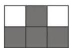

4. Which of the following figures has the largest part shaded? 

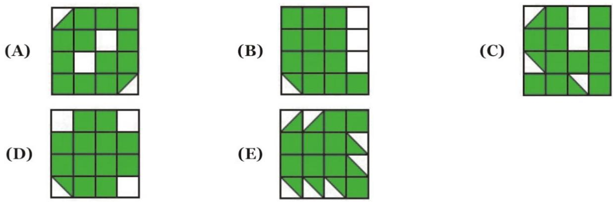

5. You can make different figures by using these pieces: 

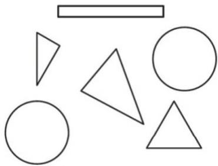

Which one of the figures below can you make with these pieces? 

(A)

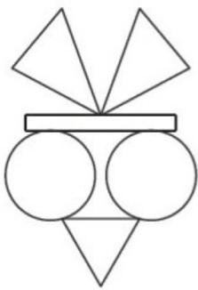

(B)

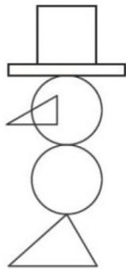

(C)

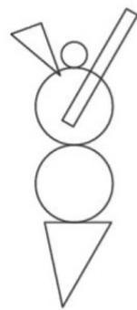

(D)

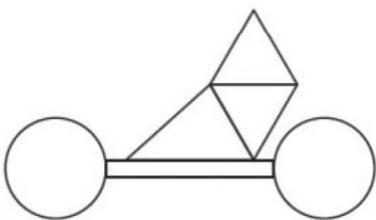

(E)

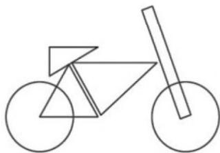

6. Elli draws the big square with chalk on the pavement. She starts jumping from number 1. Each time she jumps, she always jumps to a number that is 3 more than the number she is standing on. What is the largest number Elli can jump onto? 

(A) 11 

(B) 14 

(C) 18 

(D) 19 

(E) 24 

<table><tr><td>1</td><td>5</td><td>8</td><td>11</td></tr><tr><td>4</td><td>7</td><td>10</td><td>14</td></tr><tr><td>24</td><td>23</td><td>13</td><td>18</td></tr><tr><td>21</td><td>19</td><td>16</td><td>20</td></tr></table>

# $30^{\text{th}}$ INTERNATIONAL KANGAROO MATHEMATICS CONTEST 2020

# KSF - Problems Ecolier (Class 3 & 4)

Time Allowed: 120 minutes 

7. Jorge glues these 6 stickers to the faces of a cube: 

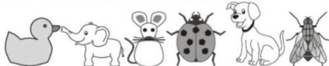

The pictures show the cube in two positions. Which sticker is on the opposite face to the duck? 

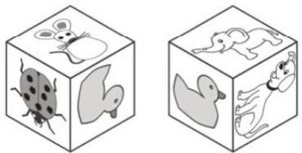

(A) 

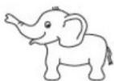

(B) 

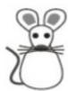

(C) 

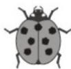

(D) 

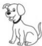

(E) 

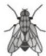

8. Casper has the following 7 pieces: 

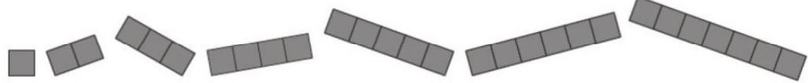

He uses some of these pieces to fully cover this grid without overlap. He uses as many different pieces as possible. How many pieces does Casper use? 

(A) 3 

(B) 4 

(C) 5 

(D) 6 

(E) 7 

## SECTION TWO - (4 point problems)

9. Cindy colours each region on the pattern either red, blue or yellow. She colours regions that touch each other with different colours. She colours the outer ring (region) of the pattern red. How many regions does Cindy colour red? 

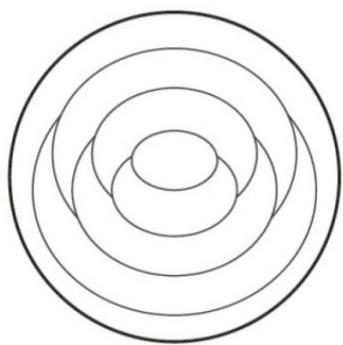

(A) 1 

(B) 2 

(C) 3 

(D) 4 

(E) 5 

10. Loes looks at the pyramid from above. What does Loes see? 

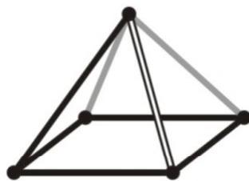

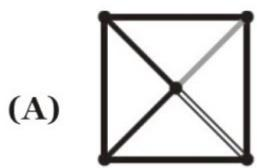

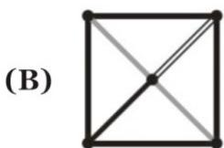

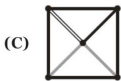

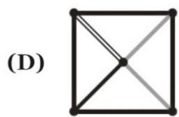

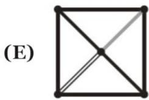

11. Dennis ties a dog 1 metre from a corner of a 7 metres by 5 metres hut as shown in the picture using an 11 metres long leash. Dennis places 5 treats as shown. How many of the treats could the dog reach? 

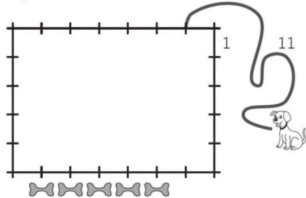

(A) 1 

(B) 2 

(C) 3 

(D) 4 

(E) 5 

12. Lonneke builds a fence using 1 metre long poles. The picture shows a 4 metres long fence. 

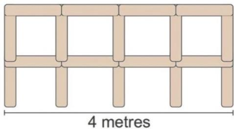

How many poles does Lonneke need to build a 10 metres long fence? 

(A) 22 

(B) 30 

(C) 33 

(D) 40 

(E) 42 

## $30^{\text{th}}$ INTERNATIONAL KANGAROO MATHEMATICS CONTEST 2020

## KSF - Problems Ecolier (Class 3 & 4)

Time Allowed: 120 minutes 

13. Every time the kangaroo goes up 7 steps, the rabbit goes down 3 steps. 

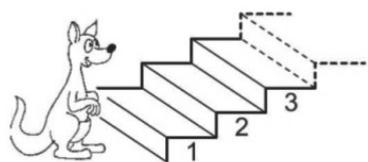

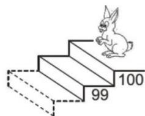

On which step do they meet? 

(A) 53 

(B) 60 

(C) 63 

(D) 70 

(E) 73 

14. The sum of three numbers is 50. Karin subtracts a secret number from each of these three numbers. She gets 24, 13 and 7 as the results. Which one of the following is one of the original three numbers? 

(A) 9 

(B) 11 

(C) 13 

(D) 17 

(E) 23 

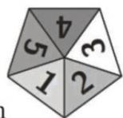

15. Amelie wants to build a crown using 10 copies of this token. When two tokens share a side, the corresponding numbers match. Four tokens have already been placed. Which number goes in the triangle marked with an $X$ ? 

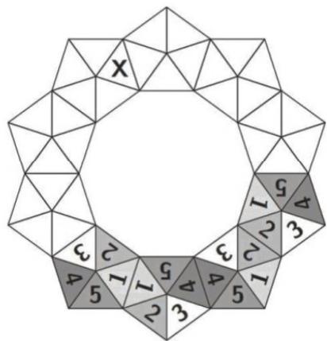

(A) 1 

(B) 2 

(C) 3 

(D) 4 

(E) 5 

## $30^{\text{th}}$ INTERNATIONAL KANGAROO MATHEMATICS CONTEST 2020

## KSF - Problems Ecolier (Class 3 & 4)

Time Allowed: 120 minutes 

16. Farid has two types of sticks: short ones, measuring 1cm and long ones, measuring 3cm. 

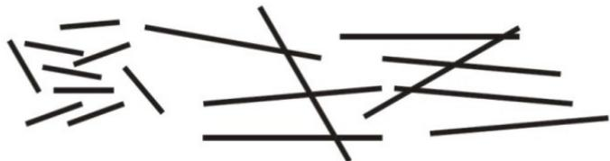

With which of the combinations below can he make a square, without breaking or overlapping the sticks? 

(A) 5 short and 2 long 

(B) 3 short and 3 long 

(C) 6 short 

(D) 4 short and 2 long 

(E) 6 long 

## SECTION THREE - (5 point problems)

17. A standard dice has 7 as the sum of the dots on opposite faces. 

The dice is put on the first square as shown and then rolls towards the right. When the dice gets to the last square, what is the total number of dots on the three faces marked with the question marks? 

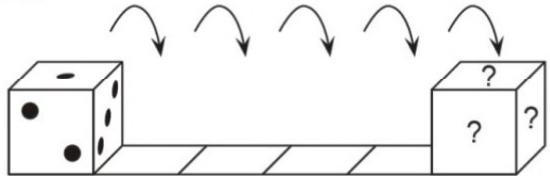

(A) 6 

(B) 7 

(C) 9 

(D) 11 

(E) 12 

18. 6 people each order one scoop of ice cream. They order 3 scoops of vanilla, 2 scoops of chocolate and 1 scoop of lemon. They top the ice creams with 3 cherries, 2 wafers and 1 chocolate chip. They use one topping on each scoop, such that no two ice creams are alike. Which of the following combinations is not possible? 

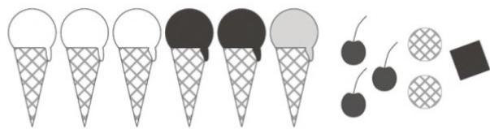

(A) chocolate with a cherry 

(B) vanilla with cherry 

(C) lemon with a wafer 

(D) chocolate with a wafer 

(E) chocolate with a wafer 

19. The Queen tries to find out the three names of Rumpelstiltskin's wife. She asks her: 

"Are you called Adele Lilly Cleo?" 

"Are you called Adele Laura Cora?" 

"Are you called Abbey Laura Cleo?" 

Each time exactly one name and its position was right. 

What is the name of Rumpelstiltskin's wife? 

(A) Abbey Lilly Cora 

(B) Abbey Laura Cora 

(C) Adele Laura Cleo 

(D) Adele Lilly Cora 

(E) Abbey Laura Cleo 

# 30 $^{th}$ INTERNATIONAL KANGAROO MATHEMATICS CONTEST 2020

# KSF - Problems Ecolier (Class 3 & 4)

Time Allowed: 120 minutes 

20. The teacher writes the numbers from 1 to 8 on the board. The teacher then covers the numbers with triangles, squares and a circle. If you add the four numbers covered by the triangles, the sum is 10. If you add the three numbers covered by the squares, the sum is 20. Which number is covered by the circle? 

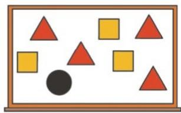

(A) 3 

(B) 4 

(C) 5 

(D) 6 

(E) 7 

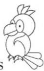

21. Jane has some pictures of parrots 📁. She wants to colour only the head, tail and wings of each parrot either red, blue or green so that all three colours are used on each picture. She colours one parrot's head red, its wings green and its tail blue. How many more parrots can she colour so that all the parrots are coloured differently? 

(A) 1 

(B) 2 

(C) 4 

(D) 5 

(E) 9 

22. Several teams came to the summer Kangaroo camp. Each team has 5 or 6 members. There are 43 people in total. How many teams are at this camp? 

(A) 4 

(B) 6 

(C) 7 

(D) 8 

(E) 9 

23. Which key would it be impossible to cut into three different figures of five shaded squares? 

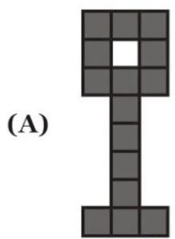

(B) 

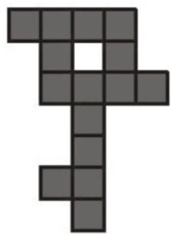

(C) 

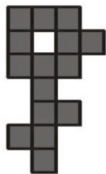

(D) 

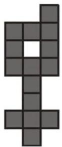

(E) 

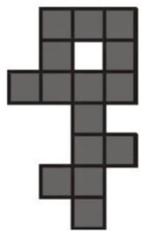

# 30 $^{th}$ INTERNATIONAL KANGAROO MATHEMATICS CONTEST 2020 KSF - Problems Ecolier (Class 3 & 4)

Time Allowed: 120 minutes 

24. Ann replaces letters in the calculation KAN - ROO + GA with numbers from 1 to 9 and then calculates the result. The same letters are replaced by the same numbers and different letters by different numbers. What is the largest possible result she could get? 

(A) 925 

(B) 933 

(C) 939 

(D) 942 

(E) 948 

-- Good Luck -- 