# 31 $^{st}$ INTERNATIONAL KANGAROO MATHEMATICS CONTEST 2021

# KSF - Problems Ecolier (Class 3 & 4)

Time Allowed: 120 minutes 

## SECTION ONE - (3 point problems)

1. How many fish will have their heads pointing towards the ring when we straighten the line? 

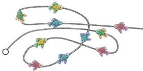

(A) 3 

(B) 5 

(C) 6 

(D) 7 

(E) 8 

2. Erik has 4 bricks: 

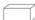

Which of the cubes shown below can he make with his 4 bricks? 

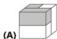

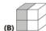

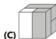

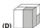

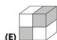

3. When you put the 4 puzzle pieces together correctly, they form a rectangle with a calculation on it. What is the result of this calculation? 

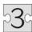

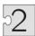

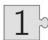

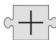

(A) 6 

(B) 15 

(C) 18 

(D) 24 

(E) 33 

4. Alaya draws a picture of the sun. 

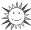

Which of the following answers is part of her picture? 

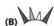

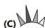

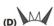

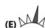

5. Five boys competed in a shooting challenge. Ricky scored the most points. Which target was Ricky's? 

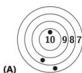

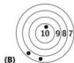

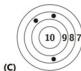

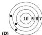

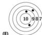

6. A measuring tape is wrapped around a cylinder. Which number should be at the place shown by the question mark? 

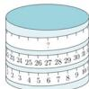

(A) 33 

(B) 42 

(C) 48 

(D) 53 

(E) 69 

7. Denise fired a silver and a gold rocket at the same time. The rockets exploded into 20 stars in total. The gold rocket exploded into 6 more stars than the silver one. How many stars did the gold rocket explode into? 

(A) 9 

(B) 10 

(C) 12 

(D) 13 

(E) 15 

8. Rosana has some balls of 3 different colours. Balls of the same colour have the same weight. What is the weight of each white ball $\bigcirc$ ? 

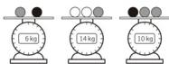

(A) 3 kg 

(B) 4 kg 

(C) 5 kg 

(D) 6 kg 

(E) 7 kg 

## SECTION TWO - (4 point problems)

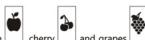

9. Nisa has 3 different sorts of cards in a game: apple □, cherry □ and grapes □. She chooses 2 cards from the set and swaps their places. She wants to arrange the cards so that all the cards with the same fruit on are next to each other. For which set is this not possible? 

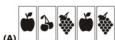

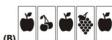

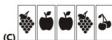

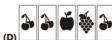

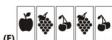

10. Sofie wants to pick five different shapes from the boxes. She can only pick 1 shape from each box. Which shape must she pick from box 4? 

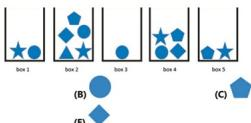

11. 18 cubes are coloured white or grey or black and are arranged as shown. 

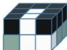

The figures on the right show the white and the black parts. 

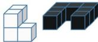

Which of the following is the grey part? 

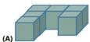

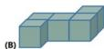

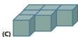

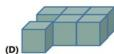

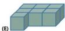

12. The 5 balls shown begin to move simultaneously in the directions indicated by their arrows. 

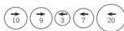

When two balls going in opposite directions collide, the bigger ball swallows the smaller one and increases its value by the value of the smaller ball. The bigger ball continues to move in its original direction, as shown in the following example. 

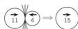

What is the final result of the collisions of the 5 balls shown? 

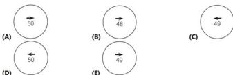

13. In an ice cream shop there is some money in a drawer. After selling 6 ice creams, there are 70 euros in the drawer. After selling a total of 16 ice creams, there are 120 euros in the drawer. How many euros were there in the drawer at the start? 

(A) 20 

(B) 30 

(C) 40 

(D) 50 

(E) 60 

14. The Koala ate some leaves from 3 branches. Each branch had 20 leaves. The Koala ate a few leaves from the first branch and then ate as many leaves from the second branch as were left on the first branch. Then it ate 2 leaves from the third branch. How many leaves in total were left on the 3 branches? 

(A) 20 

(B) 22 

(C) 28 

(D) 32 

(E) 38 

15. On a tall building there are 4 fire escape ladders, as shown. The heights of 3 ladders are at their tops. What is the height of the shortest ladder? 

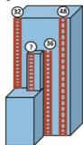

(A) 12 

(B) 14 

(C) 16 

(D) 20 

(E) 22 

16. Nora plays with 3 cups on the kitchen table. She takes the left-hand cup, flips it over, and puts it to the right of the other cups. The picture shows the first move. 

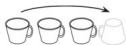

What do the cups look like after 10 moves? 

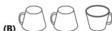

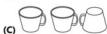

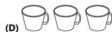

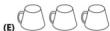

## SECTION THREE - (5 point problems)

17. Eva has the 5 stickers shown: 

She stuck one of them on each of the 5 squares of this board 

<table><tr><td>1</td><td>2</td><td>3</td><td>4</td><td>5</td></tr></table>

so that $\star$ is not on square 5, 

On which square did Eva stick 

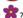

(A) 1 

(B) 2 

(C) 3 

(D) 4 

(E) 5 

18. 7 cards are arranged as shown. Each card has 2 numbers on with 1 of them written upside down. The teacher wants to rearrange the cards so that the sum of the numbers in the top row is the same as the sum of the numbers in the bottom row. She can do this by turning one of the cards upside down. Which card must she turn? 

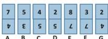

(A) A 

(B) C 

(C) D 

(D) F 

(E) G 

19. The numbers 1 to 9 are placed in the squares shown with a number in each square. The sums of all pairs of neighbouring numbers are shown. 

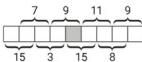

Which number is placed in the shaded square? 

(A) 4 

(B) 5 

(C) 6 

(D) 7 

(E) 8 

20. Mia throws darts at balloons worth 3, 9, 13, 14 and 18 points. She scores 30 points in total. Which balloon does Mia definitely hit? 

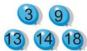

(A) 3 

(B) 9 

(C) 13 

(D) 14 

(E) 18 

21. A box has fewer than 50 cookies in. The cookies can be divided evenly between 2, 3, or 4 children. However, they cannot be divided evenly between 7 children because 6 more cookies would be needed. How many cookies are there in the box? 

(A) 12 

(B) 24 

(C) 30 

(D) 36 

(E) 48 

22. Each of the 5 boxes contains either apples or bananas, but not both. The total weight of all the bananas is 3 times the weight of all the apples. Which boxes contain apples? 

(A) 1 and 2 

(B) 2 and 3 

(C) 2 and 4 

(D) 3 and 4 

(E) 1 and 4 

23. Elena wants to write the numbers from 1 to 9 in the squares shown. The arrows always point from a smaller number to a larger one. She has already written 5 and 7. Which number should she write instead of the question mark? 

(A) 2 

(B) 3 

(C) 4 

(D) 6 

(E) 8 

24. Martin placed 3 different types of objects, hexagons $\bigcirc$ , squares $\square$ and triangles $\triangle$ , on sets of scales, as shown. 

What does he need to put on the left-hand side on the third set of scales for these scales to balance? 

(A) 1 square 

(B) 2 squares 

(C) 1 hexagon 

(D) 1 triangle 

(E) 2 triangles 

-- Good Luck -- 