## SECTION ONE - (3 point problems)

1. Buzz the bee wants to reach the flower. Which set of directions will get him there? 

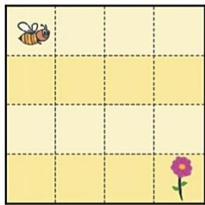

(A) $\rightarrow \downarrow \rightarrow \downarrow \downarrow \rightarrow$ 

(B) ↓↓ → ↓↓ 

(C) $\rightarrow \downarrow \rightarrow \downarrow \rightarrow$ 

(D) $\rightarrow  \rightarrow  \downarrow  \downarrow  \downarrow$ 

(E) ↓ → → ↓ ↓ ↓ 

2. Four of the following are a picture of the Great Wheel at the Luna park. Which one is the different one? 

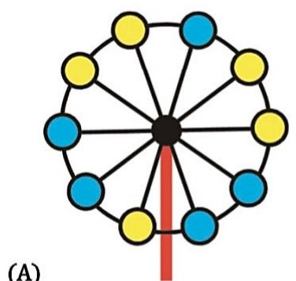

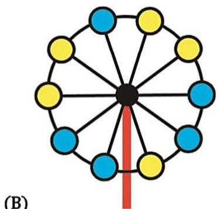

(A) 

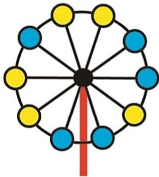

(B) 

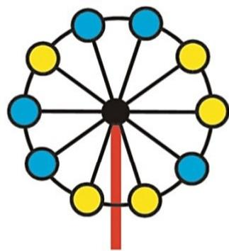

(C) 

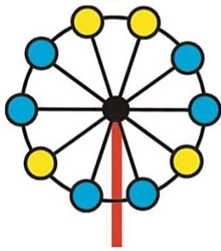

(D) 

(E) 

## 32 $^{nd}$ INTERNATIONAL KANGAROO MATHEMATICS CONTEST 2022

## KSF - Problems Ecolier (Class 3 & 4)

Time Allowed: 120 minutes 

3. Rossitza wants to put 2 coins in each row and in each column of the grid. 

Which coin does she need to move to an empty cell? 

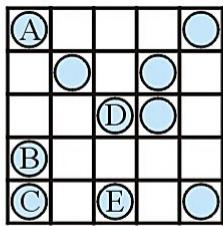

(A) A 

(B) B 

(C) C 

(D) D 

(E) E 

4. What is the smallest number of boxes that Bill has to move to be able to open the dark TRAIN box? 

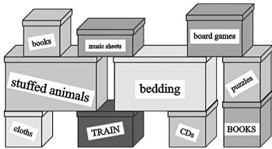

(A) 3 

(B) 4 

(C) 5 

(D) 6 

(E) 7 

5. Kengu always makes one large jump followed by two small jumps on the number line, as shown in the picture. Kengu starts at 0 and ends on 16. What is the number of jumps that Kengu makes? 

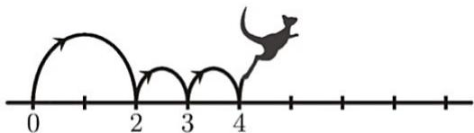

(A) 4 

(B) 7 

(C) 8 

(D) 9 

(E) 12 

6. Anna makes a jigsaw where two squares with common sides do not contain the same number. Which piece should she use to complete her jigsaw? 

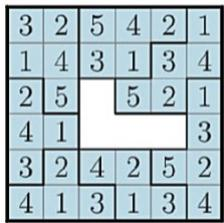

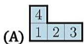

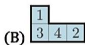

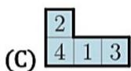

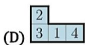

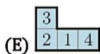

7. ${2022} + \square  = {2020} + \square$ 

Which two numbers can be written in the two boxes to make the statement correct? 

(A) 3 and 5 

(B) 4 and 1 

(C) 3 and 4 

(D) 7 and 2 

(E) 9 and 8 

8. John builds the tower shown. 

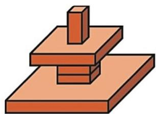

What will he see if he looks at his tower from above? 

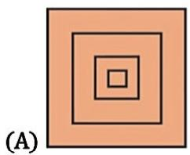

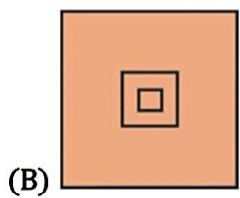

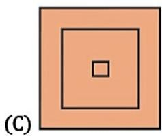

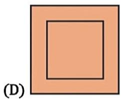

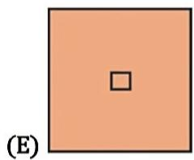

## SECTION TWO - (4 point problems)

9. Five cars numbered 1, 2, 3, 4 and 5 are moving in the same direction. 

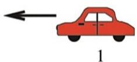

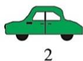

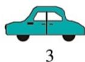

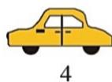

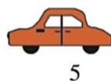

First, the last car (5) overtakes the two cars ahead of it. Next, the second last car overtakes the two cars ahead of it. Finally, the middle car overtakes the two cars ahead of it. In what order are the cars now? 

(A) 1, 2, 3, 5, 4 

(B) 2, 1, 3, 5, 4 

(C) 2, 1, 5, 3, 4 

(D) 3, 1, 4, 2, 5 

(E) 4, 1, 2, 5, 3 

10. The ages of a family of kangaroos are 2, 4, 5, 6, 8 and 10 years. The sum of the ages of four of them is 22 years. What are the ages of the other two kangaroos? 

(A) 2 and 8 

(B) 4 and 5 

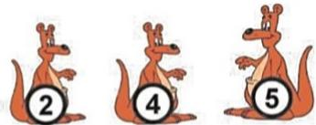

(C) 5 and 8 

(D) 6 and 8 

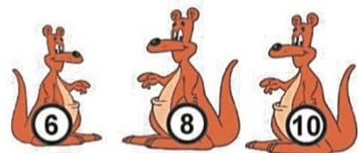

(E) 6 and 10 

11. During my holiday I sent the five postcards shown below to my friends. 

• There are no ducks on Mike's card. 

- Cara's card has the sun on it. 

- There are exactly two living creatures on Paula's card. 

- Lexi's card has a dog on it. 

- There are kangaroos on Heather's card. 

Which card did Mike get? 

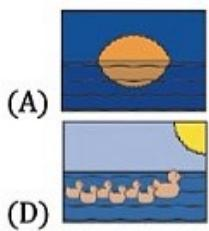

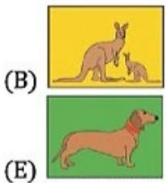

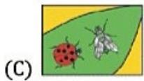

12. Mosif wanted the sum of the three numbers in each row and in each column of the grid to be the same. He made one mistake. Which number must he correct? 

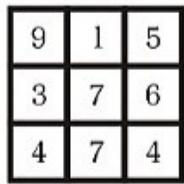

(A) 1 

(B) 3 

(D) 5 

13. Aladdin has a square carpet. There are the same number of dots, arranged in two lines, along each side of his carpet. Unfortunately, the carpet has folded. How many dots are there on Aladdin's carpet? 

(A) 48 

(B) 44 

(C) 40 

(D) 36 

(E) 32 

(C) one of the 4s 

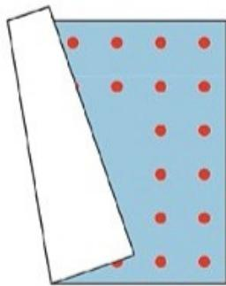

14. Joanna folds the number square twice as shown. Then she punches a hole through the black spot shown by the arrow. Which numbers does she also punch through? 

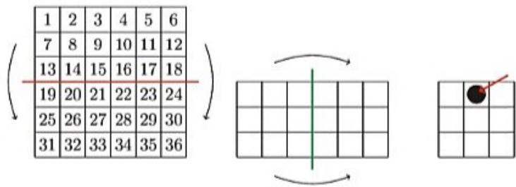

(A) 8, 11, 26, 29 

(B) 14, 17, 20, 23 

(D) 14, 16, 21, 23 

(E) 15, 17, 20, 22 

(C) 15, 16, 21, 22 

# 32 $^{nd}$ INTERNATIONAL KANGAROO MATHEMATICS CONTEST 2022

# KSF - Problems Ecolier (Class 3 & 4)

Time Allowed: 120 minutes 

15. The pupils in a class sit in rows. There are the same number of pupils in each row. There are 2 rows of pupils in front of Robert and 1 row of pupils behind him. In his row, there are 3 pupils on his left and 5 pupils on his right. How many pupils are there in this class? 

(A) 10 

(B) 17 

(C) 18 

(D) 27 

(E) 36 

16. Some shapes are drawn on a piece of paper. The teacher folded the paper along the red line. How many of the shapes on the left will fall exactly on top of shapes on the right? 

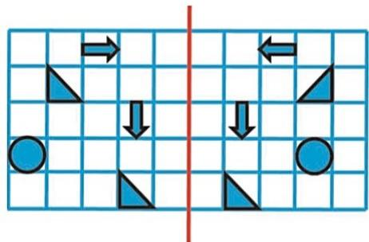

(A) one 

(B) two 

(C) three 

(D) four 

(E) five 

## SECTION THREE - (5 point problems)

17. Wanda chose a few of the following shapes and said "Amongst the shapes I have chosen, there are 2 coloured ones, 2 large ones and 2 round ones. What is the smallest number of the following shapes that Wanda could have chosen? 

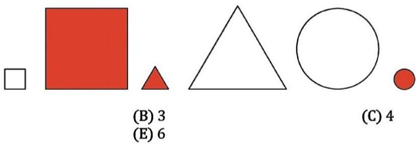

(A) 2 

(B) 3 

(C) 4 

(D) 5 

(E) 6 

18. The puzzle on the left should be completed to look like the puzzle on the right. What piece should be used? 

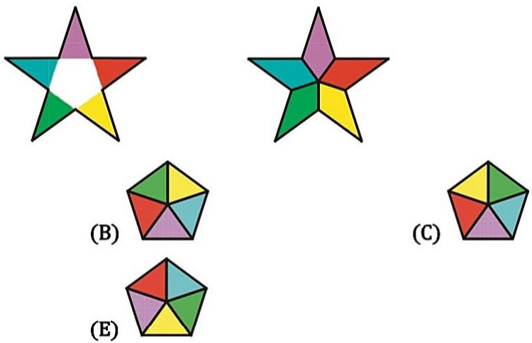

(A) 

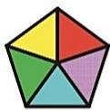

(D) 

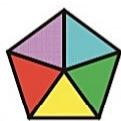

(E) 

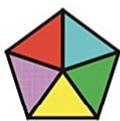

19. Karin sailed around four buoys, as shown. Which buoys did Karin sail around in a counterclockwise direction? 

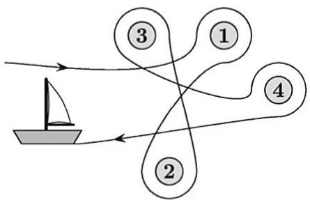

(A) 1 and 3 

(B) 2 and 3 

(C) 3 and 4 

(D) 1 and 2 

(E) 2 and 4 

20. Alma wants to put one of the pieces shown in the middle of the picture so that a child in $A$ is able to travel to $B$ and to $E$ , but not to $D$ . She can rotate the pieces. 

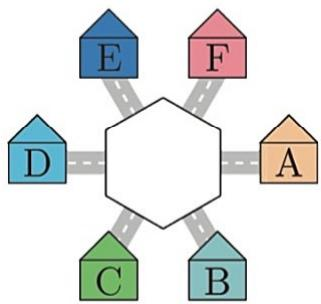

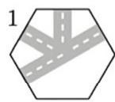

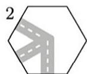

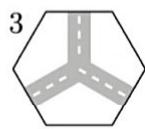

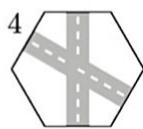

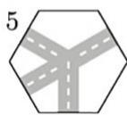

Which two pieces could she use? 

(A) 1 and 2 

(B) 2 and 3 

(C) 1 and 4 

(D) 4 and 5 

(E) 1 and 5 

21. Ahmad and Zhaleh start moving from point $A$ with the same speed, in the directions shown. Ahmad walks around the square-shaped garden and Zhaleh walks around the rectangular-shaped one. They meet again at $A$ . What is the smallest number of laps around the square-shaped garden that Ahmad could do to meet Zhaleh there? 

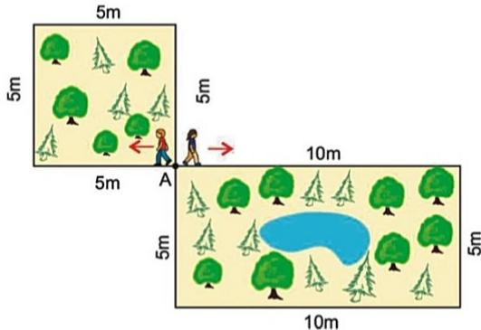

(A) 1 

(B) 2 

(C) 3 

(D) 4 

(E) 5 

22. Five children ate some plums. Lauren ate two plums more than Sophie. Betty ate three plums fewer than Lauren. Claire ate one plum more than Betty and three plums fewer than Alice. Which two girls ate the same number of plums? 

(A) Claire and Lauren 

(B) Claire and Sophie 

(C) Lauren and Alice 

(D) Sophie and Alice 

(E) Alice and Betty 

23. Every box shows the result of the number on the left and on the top. Which number is written behind the heart? 

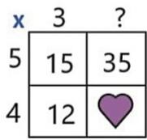

(A) 25 

(B) 27 

(C) 28 

(D) 29 

(E) 30 

24. Joanna numbered 4 cards from 1 to 4: 1 2 3 4. On the back of each card she draw one different fruit. So, each fruit represents one number, the one written on the back of the 

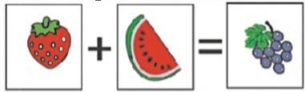

card. Joanna realized that 

(A) 3 

(B) 4 

(C) 5 

(D) 6 

(E) 7 

