## SECTION ONE - (3 point problems)

1. Akira lits 5 identical candles all at the same time. They stopped burning at different times and now look as shown in the picture. 

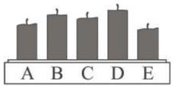

Which candle stopped burning first? 

(A) A 

(B) B 

(c) C 

(D) D 

(E) E 

2. The 2 kangaroo coins with the question mark on have the same value. What is this value? 

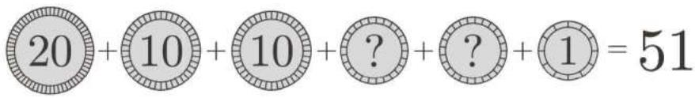

(A) 1 

(B) 2 

(C) 5 

(D) 10 

(E) 20 

3. A gray circle with 2 large holes in it is put on top of a clock-face, as shown. 

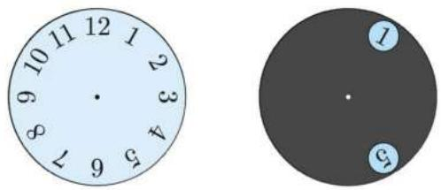

The gray circle is turned around its center. Which 2 numbers is it possible to see at the same time? 

(A) 4 and 9 

(B) 5 and 9 

(c) 5 and 10 

(D) 6 and 9 

(E) 7 and 12 

4. Alice has these puzzle pieces: 

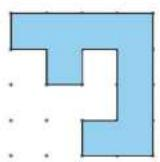

1

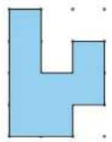

2

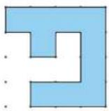

3

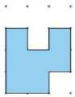

4

Which 2 pieces can she put together to form this square? 

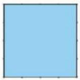

(A) 1 and 2 

(B) 1 and 3 

(C) 1 and 4 

(D) 2 and 3 

(E) 2 and 4 

5. A light engineer in the theatre turns the lights on and off. She uses the plan shown. How long in total are exactly 2 of the lights on at the same time? 

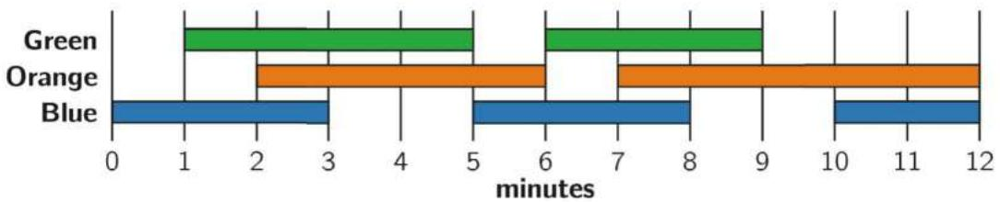

(A) 2 minutes 

(B) 6 minutes 

(c) 8 minutes 

(D) 9 minutes 

(E) 10 minutes 

6. Kristoffer folds the transparent paper along the dashed line. 

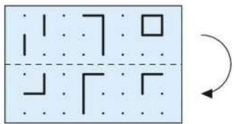

What can he then see? 

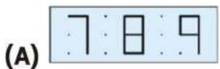

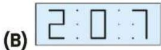

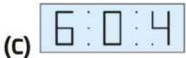

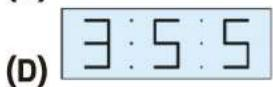

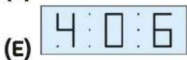

7. Anna has 4 discs of different sizes. She wants to build a tower of 3 discs so that every disc is smaller than the disc below it. How many different towers can Anna make? 

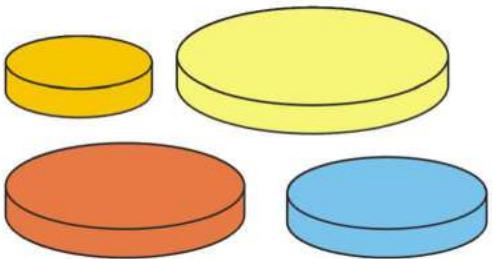

(A) 1 

(B) 2 

(C) 4 

(D) 5 

(E) 6 

8. Danny glued the 2 pieces of paper circle on the right. What can he not on top of the black 

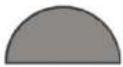

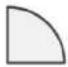

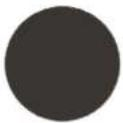

(A)

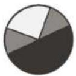

(B)

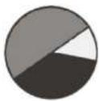

(c)

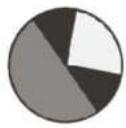

(D)

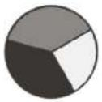

(E)

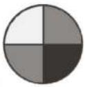

SECTION TWO - (4 point problems) 

9. The shape on the right is covered with the 5 pieces below. Which piece will cover the dot? 

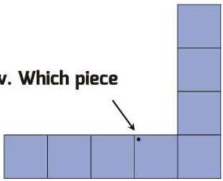

(A)

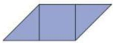

(B)

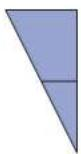

(C)

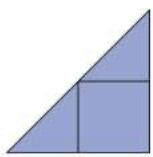

(D)

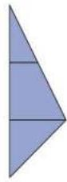

(E)

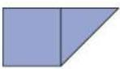

10. There are six weights of 1, 2, 3, 4, 5 and $6 \mathrm{~kg}$ . Rossitza puts five of them on the scales and puts one weight aside. The scales balance. Which weight did she put aside? 

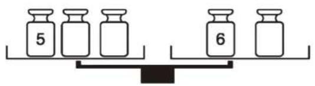

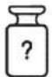

(A) 1 kg 

(D) 4 kg 

(B) 2 kg 

(E) can't be sure 

(c) 3 kg 

11. Ali has a 60 cm ruler. Unfortunately, some of the markings have faded away. He is able to measure any of the lengths 10, 20, 30, 40, 50 and 60 cm using his ruler only once. Which is Ali's ruler? 

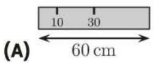

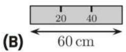

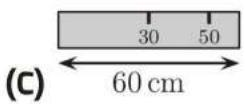

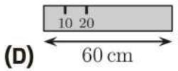

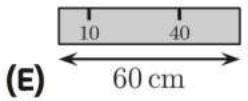

12. There are 7 houses north of Road A, 8 houses east of Road B and 5 houses south of Road A. How many houses are west of Road B? 

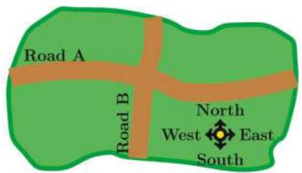

(A) 4 

(B) 5 

(c) 6 

(D) 7 

(E) 8 

13. There are 8 cars waiting in a queue for the ferry. Every car contains either 2 or 3 people. There are 19 people in total waiting for the ferry. How many cars contain exactly 2 people? 

(A) 2 

(B) 3 

(C) 4 

(D) 5 

(E) 6 

14. The Metro line has 6 stations, A, B, C, D, E, and F. The train stops at every station. When it reaches one of the two end stations, it changes its direction. The train driver started driving at station B and her first stop was station C. Which station will be her $96^{\text{th}}$ stop? 

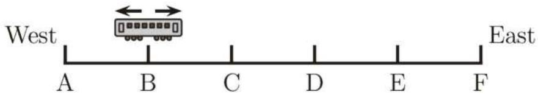

(A) A 

(B) B 

(c) C 

(D) D 

(E) E 

15. Hatice wants to paint the circles in the picture. She wants to paint any 2 circles connected with a line different colours. What is the smallest number of colours she needs? 

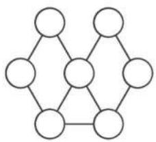

(A) 2 

(B) 3 

(C) 4 

(D) 5 

(E) 6 

16. Sam walks through the two-storey maze from the entrance to the exit, passing 3 wall stickers. In what order will she see them? 

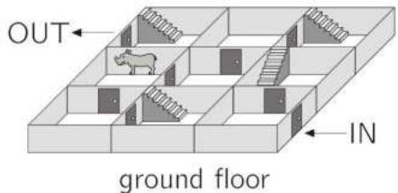

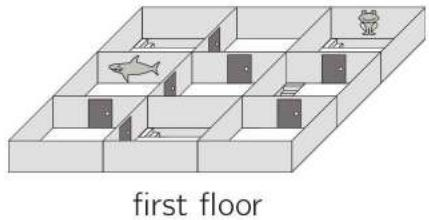

(A) 

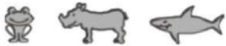

(B) 

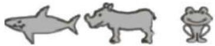

(C) 

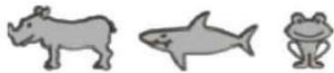

(D) 

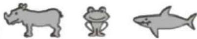

(E) 

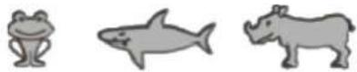

SECTION THREE - (5 point problems) 

17. 6 beavers and 2 kangaroos are standing in a line. Amongst any 3 consecutively numbered animals, exactly 1 is a kangaroo. 

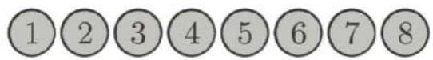

Which numbered animal is a kangaroo? 

(A) 1 

(B) 2 

(C) 3 

(D) 4 

(E) 5 

18. Rebecca folds a square piece of paper twice. Then she cuts off one corner. Next, she unfolds the paper. What does the paper look like once unfolded? 

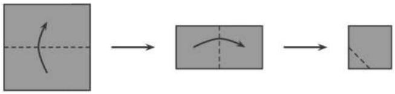

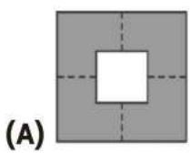

19. Hermione, Harry and Ron always walk into the common room one at a time. Hermione is never first, Harry is never second and Ron is never third. In how many different orders could they walk in? 

(A) 1 

(B) 2 

(C) 3 

(D) 4 

(E) 6 

20. There are five clocks on the wall. It is known that one clock is an hour fast, one clock is an hour slow, one clock shows the correct time and two clocks have stopped. Which clock shows the correct time? 

A

B

C

D

E

(A) A 

(B) B 

(c) C 

(D) D 

(E) E 

21. Adam and Brenda have 9 marbles each. Together, they have 8 red and 10 blue marbles. Brenda has twice as many blue marbles as red marbles. How many blue marbles does Adam have? 

(A) 3 

(B) 4 

(C) 5 

(D) 6 

(E) □ 

22. Else has two machines. When she puts a square sheet of paper in machine R, it turns the paper $90^{\circ}$ clockwise, as shown in the picture. When she puts the paper in machine S, it stamps the paper with a $\clubsuit$ . 

In which order are the machines used to produce the result shown? 

(A) SRR 

(B) RSR 

(C) RSS 

(D) RRS 

(E) SRS 

23. Holger fills the rest of the table with the numbers up to 50 following the system shown: 

<table><tr><td>1</td><td>2</td><td>3</td><td>4</td><td>5</td><td>6</td><td>7</td><td>8</td><td>9</td><td>10</td></tr><tr><td>11</td><td>12</td><td>13</td><td>14</td><td>15</td><td>16</td><td>17</td><td>18</td><td>19</td><td>20</td></tr><tr><td>21</td><td>22</td><td></td><td></td><td></td><td></td><td></td><td></td><td></td><td></td></tr><tr><td></td><td></td><td></td><td></td><td></td><td></td><td></td><td></td><td></td><td></td></tr><tr><td></td><td></td><td></td><td></td><td></td><td></td><td></td><td></td><td></td><td></td></tr></table>

What piece can he cut from the table? 

24. Teacher Olena wants to write the numbers 1 to 7 in the circles. Inside each circle she writes 1 number. 

She wants the sum of the numbers in 2 circles that are next to each other to be as shown. 

What number must she write inside the green/shaded circle? 

(A) 1 

(B) 2 

(C) 3 

(D) 4 

(E) 5 

