## SECTION ONE - (3 point problems)

1. Which cloud contains only numbers less than 7? 

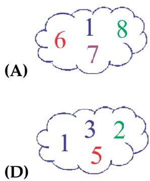

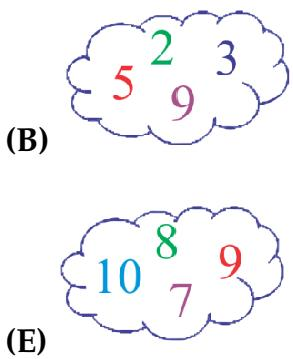

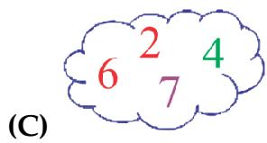

2. Yesterday was Sunday. What day is tomorrow? 

(A) Tuesday 

(D) Monday 

(B) Thursday 

(E) Saturday 

(C) Wednesday 

3. Which figure shows a part of this necklace? 

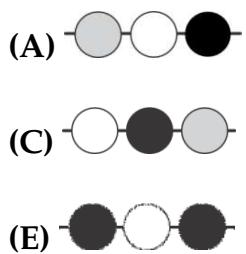

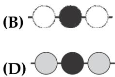

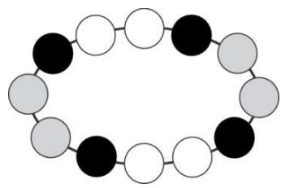

4. Together, mum Kangaroo and her son Jumper weigh 60  kilograms. Mum Kangaroo alone weighs 52 kilograms. How much does Jumper weigh? 

(A) 2 kilograms 

(D) 30 kilograms 

(B) 4 kilograms 

(E) 46 kilograms 

(C) 8 kilograms 

5. Karen cuts out one piece of this grid: 

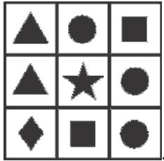

Which piece is the one she cut? 

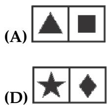

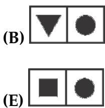

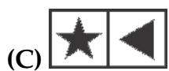

6. At the entrance of the zoo there are 12 children in the queue. Lucy is the 7th from the front and Kim is the second from the back. How many children are there between Lucy and Kim in the queue? 

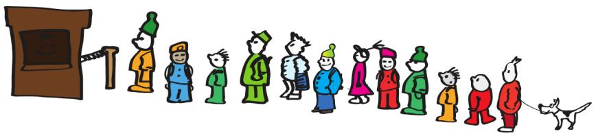

(A) 2 

(B) 3 

(C) 4 

(D) 5 

(E) 6 

7. Jorge pairs his socks so that the numbers match. How many pairs can he make? 

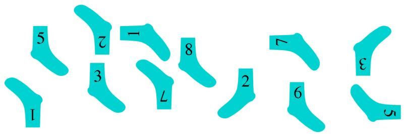

(A) 3 

(B) 4 

(C) 5 

(D) 6 

(E) 8 

8. 

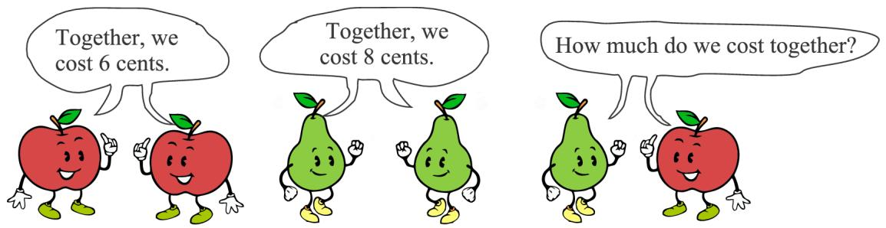

(A) 5 cents 

(B) 6 cents 

(C) 7 cents 

(D) 8 cents 

(E) 9 cents 

## SECTION TWO - (4 point problems)

9. You have to close two of the five gates so that the mouse cannot reach the cheese. t Which gates should you close? 

(A) 1 and 2 

(B) 2 and 3 

(C) 3 and 4 

(D) 3 and 5 

(E) 4 and 5 

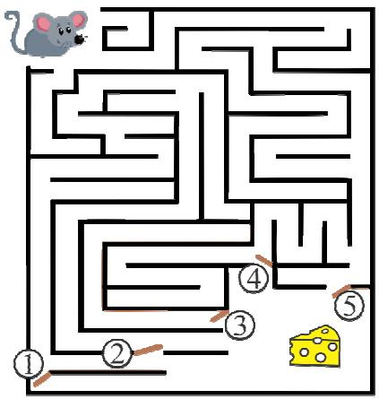

10. Patricia folds a sheet of paper twice and then cuts it, as shown. How many pieces of paper does she end up with? 

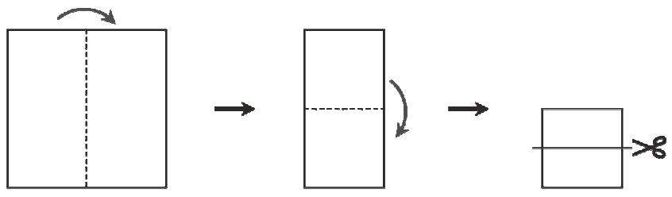

(A) 2 

(B) 3 

(C) 4 

(D) 5 

(E) 6 

11. Five square cards are stacked on a table, as shown. 

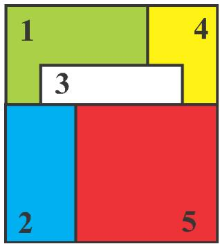

The cards are removed one by one from the top of the stack. In what order are the cards removed? 

(A) 5-3-2-1-4 

(B) 5-2-3-4-1 

(C) 4-5-2-3-1 

(D) 5-2-3-1-4 

(E) 1-2-3-4-5 

12. Maya Bee was gathering pollen from all of the flowers that lie inside the rectangle, but are outside the triangle. From how many flowers did she collect pollen? 

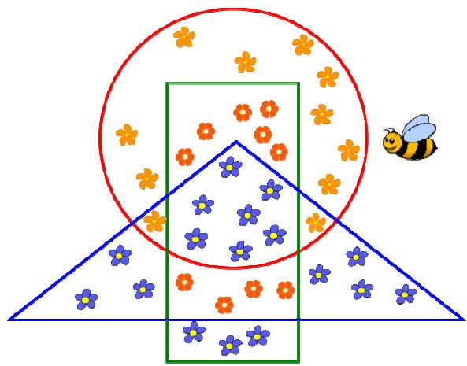

(A) 9 

(B) 10 

(C) 13 

(D) 17 

(E) 20 

13. Four strips are woven into a pattern, as shown. 

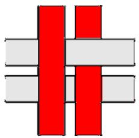

What do you see when you look at it from the other side? 

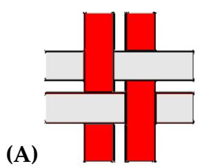

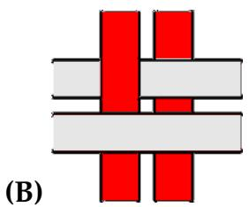

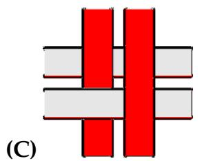

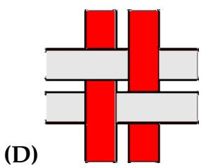

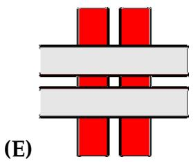

14. Each of the shapes shown is made by gluing together four cubes of the same size. The shapes are to be painted. Which shape has the smallest area to be painted? 

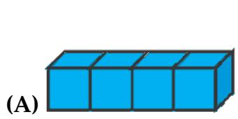

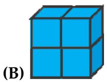

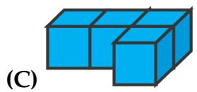

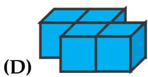

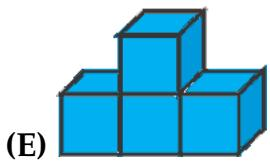

15. A floor is covered with identical rectangular tiles as shown. The shorter side of each tile is 1 m. What is the length of the side with the question mark? 

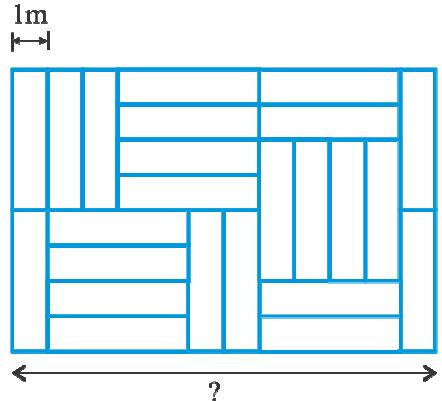

(A) 6 m 

(B) 8 m 

(C) 10 m 

(D) 11 m 

(E) 12 m 

16. A train from Kang station to Aroo station leaves at 6:00 in the morning and passes by other three stations on the way, without stopping. 

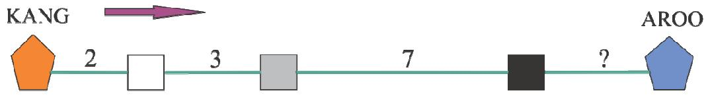

The numbers show the journey times between two stations, in hours. The train arrives at Aroo station at 11:00 at night on the same day. What is the journey time between Aroo:00 station and the previous one? 

(A) 2 hours 

(B) 3 hours 

(C) 4 hours 

(D) 5 hours 

(E) 6 hours 

## SECTION THREE - (5 point problems)

17. A cat and a bowl of milk are in the opposite corners of the board. The cat can only move as shown by the arrows. In how many ways can the cat reach the milk? 

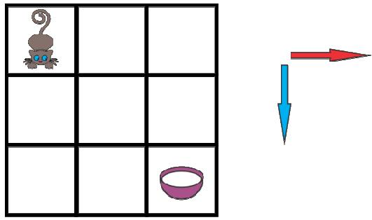

(A) 2 

(B) 3 

(C) 4 

(E) 6 

18. On a farm, there are only sheep and cows. The number of sheep is 8 more than the number of cows. The number of cows is half the number of sheep. How many animals are on the farm? 

(A) 16 

(B) 18 

(C) 20 

(D) 24 

(E) 28 

19. A figure has been cut into these 3 pieces: 

Which figure could have been cut? 

(A) 

(B) 

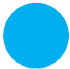

(D) 

(E) 

20. There are 10 camels in a Zoo. The camels are either bactrian (with two humps) or dromedary (with one hump).hump). In total there are 14 humps. Find the number of bactrian camels in the Zoo. 

(A) 1 

(B) 2 

(C) 3 

(D) 4 

(E) 5 

21. Three squirrels Anni, Asia and Elli collected 7 nuts in total. Each collected a different number of nuts, but each collected at least one. Anni collected the least, Asia the most. How many nuts did Elli collect? 

(A) 1 

(B) 2 

(C) 3 

(D) 4 

(E) 5 

22. Tim and Tom built a sandcastle and decorated it with a flag. They stuck half of the flagpole into the highest point of the castle. The upper tip of the flagpole was 80 cm above the ground, the lower tip was 20  cm above the ground. How tall was the sandcastle? 

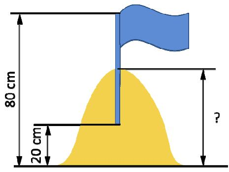

(A) 40 cm 

(B) 45 cm 

(C) 50 cm 

(D) 55 cm 

(E) 60 cm 

23. Here are nine squares: 

First, Ani replaced all the black squares with white ones. Next, Bob replaced all the grey squares with black ones. Finally, Chris replaced all the white squares with grgrey ones. What did they get at the end? 

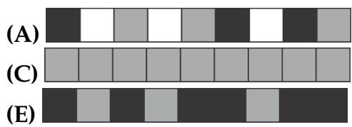

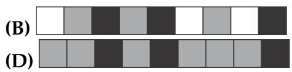

24. Peter chose a square of four cells in the tabletable so that the sum of the four numbers inside the square is greater than 63: 

<table><tr><td>1</td><td>2</td><td>3</td><td>4</td><td>5</td></tr><tr><td>6</td><td>7</td><td>8</td><td>9</td><td>10</td></tr><tr><td>11</td><td>12</td><td>13</td><td>14</td><td>15</td></tr><tr><td>16</td><td>17</td><td>18</td><td>19</td><td>20</td></tr></table>

Which of the following numbers must be in the chosen square? 

(A) 14 

(B) 15 

(C) 17 

(D) 18 

(E) 20 

Good Luck 