## SECTION ONE - (3 point problems)

1. The kangaroo goes up 3 steps each time the rabbit goes down 2 steps. On which step do they meet? 

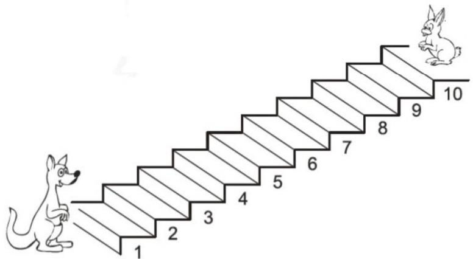

(A) 3 

(B) 4 

(C) 5 

(D) 6 

(E) 7 

2. Mordka took a selfie in front of this castle. 

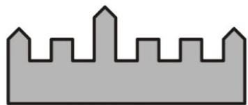

Which of the pictures below could be Mordka's photo? 

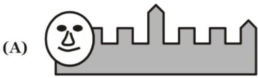

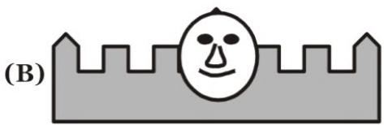

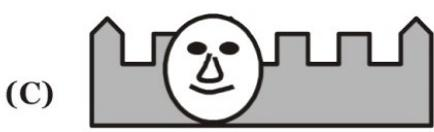

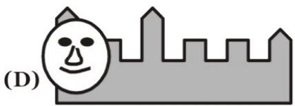

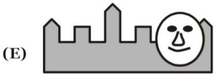

3. Nelly arranged the 4 pieces to make a picture of a kangaroo. 

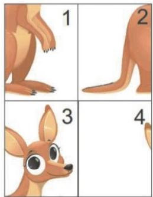

How are the pieces arranged? 

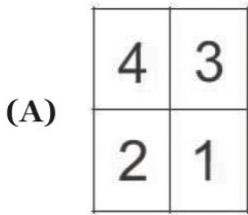

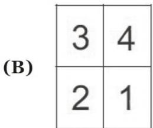

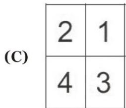

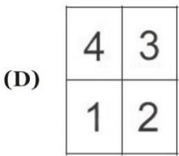

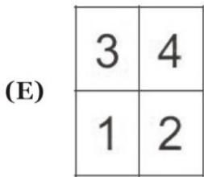

4. A magician is pulling toys out of his top hat. He always pulls out the toys in the same order as shown in the picture. 

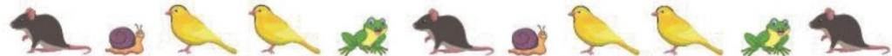

The pattern in the picture repeats every five toys. Which two toys does he pull out next? 

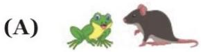

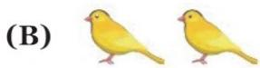

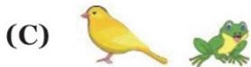

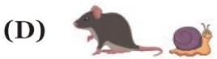

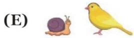

5. José has two cards of the same size. Card A has four holes cut in it. 

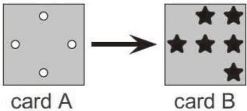

José places card A directly on top of card B. What can José see? 

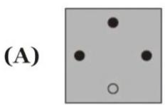

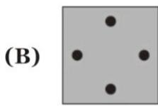

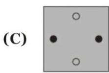

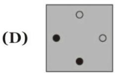

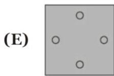

6. Mary made a shape using some white cubes and 14 grey cubes. 

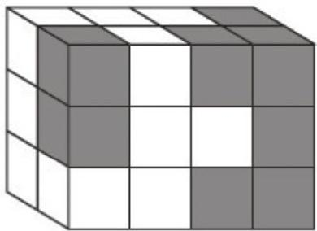

How many of these grey cubes cannot be seen in the picture? 

(A) 1 

(B) 3 

(C) 5 

(D) 6 

(E) 8 

7. Anna draws a picture of some shapes. Her picture contains 3 black triangles and fewer than 4 squares. Which could be Anna's picture? 

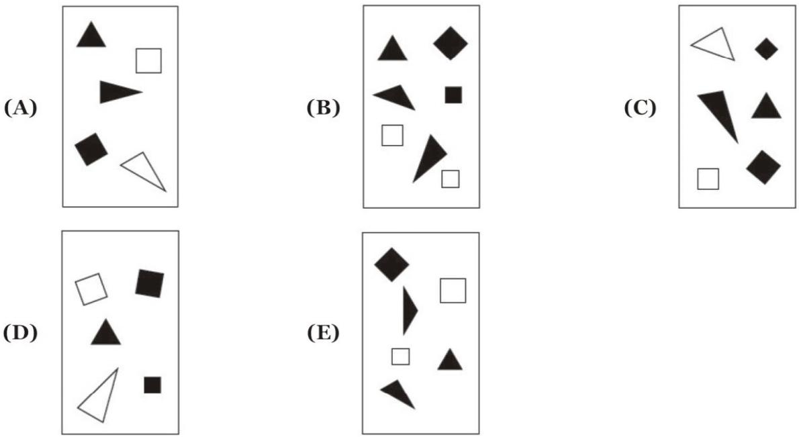

(A) 

(B) 

(C) 

(D) 

(E) 

8. The braid in the figure is composed of three threads. One thread is green, one is blue and one is red. What colours are the three threads? 

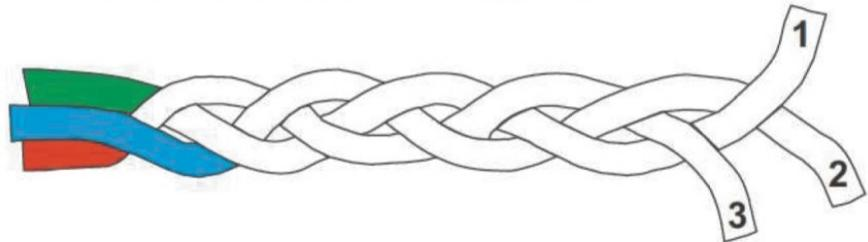

(A) 1 is blue, 2 is green and 3 is red. 

(C) 1 is red, 2 is blue and 3 is green. 

(E) 1 is blue, 2 is red and 3 is green. 

(B) 1 is green, 2 is red and 3 is blue. 

(D) 1 is green, 2 is blue and 3 is red. 

## SECTION TWO - (4 point problems)

9. Which piece completes the picture? 

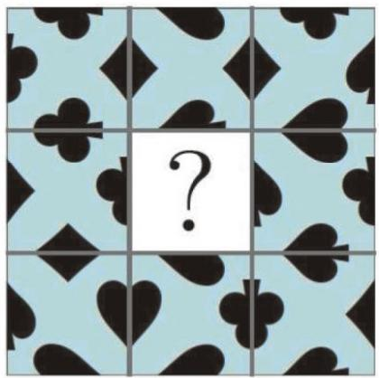

(A)

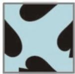

(B)

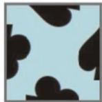

(C)

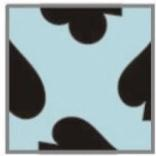

(D)

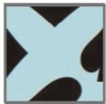

(E)

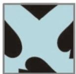

10. A village of 12 houses has four straight roads and four circular roads. The map shows 11 of the houses. On each straight road there are 3 houses. On each circular road there are also 3 houses. Where on the map should the $12^{\text{th}}$ house be put? 

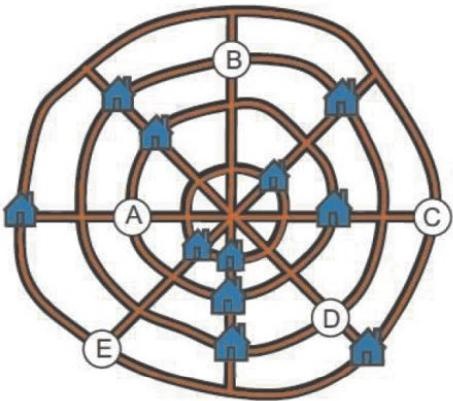

(A) at A 

(B) at B 

(C) at C 

(D) at D 

(E) at E 

11. Five shapes are made by glueing cubes together face to face. Which shape uses the most cubes? 

(A)

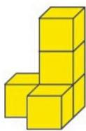

(B)

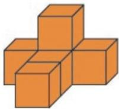

(C)

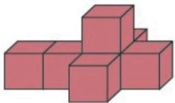

(D)

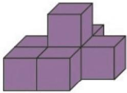

(E)

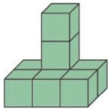

12. A number is written on each petal of two flowers. One petal is hidden. 

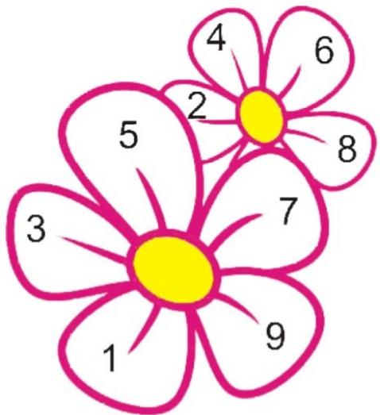

The sums of the numbers on the two flowers are equal. What number is written on the hidden petal? 

(A) 0 

(B) 3 

(C) 5 

(D) 7 

(E) 1 

13. In which of the following pictures is more of the shape shaded than any of the others? 

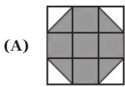

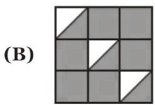

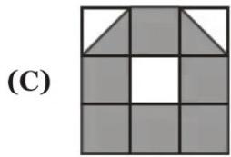

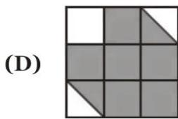

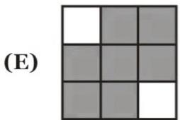

14. Mary wants to write the numbers 1, 2, 3, 4, 5 and 6 inside the six squares of the figure. She wants a different number in each square. She wants both the sum of the numbers in the blue squares and the sum of the numbers in the yellow squares to be 10. What number must she write in the white square with the question mark? 

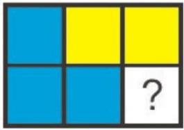

(A) 1 

(B) 2 

(C) 3 

(D) 4 

(E) 5 

15. This card lies on the table. 

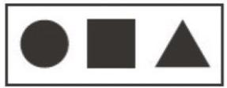

It is flipped over its top edge then flipped over its left edge, as shown in the picture. 

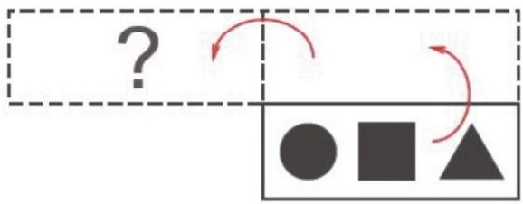

What does the card look like after the two flips? 

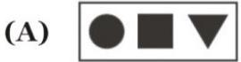

16. Grandmother has just baked 12 cookies. She wants to give all of the cookies to her 5 grand-children but also wants to give each of the grandchildren the same number of cookies. How many more cookies should she bake? 

(A) 0 

(B) 1 

(C) 2 

(D) 3 

(E) 4 

## SECTION THREE - (5 point problems)

17. Tom has 9 cards, as shown: 

He puts the cards on the board so that each horizontal line and each vertical line countains three cards with three different shapes and three different number of shapes. He has already put three cards, as shown 

Which card does he put on the grey square? 

18. Two identical trains, each with 31 cars, are traveling in opposite directions. When car No. 19 of one train is opposite car No. 19 of the other, which car is opposite car No. 12? 

(A) 7 

(B) 12 

(C) 21 

(D) 26 

(E) 31 

19. Mark the bee can walk only on grey cells. In how many ways could you colour exactly two white cells grey so that Mark can walk from A to B? 

(A) 3 

(B) 4 

(C) 5 

(D) 6 

(E) 7 

20. An arrow pointing from one person to another means that the first person is taller than the second. 

For example, person B is taller than person A. Who is the shortest? 

(A) Person A 

(B) Person B 

(C) Person C 

(D) Person D 

(E) Person E 

21. There are some apples and 8 pears in a basket, each of them green or yellow. There are three more apples than the total number of green fruit. There are 6 yellow pears. How many yellow apples are there in the basket? 

(A) 4 

(B) 5 

(C) 6 

(D) 7 

(E) 8 

22. Roo wrote each of the numbers 1, 2, 3, 4 and 5 in one of the circles so that the sum of the numbers in the row is equal to the sum of the numbers in the column. 

What number could be written in the circle with the question mark? 

(A) Only 5 

(B) 2, 3 or 4 

(C) Only 3 

(D) Only 1 or 3 

(E) 1, 3 or 5 

23. Six different numbers chosen from 1 to 9 are written on the faces of a cube, one number on each face. The sums of numbers on each pair of opposite faces are equal. 

Which number could be on the face opposite to the face with the number 5? 

(A) 3 

(B) 5 

(C) 6 

(D) 7 

(E) 9 

24. John and Olivia exchanged sweets. First John gave Olivia as many sweets as Olivia had. Then Olivia gave John as many sweets as John had after the first exchange. After these two exchanges, each had 4 sweets. How many sweets did John have at the beginning? 

(A) 6 

(B) 5 

(C) 4 

(D) 3 

(E) 2 

-- Good Luck -- 