## SECTION ONE - (3 point problems)

1. A kangaroo laid out 3 sticks like this —— to make a shape. It's not allowed to break or to bend the sticks. Which shape could the kangaroo make? 

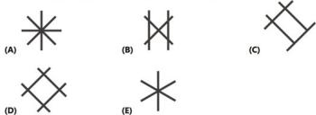

2. In the Kangaroo constellation, all stars have a number greater than 3 and their sum is 20. Which is the Kangaroo constellation? 

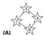

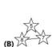

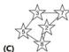

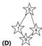

3. Ella puts on this t-shirt and stands in front of a mirror. Which of these images does she see in the mirror? 

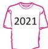

(A) $\int SOS$ 

(B) 1505 

ST50(c) 

(D)120S 

(E) 1S02 

4. On Michael's toy shelf, there are neither turtles, nor rabbits, nor brown teddy bears. 

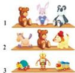

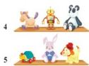

What is Michael's shelf? 

(A) 1 

(B) 2 

(C) 3 

(D) 4 

(E) 5 

5. Which of the paths shown in the pictures is the longest? 

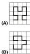

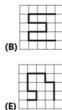

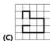

6. Four identical pieces of paper are placed as shown. Michael wants to punch a hole that goes through all four pieces. At which point should Michael punch the hole? 

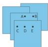

(A) A 

(B) B 

(C) C 

(D) D 

(E) E 

7. These children are standing in a line. Some are facing forwards and others are facing backwards. How many children are holding another child's hand with their right hand? 

(A) 2 

(B) 3 

(C) 4 

(D) 5 

(E) 6 

8. The picture shows 2 mushrooms. What is the difference between their heights? 

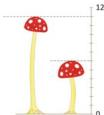

(A) 4 

(B) 5 

(C) 6 

(D) 11 

(E) 17 

## SECTION TWO - (4 point problems)

9. Rose the cat walks along the wall. She starts at point $B$ and follows the direction of the arrows shown in the picture. The cat walks a total of 20 metres. Where does she end up? 

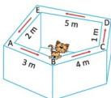

(A) A 

(B) B 

(C) C 

(D) D 

(E) E 

10. Edmund cut a ribbon as shown in the picture. How many pieces of the ribbon did he finish with? 

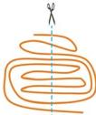

(A) 9 

(B) 10 

(C) 11 

(D) 12 

(E) 13 

11. Julia has two pots with flowers as shown. She keeps the flowers exactly where they are. She buys more flowers so that each pot will have the same number of each type of flower. What is the smallest number of flowers she needs to buy? 

(A) 2 

(B) 4 

(C) 6 

(D) 8 

(E) 10 

12. Tom encodes words using the board shown. 

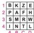

For example, the word PIZZA has the code A2 A4 C1 C1 B2. What word did Tom encode as B3 B2 C4 D2? 

(A) MAZE 

(B) MASK 

(C) MILK 

(D) MATE 

(E) MATH 

13. Which figure can be made of these two pieces? 

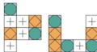

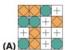

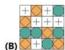

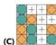

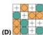

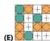

14. Julie and Angela played "kangball", a ball game. Each goal in their game scores 2 points. Julie scored 5 goals and Angela scored 9 goals. How many more points than Julie did Angela score? 

(A) 4 

(B) 6 

(C) 8 

(D) 10 

(E) 12 

15. The picture shows the five houses of five friends and their school. The school is the largest building in the picture. To go to school, Doris and Ali walk past Leo's house. Eva walks past Chole's house. Which is Eva's house? 

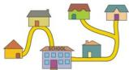

(A) 

(D) 

(B) 

(E) 

(C) 

16. The kangaroo had two branches for lunch. Each branch had 10 leaves. The kangaroo ate some leaves from one branch. Then, from the second branch, it ate as many leaves as were left on the first branch. How many leaves in total were left on the two branches? 

(A) 5 

(B) 6 

(C) 8 

(D) 10 

(E) 15 

# 31 $^{st}$ INTERNATIONAL KANGAROO MATHEMATICS CONTEST 2021

# KSF - Problems PreEcolier (Class 1 & 2)

Time Allowed: 120 minutes 

## SECTION THREE - (5 point problems)

17. Mara built the square by using four of the following five shapes. Which shape was not used? 

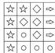

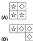

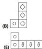

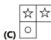

18. Every time the witch has 3 apples she turns them in to 1 banana. Every time she has 3 bananas she turns them in to 1 apple. 

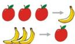

What will she finish with if she starts with 4 apples and 5 bananas? 

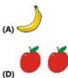

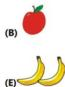

19. The cards shown are placed into two boxes 2 3 4 5 6. The sums of the numbers in each box are the same. Which number must be in the box with the number 4? 

(A) only 3 

(D) only 5 or 6 

(B) only 5 

(E) impossible to determine 

(C) only 6 

20. Stan has five toys: a ball, a set of blocks, a game, a puzzle and a car. He puts each toy on a different shelf of the bookcase. The ball is higher than the blocks and lower than the car. The game is directly above the ball. On which shelf can the puzzle not be placed? 

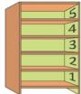

(A) 1 

(B) 2 

(C) 3 

(D) 4 

(E) 5 

21. The pink tower is taller than the red tower but shorter than the green tower. The silver tower is taller than the green tower. Which tower is the tallest? 

(A) pink tower 

(B) silver tower 

(C) green tower 

(D) red tower 

(E) impossible to decide 

22. Each participant in a cooking contest baked one tray of cookies like the one shown. 

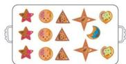

What is the smallest number of trays of cookies needed to make the following plate? 

(A) 1 

(B) 2 

(C) 3 

(D) 4 

(E) 5 

## 31 $^{st}$ INTERNATIONAL KANGAROO MATHEMATICS CONTEST 2021 KSF - Problems PreEcolier (Class 1 & 2)

Time Allowed: 120 minutes 

23. Kangie eats only apples on Monday, Wednesday and Friday. On Tuesdays and Thursdays he eats only mangoes. He eats either 2 apples or 3 mangoes a day. On Saturdays and Sundays he eats nothing. How many pieces of fruit does Kangie eat in two weeks? 

(A) 12 

(B) 16 

(C) 18 

(D) 20 

(E) 24 

24. The picture shows two cogs, each with a black tooth. 

Where will the black teeth end up after the small cog has made one full turn? 

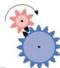

(A) 

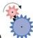

(B) 

(C) 

(D) 

(E) 

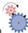

-- Good Luck -- 