## SECTION ONE - (3 point problems)

## 1. Which box contains the most triangles?

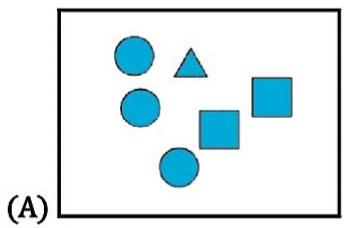

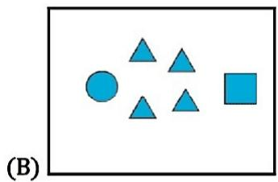

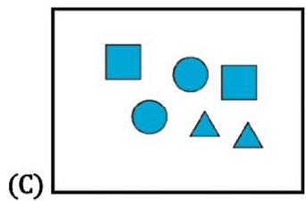

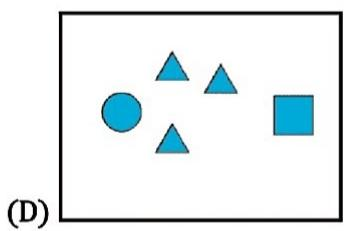

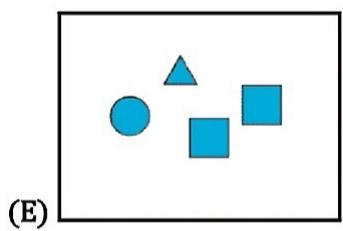

## 2. Arek cuts this picture in half and puts the two pieces together.

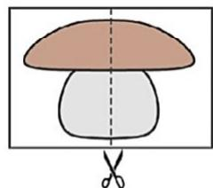

## Which option shows the two pieces of Arek's picture?

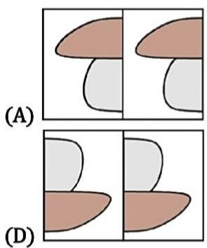

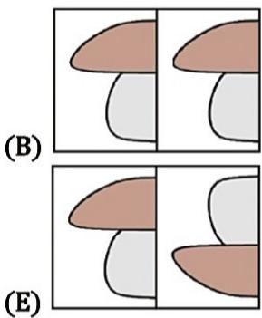

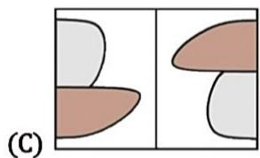

## 3. The picture shows 5 identical bricks. How many bricks are touching exactly 3 other bricks?

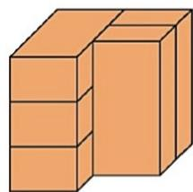

(A) 1 

(B) 2 

(C) 3 

(D) 4 

(E) 5 

# 32 $^{nd}$ INTERNATIONAL KANGAROO MATHEMATICS CONTEST 2022

# KSF - Problems PreEcolier (Class 1 & 2)

Time Allowed: 120 minutes 

4. One sandwich and one juice together cost 12 euro. One sandwich and two juices together cost 14 euro. How much does one juice cost? 

(A) 1 

(B) 2 

(C) 3 

(D) 4 

(E) 5 

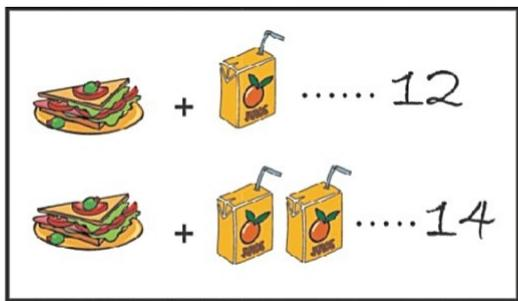

5. There has to be 2 coins in each row and each column. 

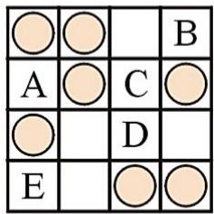

Where do you need to put the final coin? 

(A) A 

(B) B 

(C) C 

(D) D 

(E) E 

6. A monkey has torn a piece from Captain Jack's map. 

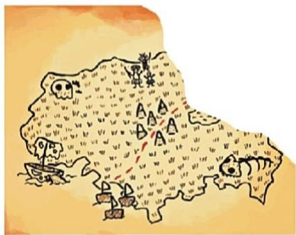

Which is the missing piece? 

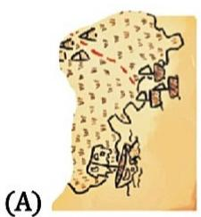

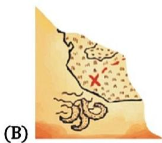

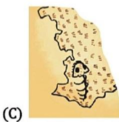

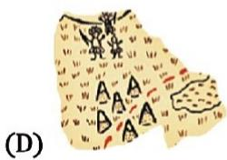

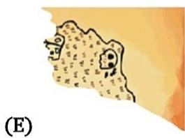

## 32 $^{nd}$ INTERNATIONAL KANGAROO MATHEMATICS CONTEST 2022

## KSF - Problems PreEcolier (Class 1 & 2)

Time Allowed: 120 minutes 

7. Peter puts the 4 puzzle pieces shown together to make a square. Which picture can he make? 

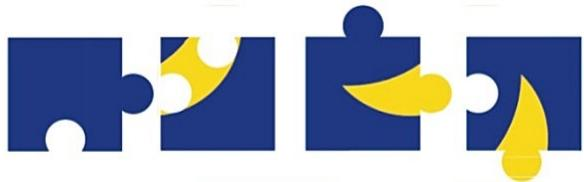

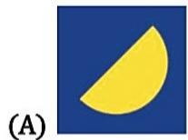

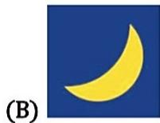

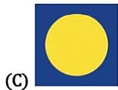

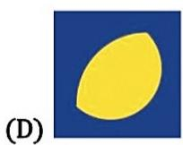

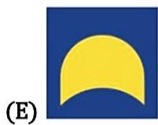

8. Some ink spilled on a piece of squared paper, as shown in the picture. How many of the squares have ink on them? 

(A) 16 

(B) 17 

(C) 18 

(D) 19 

(E) 20 

## SECTION TWO - (4 point problems)

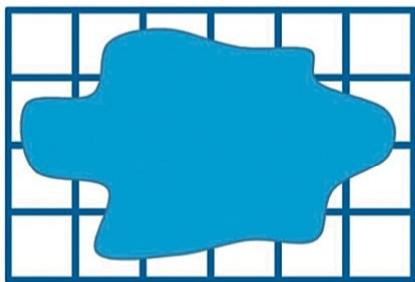

9. Kanga wrote down a number and then covered each digit with a shape. Different digits were covered by different shapes, and the same digits were covered by the same shape. Which number could be written under these shapes? 

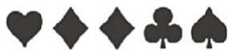

(A) 34426 

(B) 34526 

(C) 34423 

(D) 34424 

(E) 32446 

10. One animal sleeps in each of the baskets. The koala and the fox are sleeping in baskets with the same pattern and shape. 

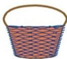

basket 1

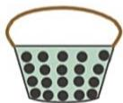

basket 2

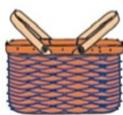

basket 3

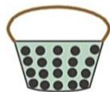

basket 4

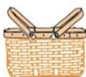

basket 5

The kangaroo and the ostrich have the same pattern on their baskets. Which basket is the puppy sleeping in? 

(A) basket 1 

(B) basket 2 

(C) basket 3 

(D) basket 4 

(E) basket 5 

11. Kanga wants to reach the koala without going through any of the coloured squares. 

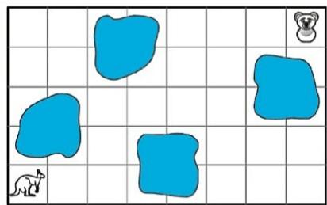

Which route could she take? 

(A) 

(B) 

(C) 

(D) 

(E) 

12. In one of the pictures below, a shape is used that cannot be seen in the others. In which picture is it? 

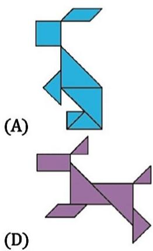

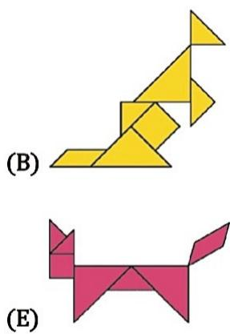

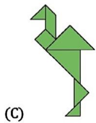

13. Which option shows the view from above this stack of discs? 

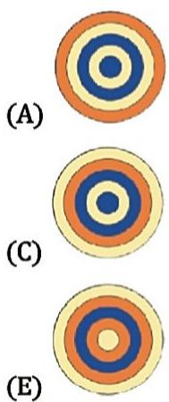

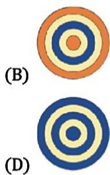

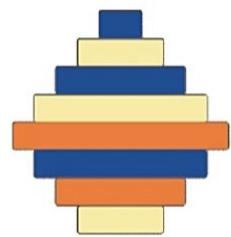

14. Which of the following pictures will we see when we use the stamp shown? 

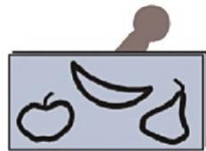

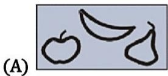

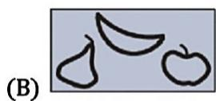

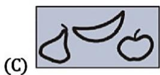

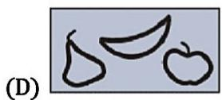

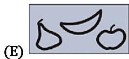

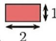

15. Katrin builds a path around each square using tiles like the one shown. 

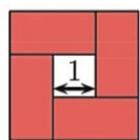

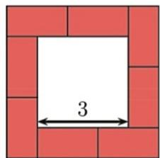

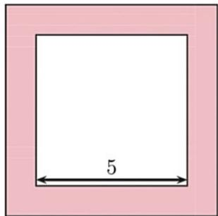

How many tiles does she use around a square with side 5? 

(A) 10 

(B) 11 

(C) 12 

(D) 14 

(E) 16 

16. Each year, Maria received teddy bears for her birthday. For her first birthday she received 1 teddy bear. For her second birthday she received 2 teddy bears. For each subsequent birthday she received one teddy bear more than the previous year. How many teddy bears does Maria have in total when she is 6 years old? 

(A) 19 

(B) 20 

(C) 21 

(D) 22 

(E) 23 

## SECTION THREE - (5 point problems)

17. The sum of the five numbers in each house is 20. Some numbers have been painted over. What number is hidden under the question mark? 

(A) 3 

(B) 4 

(C) 7 

(D) 9 

(E) 14 

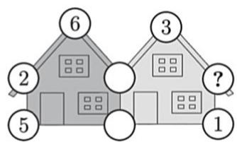

18. Some lawns are shown below. Which lawn is the smallest? 

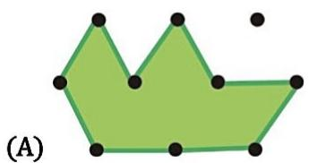

19. Ann has 4 stickers as shown. 

She sticks down the star after she sticks down the square. She sticks down the star before she sticks down the triangle. Which picture could she end up with? 

20. Dino moves from the entrance to the exit by going through rooms. He can only go through each room once. 

Dino adds up the numbers as he passes through each room. What is the highest total Dino can make? 

(A) 27 

(B) 29 

(C) 32 

(D) 34 

(E) 36 

21. In the picture, each shape stands for a different number. Which number should be written in place of the question mark? 

(A) 10 

(B) 12 

(C) 14 

(D) 16 

(E) 18 

22. Three zebras take part in a contest. The winner is the zebra with the most stripes. Runa has 15 stripes, Zara has 3 more than Runa. Runa has 5 fewer stripes than Biba. How many stripes does the winner have? 

(A) 16 

(B) 18 

(C) 20 

(D) 21 

(E) 22 

23. Kangy's car can only turn left. It can never turn right. Which of the following five routes can Kangy take? 

24. There are five numbered cards on the table as shown. You may swap two cards at each step. What is the smallest number of steps needed to put the cards into increasing order? 

(A) 1 

(B) 2 

(C) 3 

(D) 4 

(E) 5 

