## SECTION ONE - (3 point problems)

## 1. How many circles are there in the figure?

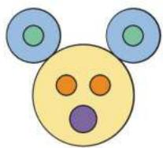

(A) 5 

(B) 6 

(c) 7 

(D) 8 

(E) 9 

## 2. The picture shows 5 cubes viewed from the front. What is the view from above?

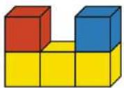

(A) 

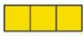

(B) 

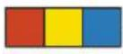

(C) 

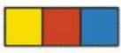

(D) 

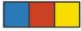

(E) 

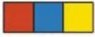

## 3. Each bowl contains four numbered balls, as shown. In which bowl is the sum of all the numbers largest?

(A) 

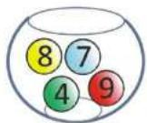

(B) 

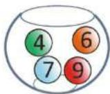

(c) 

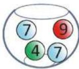

(D) 

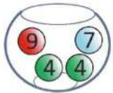

(E) 

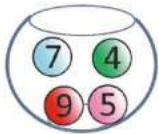

## 4. Mr. Beaver rearranges the pieces to make a kangaroo figure.

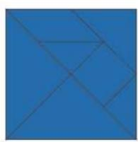

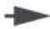

## Which piece is missing?

(A) 

(B) 

(C) 

(D) 

(E) 

5. My boat has more than 1 circle. It also has 2 more triangles than squares. Which boat is mine? 

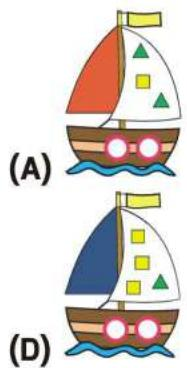

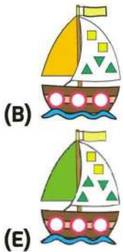

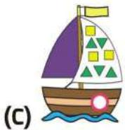

6. This is my grandfather's birthday cake. A large candle stands for 10 years and a small one for 1 year. How old is my grandfather? 

(A) 65 (C) 76 (B) 66
(D) 77 (E) 78 

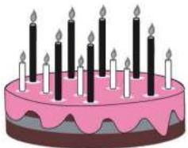

7. Pablo puts 10 toy cars on this racetrack. How many cars are in the tunnel? 

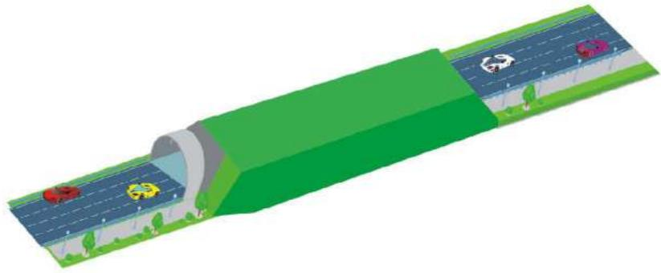

(A) 5 (D) 8 (B) 6
(E) 9 

(C) 7 

8. Steven drives from X to Y. At each crossing, he stops before going straight ahead. In total, how many times does he stop at a crossing? 

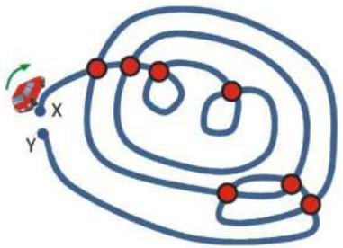

(A) 11 (D) 14 (B) 12 (E) 15 (c) 13 

## SECTION TWO - (4 point problems)

9. There are 5 trees in a park. A beaver can see only two of the trees because all the others are hidden behind other trees. At which of the marked points is the beaver standing? 

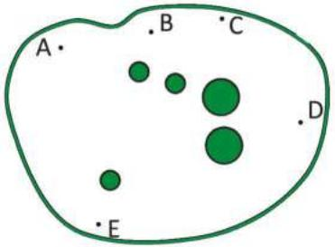

(A) at A 

(B) at B 

(C) at C 

(D) at D 

(E) at E 

10. There are 24 squares in the picture. Suchit has coloured some of the squares. How many more squares need to be coloured so that half of the squares are coloured? 

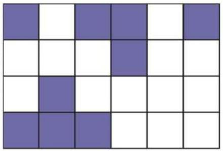

(A) 1 

(B) 2 

(C) 3 

(D) 4 

(E) 5 

11. The two tokens with the question mark have the same number. What is each missing number so that the sum is 18? 

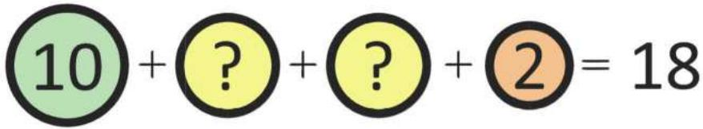

(A) 1 

(B) 2 

(C) 3 

(D) 4 

(E) 5 

12. Raha wants to finish the bee on the left according to the model on the right. 

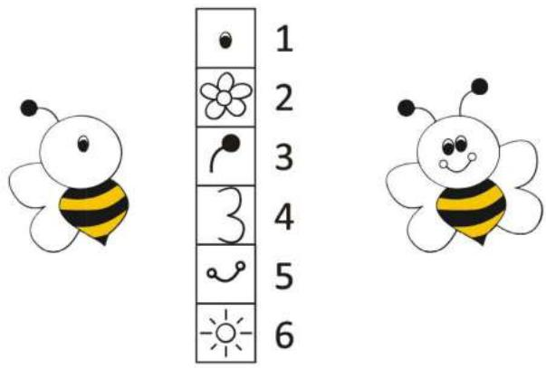

Raha needs to win points to unlock parts of the bee. How many points does she need to win to complete the bee? 

(A) 9 

(B) 10 

(C) 11 

(D) 12 

(E) 13 

13. The table has 30 boxes. After painting the boxes in row 3, row 6, column C and column D, how many boxes will be not painted? 

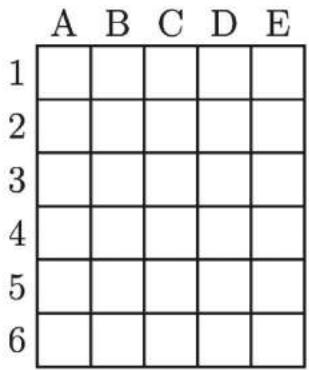

(A) 8 

(B) 10 

(C) 12 

(D) 18 

(E) 22 

14. A sheet of paper is folded in half. Square and round holes are punched. 

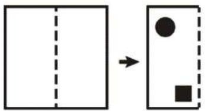

How does the sheet look after it is unfolded again? 

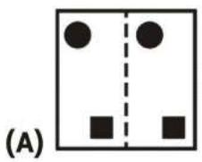

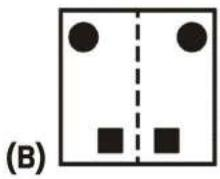

(C)

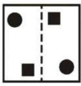

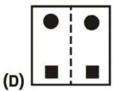

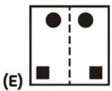

15. A student made the shape shown using 12 cubes. He put one drop of glue between any two cubes that share a common face. How many drops of glue did he use? 

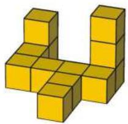

(A) 8 

(B) 9 

(C) 10 

(D) 11 

(E) 12 

16. Max wants to complete the puzzle shown. 

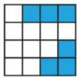

He has 5 different pieces shown. 

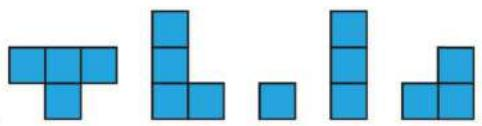

Which pieces does he have to use to complete the puzzle? 

(A) 

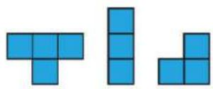

(B) 

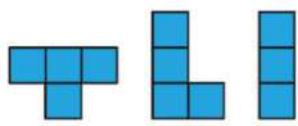

(C) 

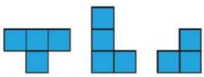

(D) 

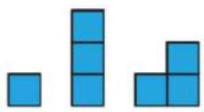

(E) 

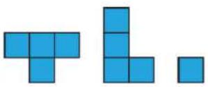

## SECTION THREE - (5 point problems)

17. Elvis has 6 identical triangles like this he make? 

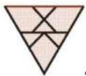

. Which of the following pictures can 

(A)

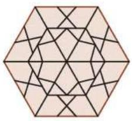

(B)

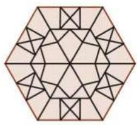

(C)

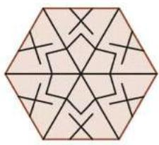

(D)

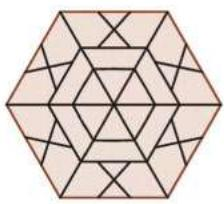

(E)

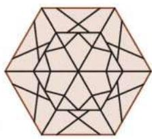

18. Five children share a birthday and each child has their own cake. Lea is two years older than Jose, but one year younger than Ali. Vittorio is the youngest. Which is Sarah's cake? 

(A)

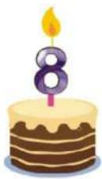

(B)

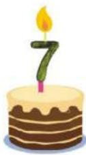

(c)

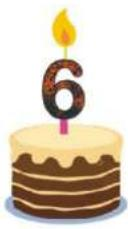

(D)

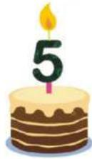

(E)

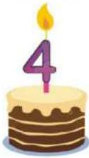

19. The map shows five villages A, B, C, D and E, and the distances in kilometres between them. Only two villages are the same distance apart no matter which route you choose. Which are these two villages? 

(A) B and E 

(B) B and D 

(E) A and D 

(C) C and E 

(D) A and C 

20. Sam walks through a two-storey maze from the entrance to the exit, both located at floor 1. In what order will she find the wall stickers? 

21. Emma finished third in a solo dance competition. There were three dancers between her and last place. In total, how many dancers took part in the competition? 

(A) 4 (B) 5 

(c) 6 

(D) 7 (E) 8 

22. Malik places one of the five pieces on the grid. He cannot rotate or flip the pieces. 

<table><tr><td>1</td><td>6</td><td>7</td></tr><tr><td>9</td><td>5</td><td>4</td></tr><tr><td>2</td><td>8</td><td>3</td></tr></table>

Which piece should he use to cover the numbers with the largest sum? 

23. In total, Maria has 19 apples in 3 bags. From each bag, she takes out the same number of apples. Now the bags have 3, 4 and 6 apples. How many apples did Maria take out of each bag? 

(A) 1 

(B) 2 

(C) 3 

(D) 4 

(E) 5 

24. Three frogs live in a pond. Each night, one of the frogs sings a song to the other two. After 9 nights, one of the frogs had sung 2 times. Another frog had listened to 5 songs. How many songs had the third frog listened to? 

(A) 7 

(B) 6 

(C) 5 

(D) 4 

(E) 3 

