## Arsip Soal OSN Matematika SD/MI Tingkat Kabupaten Tahun 2007

Disusun oleh Tim OSN Provinsi Kalimantan Barat 

Diunduh melalui situs mathcyber1997.com 

## I. Bagian Tes 1

1. Ayah berumur (x + 5) tahun. Ibu 4 tahun lebih muda darinya. Jumlah umur keduanya 6 tahun yang lalu bila dinyatakan dalam x adalah · · · · 

2. Bentuk sederhana dari 10a $- 1 , 5 - 4 a + \frac { 2 } { 5 } - 1 \frac { 1 } { 2 }$ adalah 

3. Jumlah siswa di kelas 3B adalah 30t siswa. Banyak siswa yang berangkat untuk rekreasi adalah 10t. Perbandingan banyak siswa yang berangkat dan tidak berangkat adalah · · · · 

4. Diketahui uang A + uang B sama dengan Rp28.000,00, uang B + uang C sama dengan Rp36.000,00, dan uang A + uang C sama dengan Rp32.000,00. Jumlah uang ketiganya adalah · · · · 

5. Berapa banyak kubus satuan yang masih diperlukan untuk memenuhi kotak berbentuk balok berdasarkan gambar berikut? 

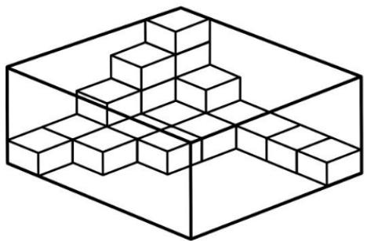

6. Segitiga BEF pada gambar di bawah adalah segitiga sama sisi. Diketahui juga bahwa AB sejajar dengan DC. Besar $\angle D C E + \angle D A F$ adalah · · · · 

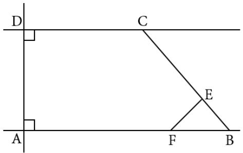

7. Jumlah 101 bilangan bulat berurutan adalah 101. Berapakah bilangan bulat terbesar dari deret tersebut? 

8. Untuk menempuh perjalanan dari kota A ke kota B dengan kecepatan rata-rata 60 km/jam, seorang sopir bus biasanya memerlukan waktu selama 6 jam 40 menit. Kecepatan rata-rata bus agar tiba di kota B dalam waktu 1 jam 20 menit lebih awal dari biasanya adalah · · · · 

9. Sebuah pabrik obat memproduksi obat berbentuk pil yang beratbya 0, 6 gram. Pil tersebut akan dikemas menggunakan kertas aluminium. Setiap lembar kertas aluminium berisi 28 pil. Lima lembar aluminium akan dikemas ralam satu kotak karton. Setiap 480 kotak karton akan disimpan dalam sebuah kotak kardus. Berat seluruh pil yang ada dalam satu kotak kardus adalah · · · gram. 

10. Budi dapat mengayuh sepeda sejauh 15 km dalam waktu 50 menit. Dengan kecepatan yang sama, lamanya waktu yang dibutuhkan Budi untuk mencapai jarak 12 km adalah · · · menit. 

11. Sebuah bak air berbentuk balok memiliki panjang, lebar, dan tinggi berturut-turut 60 cm, 50 cm, dan 40 cm. Jika bak diisi air secara hati-hati dengan menggunakan ember yang berkapasitas 9 liter, maka air dalam bak akan mulai tumpah pada takaran ke-· · · · 

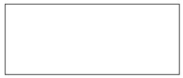

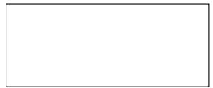

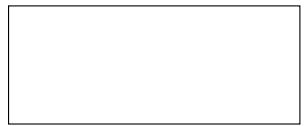

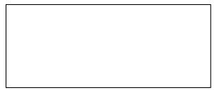

12. Lebar dari suatu persegi panjang adalah $( 2 s + 5 r )$ cm. Panjangnya 4 kali lebarnya. Keliling persegi panjang tersebut bila dinyatakan dalam s dan r adalah · · · · 

13. ABCD adalah persegi panjang dengan $D E = E A = 4$ cm, $A F = 6$ cm, dan $F B = 4 ~ \mathrm { c m }$ , seperti tampak pada gambar. Luas daerah yang diarsir adalah $\cdots \mathrm { c m ^ { 2 } }$ . 

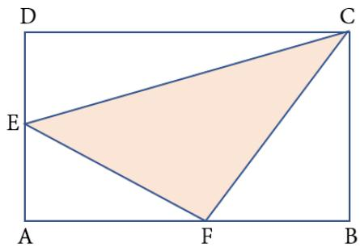

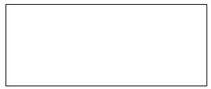

14. Pada gambar di bawah, F adalah titik pusat lingkaran. Luas persegi DEF G adalah 4 satuan luas. Luas lingkaran tersebut adalah · · · satuan luas. 

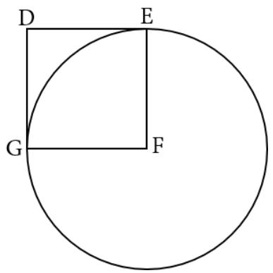

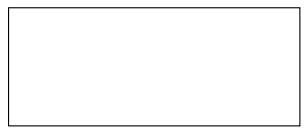

15. Tabel berikut ini menunjukkan waktu yang diperlukan seorang pelari untuk menempuh jarak 100 m dalam latihannya. 

<table><tr><td>Latihan ke-</td><td>1</td><td>2</td><td>3</td><td>4</td><td>5</td><td>6</td><td>7</td></tr><tr><td>Waktu (detik)</td><td>16</td><td>18</td><td>14</td><td>21</td><td>12</td><td>15</td><td><eq>\cdots</eq></td></tr></table>

Pelari tersebut berharap dapat memperbaiki waktu tempuh rata-rata selama 0, 8 detik. Berapa waktu yang harus ia capai untuk latihan ke-7? 

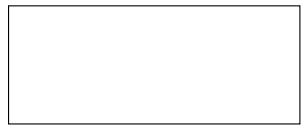

16. Umur Mita $\frac { 2 } { 5 }$ kali dari umur ayahnya. Umur ayahnya 3 tahun yang akan datang adalah 48 tahun. Dalam berapa tahun umur Mita akan mencapai setengah dari umur ayahnya? 

17. Bilangan pecahan positif yang bila ditambahkan pada ${ \frac { 3 } { 7 } } \times { \frac { 2 1 } { 2 2 } } \times { \frac { 1 1 } { 1 2 } } \times { \frac { 8 } { 9 } }$ menghasilkan bilangan bulat adalah 

18. Terdapat 1.200 siswa di suatu sekolah. Diketahui sebanyak $\frac { 2 } { 5 }$ dari jumlah siswa laki-laki sama dengan $\frac { 4 } { 1 5 }$ dari jumlah siswa perempuan. Banyak siswa perempuan di sekolah itu adalah · · · · 

19. Nilai dari $( 1 4 + 1 9 ) ^ { 2 } - ( 1 4 ^ { 2 } + 1 9 ^ { 2 } ) = \cdot \cdot \cdot \cdot$ 

20. Jika bilangan 6-digit 3NN345 habis dibagi 9, maka nilai N adalah · · · · 

21. Jika Sena lebih tua dari Arjuna, Arjuna lebih tua dari Arimbi, Arimbi lebih muda dari Sena, dan Rama lebih tua dari Sena, maka urutan umur mereka dimulai dari yang tertua adalah · · · · 

22. Angka satuan dari $7 ^ { 1 0 }$ adalah · · · · 

23. Jika $a : b = 3 : 2$ , maka $( 3 a + 5 b ) : ( 3 a - 2 b ) = \cdot \cdot \cdot$ · 

24. Perbandingan luas dua persegi panjang adalah 8 : 3. Jika luas persegi panjang kecil adalah 45 cm2, maka luas persegi panjang yang besar adalah · · · · 

25. Total uang Fahri dan Dinda adalah Rp200.000,00. Perbandingan uang Fahri dan Dinda adalah 5 : 3. Banyaknya uang Fahri adalah · · · · 

## II. Bagian Tes 2

1. Menjelang hari raya, sebuah toko memberikan diskon. Semua harga barang didiskon 30%. Berapakah harga baju di toko tersebut jika harga mula-mulanya Rp. X? 

2. Sebuah tongkat berwarna cokelat memiliki panjang 0, 8 meter dan tongkat berwarna hijau memiliki panjang $\frac { 5 } { 6 }$ dari tongkat berwarna cokelat. Ada juga tongkat berwarna biru yang panjangnya $\frac { 1 } { 6 }$ meter lebih pendek dari tongkat yang berwarna hijau. Berapakah jumlah panjang dari ketiga tongkat itu? 

3. Jika 8 pekerja mampu menggarap 80 hektare lahan dalam waktu 24 hari, maka dalam waktu 30 hari kelompok pekerja tersebut dapat menggarap seluas · · · hektare lahan. 

4. Terdapat tiga lingkaran berjari-jari sama. Gambarkan model irisan yang dapat dibentuk. 

5. Keliling sebuah persegi panjang adalah 234 cm. Ukuran panjangnya adalah empat kali lebarnya ditambah 2 cm. Tentukan luas persegi paniang tersebut. 

6. Hitunglah luas bangun datar gabungan berikut $( \pi = 3 , 1 4 )$ . 

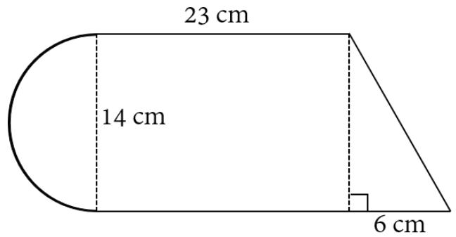

7. Panjang jari-jari setiap lingkaran pada gambar di bawah adalah 7 satuan. Tentukan luas daerah yang diarsir $( \pi = 3 , 1 4 )$ . 

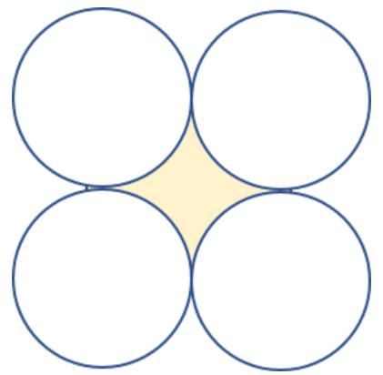

8. Berapa keliling dari segitiga pada gambar berikut? 

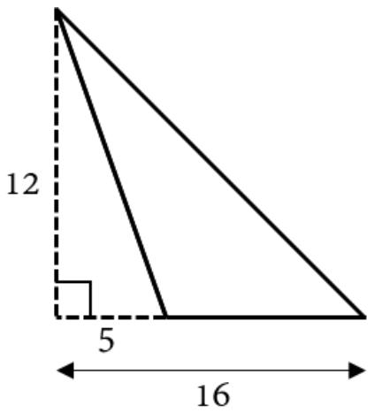

9. Tiga benda A, B, dan C memiliki berat rata-rata 84 kg. Jika benda D digabung, maka berat rata-ratanya menjadi 80 kg. Jika benda E yang memiliki berat 3 kg lebihnya dari benda D menggantikan benda A, maka berat rata-rata 4 benda itu berubah menjadi 79 kg. Berapakah berat benda A? 

10. Terdapat 3 bilangan. Bilangan pertama dua kalinya dari bilangan kedua. Bilangan ketiga dua kalinya dari bilangan pertama. Jumlah ketiga bilangan itu adalah 112. Tentukan ketiga bilangan tersebut. 

11. Pada sebuah pameran, jumlah wanita dewasa yang hadir sama dengan $\frac 1 3$ dari jumlah laki-laki dewasa. Jumlah anak-anak yang hadir 20 orang lebihnya dari jumlah laki-laki dewasa. Jika jumlah wanita dewasa yang hadir sama dengan 0, 2 dari jumlah anak-anak, maka berapa banyak orang yang hadir saat pameran itu? 

12. Pak Harun membeli sepeda dan sepeda motor dengan perbandingan harga 1 : 18. Pak Harun membayar Rp11.400.000,00 untuk kedua kendaraan tersebut. Setahun kemudian, Pak Harun menjual keduanya dan mengalami kerugian 25% untuk sepeda dan 30% untuk sepeda motor. Berapa jumlah uang yang diterima Pak Harun dari hasil penjualan tersebut? 

## Kunjungi mathcyber1997.com untuk mendapatkan arsip soal lainnya