## Arsip Soal OSN Matematika SD/MI Tingkat Kabupaten Tahun 2008

Disusun oleh Tim OSN Provinsi Kalimantan Barat 

Diunduh melalui situs mathcyber1997.com 

## I. Bagian Tes 1

1. Hasil dari 2, $4 \times \frac { 5 } { 2 } \div 6 \%$ adalah · · · · 

2. Selisih dua bilangan positif adalah 2, sedangkan hasil kalinya 168. Jumlah dua bilangan itu adalah · · · · 

3. Sebuah bola memiliki jari-jari yang panjangnya sama dengan panjang rusuk suatu kubus. Perbandingan panjang diameter bola dan diagonal ruang kubus adalah 

4. Tentukan nilai x dari ${ \frac { 3 - 0 , 3 } { x - 1 } } = 1$ . 

5. Rata-rata nilai 11 siswa adalah 7. Jika seorang siswa mengikuti perbaikan nilainya, rata-rata berubah menjadi 7, 1. Selisih nilai siswa sebelum dan sesudah perbaikan adalah · · · · 

6. Dari gambar berikut, keliling yang paling besar di antara segitiga ACD, segitiga DEC, dan segitiga DF C adalah 

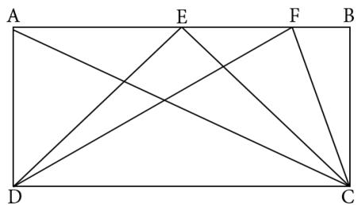

7. Amat dan Bayu dapat bersepeda mengelilingi lapangan dalam waktu 12 menit dan 15 menit. Jika keduanya memulai pada waktu, tempat, dan arah yang sama, maka pada menit ke berapa mereka akan berpapasan? 

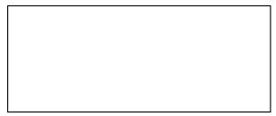

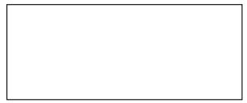

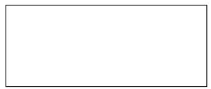

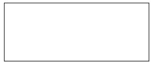

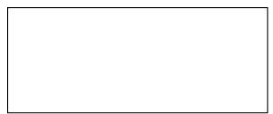

8. Hasil dari $1 + 3 + 5 + 7 + \cdot \cdot \cdot + 2 5$ adalah · · · · 

9. Bilangan bulat yang paling dekat dengan nilai ${ \frac { 7 } { 3 } } \times { \frac { 4 } { 9 } } + { \frac { 1 5 } { 8 } }$ adalah · · · · 

10. Bilangan 1, 232323 · · · dapat dinyatakan dalam bentuk pecahan ${ \frac { a } { b } } ;$ dengan a, b relatif prima. Nilai dari $a + b =$ 

11. Suatu persegi memiliki keliling 60 cm. Jika setiap sisi panjangnya bertambah 10%, maka luasnya sekarang adalah $\cdots \mathrm { c m ^ { 2 } }$ . 

12. Harga sebuah buku bacaan mula-mula Rp10.000,00. Jika harga buku tersebut naik 20%, kemudian turun 20% dari harga baru, maka harga terakhir buku tersebut adalah · · · · 

13. Jika A : $B = B : C = C : D = 1 : 2$ , maka A : $D = \cdots$ 

14. Sebuah bak berisi air $\frac 1 4$ bagian. Jika ditambahkan 20 liter air, maka bak menjadi terisi $\frac 1 3$ bagian. Berapa maksimum liter air yang dapat ditampung bak tersebut? 

15. Berapa banyak angka 5 yang ditulis dari bilangan 1 sampai 100? 

16. Jika dua garis horizontal pada gambar di bawah ini sejajar, maka nilai x yang memenuhi adalah · · · · 

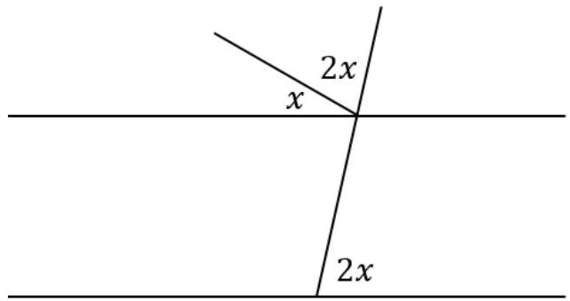

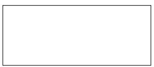

17. Jika $a \# b$ didefinisikan sebagai $\frac { a ^ { 2 } + b ^ { 2 } } { a - b }$ a − b , maka nilai dari $5 \# 3$ adalah · · · · 

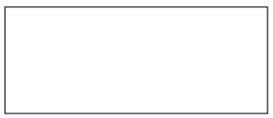

18. Jika luas satu persegi pada gambar di bawah adalah $5 ~ \mathrm { c m } ^ { 2 } .$ , maka luas daerah yang diarsir adalah · · · · 

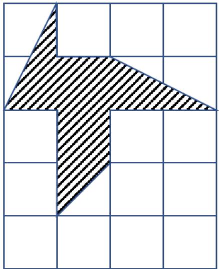

19. Jika suatu bilangan dikalikan 6, hasilnya adalah 20 lebihnya dari bilangan itu. Bilangan yang dimaksud adalah · · · · 

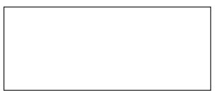

20. Jika 8% dari $( P - 2 )$ adalah 12, maka nilai P sama dengan · · · · 

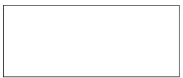

21. Jumlah tiga bilangan yang rumpang dalam barisan dengan selisih antarsuku yang berdekatan sama berikut ini adalah · · · · 

18, , , , 54 

22. Nilai x yang memenuhi operasi skematik berikut adalah 

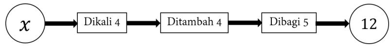

23. Tanggal 12 April 2008 adalah hari Sabtu. Seratus hari kemudian adalah hari · · · · 

24. Lantai suatu rumah berukuran 9 m × 8 m. Ayah ingin menutup lantai dengan keramik berukuran 60 cm × 60 cm. Satu keping keramik harganya Rp50.000,00. Total harga beli keramik agar seluruh lantai rumah tertutup adalah · · · · 

25. Berapa tahun 3 abad + 13 dasawarsa + 15 windu? 

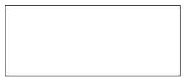

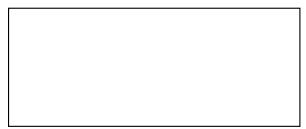

## II. Bagian Tes 2

1. Bangun yang diarsir adalah persegi dengan panjang sisi 20 cm. Bangun yang melengkung merupakan setengah lingkaran. Luas daerah yang tidak diarsir dengan asumsi π = 3, 14 adalah · · · · 

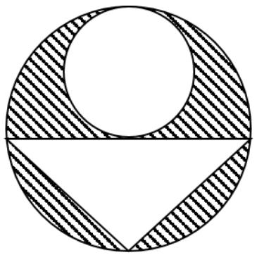

2. Rata-rata nilai 20 anak adalah 60. Jika nilai anak pertama ditambah 1, anak kedua ditambah 3, anak ketiga ditambah 5, dan seterusnya sampai anak ke-20, maka nilai rata-rata nilai 20 anak tersebut saat ini adalah · · · · 

3. Amir membeli barang jenis A dan B masing-masing seharga Rp900,00 dan Rp1.200,00. Jika Amir membayar Rp9.600,00 maka tuliskan semua kemungkinan banyak masing-masing barang yang dapat dibeli Amir. 

4. Tentukan angka ke-2008 dari bentuk pecahan desimal $\frac { 1 } { 1 7 }$ . 

5. Ayah ingin mengisi bak air berbentuk kubus seperti gambar. 

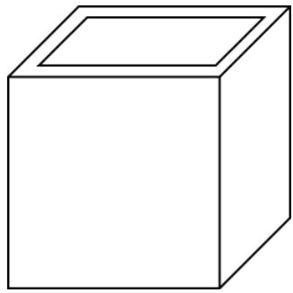

Panjang, lebar, dan tingginya 1 meter, sedangkan tebal bak 5 cm. Paling banyak berapa liter air yang dapat ditampung oleh bak itu? 

6. Tentukan luas daerah yang diarsir jika panjang diameter lingkaran kecil sama dengan tinggi segitiga sama kaki serta diketahui bahwa jari-jari lingkaran kecil 10 cm dan asumsi $\pi = 3$ , 14. 

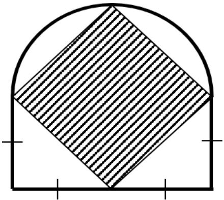

7. Umur Pak Joko sekarang 4 kali umur anaknya. Enam tahun yang akan datang, umurnya 3 kali umur anaknya. Berapa umur Pak Joko saat itu? 

8. Hasil akhir dari ${ \bigg ( } { \bigg ( } 6 , 2 5 - { \frac { 3 } { 8 } } { \bigg ) } \times { \bigg ( } 3 { \frac { 1 } { 2 } } - 7 5 \% { \bigg ) } + 2 , 7 5 { \bigg ) } { \div } 1 0 0 . 0 0 0$ dalam pecahan desimal adalah · · · 

9. Tanggal 8 November 1988 merupakan tanggal yang unik, karena jika dituliskan dalam format 8/11/88, maka kita peroleh 8 × 11 = 88. Tuliskan semua tanggal dan bulan yang memiliki keunikan seperti itu pada tahun 1990. 

10. Budi menginginkan lantai rumahnya dipasang keramik. Sekotak keramik isinya 4 keping dan 1 keping berukuran 60 cm ×60 cm. Harga sekotak keramik Rp160.000,00. Jika upah pemasangan 1 keping keramik adalah Rp15.000,00 dan lantai rumahnya berukuran 8 m ×9 m, maka total biaya yang harus dikeluarkan Budi untuk pembelian dan pemasangan keramik adalah · · · · 

11. Seorang pedagang barang antik membeli piring kuno dengan harga 5 juta rupiah dan dijual kepada kolektor sehingga mendapat untung 40%. Selang beberapa bulan kemudian, kolektor itu menjual piring kuno tersebut dan mengalami kerugian 10%. Harga jual piring kuno oleh kolektor adalah · · · · 

12. Bilangan bulat positif terkecil yang hasil kalinya terhadap 120 menghasilkan bilangan kuadrat sempurna adalah · · · · 

13. Di dalam kelas terdapat 6 siswa yang ingin bersalaman satu sama lain masing-masing sekali. Berapa banyak salaman yang terjadi? 

Kunjungi mathcyber1997.com untuk mendapatkan arsip soal lainnya 