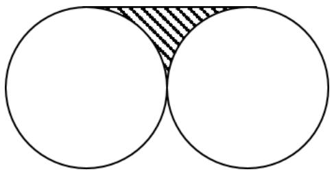
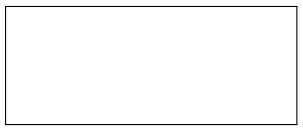
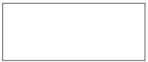
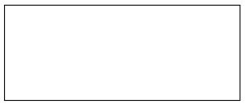
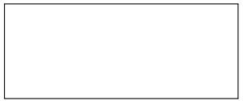
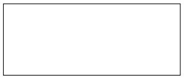
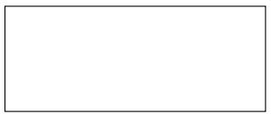
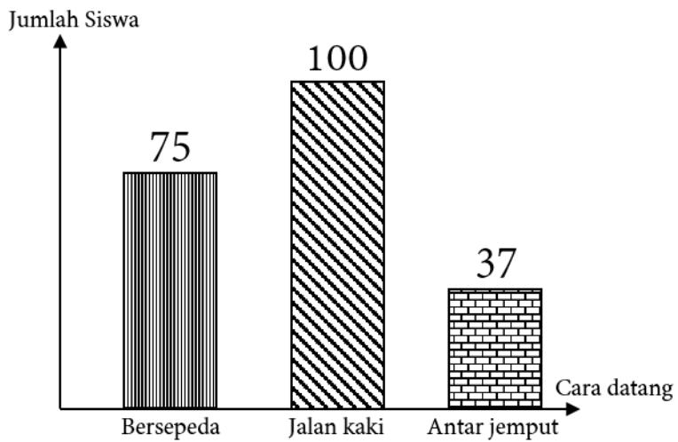
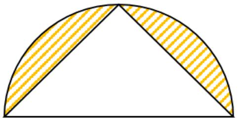

## Arsip Soal OSN Matematika SD/MI Tingkat Kabupaten Tahun 2009

Disusun oleh Tim OSN Provinsi Kalimantan Barat 

Diunduh melalui situs mathcyber1997.com 

## I. Bagian Tes 1

1. Hasil dari (321 ÷ 0, 5) × 15 adalah · · · · 

2. Jika $6 a + { \frac { 1 } { 3 } } - 2 a - { \frac { 2 } { 3 } } = 1$ , maka nilai a yang tepat adalah 

3. Sebuah kerucut memiliki panjang diameter yang sama dengan tingginya, yaitu 14 cm. Volume kerucut tersebut sama dengan $\cdots ~ \mathrm { c m ^ { 3 } }$ . 

4. Berat badan Ahmad 4p kg, Bahari $7 p$ kg, dan Cahyo $7 p$ kg. Rata-rata berat badan mereka bertiga adalah · · · · 

5. Ayah ingin memberi nama kepada adik dengan menggunakan tiga huruf, yaitu A-I-S. Berapa banyak nama adik yang mungkin dipilih dari tiga huruf itu? 

6. Hasil penjumlahan semua bilangan prima antara 10 dan 30 adalah · · · · 

7. Tanggal 13 Maret 2009 adalah hari Jumat. Seratus hari kemudian dari tanggal tersebut adalah hari · · · · 

8. Ayah memiliki 10 lembar uang ratusan ribu rupiah, 7 lembar uang lima puluh ribuan rupiah, dan 7 koin uang seratusan rupiah. Jumlah keseluruhan uang ayah adalah 

9. Sebuah drum berisi air $\frac { 3 } { 5 }$ bagian. Jika 32, 4 liter air diambil dalam drum, maka air yang tersisa sekarang adalah 42, 6 liter. Berapa liter kapasitas drum tersebut? 

10. Suatu persegi dan segitiga sama sisi memiliki panjang sisi yang sama. Perbandingan luas antara persegi dan segitiga tersebut adalah · · · · 

11. Ibu membeli 4 kg apel seharga Rp80.000,00. Ibu menjual lagi dengan harga Rp6.000,00 untuk setiap ${ \frac { 1 } { 4 } } \mathrm { k g }$ . Berapa rupiah keuntungan yang diperoleh ibu? 

12. Jumlah lima bilangan asli berurutan adalah 350. Bilangan terkecil dari kelima bilangan itu adalah · · · · 

13. Diberikan barisan bilangan berikut. 1, 1, 2, 3, 5, 8, , 21 Bilangan pada kotak di atas adalah · · · · 

14. Hari ini usiaku $\frac 1 4$ kali usia ayahku. Delapan tahun mendatang, usiaku $\frac 1 3$ kali dari usia ayahku. Berapa usiaku saat ini? 

15. Jika ${ \frac { 2 } { 7 } } + { \frac { 7 } { 2 } } = { \frac { 1 } { m } } - { \frac { 3 } { 4 } } .$ , maka nilai m adalah · · · · 

<table><tr><td></td></tr><tr><td></td></tr><tr><td></td></tr><tr><td></td></tr><tr><td></td></tr><tr><td></td></tr><tr><td></td></tr><tr><td></td></tr></table>

16. Angka satuan dari $3 ^ { 1 2 1 }$ adalah · · · · 

17. Jika suatu bilangan dikalikan 4 dan dikurangi dengan 8, lalu dibagi 5 menghasilkan bilangan 4, maka bilangan itu adalah · · · · 

18. Jumlah dua bilangan positif adalah 15 dan selisih dua bilangan itu adalah 1. Masing-masing dari bilangan itu adalah · · · · 

19. Tentukan nilai P jika 20% dari setengah P adalah 10.000. 

20. Harga sebotol soda adalah Rp2.500,00. Dalam satu peti terdapat 48 botol. Mobil Pak Ahmad membawa 12 peti yang berisi botol-botol soda. Berapa harga total seluruh botol soda itu? 

21. Sebuah kubus memiliki diagonal bidang (sisi) dan diagonal ruang. Banyaknya diagonal bidang dan diagonal ruang yang dimiliki kubus berturut-turut adalah · · · · 

22. Gambar di bawah adalah dua lingkaran kongruen berdiameter 20 cm. Luas daerah yang diarsir adalah $\cdot \cdot \cdot \mathrm { c m } ^ { 2 } ( \pi = 3 , 1 4 )$ . 

23. Perhatikan diagram batang yang menunjukkan cara siswa menuju ke sekolah berikut. 

Berdasarkan diagram itu, sebagian besar siswa datang ke sekolah menggunakan cara · · · · 

24. Harga 8 gelas adalah Rp100.000,00. Harga 1, 5 lusin gelas yang sama adalah · · · · 

## II. Bagian Tes 2

1. Umur Pak Joko 4 kali umur anaknya. Enam tahun mendatang, umur Pak Joko akan menjadi 3 kali dari umur anaknya. Berapa tahun umur Pak Joko saat ini? 

2. Ari berlatih bulu tangkis setiap 4 hari sekali dan Idang setiap 5 hari sekali. Pada tanggal 15 April mereka berlatih bersama-sama. Pada saat mereka seharusnya bersama latihan lagi, Ari tidak datang latihan dikarenakan sakit. Berikutnya pada tanggal berapa mereka akan berlatih bersama-sama lagi? 

3. Sebuah bak mandi berbentuk balok berukuran panjang 1, 2 m, lebar 8 dm, dan kedalamannya 100 cm. Di dalamnya telah terisi air setinggi 4 dm. Berapa liter air yang diperlukan untuk memenuhi bak mandi tersebut? 

4. Tentukan angka ke-2008 dari bentuk pecahan desimal $\frac { 1 } { 1 7 }$ . 

5. Toriq naik komidi putar yang berdiameter 15 m. Jika komidi putar tersebut berputar selama 7 kali, berapa meter jarak yang ditempuh Toriq? 

6. Seekor anjing beratnya 2 kali lipat dari seekor kucing. Diketahui seekor monyet beratnya 5 kali lipat dari anjing itu. Jika total berat anjing dan kucing adalah 12 kg, maka berat seekor monyet adalah · · · · 

7. Harga 1 kg kambing senilai 250% dari harga 1 kg ayam. Ayah membeli 2 kg kambing dan 3 kg ayam dengan harga Rp160.000,00. Berapa rupiah harga masing-masing dari 1 kg ayam dan 1 kg kambing? 

8. Pak Saleh membayar Rp20.000,00 untuk membeli sebuah jam tangan. Dia dapat menjual jam tangan tersebut dengan harga senilai Rp225.000,00. Berapa persen keuntungan yang diperolehnya? 

9. Sebuah bola pingpong jatuh dari ketinggian 1 meter dan selalu memantul kembali secara vertikal dengan ketinggian 50% dari semula. Tentukan total jarak lintasan yang ditempuh bola pingpong setelah pantulan keempat dalam satuan meter. 

10. Sehelai kain memiliki panjang 512 cm dan dibuat menjadi 6 kali lipatan. Panjang lipatan terakhir dalam satuan sentimeter adalah · · · · 

11. Jika panjang jari-jari setengah lingkaran berikut adalah r, tentukan luas daerah yang diarsir. 

Kunjungi mathcyber1997.com untuk mendapatkan arsip soal lainnya 