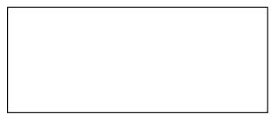
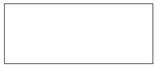
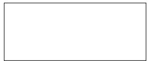
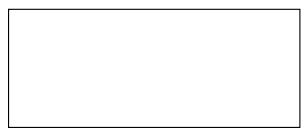
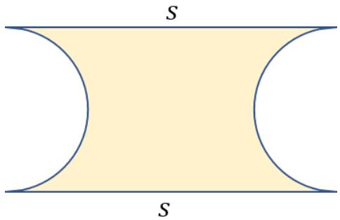
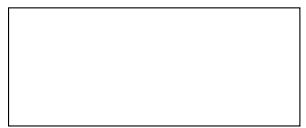
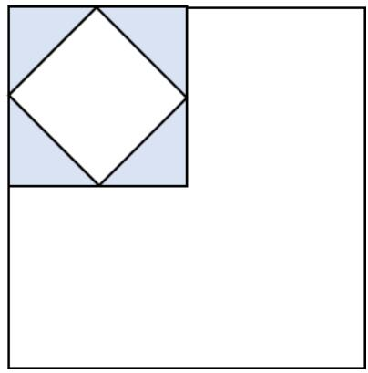
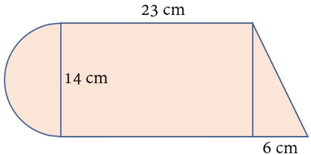

## Arsip Soal OSN Matematika SD/MI Tingkat Kabupaten Tahun 2010

Disusun oleh Tim OSN Provinsi Kalimantan Barat 

Diunduh melalui situs mathcyber1997.com 

## I. Bagian Tes 1

1. Hasil dari $( 1 0 1 \div 0 , 0 1 ) \times 1 \frac { 3 } { 4 }$ adalah · · · · 

2. Nilai a yang memenuhi persamaan 0, $3 a - 3 0 = 0 , 3 + 1$ , 2a adalah · · · · 

3. Hasil dari 13.579 × 99.999 adalah · · · · 

4. Dua bilangan yang rumpang pada barisan berikut adalah 

1, $1 0 , 1 1 , 1 0 0 , \cdots , \cdots , 1 1 1 , 1 0 0 0$ 

5. Bentuk pecahan biasa dari 0, 123123123 · · · adalah · · · · 

6. Seorang penjual mangga berhasil menjual $\frac { 2 } { 5 }$ bagian dari dagangannya. Di antara yang belum terjual, ada $\frac { 1 } { 8 }$ bagian yang busuk. Banyak mangga yang masih baik dan belum terjual adalah · · · bagian. 

7. Lambang bilangan Romawi untuk 1949 adalah · · · · 

8. Banyak sisi yang dimiliki sebuah lingkaran adalah · · · · 

9. Jika $a : b = 2 : 3$ , maka $\left( 2 a - { \frac { 1 } { 3 } } b \right) : \left( 0 , 5 b - { \frac { 1 } { 3 } } a \right)$ sama dengan · · · · 

10. Harga sepeda motor jenis A lebih murah 20% dari harga sepeda motor jenis B. Jika harga sepeda motor jenis A adalah Rp11.200.000,00, maka harga sepeda motor jenis B adalah · · · · 

11. Rata-rata hitung dari x dan 4x adalah 20. Nilai x sama dengan · · · · 

12. Berat badan ibu 55 kg dan berat badan ayah 70 kg. Berat badan ayah, ibu, dan adik totalnya 1, 4 kuintal. Berat badan adik adalah · · · kg. 

13. KPK dan FPB dari 28, 36, dan 40 berturut-turut adalah 

14. Seutas tali dipotong tepat di tengah dan sebagian digunakan. Sebagian yang lain dipotong lagi di tengahnya untuk digunakan. Jika panjang yang tersisa 8 meter, maka panjang tali mula-mula adalah · · · meter. 

15. Fera piket di kelasnya 3 hari sekali. Dian piket di kelasnya 4 hari sekali. Rizki piket di kelasnya 5 hari sekali. Jika mereka bersama-sama piket pada tanggal 10 Januari 2010, maka mereka akan piket bersama lagi pada tanggal · · · · 

16. Nilai rata-rata 16 bilangan adalah 19, sedangkan nilai rata-rata 9 bilangan lain adalah 16. Dengan demikian, nilai rata-rata dari 25 bilangan tersebut adalah · · · · 

17. Pak Darwin membeli dua kodi kain sarung seharga Rp480.000,00. Kain itu kemudian dijual dengan harga Rp15.000,00 per lembar. Keuntungan yang diperoleh Pak Darwin sebesar · · · %. 

18. Jumlah 25 bilangan asli pertama, yaitu 1+2+3+· · ·+25, adalah 325. Jumlah 25 bilangan asli berikutnya, yaitu 26 + 27 + 28 + · · · + 50, adalah · · · · 

19. Roni membeli gawai di toko A dan mendapat diskon 30%. Setahun kemudian, Roni menjual gawai tersebut kepada temannya seharga Rp700.000,00 atau senilai 50% dari harga pembelian. Harga gawai tersebut mula-mula sebelum terkena diskon di toko A adalah · · · · 

20. Ukuran penampang kertas photocopy jenis F4 (folio) adalah 215 mm × 330 mm. Jika 1 rim kertas F4 disusun merata, maka luas persegi panjang yang terbentuk adalah · · · · 

21. Diketahui kubus ABCD.EF GH dengan titik sudut A, B, C, D, E, F, G, dan H. Jarak dua titik terpanjang dari bangun ruang itu adalah · · · · 

22. Perhatikan gambar berikut. 

Jika s = 4r dengan r sebagai panjang jari-jari lingkaran, yakni 10 cm, maka luas daerah yang diarsir adalah $\cdot \cdot \cdot ( \pi = 3 , 1 4 )$ . 

23. Ayah memiliki angka 1, 3, 7, dan 9 untuk dijadikan nomor pelat kendaraan bermotor yang terdiri dari 4 angka. Ayah tidak menginginkan angka yang sama muncul kembali. Banyak nomor pelat yang dapat dibuat adalah · · · · 

24. Minimal ukuran kain yang diperlukan untuk menutupi setengah bola berdiameter 14 cm adalah · · · cm2. 

25. Rata-rata ulangan matematika untuk 15 orang siswa adalah 7, 2. Setelah nilai siswa ke-16 diikutkan, nilai rata-ratanya berubah menjadi 7, 0. Nilai ulangan matematika siswa ke-16 tersebut adalah · · · · 

## II. Bagian Tes 2

1. Carilah nilai bilangan asli m yang memenuhi persamaan ${ \frac { 2 } { 7 } } + { \frac { 1 } { 2 } } = 2 { \frac { 1 } { m } } - { \frac { 1 } { 4 } } .$ 

2. Berapakah harga yang harus dipasang untuk menjual buku yang harga belinya Rp12.000,00 supaya dapat memberikan potongan harga 20%, namun masih mendapat laba 25%? 

3. Sebuah kotak plastik berbentuk kubus terbuka mempunyai panjang rusuk 90 cm dan terisi penuh dengan air. Air dari kotak dituangkan semuanya ke dalam kotak plastik lain berbentuk balok yang memiliki ukuran panjang 90 cm dan lebar 80 cm. Tentukan tinggi kotak plastik berbentuk balok tersebut jika 80% air dari banyak air di kotak plastik berbentuk kubus sudah cukup untuk memenuhi kotak plastik berbentuk balok. 

4. Terdapat 1 rim kertas ukuran A4 yang sampul kertasnya bertuliskan A4, 210 × 297 mm, 500 sheets, dan 70 GSM. Tentukan berat bersih 1 rim kertas tersebut. (70 GSM = 70 gram setiap m2) 

5. Keliling sebuah persegi panjang adalah 234 cm. Ukuran panjangnya adalah 4 kali lebarnya ditambah 2 cm. Tentukan luas persegi panjang itu. 

6. Pembilang dan penyebut sebuah pecahan berjumlah 48. Dua kali pembilang dikurangkan penyebut menghasilkan 3. Tentukan pecahan yang dimaksud. 

7. Ari membaca buku dari halaman 58 sampai halaman 98. Putri membaca dari halaman 12 sampai 45. Reni membaca dari halaman 456 sampai 562. Tentukan banyak halaman yang dibaca oleh mereka bertiga secara keseluruhan. 

8. Pada saat berlibur, Pak Sunaryo membawa sejumlah uang. Pada hari pertama, ia menghabiskan Rp120.000,00, lalu ia menghabiskan setengah dari sisa uangnya pada hari kedua. Jika sekarang tersisa Rp300.000,00, maka berapakah uang Pak Sunaryo mula-mula? 

9. Perhatikan gambar berikut. 

Tentukan perbandingan luas daerah yang diarsir terhadap luas keseluruhan bangun datar. 

10. Juragan Ahmad memiliki kebun berbentuk persegi panjang dengan ukuran lebar 12 meter dan panjang 19 meter. Tanah kebun itu dicangkul oleh pekerja dengan upah Rp15.000,00 untuk setiap 15 m2. Berapa uang yang harus dikeluarkan Juragan Ahmad untuk mencangkul seluruh tanah di kebunnya? 

11. Hitunglah luas bangun datar gabungan berikut. 

Kunjungi mathcyber1997.com untuk mendapatkan arsip soal lainnya 