## Arsip Soal OSN Matematika SD/MI Tingkat Kabupaten Tahun 2011

Disusun oleh Tim OSN Provinsi Kalimantan Barat 

Diunduh melalui situs mathcyber1997.com 

## I. Bagian Tes 1

1. Hasil dari $( 1 , 5 \times 2 5 0 \% ) \div \frac { 1 } { 8 } \mathrm { a d a l a h } \cdots .$ 1 

2. Sebuah bola memiliki panjang diameter yang sama dengan panjang rusuk suatu kubus. Perbandingan luas permukaan bola dan luas permukaan kubus adalah · · · · 

3. Pecahan biasa paling sederhana dari 0, 3323232 · · · adalah · · · · 

4. Jumlah semua bilangan prima dari 50 bilangan asli pertama adalah · · · · 

5. Bonar membelanjakan $\frac { 1 } { 5 }$ dari jumlah uangnya, kemudian ia belania lagi 50% dari sisanya. Sekarang uang Bonar tinggal Rp120.000,00. Uang Bonar mula-mula adalah 

6. Jika 8 pekerja mampu menggarap 80 hektar dalam waktu 24 hari, maka dalam waktu 30 hari kelompok pekerja tersebut dapat menggarap lahan seluas · · · hektar. 

7. Keliling sebuah persegi adalah 60 cm. Jika setiap sisinya bertambah panjang sebesar 60%, maka kelilingnya sekarang adalah · · · cm. 

8. Kerucut memiliki sisi sebanyak · · · buah. 

9. Jika panjang diagonal bidang sebuah kubus adalah $2 \sqrt { 2 }$ cm, maka panjang diagonal ruangnya adalah · · · cm. 

10. Harga sebuah baju adalah 70% dari harga sebuah celana. Harga celana Rp120.000,00 lebih mahal daripada baju. Harga celana itu adalah · · · · 

11. Bangun pada gambar dibentuk dari dua buah persegi. Luas gabungannya adalah $1 0 0  { \mathrm { ~ \textrm ~ { ~ ~ } ~ } }  { \mathrm { c m } } ^ { 2 }$ . Panjang masing-masing sisi persegi tersebut berupa bilangan bulat. Keliling bangun itu adalah · · · cm. 

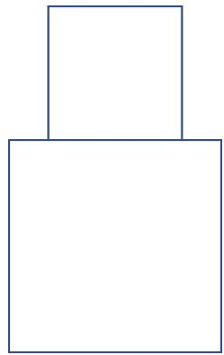

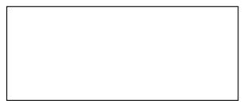

12. Dari jajar genjang pada gambar di bawah, diketahui $A B = 3$ cm dan $A D = 5$ cm. Berapakah panjang AC? 

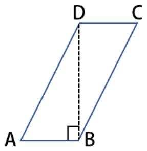

13. KPK dari 24, 42, dan 54 adalah · · · · 

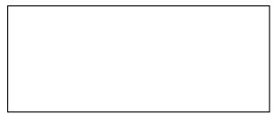

14. Tinggi rata-rata dari 4 batang pohon adalah 17 m 6 cm. Bila batang pohon kelima diikutkan, maka tinggi rata-ratanya menjadi 14 m 20 cm. Tinggi batang pohon kelima adalah · · · cm. 

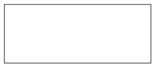

15. Berat dari 8 karung gandum dan 3 karung beras adalah 229, 5 kg. Setiap karung gandum tiga kali beratnya dari sekarung beras. Selisih berat sekarung gandum dan sekarung beras adalah · · · kg. 

16. Dua per tiga dari peserta suatu lomba lari adalah laki-laki. Setengah dari jumlah peserta wanita tidak mencapai garis finish. Banyak peserta wanita yang mencapai finish adalah 1.200 orang. Jumlah seluruh peserta lomba lari itu adalah · · · orang. 

17. Volume sebuah gelas adalah 330 ml. Volume sebuah botol adalah tiga kali lipat dari volume gelas itu. Jumlah volume dari 3 gelas dan 2 botol adalah · · · ml. 

18. Sebuah kendaraan melaju dengan kecepatan 85 km/jam. Jarak yang ditempuh olehnya selama $\frac { 1 } { 2 }$ menit adalah · · · km. 

19. Panjang suatu jalan adalah $2 \frac 1 4$ km. Setiap 50 m akan didirikan tiang listrik di tepi jalan itu. Tiang listrik yang dibutuhkan sebanyak · · · · 

20. Dua puluh persen dari uang Rodhi adalah Rp17.500,00. Seperempat dari uangnya digunakan untuk membeli buku. Sisa uang Rodhi adalah · · · · 

21. Volume kubus pertama delapan kali volume kubus kedua. Perbandingan panjang rusuk kubus pertama dan kedua adalah · · · · 

22. Empat liter bensin dapat digunakan untuk menempuh jarak 64 km. Untuk menempuh jarak 112 km, diperlukan bensin sebanyak · · · liter. 

23. Panjang jari-jari sebuah roda adalah 17, 5 cm. Roda itu menggelinding di jalan sepanjang 275 m. Roda tersebut telah berputar sebanyak · · · kali. 

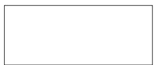

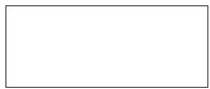

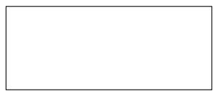

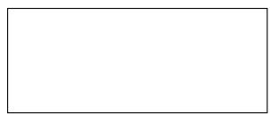

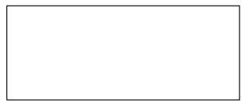

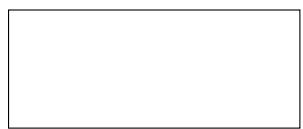

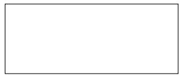

24. Sebuah barang mempunyai berat bruto 250 kg dan tara 5%. Barang itu dijual dengan Rp10.000,00 tiap 1 kg neto dan memperoleh keuntungan sebesar Rp1.000.000,00. Harga beli rata-rata per kilogram barang tersebut adalah 

25. Hasil dari 1, 5 kuintal + 2, 5 ons + 1, 5 ton adalah · · · kg. 

## II. Bagian Tes 2

1. Sebuah taman berbentuk setengah lingkaran dengan luas 100, 48 $\mathrm { c m ^ { 2 } }$ . Tentukan panjang jari-jari taman tersebut. 

2. Segitiga ABC adalah segitiga sama kaki. Jika besar salah satu kaki sudutnya $7 5 ^ { \circ }$ , maka tentukan besar sudut yang lainnya. 

3. Suatu keluarga tiap hari memerlukan air sebanyak 65 liter. Jika keluarga tersebut terdiri atas 5 orang dan kebutuhan air mereka sama, maka tentukan air yang dibutuhkan tiap orang dalam waktu 24 hari. 

4. Tentukan angka satuan dari $7 ^ { 3 0 }$ . 

5. Banyaknya siswa kelas 7B SMPN X Ponorogo adalah 45 orang. Banyak siswa putra sama dengan 4 kali banyak siswa putri. Jika beberapa siswa putri izin mengikuti rapat OSIS, maka dalam kelas tersebut banyak siswa putra menjadi 6 kali banyaknya siswa putri. Tentukan banyak siswa putri yang mengikuti rapat OSIS. 

6. Sebuah trapesium sama kaki ABCD memiliki besar sudut BAD 60◦. Tentukan besar tiga sudut lainnya. 

7. Harga baju di suatu toko adalah Rp120.000,00, tetapi karena ada diskon, pembeli hanya perlu membayar Rp100.000,00. Berapa persen diskon harga baju itu? 

8. Sebuah layang-layang dibentuk dari dua segitiga sama kaki, yang masing-masing panjang kakinya 5 cm dan 10 cm. Tentukan ukuran diagonal terpanjang dari layang-layang tersebut jika diagonal terpendek memiliki panjang 8 cm. 

## Kunjungi mathcyber1997.com untuk mendapatkan arsip soal lainnya