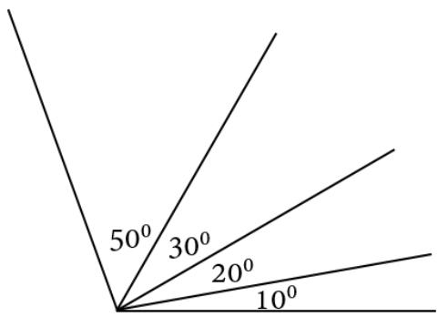
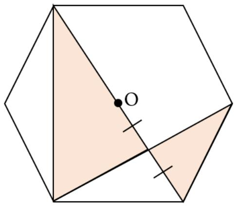

## Arsip Soal OSN Matematika SD/MI Tingkat Kabupaten Tahun 2018

Diunduh melalui situs mathcyber1997.com 

## I. Bagian Tes 1

1. Hasil dari $1 0 \times 9 \div 6 + 8 \times 5 \div 4 - 7 \times 3 \div 1$ adalah · · · · 

2. Tiga bilangan memiliki selisih yang sama antara dua bilangan yang berurutan. Jumlah ketiga bilangan itu 24 dan hasil kalinya 384. Ketiga bilangan itu adalah 

3. Jumlah angka-angka dari hasil $6 6 6 . 6 6 6 ^ { 2 } \ : - \ : 3 3 3 . 3 3 3 ^ { 2 }$ adalah · · · · 

4. The value of ${ \frac { 1 } { 6 } } + { \frac { 1 } { 1 2 } } + { \frac { 1 } { 2 0 } } + { \frac { 1 } { 3 0 } }$ is 

5. Jika 12, 5% dari (N − 2) adalah 412, 5%, maka nilai $N = \cdots$ 

6. Andi mempunyai beberapa kelereng. Dia memberikan kepada Bobi $\frac 1 3$ bagian dan Soni $\frac { 2 } { 5 }$ bagian. Setelah itu, 2 butir kelereng milik Andi hilang dan sekarang tersisa 14 butir. Berapa jumlah kelereng Andi mula-mula? 

7. Apakah pernyataan berikut bernilai benar atau salah? Luas persegi panjang selalu lebih besar dari luas persegi 

8. Panjang diameter suatu bola sama dengan panjang diameter dan tinggi suatu tabung. Perbandingan volume tabung dan volume bola adalah · · · · 

9. Pada sebuah persegi panjang, kedua sisi yang sejajar diperbesar 25%. Agar luas bangun tersebut tidak berubah, besar persentase pengecilan ukuran panjang sisi-sisi yang lain adalah · · · · 

10. Terdapat lima siswa yang ingin membentuk kelompok yang terdiri dari tiga siswa. Banyak kelompok berbeda yang dapat dibentuk adalah · · · · 

11. Perhatikan gambar berikut. 

Banyak sudut dengan ukuran yang berbeda pada gambar di atas adalah · · · · 

12. Satu juta miligram setara dengan · · · kilogram. 

13. Diketahui $a = 2 ^ { 7 8 }$ dan $b = 3 ^ { 6 5 }$ . Bagaimana hubungan ketaksamaan a dan b? Pilih $a < b$ atau $a > b .$ . 

14. Hasil penjumlahan tiga bilangan asli adalah 547. Nilai maksimum dari bilangan terkecilnya adalah · · · · 

15. Bilangan bulat yang paling mendekati rata-rata dari semua bilangan prima yang kurang dari 30 adalah · · · · 

16. Keliling dari suatu persegi panjang adalah 98 cm. Jika ukuran panjangnya tiga kali dari lebarnya ditambah lima, maka luas persegi paniang tersebut adalah $\cdots \mathrm { c m ^ { 2 } }$ . 

17. There are 4 integers: 2.100.000.472; 2.300.000.104; 1.100.300.002; and 1.230.900.534. Which number is divisible by 6? 

18. Tono membelanjakan $\frac { 3 } { 7 }$ bagian dari uangnya, lalu membelanjakan lagi sebanyak setengah bagian dari sisa uangnya. Sekarang uang Tono tersisa Rp22.000,00. Berapa rupiah uang Tono mula-mula? 

19. 40% dari 1 hari setara dengan · · · jam · · · menit. 

20. Banyaknya angka 1 yang diperlukan untuk menulis bilangan dari 1 sampai 200 adalah · · · · 

## II. Bagian Tes 2

1. Tentukan hasil dari 

$$
\frac {1}{2} + \left(\frac {1}{3} + \frac {2}{3}\right) + \left(\frac {1}{4} + \frac {2}{4} + \frac {3}{4}\right) + \dots + \left(\frac {1}{4 0} + \frac {2}{4 0} + \frac {3}{4 0} + \dots + \frac {3 8}{4 0} + \frac {3 9}{4 0}\right).
$$

2. Jika ${ \frac { 3 } { A } } + 5 \div { \frac { 2 } { 7 } } = 4$ , maka tentukan nilai A. 

3. Tentukan nilai x yang memenuhi persamaan 

$$
\left(\left(\sqrt {1 + \sqrt {x + 4}}\right) \times \frac {1}{3}\right) \div \frac {1}{5} = 1 0.
$$

4. Berat rata-rata 3 buah kotak adalah 42 kg. Berat kotak A tiga kalinya dari berat kotak B. Berat kotak B setengah kalinya dari berat kotak C. Berapa kg berat kotak B? 

5. Bangun datar berikut adalah segi-6 beraturan dengan O sebagai titik pusatnya. Berapa bagian luas daerah yang diarsir dari segi-6 tersebut? 

6. The length of the longer sides of a rectangle is 3 times the length of the shorter sides. If the perimeter is 72 cm, what is the length of its shorter side? 

Kunjungi mathcyber1997.com untuk mendapatkan arsip soal lainnya 