## Arsip Soal KSN Matematika SD/MI Tingkat Kabupaten Tahun 2020

Diunduh melalui situs mathcyber1997.com 

1. Balok kayu berukuran 20 cm × 10 cm dengan panjang 1, 5 m berjumlah 9 batang akan diikat seperti tampak pada gambar berikut. 

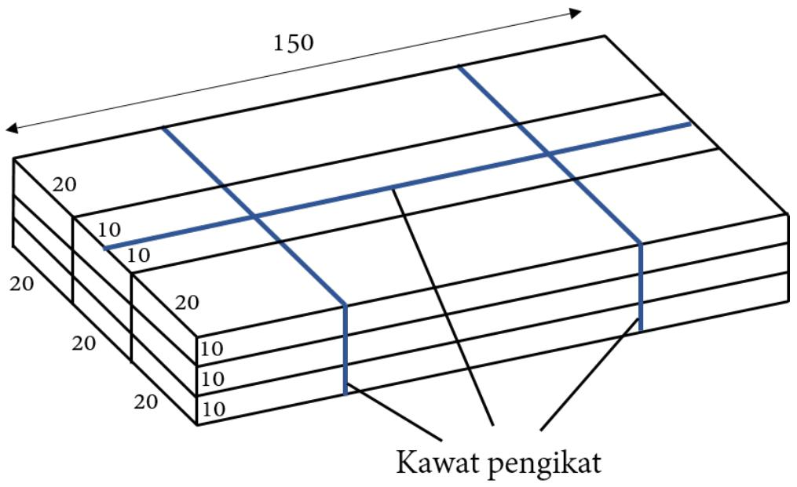

Jika masing-masing ikatan kawat diperlukan kelebihan panjang 5 cm untuk dililit, maka panjang kawat yang dibutuhkan untuk mengikat kayu adalah · · · cm. 

2. Sebuah meja belajar berbentuk segienam dapat dipasang 6 kursi. Jika dua meja dirapatkan, maka dapat dipasang 10 kursi. Jika tiga meja dirapatkan, maka dapat dipasang 14 kursi, dan seterusnya seperti diilustrasikan pada gambar di bawah. 

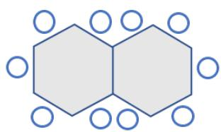

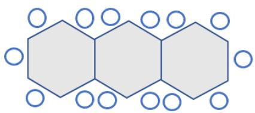

Di sekolah Rini terdapat 10 meja segienam. Jika semua meja dipasang dan dirapatkan memanjang, maka banyak kursi maksimal yang dapat dipasang adalah · · · buah. 

3. Ani dan Budi akan pergi membeli buku di toko Pak Dirman dengan naik sepeda. Sepeda Budi melaju dengan kecepatan rata-rata 30 km/jam dan sampai di toko Pak Dirman dalam waktu 15 menit, sedangkan Ani hanya mampu mengayuh sepeda dengan kecepatan rata-rata 25 km/jam. Waktu yang digunakan Budi untuk menunggu Ani adalah · · · menit. 

4. Doni, Joko, Gonta, dan Peter bermain matematika. Setiap anak menuliskan sebuah bilangan pecahan positif dalam tiga kertas berbeda, kemudian memberikannya kepada tiga temannya. Aturan mainnya adalah menjumlahkan semua bilangan pecahan yang diterima dan jika jumlahnya tidak bulat, maka harus mengurangi dengan sebuah pecahan positif lain sehingga nilainya bilangan bulat terbesar. Joko menerima bilangan pecahan berikut dari tiga temannya: $2 { \frac { 3 } { 8 } } ; 0 , 1 2 5 ; 2 5 \%$ pecahan yang harus dikurangkan oleh Joko? 

5. Bilangan 9, 10, 11, 12, 13, 14, dan 15 akan diletakkan di ubin segienam seperti pada gambar di bawah ini. 

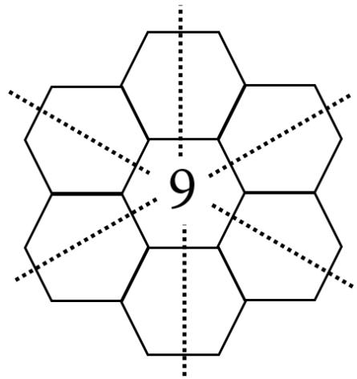

Jumlah tiga bilangan yang terletak di tiga ubin segaris adalah sama. Jumlah tiga bilangan yang memenuhi kondisi tersebut adalah · · · · 

6. Diketahui data jumlah penduduk pada suatu kampung sebagai berikut. 

<table><tr><td>Tahun</td><td>Jumlah Penduduk</td></tr><tr><td>2015</td><td>124</td></tr><tr><td>2016</td><td>140</td></tr><tr><td>2017</td><td>120</td></tr><tr><td>2018</td><td>160</td></tr></table>

Diagram batang yang sesuai dengan tabel di atas adalah · · · · 

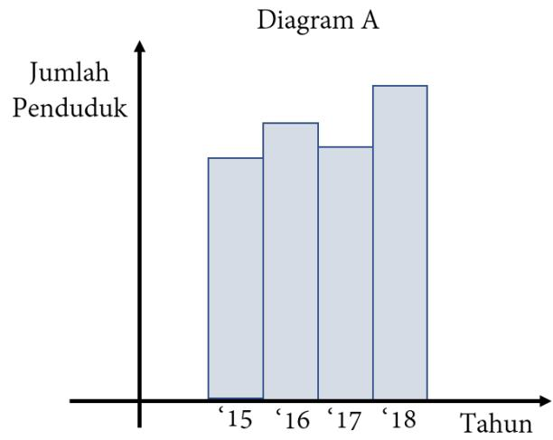

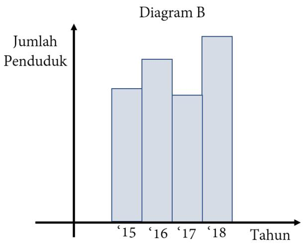

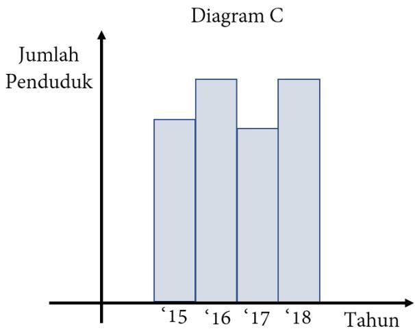

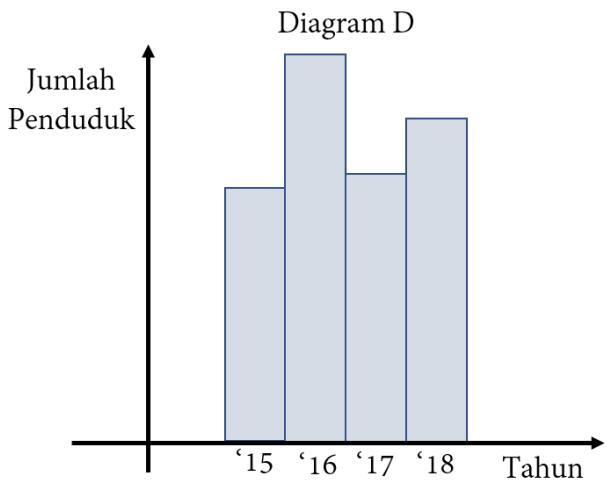

7. Data hasil PAS (Penilaian Akhir Semester) matematika siswa dalam suatu kelompok belajar adalah 7, 8, 5, 6, 7, 9, 9, 7, 8. Modus dari data hasil PAS matematika siswa tersebut adalah · · · · 

8. Isilah petak A, C, dan E dengan bilangan 4, 7, atau 9, sedangkan petak B dan D dengan operasi +, −, ×, atau ÷. 

<table><tr><td>A</td><td>B</td><td>C</td><td>D</td><td>E</td></tr></table>

Jika kelima petak diisi dengan angka dan operasi hitung berbeda, maka nilai minimum hasil operasi hitung pada petak tersebut adalah · · · · Contoh: Bila kelima petak diisi dengan formasi berikut, maka hasil operasinya adalah 2. 

<table><tr><td>4</td><td>+</td><td>7</td><td>-</td><td>9</td></tr></table>

9. Pada gambar berikut, A, C, dan D segaris. Diketahui F E sejajar CD. Bilangan pada ruas garis menyatakan panjang ruas garis tersebut dengan satuan cm. Jika luas daerah ABCDEF adalah 366 cm2, maka panjang CD adalah · · · · 

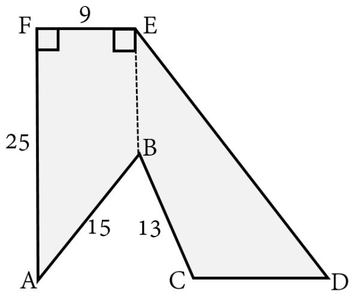

10. Pak Amir membeli rumah di sebuah perumahan. Denah rumah Pak Amir sebagai berikut. 

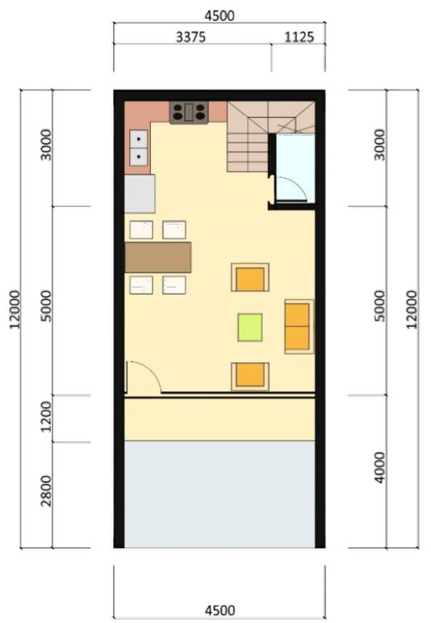

DENAH LT 1

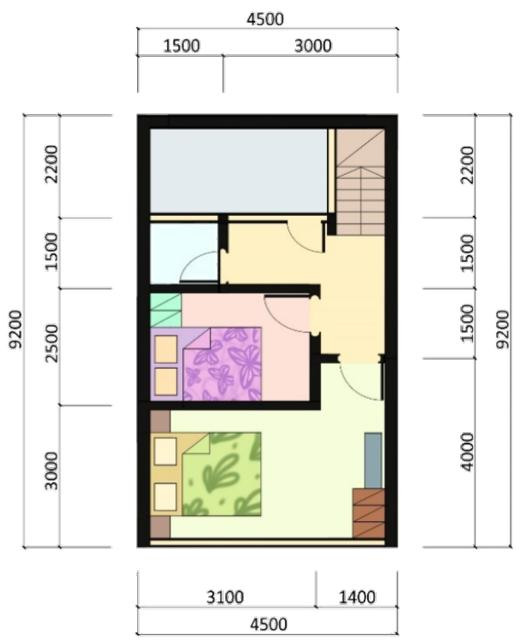

DENAH LT2-

Jika luas bangunan rumah Pak Amir di lantai 1 adalah 36 m2, maka luas bangunan rumah Pak Amir di lantai 2 adalah $\cdots \mathrm { m ^ { 2 } }$ . 

11. Bilangan prima terkecil yang lebih dari 350 adalah · · · · 

12. Diketahui bilangan empat angka ${ \overline { { a b c d } } } \ ( a , b , c ,$ d semuanya bukan nol) dengan FPB dari ab dan bc adalah FPB dari bc dan cd dikurang 2. Bilangan empat angka terkecil dari abcd adalah · · · · 

13. Saat liburan ke Jakarta, Kiara membeli miniatur Monumen Nasional untuk oleh-oleh. Tinggi miniatur adalah 15 cm. Tinggi Monumen Nasional yang sesungguhnya adalah 132 meter. Miniatur monumen yang dibeli oleh Kiara memiliki skala · · · 

14. Data ukuran baju siswa kelas V SDN Cipali dinyatakan oleh tabel berikut. 

<table><tr><td>No.</td><td>Ukuran Baju</td><td>Jumlah Siswa</td></tr><tr><td>1</td><td>XS</td><td>3</td></tr><tr><td>2</td><td>S</td><td>6</td></tr><tr><td>3</td><td>M</td><td>8</td></tr><tr><td>4</td><td>L</td><td>7</td></tr><tr><td>5</td><td>XL</td><td>4</td></tr><tr><td>6</td><td>XXL</td><td>2</td></tr></table>

Diagram lingkarannya adalah sebagai berikut. 

Ukuran Baju Siswa Kelas V SDN Cipali

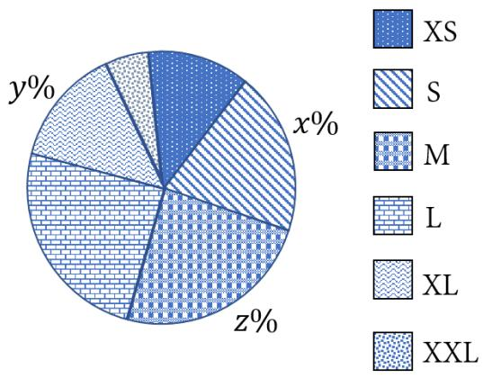

Nilai x + y + z = · · · · 

15. Bilangan palindrom adalah bilangan yang sama jika dibaca dari depan ke belakang atau dari belakang ke depan, misalnya 111, 121, 131, dll. Berapa banyak bilangan palindrom 3-angka yang dapat disusun dari angka 1, 2, 3, 4, 5? 

16. Diketahui sebuah balok ABCD.EF GH dengan $A B = 2 5$ cm, $B C = 2 0$ cm, dan $C G = 1 2 ~ \mathrm { c m }$ . Garis IJ sejajar BC dan KL sejajar EH. Perbandingan panjang $I B : E L$ adalah $1 : 3$ dan panjang $L I = 1 5 \ \mathrm { c m }$ . Volume IBCJ.LF GK adalah $\cdots ~ \mathrm { c m ^ { 3 } }$ . 

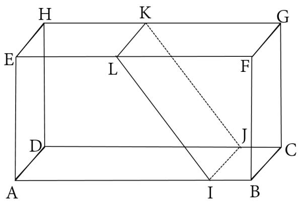

17. Perhatikan barisan bilangan berikut ini: 2, 9, 28, 65, 126, a. Nilai a pada barisan bilangan tersebut adalah · · · · 

18. Tiga buah mesin pompa air M1, M2, dan M3 berbahan bakar bensin mampu beroperasi terus menerus, kecuali saat pengisian bensin. Mesin-mesin tersebut akan dioperasikan untuk mengalihkan aliran air ke saluran pembuangan pengendalian banjir. Mesin M1 diisi bensin setiap 5 jam sekali, mesin M2 diisi bensin setiap 6 jam sekali, sedangkan mesin M3 diisi bensin setiap 11 jam sekali. Setiap waktu pengisian bensin, mesin pompa air berhenti selama 1 jam. Jika mesin-mesin tersebut beroperasi secara bersamaan mulai hari Selasa pukul 07.00 WIB, maka ketiga mesin akan diisi bensin untuk pertama kalinya pada hari · · · pukul · · · WIB. 

19. Rata-rata nilai rapor matematika dari 24 siswa kelas V adalah 7, 6. Rata-rata nilai rapor matematika kelas V setelah 2 siswa pindahan diikutkan berubah menjadi 7, 8. Jumlah nilai rapor matematika 2 siswa pindahan tersebut adalah · · · 

20. Bianca akan membeli 3 jenis anak ikan hias, yaitu Lion Head, Slayer, dan Silver yang masing-masing harganya Rp7.500,00; Rp12.500,00; dan Rp15.000,00. Uang yang dimiliki Bianca sebesar Rp80.000,00. Bianca ingin membeli ikan tersebut dengan total sebanyak 6 ekor dan tidak semua jenis ikan harus dibeli. Banyak cara membeli 6 ikan tersebut agar uangnya tersisa paling sedikit Rp10.000,00 adalah · · · cara. 

## Kunjungi mathcyber1997.com untuk mendapatkan arsip soal lainnya