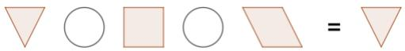
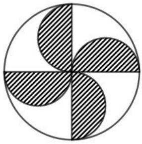
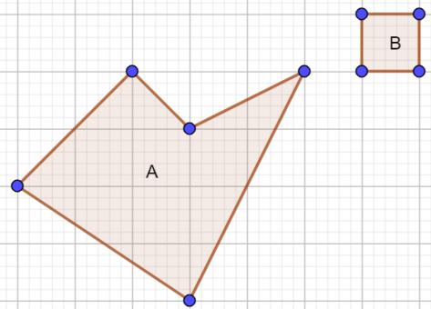
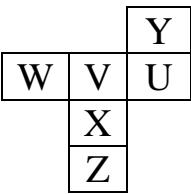
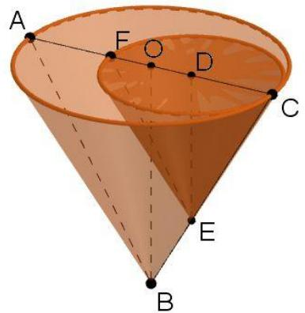
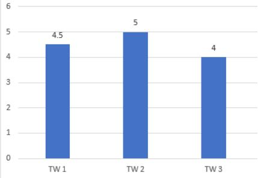
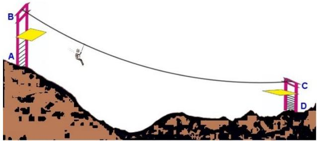
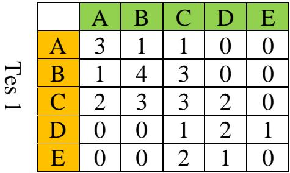
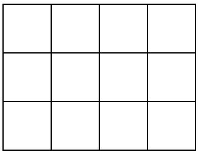
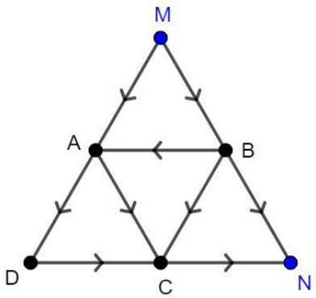

## SOAL OSN JENJANG SEKOLAH DASAR

## BIDANG MATEMATIKA

## TAHUN 2023

<table><tr><td>No</td><td colspan="3">Soal</td></tr><tr><td>1</td><td colspan="3">Misalkan <eq>a</eq> adalah bilangan asli. Faktor Persekutuan Terbesar dari 3 dan <eq>a</eq> adalah 3. Jika Kelipatan Persekutuan Terkecil dari 15 dan <eq>a</eq> adalah 105, maka nilai <eq>a</eq> adalah ....A. 7B. 15C. 21D. 45</td></tr><tr><td>2</td><td colspan="3">The result of 125% <eq>\times \frac{2}{5} \div 0,25 \times 1\frac{1}{4} \div 2,5</eq> is ....A. 0,1B. 0,64C. 1D. 10</td></tr><tr><td>3</td><td colspan="3">Bila <eq>m</eq> dan <eq>n</eq> adalah dua bilangan asli berbeda, maka salah satu hasil operasi <eq>5 \times m + 8 \times n</eq> adalah ....A. 17B. 19C. 39D. 47</td></tr><tr><td>4</td><td colspan="3">Diketahui <eq>q</eq> merupakan bilangan asli. Banyaknya <eq>q</eq> yang memenuhi pertidaksamaan <eq>\frac{21}{135} &lt; \frac{q}{8} &lt; \frac{27}{24}</eq> adalah ....A. 7B. 8C. 9D. 10</td></tr><tr><td>5</td><td colspan="3">Diketahui barisan bilangan<eq>a,b,a+b,a+2b,2a+3b,3a+5b,....</eq>Bila bilangan ke-2 dan ke-9 pada barisan tersebut berturut-turut <eq>74\frac{2}{3}</eq> dan 2023, maka bilangan ke-5 pada barisan tersebut adalah ....A. 246B. 249C. 264D. 294</td></tr><tr><td>6</td><td colspan="3">Jika m merupakan bilangan asli yang bersisa 3 ketika dibagi 4, bersisa 4 ketika dibagi 9, dan bersisa 1 ketika dibagi 3, maka nilai <eq>m - 6</eq> adalah ....A. 25B. 29C. 31D. 34</td></tr><tr><td>7</td><td colspan="3">Perhatikan operasi pengurangan berikut:<eq>\begin{array}{c}9\ 4\ 3\\ \square\ \Delta- \\8\ \Delta\ 4\end{array}</eq>Nilai <eq>\square + \Delta = \cdots</eq>.A. 11B. 12C. 13D. 14</td></tr><tr><td>8</td><td colspan="3">Butet berolahraga selama 1 1⁄4 jam dengan berjalan kaki selama 45 menit dengan kecepatan rata-rata 4 km/jam kemudian dilanjutkan dengan berlari selama 30 menit dengan kecepatan rata-rata 10 km/jam.Jarak yang ditempuh Butet selama berolahraga adalah ... km.A. 5B. 6C. 7D. 8</td></tr><tr><td>9</td><td colspan="3">Sebuah sanggar tari memiliki 40 anggota yang dibagi menjadi 2 kelas. Seluruh anggota akan tampil pada suatu acara dan membutuhkan kostum. Harga sewa kostum untuk kelas A adalah Rp60.000,00/orang dan untuk kelas B adalah Rp70.000,00/orang. Jika total biaya sewa seluruh kostum adalah Rp2.580.000,00 maka total biaya sewa kostum untuk seluruh anggota kelas A adalah ....A. Rp1.080.000,00B. Rp1.260.000,00C. Rp1.320.000,00D. Rp1.380.000,00</td></tr><tr><td>10</td><td colspan="3">Bagiyo, Gito, dan Rio merupakan tiga bersaudara dan memiliki jumlah tabungan yang sama. Bagiyo memberi Gito sebesar <eq>\frac{1}{5}</eq> dari semua tabungannya, kemudian Gito memberi Rio 50% dari semua tabungan yang dimiliki saat ini. Selanjutnya jika Rio memberikan sebesar <eq>\frac{1}{10}</eq> dari semua tabungannya kepada Bagiyo, maka tabungan Bagiyo akan berkurang Rp500.000,00 dari tabungan awal yang dimiliki. Jumlah tabungan yang dimiliki oleh Gito saat ini adalah ....A. Rp2.500.000,00B. Rp7.500.000,00C. Rp12.500.000,00D. Rp18.000.000,00</td></tr><tr><td>11</td><td colspan="3">Perhatikan gambar berikut:Segitiga, persegi dan jajar genjang mewakili bilangan berbeda 1, 2, 3, 4, 5, 6, 7, 8 atau 9. Segitiga di ruas kanan dan kiri merupakan bilangan yang sama. Lingkaran mewakili operasi hitung: tambah, kurang, kali atau bagi. Kedua lingkaran boleh dipasang operasi hitung yang berbeda. Banyak bilangan yang mungkin dipasang pada segitiga adalah ....A. 6B. 7C. 8D. 9</td></tr><tr><td>12</td><td colspan="3">Diberikan empat bilangan bulat positif yang berbeda <eq>A, B, C</eq> dan <eq>D</eq> sehingga <eq>A + B + C + D = 15</eq>.Hasil operasi dari <eq>A \times C + B \times D - A</eq>: <eq>B</eq> sebesar mungkin adalah .... (pembulatan sampai dua angka di belakang koma)A. 32,83B. 33,88C. 36,86D. 37,17</td></tr><tr><td>13</td><td colspan="3">Perhatikan gambar di bawah ini:Gambar di atas terdiri dari satu lingkaran besar dan empat buah setengah lingkaran kecil yang identik.Jika jari-jari lingkaran besar adalah diameter lingkaran kecil, maka perbandingan luas daerah yang diarsir dan yang tidak diarsir pada gambar di atas adalah ....A. 1 : 1B. 2 : 3C. 3 : 4D. 4 : 5</td></tr><tr><td>14</td><td colspan="3">Perbandingan panjang, lebar, dan tinggi suatu balok adalah 1:5:2. Jika luas permukaan balok tersebut <eq>9.826 cm^{2}</eq>, maka volume balok tersebut adalah .... <eq>cm^{3}</eq>.A. 49.013B. 49.130C. 49.301D. 49.310</td></tr><tr><td>15</td><td colspan="3">Look at the following picture.If the area of region A is 2,5 cm2, then the area of region B is ... cm2.A. 20B. 23,75C. 25D. 26,25</td></tr><tr><td>16</td><td colspan="3">Berikut merupakan jaring-jaring suatu kubus.Jika jaring-jaring tersebut dibentuk menjadi kubus, maka sisi Y akan berhadapan dengan sisi ....A. UB. VC.XD.Z</td></tr><tr><td>17</td><td colspan="3">Gambar berikut adalah 2 kerucut. Kerucut besar dengan diameter alas AC dan tinggi OB. Kerucut kecil dengan diameter alas CF dan tinggi DE. ABC dan CEF keduanya segitiga sama sisi dengan AB : CE = 3 : 2. Perbandingan volume kerucut kecil dan kerucut besar adalah ...A. 2 : 7B. 4 : 9C. 5 : 12D. 8 : 27</td></tr><tr><td>18</td><td colspan="3">Dua buah bangun yang berbentuk persegi dan segitiga mempunyai keliling yang sama. Sisi-sisi segitiga tersebut mempunyai panjang 5 cm, 8 cm dan 5 cm. Jumlah luas kedua bangun tersebut adalah ....A. 32B. 32,25C. 32,5D. 32,75</td></tr><tr><td>19</td><td colspan="3">Berikut adalah data penjualan selama triwulan ke-satu (TW 1), ke-dua (TW 2), dan ke-tiga (TW 3) pada tahun 2022 dari suatu pabrik makanan ringan dalam satuan ton.Jika penjualan pada TW 3 merupakan 20% dari total penjualan dalam setahun, maka penjualan makanan ringan tersebut pada TW 4 adalah ... ton.A. 4,5B. 5,5C. 6,5D. 7,5</td></tr><tr><td rowspan="6">20</td><td colspan="3">Data banyaknya kepala keluarga (KK) dan pemilih kepala Desa Taruma Indah pada 4 RW TRIWULANDisajikan sebagai berikut:RW Banyak Kepala Keluarga (KK) Banyak Pemilih</td></tr><tr><td>01</td><td>95</td><td>210</td></tr><tr><td>02</td><td>153</td><td>200</td></tr><tr><td>03</td><td>120</td><td>280</td></tr><tr><td>04</td><td>135</td><td>165</td></tr><tr><td colspan="3">Rata-rata banyak pemilih di setiap RW yang bukan kepala keluarga (KK) adalah ... orang.A. 80B. 85C. 88D. 92</td></tr></table>

<table><tr><td>RW</td><td>Banyak Kepala Keluarga (KK)</td><td>Banyak Pemilih</td></tr><tr><td>01</td><td>95</td><td>210</td></tr><tr><td>02</td><td>153</td><td>200</td></tr><tr><td>03</td><td>120</td><td>280</td></tr><tr><td>04</td><td>135</td><td>165</td></tr></table>

<table><tr><td>No</td><td>Soal</td></tr><tr><td>21</td><td>Pada suatu permainan flying fox, seorang pemain harus menaiki tangga AB kemudian meluncur pada kabel baja BC dan menuruni tangga CD. Tinggi AB dan CD masing-masing 3 meter. David menaiki tangga AB dengan kecepatan 2 meter/menit, meluncur pada BC dengan kecepatan 15 km/jam dan menuruni tangga CD dengan kecepatan 3 meter/menit. Jika waktu yang diperlukan David untuk bermain flying fox adalah 5 menit (dari A ke D), maka panjang kabel baja flying fox adalah ... meter.A. 550B. 575C. 600D. 625</td></tr><tr><td>22</td><td>Hasil penilaian tes matematika yang dilakukan sebanyak dua kali di suatu kelas disajikan sebagai berikut:Tes 2Pada baris A kolom C tertera angka 1, artinya banyaknya siswa yang memperoleh nilai A pada tes 1 dan nilai C pada tes 2 adalah 1 orang. Persentase siswa yang nilainya sama untuk 2 kali tes adalah ....A. 30%B. 40%C. 50%D. 60%</td></tr><tr><td>23</td><td>Benny menyalin data dari hasil survey yang dilakukannya. Karena kurang hati-hati kertas hasil survey terkena air sehingga terdapat sejumlah data yang tidak terbaca. Data yang tidak terbaca diberi simbol dengan huruf. Data yang dituliskan Benny adalah sebagai berikut: 96, A, 64, 78, 78, 90, 60, 60, 70, 80 dan B. Jika median data tersebut adalah 76 dan rata-rata data tersebut adalah 75, maka data yang tidak terbaca adalah ....A. 76 dan 75B. 76 dan 73C. 77 dan 75D. 78 dan 74</td></tr><tr><td>24</td><td>Ati, Bani, dan Cici menabung di Bank M dan N. Perbandingan tabungan Ati, Bani, dan Cici di Bank M adalah 2 : 3 : 5, sementara di Bank N adalah 5 : 4 : 3. Jika tabungan Ati di Bank M sebesar Rp2.400.000,00 dan rata-rata tabungan mereka di Bank N adalah dua kali rata-rata tabungan mereka di Bank M, maka tabungan Ati di Bank N sebesar ....A. Rp8.400.000,00B. Rp10.000.000,00C. Rp10.600.000,00D. Rp12.000.000,00</td></tr><tr><td>25</td><td>Felly berada di toko alat-alat kantor hendak membeli 3 buah buku dan 2 buah bolpoin. Di etalase toko terdapat 5 merek buku dan 7 merek bolpoin, serta tidak ada buku dan bolpoin yang bermerek sama. Berapa banyak pilihan yang dimiliki Felly, jika buku dan bolpoin yang dibeli berasal dari merek yang berbeda?A. 2520B. 840C. 420D. 210</td></tr><tr><td>26</td><td>Banyak cara menyusun tiga bilangan asli dengan susunan genap-ganjil-genap yang hasil kalinya merupakan kelipatan 8 dan kurang dari 30 adalah ....A. 9B. 10C. 11D. 12</td></tr><tr><td>27</td><td>Andika ditugaskan untuk melengkapi huruf-huruf pada petak 3 x 4 berikut.Dalam satu baris, satu kolom, dan satu diagonal yang sama tidak boleh diletakkan huruf yang sama. Minimum banyaknya huruf yang berbeda yang dapat diletakkan pada petak tersebut adalah ... huruf.A. 4B. 5C. 6D. 7</td></tr><tr><td>28</td><td>Banyak bilangan bulat antara 100 sampai 400 yang memuat angka 2 adalah ... bilangan.A. 128B. 136C. 138D. 140</td></tr><tr><td>29</td><td>Berikut peta perjalanan dari 6 kecamatan di suatu kabupaten:Ada berapa rute berbeda yang dapat ditempuh oleh seseorang yang berangkat dari M ke N?A. 9B. 8C. 7D. 6</td></tr><tr><td>30</td><td>Agnes memiliki 5 buah persegi panjang yang masing-masing berukuran 2 cm x 3 cm. Pak guru meminta Agnes untuk membentuk bangun datar baru dengan cara menempelkan sisi-sisi kelima persegi panjang tersebut sehingga sisi yang sama panjang tepat berimpit. Banyak bangun datar dengan keliling berbeda yang dapat dibuat Agnes ada ... bangun.A. 3B. 4C. 5D. 6</td></tr></table>