<table><tr><td>No</td><td>Soal</td></tr><tr><td>1</td><td>Susi mengurutkan bilangan asli terkecil ke terbesar kelipatan 2 dan Wati mengurutkan bilangan asli terkecil ke terbesar kelipatan 3. Jumlah bilangan Susi urutan ke 25 dan bilangan Wati urutan ke 20 adalah ....A. 100B. 110C. 115D. 125</td></tr><tr><td>2</td><td>Diketahui suatu pola berikut ini.■◆◆●▲▲▲■◆◆●▲▲▲....Gambar yang akan tampak pada urutan ke-100 adalah ....A. ■B. ◆C. ●D. ▲</td></tr><tr><td>3</td><td>Bilangan ratusan x dan y dimana x = apc dan y = aqc memenuhi sifat-sifat x - y = 50 dan p + q = 11. Hasil dari p × q = ....A. 24B. 28C. 30D. 50</td></tr><tr><td>4</td><td>Andi mengurutkan bilangan bulat yang bukan prima atau bukan kelipatan 5, dimulai dari besar ke kecil. Jika urutan ke-10 bilangan yang dituliskan oleh Andi adalah 102, maka urutan ke-21 adalah ....A. 83B. 84C. 86D. 87</td></tr><tr><td>5</td><td>Jika <eq>\frac{1}{4} \times \frac{1}{q} - \frac{1}{4} - \frac{1}{q} = \frac{13}{2}</eq>, maka nilai q adalah ....A. -9B. <eq>-\frac{1}{9}</eq>C. <eq>\frac{1}{9}</eq>D. 9</td></tr><tr><td>6</td><td>Jika a dan b bilangan bulat positif yang memenuhi <eq>a^{2} - b^{2} = 6^{3}</eq>, maka nilai berikut yang bukan merupakan hasil dari <eq>a \times b</eq> adalah ....A. 45B. 135C. 315D. 2915</td></tr><tr><td>7</td><td>Tiga bilangan x, y, z merupakan tiga bilangan kelipatan n berurutan (contoh: 6, 8, 10 merupakan bilangan kelipatan 2 berurutan). Jumlah tiga bilangan tersebut adalah 27 dan perkalian bilangan terkecil dan terbesarnya adalah 72. Selisih bilangan terbesar dan terkecil adalah ....A. 2B. 4C. 6D. 8</td></tr><tr><td>8</td><td>Diketahui tiga orang sahabat, yaitu Ani, Budi dan Corry. Diantara ketiganya, Ani paling muda dan Corry paling tua. Usia Ani dan Budi berselisih 1 tahun, sedangkan usia Budi dan Corry berselisih 2 tahun. Empat tahun kemudian jumlah usia mereka 76 tahun. Jumlah usia Ani dan Corry saat ini adalah ... tahun.A. 41B. 42C. 43D. 45</td></tr><tr><td>9</td><td>Pak Joni membeli 13 kg keripik pisang seharga Rp650.000. Keripik pisang dijual kembali dengan harga Rp15.000 per 250 gram. Keuntungan maksimum yang akan diperoleh Pak Joni adalah ....A. Rp100.000B. Rp130.000C. Rp150.000D. Rp180.000</td></tr><tr><td>10</td><td>Naomi, Tori, dan Eksa sedang memainkan suatu permainan dalam 10 babak. Juara ke-1, ke-2, dan ke-3 pada setiap babak akan mendapatkan poin berturut-turut sebesar 5 poin, 3 poin, dan 0 poin. Dari seluruh babak, Naomi memperoleh total poin 28. Berapa kali paling sedikit Naomi menjadi juara ke-3 dari seluruh babak permainan?A. 4 kaliB. 3 kaliC. 2 kaliD. 1 kali</td></tr><tr><td>11</td><td>Hasil operasi dari <eq>((0,4)^6 \times 25^3) + ((0,5)^4 \times 16^3)</eq> adalah ....A. 320B. 312C. 296D. 272</td></tr><tr><td>12</td><td>Diketahui <eq>\frac{3}{4} + \frac{7}{253} = \frac{a}{2024}</eq>. Nilai <eq>a = \dots</eq>A. 787B. 1012C. 1574D. 1724</td></tr><tr><td>13</td><td>Azizah akan mengoperasikan suatu bilangan dengan operasi-operasi berikut: ditambah 2, dibagi 6, dibagi 5, dikurang 3 dan dikali 2.Sebagai contoh: Azizah mengoperasikan bilangan 11, untuk mendapatkan hasil akhir 1 dilakukan operasi sebagai berikut:1) <eq>11 + 2 = 13</eq>;2) <eq>13 - 3 = 10</eq>;3) <eq>10 / 5 = 2</eq>;4) <eq>2 + 2 = 4</eq>;5) <eq>4 - 3 = 1</eq>.Pada contoh tersebut Azizah melakukan sebanyak lima operasi.Jika Azizah mengoperasikan bilangan 122 dan hasil operasi terakhir yang diinginkan adalah 1, maka banyaknya operasi yang paling sedikit dilakukan oleh Azizah adalah ... operasi.A. enamB. tujuhC. sembilanD. sepuluh</td></tr><tr><td>14</td><td>Andika akan membuat kotak donasi untuk mengumpulkan sumbangan. Jaring-jaring kotak donasi tersebut disajikan pada gambar berikut.Kotak donasi yang terbentuk adalah ....A.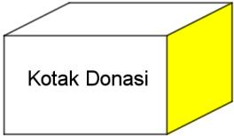B.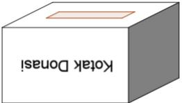C.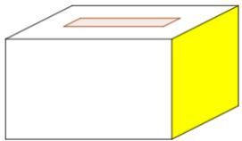D.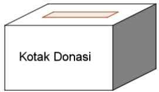</td></tr><tr><td>15</td><td>Limas E.ABCD berikut memiliki alas persegi panjang dengan ukuran CD = 6 cm, AD = 8 cm dan rusuk-rusuk tegak nya 13 cm. Luas segitiga BDE = ... <eq>cm^{2}</eq>.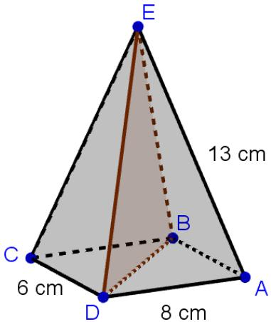A. 24B. 30C. 48D. 60</td></tr><tr><td>16</td><td>Jumlah keliling suatu persegi dan suatu persegi panjang sama dengan tiga kali keliling suatu segitiga sama sisi. Diketahui panjang sisi persegi dan segitiga sama sisi berturut-turut adalah 12 cm dan 10 cm. Jika lebar persegi panjang adalah 9 cm, maka perbandingan lebar dan panjang dari persegi panjang adalah ....A. 2:3B. 1:2C. 1:4D. 3:4</td></tr><tr><td>17</td><td>Perhatikan gambar segitiga sama kaki ABC berikut.Titik <eq>D</eq> berada pada garis <eq>AB</eq>. Panjang t adalah ... satuan panjang.A. <eq>\frac{15}{8}</eq>B. <eq>\frac{24}{5}</eq>C. <eq>\frac{40}{3}</eq>D. 120</td></tr><tr><td>18</td><td>Diketahui tabung A memiliki jari-jari sama dengan tingginya, sedangkan tabung B memiliki jari-jari sama dengan <eq>\frac{3}{4}</eq> tingginya. Jika jari-jari tabung A sama dengan dua kali jari-jari tabung B, maka perbandingan luas selimut tabung A dan tabung B adalah ....A. 2:1B. 3:1C. 4:3D. 3:2</td></tr><tr><td>19</td><td>Perhatikan gambar berikut.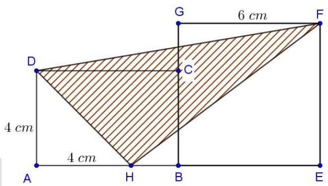ABCD adalah persegi panjang dan BEFG adalah persegi. Jika perbandingan HB : BE = 1:3, maka luas daerah yang diarsir adalah ... cm2.A. 28B. 33C. 38D. 42</td></tr><tr><td>20</td><td>Hasil ujian matematika di suatu kelas yang terdiri dari 20 siswa berada pada interval 56 – 100. Rata-rata seluruh siswa di kelas tersebut adalah 68. Sebanyak 3 siswa mengikuti remedial dengan nilai maksimum 75. Rata-rata tertinggi setelah remedial yang mungkin untuk kelas tersebut adalah ....A. 70,65B. 70,75C. 70,85D. 70,95</td></tr><tr><td>21</td><td>Data banyak penjualan roti A, B, C, D, E dan F dalam dua hari berturut-turut pada suatu toko disajikan pada tabel di bawah ini:</td></tr></table>

<table><tr><td>No</td><td colspan="3">Soal</td></tr><tr><td rowspan="8"></td><td rowspan="2">Roti</td><td colspan="2">Banyak Penjualan (Bungkus)</td></tr><tr><td>Hari I</td><td>Hari II</td></tr><tr><td>A</td><td>12</td><td>8</td></tr><tr><td>B</td><td>24</td><td>18</td></tr><tr><td>C</td><td>15</td><td>10</td></tr><tr><td>D</td><td>19</td><td>13</td></tr><tr><td>E</td><td>16</td><td>20</td></tr><tr><td>F</td><td>18</td><td>8</td></tr><tr><td colspan="4">Grafik rata-rata banyak penjualan keenam roti tersebut adalah ....</td></tr><tr><td colspan="4">A. 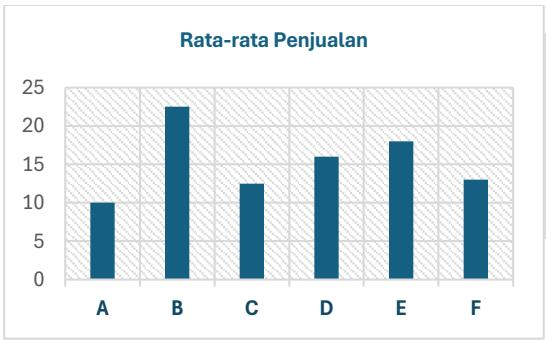</td></tr><tr><td colspan="4">B. 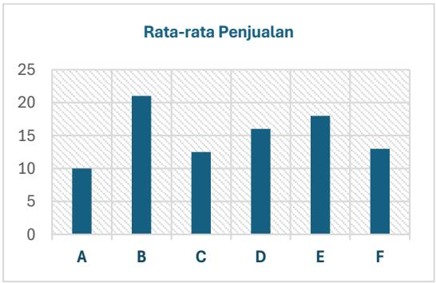</td></tr></table>

<table><tr><td>No</td><td colspan="5">Soal</td></tr><tr><td rowspan="2"></td><td>C.</td><td>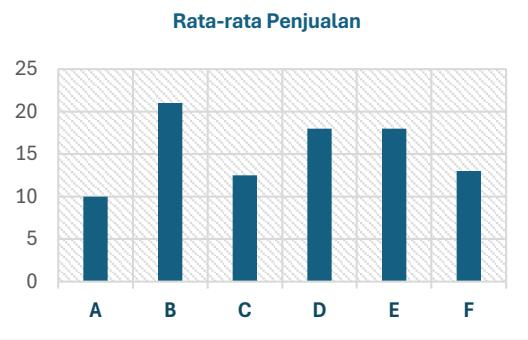</td><td colspan="3"></td></tr><tr><td>D.</td><td>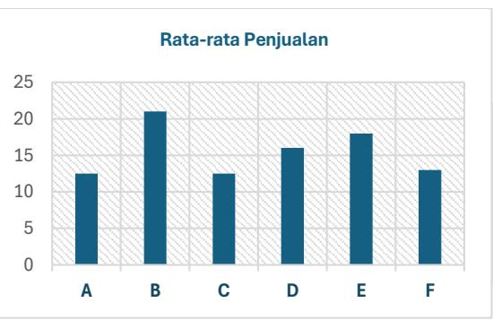</td><td colspan="3">DENTIAL</td></tr><tr><td>22</td><td colspan="5">Dua tim siswa sekolah dasar, yaitu tim A dan tim B, berlomba lari estafet 4 × 100 meter. Lari estafet 4 × 100 meter adalah lomba lari yang diikuti oleh empat pelari pada setiap tim dengan aturan: pelari ke-1 membawa tongkat dan berlari 100 meter, kemudian tongkat diserahkan ke pelari berikutnya yang juga berlari 100 meter dan seterusnya sampai pelari ke-4. Berikut adalah data kecepatan pelari pada perlombaan tersebut.Tim Pelari ke-1 Pelari ke-2 Pelari ke-3 Pelari ke-4A 10 m/menit 10 m/menit 15 m/menit 25 m/menitB 12,5 m/menit 8 m/menit 20 m/menit 20 m/menitSelisih waktu tempuh kedua tim adalah ... detika. 11B. 10C. 9</td></tr></table>

<table><tr><td>Tim</td><td>Pelari ke-1</td><td>Pelari ke-2</td><td>Pelari ke-3</td><td>Pelari ke-4</td></tr><tr><td>A</td><td>10 m/menit</td><td>10 m/menit</td><td>15 m/menit</td><td>25 m/menit</td></tr><tr><td>B</td><td>12,5 m/menit</td><td>8 m/menit</td><td>20 m/menit</td><td>20 m/menit</td></tr></table>

<table><tr><td>No</td><td>Soal</td></tr><tr><td></td><td>D. 8</td></tr><tr><td>23</td><td>Berikut ini adalah pemenang pada lomba Chicago Marathon 2023.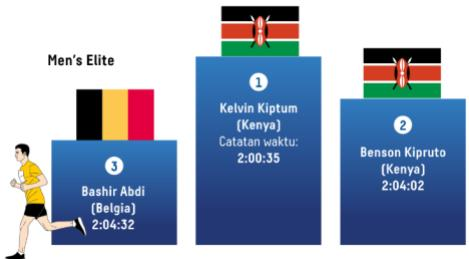Sumber :https://www.kompas.id/baca/riset/2023/10/23/chicago-marathon-2023-merayakan-rekor-baru-duniaPada lomba tersebut, jarak yang harus ditempuh adalah 42 km. Kecepatan rata-rata Kelvin Kiptum pada lomba tersebut mendekati ... meter/detik.A. 5B. 6C. 7D. 8</td></tr><tr><td>24</td><td>Berikut adalah tabel perolehan hasil tes IPA.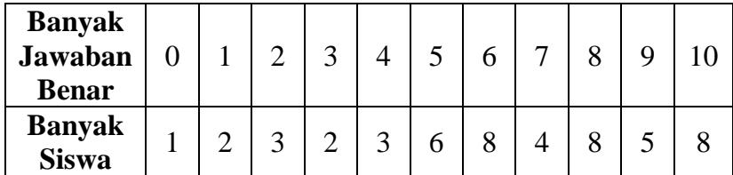Berapa minimal banyak jawaban benar sehingga banyak jawaban benar tersebut melebihi 70% siswa yang lain?A. 7B. 8C. 9D. 10</td></tr><tr><td>25</td><td>Pada perlombaan panjat pinang, mula-mula Jimmy memanjat sejauh <eq>\frac{2}{5}</eq> dari tinggi batang pinang,namun kemudian Jimmy merosot ke posisi <eq>\frac{1}{4}</eq> dari posisi sebelumnya. Selanjutnya, Jimmymemanjat kembali tepat <eq>\frac{1}{5}</eq> dari posisi terakhir. Jika Jimmy harus memanjat 6 meter lagi untuksampai di puncak, maka tinggi batang pinang adalah ... meter.A. 9,125B. 9,375C. 9,500D. 9,750</td></tr><tr><td>26</td><td>Bilangan penyusun dari tahun 2024 yaitu 2, 0, 2 dan 4, bila dijumlahkan hasilnya adalah 8. Berapa banyak tahun yang memiliki sifat tersebut seabad setelah 2040?A. 6B. 7C. 8D. 9</td></tr><tr><td>27</td><td>Berapa banyak bilangan ganjil sembilan angka abcdefghi berbeda yang tersusun dari angka-angka 1,2,3,4,5,6,7,8 dan 9 sehingga <eq>d+e+f=10</eq>?A. 2160B. 4320C. 6480D. 8640</td></tr><tr><td>28</td><td>Bilangan ratusan abc disusun dari angka-angka yang berbeda 1, 2, 3, 4, 5, dan 6. Jika b merupakan bilangan genap dan a &lt; c, maka banyak bilangan ratusan yang mungkin adalah ... bilanganA. 16B. 20C. 30D. 32</td></tr><tr><td>29</td><td>Perhatikan 3 untai balon yang disusun sebagai berikut: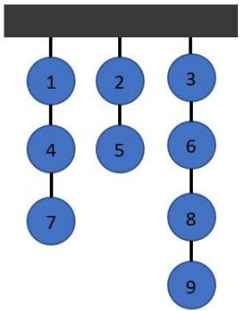Setiap balon akan diledakkan dengan syarat tidak boleh menjatuhkan balon lain, dan untuk meledakkan balon berikutnya harus berbeda untaian. Banyak cara agar balon nomor 6 diledakkan pada urutan ke-lima adalah ....A. 6B. 5C. 4D. 3</td></tr><tr><td>30</td><td>Panitia pentas seni membutuhkan 2 orang bagian perlengkapan dan 2 orang bagian sekretariat. Jika terdapat 3 calon anggota bagian perlengkapan dan 4 calon anggota bagian sekretariat, maka banyak susunan anggota berbeda yang dapat dipilih adalah....A. 9B. 18C. 36D. 72</td></tr></table>