## OSN

## MATEMATIKA

## OSN TINGKAT KABUPATEN

## Soal OSN Kabupaten Matematika

## Soal Pilihan Jamak

1. Terdapat bilangan-bilangan sebagai berikut: 75% ; 0,745 ; $\frac{67}{100}$ ; $\frac{2}{3}$ . Jika bilangan-bilangan tersebut diurutkan dari 100 3 nilai terkecil hingga terbesar, maka urutannya adalah .... 

A. $\frac{2}{3}$ ; $\frac{67}{100}$ ; 0,745; 75% 

B. $\frac{67}{100}$ ; $\frac{2}{3}$ ; 0,745; 75% 

C. $\frac{2}{3}$ ; $\frac{67}{100}$ ; $75\%$ ; 0,745 

D. $\frac{67}{100}$ ; $\frac{2}{3}$ ; 75%; 0,745 

## Jawab: A

$$
75 \% = 0,75
$$

$$
0, 7 4 5 = 0, 7 4 5
$$

$$
\frac {6 7}{1 0 0} = 0, 6 7
$$

$$
\frac {2}{3} = 0, 6 6 6 6
$$

Jadi jika diurutkan bilangan dari nilai terkecil hingga terbesar adalah $\frac{2}{3}$ ; $\frac{67}{100}$ ; 0,745; 75% 

2. Rifky mempunyai uang Rp50.000,00. Uang tersebut akan digunakan untuk membeli kue yang dijual dengan harga Rp10.000,00 per bungkus. Jika satu bungkus berisi tiga kue, maka maksimal banyaknya kue yang didapat Rifky adalah ... kue. 

A. 3 

B. 5 

C. 12 

D. 15 

## Jawab: D

- Jumlah kelompok = Total uang / Harga per kelompok Jumlah kelompok = Rp50.000,00 / Rp10.000,00 Jumlah kelompok = 5 

- Karena setiap kelompok berisi 3 kue, maka total kue yang diperoleh Rifky adalah: 

- Total gorengan = Jumlah kelompok × Jumlah kue per kelompok Total kue = 5 × 3
Total kue = 15 

Jadi, kue yang diperoleh Rifky sebanyak 15 kue. 

## Soal OSN Kabupaten Matematika

3. Sebuah kubus dengan panjang rusuk 4 cm dicat seluruh permukaannya dengan warna merah. Kubus tersebut kemudian dipotong-potong menjadi kubus-kubus kecil dengan panjang rusuk 1 cm. Banyak kubus kecil yang tepat memiliki dua sisi berwarna merah adalah .... 

A. 16 

B. 24 

C. 32 

D. 48 

Jawab: B

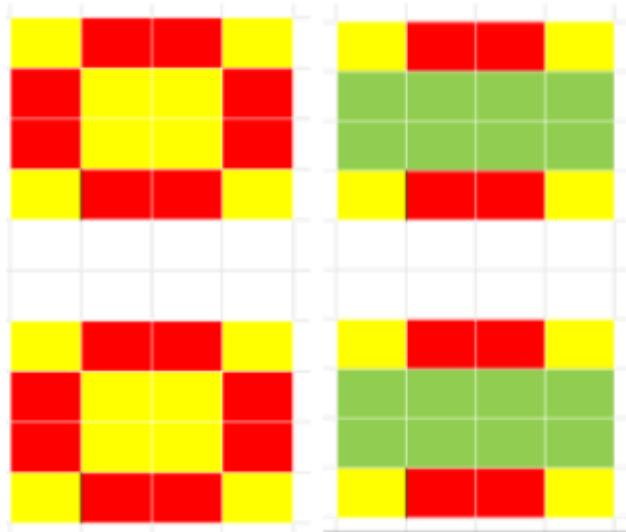

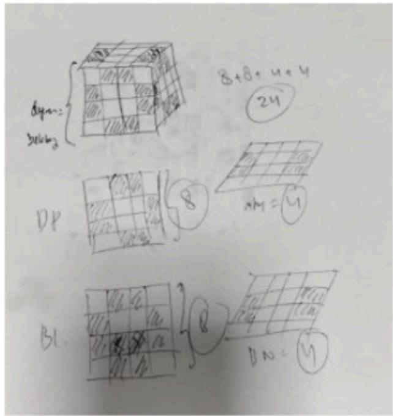

# Soal OSN Kabupaten Matematika

## 4. Perhatikan gambar di bawah ini.

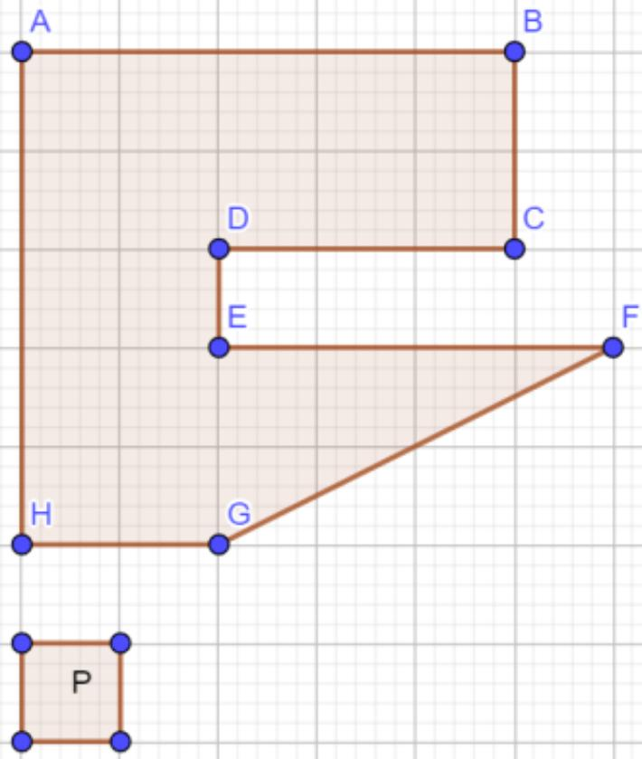

Jika luas P adalah 2 cm2, maka luas daerah ABCDEFGH adalah ...cm2 

A. 38 

B. 40 

C. 42 

D. 44 

Jawab: B. 40 

2 

2 

2 

2 

## Soal OSN Kabupaten Matematika

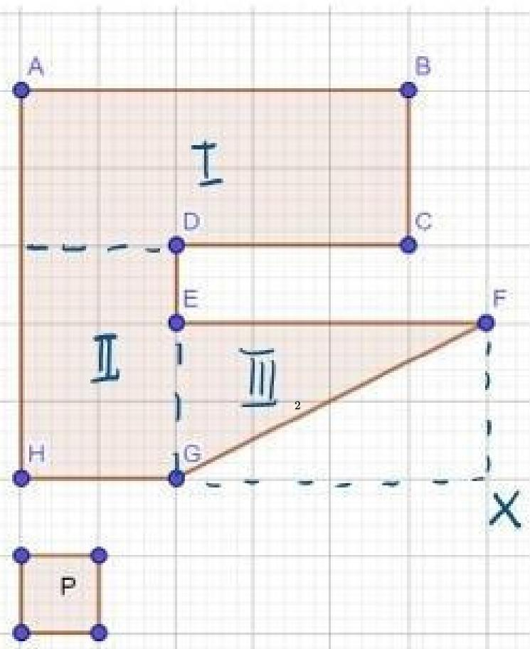

Luas daerah ABCDEFGH=Luas I + Luas II + Luas III 

- Luas I = 10 x luas P = 20 cm 

- Luas II = 6 x luas P = 12 cm 

- Luas III = $\frac{1}{2}$ luas EFXG = $\frac{1}{2} \times 8 \times$ luas P = 8 cm 

• Jadi Luas ABCDEFGH = 40 cm 

2 

2 

2 

2 

## Soal OSN Kabupaten Matematika

5. Berikut adalah data banyaknya jawaban benar dari 10 siswa yang mengikuti kompetisi matematika SD: 10, 12, 8, 15, 17, 18, 25, 30, 35, 40. Rata-rata banyaknya jawaban benar dari 10 siswa tersebut adalah .... 

A. 12 

B. 18 

C. 21 

D. 3 

## Jawab: C. 21

- Jumlah seluruh siswa yang menjawab benar adalah: 10+12+8+15+17+18+25+30+35+40=210 

• Banyaknya data adalah 10. 

- Rata-rata = Jumlah seluruh data / Banyaknya data 

- Rata-rata = 210/10 

- Rata-rata = 21 

- Jadi, rata-rata dari jumlah siswa yang menjawab benar adalah 21. 

6. Pukul 06.15 Amir berangkat ke sekolah naik sepeda dengan kecepatan 10 km/jam. Jika jarak rumah Amir ke sekolah adalah 3 km, maka Amir tiba di sekolah pada pukul .... 

A. 06.24 

B. 06.33 

C. 06.44 

D. 06.55 

## Jawab: B. 06.33

Menghitung waktu yang ditempuh Amir ke sekolah: $v = \frac{s}{t}$ 

$$
1 0 = \frac {3}{t}
$$

t = 0,3 jam = 18 menit 

Amir tiba di sekolah: pukul 06.15 ditambah 18 menit, pukul 06.33 

## Soal OSN Kabupaten Matematika

7. Terdapat 10 kartu bilangan prima pertama. Banyaknya cara mengambil 2 kartu sehingga jumlah bilangan dari kedua kartu tersebut bernilai ganjil adalah ... cara. 

A. 90 

B. 10 

C. 9 

D. 5 

## Jawab: C. 9

2 bilangan dijumlah hasilnya ganjil maka 1 bilangan genap dan 1 bilangan ganjil. Karena bilangan prima yang genap hanya ada 1 yaitu 2, bilangan yang lain adalah prima ganjil, sehingga pasangan bilangan prima yang mungkin adalah (2, x) dengan banyaknya x adalah 9 bilangan prima ganjil. Jadi banyaknya cara adalah 9 cara. 

8. Sebuah tim cerdas cermat terdiri dari 3 siswa yang dipilih dari 4 siswa terbaik di kelas. Banyak tim berbeda yang mungkin dapat dibentuk adalah .... 

A. 4 

B. 6 

C. 12 

D. 24 

## Jawab: A. 4

- Memilih 3 siswa dari 4 siswa terbaik. Urutan pemilihan tidak penting 

• Kombinasi memilih 3 dari 4. 

$$
C (n, k) = k! (n - k)! n!
$$

$$
C (4, 3) = 4! / (4 - 3)! ^ {*} 3! = 4
$$

Jadi ada 4 susunan tim yang berbeda. 

## Soal OSN Kabupaten Matematika

9. Lina memiliki tiga kotak berisi pensil. Kotak pertama berisi 24 pensil. Kotak kedua berisi tiga kali dari isi kotak pertama, dan kotak ketiga berisi setengah dari isi kotak kedua. 

Banyak pensil yang dimiliki Lina dari ketiga kotak tersebut adalah.... 

A. 96 

B. 120 

C. 132 

D. 144 

## Jawab: C. 132

Kotak pertama = 24 pensil 

Kotak kedua = 3 × 24 = 72 pensil 

Kotak ketiga = $\frac{1}{2} \times 72 = 36$ pensil 

Total pensil = 24 + 72 + 36 = 132 pensil 

10. Suhu udara di Antartika tanggal 16 Mei 2025 pukul 04.00 mencapai $-48^{\circ}C$ , dua jam kemudian suhu udara mengalami kenaikan sebesar 2 derajat Celsius dan dua jam kemudian suhu mengalami penurunan sebesar 3 derajat Celsius. Suhu udara di Antartika tanggal 16 Mei 2025 .... 

pukul 06.00 mencapai -50°C. 

pukul 08.00 mencapai -47°C. 

pukul 06.00 mencapai $-46^{\circ}C$ . 

pukul 08.00 mencapai $-43^{\circ}C$ . 

Jawab: C. pukul 06.00 mencapai -46°C. 

16 Mei 2025 pukul 04.00 mencapai $-48^{\circ}C$ , dua jam kemudian yaitu pukul 06.00 mengalami kenaikan sebesar 2 derajat sehingga suhu udara menjadi $-48^{\circ}C + 2^{\circ}C = -46^{\circ}C$ . 

Dua jam kemudian yaitu pukul 08.00 mengalami penurunan sebesar 3 derajat Celsius sehingga suhu udara menjadi $-46^{\circ}C - 3^{\circ}C = -49^{\circ}C$ . 

## Soal OSN Kabupaten Matematika

11. Jumlah dari 

$$
8 \frac {2}{5}: 2, 2 5 \text {   dan   } \frac {1 0}{3} \times 2 \frac {3}{5}
$$

A. 12,75 

B. 12,55 

C. 12,40 

D. 12,00 

Jawab: C. 12,40 

$$
8 \frac {2}{5}: 2, 2 5 = \frac {4 2}{5}: \frac {9}{4} = \frac {4 2}{5} \times \frac {4}{9} = \frac {1 6 8}{4 5}
$$

$$
\frac {1 0}{3} \times 2 \frac {3}{5} = \frac {1 0}{3} \times \frac {1 3}{5} = \frac {1 3 0}{1 5}
$$

Jadi $\frac{168}{45} +\frac{130}{15} = \frac{168}{45} +\frac{390}{45} = 12.40$ 

12. Dua buah bangun yang berbentuk persegi dan segitiga mempunyai keliling yang sama. Sisi-sisi segitiga tersebut mempunyai panjang 10 cm, 16 cm dan 10 cm. Jumlah luas kedua bangun tersebut adalah... cm $^{2}$ 

A. 72 

B. 84 

C. 129 

D. 177 

Jawab: C. 129 

Pembahasan: 

Perhatikan gambar segitiga berikut: 

Tinggi segitiga: 

$$
t = \sqrt {1 0 ^ {2} - 8 ^ {2}} = 6 c m
$$

keliling segitiga = keliling persegi, maka 

Panjang sisi persegi adalah 10+16+10 = 4s 

$$
3 6 = 4 \mathrm{s}
$$

$$
s = 9
$$

Jumlah luas kedua bangun tersebut adalah 

luas segitiga + luas persegi = 

$$
(1 \times 1 6 \times 6) + 9 ^ {2} = 4 8 + 8 1 = 1 2 9 \mathrm{cm} ^ {2}
$$

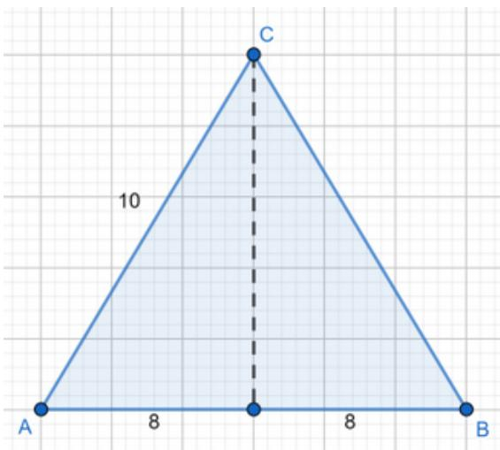

## Soal OSN Kabupaten Matematika

13. Sebuah taman kota terdiri dari tiga taman yang saling berimpitan yaitu taman 1, taman 2 dan taman 3 yang masing-masing berbentuk persegi seperti pada gambar berikut. 

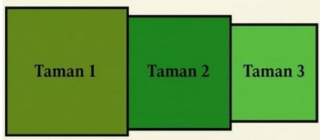

Jika perbandingan sisi taman 1, taman 2 dan taman 3 adalah 5 : 4 : 3, dan luas taman 1 adalah 100 m $^{2}$ , maka keliling taman kota tersebut adalah.... 

A. 60 m 

B. 64 m 

C. 68 m 

D. 72 m 

Jawab: C. 68 m 

Misalkan taman 1=A, taman 2=B, taman 3=C. 

Panjang sisi area A, B, dan C dapat dinyatakan dengan 5x, 4x, dan 3x. 

Diketahui luas area A adalah 100 m $^{2}$ , maka: 

$$
L = s \times s
$$

$$
1 0 0 = 5 x \times 5 x
$$

$$
1 0 0 = 2 5 x ^ {2}
$$

$$
4 = x ^ {2} \Rightarrow x = 2.
$$

Sehingga diperoleh panjang sisi area A, B, dan C adalah 10 m, 8 m, dan 6 m. Diperhatikan gambar berikut. 

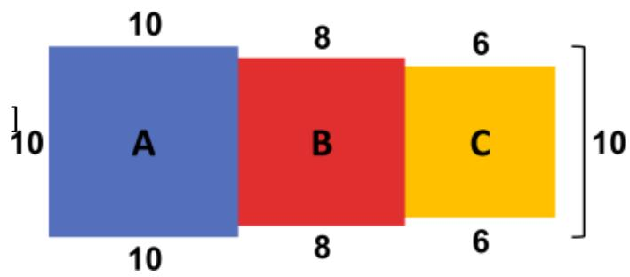

Keliling taman adalah: 

$$
K = (4 \times 1 0) + (2 \times 8) + (2 \times 6) = 6 8 m.
$$

## Soal OSN Kabupaten Matematika

14. Data peminjaman buku siswa kelas 4, 5, dan 6 selama satu minggu di perpustakaan sekolah disajikan dalam diagram batang berikut. 

Data Peminjaman Buku Perpustakaan

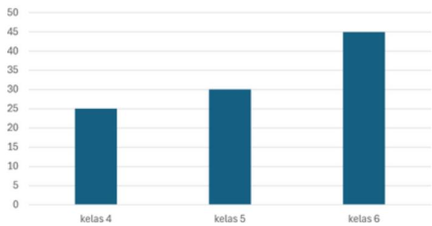

Pernyataan yang tepat mengenai data tersebut adalah.... 

A. rata-rata banyak buku yang dipinjam oleh tiap kelas adalah 30 buku. 

B. selisih banyak buku yang dipinjam antara kelas 6 dengan kelas 4 adalah 15 buku. 

C. median dari data peminjaman buku adalah 35 buku. 

D. jumlah buku yang dipinjam oleh ketiga kelas adalah 100 buku. 

## Jawab: D. 100

A. Rata-rata jumlah buku yang dipinjam adalah 30 buku. Rata-rata = (Jumlah buku Kelas 4 + Jumlah buku Kelas 5 + Jumlah buku Kelas 6) / Banyak kelas 

$$
\text { R   a   t   a   -   r   a   t   a } = (2 5 + 3 0 + 4 5) / 3
$$

$$
= 1 0 0 / 3
$$

$$
= 3 3, 3 3 \text { buku   (tidak   tepat) }
$$

B. Selisih jumlah buku yang dipinjam antara kelas 6 dan 4 adalah 15 buku. 

Kelas tertinggi meminjam 45 buku (Kelas 6). Kelas terendah meminjam 25 buku (Kelas 4). 

$$
\text { S   e   l   i   s   i   h } = 4 5 - 2 5
$$

$$
= 2 0 \text { buku   (tidak   tepat) }
$$

C. Median jumlah buku yang dipinjam adalah 30 buku. Untuk mencari median, kita urutkan data: 25, 30, 45. Karena ada 3 data (ganjil), median adalah nilai tengah, yaitu 35 buku (tidak tepat). 

D. Total buku yang dipinjam oleh ketiga kelas adalah 100 buku. 

Total = 25 + 30 + 45 = 100 buku (tepat). 

## Soal OSN Kabupaten Matematika

15. Median dari data berikut: 

$$
\frac {4}{5}; \frac {5}{1 0}; 0, 2 3 5; \frac {3}{4}
$$

adalah .... 

A. 0,5 

B. 0,625 

C. 0,75 

D. 0,8 

Jawab: B. 0,625 

$$
\frac {4}{5} = 0, 8
$$

$$
\frac {5}{1 0} = 0, 5
$$

$$
0, 2 3 5 = 0, 2 3 5
$$

$$
\frac {3}{4} = 0, 7 5
$$

Jadi Data diurutkan dari yang terkecil 0,235 ; 0,5 ; 0,75 ; 0,8 

$$
\text { Median } = \frac {0 , 5 + 0 , 7 5}{2} = 0, 6 2 5
$$

16. Pak Marto memanen padi pada lahan 2 hektar dengan hasil 10,6 ton per hektar. Setelah dijemur, berat padi tersebut akan berkurang 20%. Berat padi yang diperoleh pak Marto setelah dijemur adalah ...kg. 

A. 848 

B. 1696 

C. 8480 

D. 16960 

Jawab: D. 16960 

Padi yang dipanen pak marto = 10,6 ton * 2 = 21,2 ton = 21200 kg 

Karena mengalami penyusutan 20% maka padi kering yang diperoleh adalah 21200*80%=16960kg 

## Soal OSN Kabupaten Matematika

17. Pak Agung memiliki 4 anak dan 1 istri. Hari minggu, Pak Agung dan keluarga akan melakukan foto bersama di studio foto. Banyak cara menata pose foto dalam satu baris dari keluarga pak Agung sehingga Pak Agung dan Istri berdiri saling berdampingan adalah ... 

A. 120 cara 

B. 140 cara 

C. 220 cara 

D. 240 cara 

## Jawab: D. 240

- 4 anak, 1 istri, dan Pak Agus (total 6 orang) dengan ketentuan Pak Agus dan istri harus berdiri saling berdekatan. 

- Pak Agus dan istrinya sebagai satu unit. sehingga 4 anak + 1 unit (Pak Agus & istri) = 5 entitas yang akan diatur dalam satu baris. 

- Banyak cara untuk menyusun 5 entitas dalam satu baris adalah 5! (5 faktorial). 5!=5×4×3×2×1=120 cara. 

- Namun, di dalam unit "Pak Agus & istri", mereka berdua bisa bertukar posisi. Ada 2 kemungkinan susunan untuk unit ini: (Pak Agus, istri) atau (istri, Pak Agus). 

- Oleh karena itu, untuk setiap susunan dari 5 entitas, ada 2 kemungkinan susunan di dalam unit Pak Agus dan istri. 

• Total banyak cara menata pose foto adalah: 

- Total cara = (Banyak cara menyusun 5 entitas) × (Banyak cara menyusun di dalam unit Pak Agus & istri) 

- Total cara = 5!×2! Total cara = 120×2 Total cara = 240 

- Jadi, banyak cara menata pose foto dalam satu baris sehingga Pak Agus dan istri berdiri saling berdekatan adalah 240 cara. 

## Soal OSN Kabupaten Matematika

18. Aris akan mengisi petak 2 x 2 berikut dengan bilangan prima berbeda yang nilainya masing-masing kurang dari 40. 

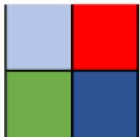

Banyak cara untuk mengisi petak-petak tersebut adalah...cara. 

A. 24 

B. 64 

C. 11880 

D. 20736 

Jawab: C. 11880 

Bilangan prima kurang dari 40 adalah 2,3,5,7,11,13,17,19, 23, 29, 31 dan 37(12 bilangan). Maka 

banyaknya cara menyusun bilangan-bilangan tersebut pada 4 petak adalah 

$$
1 2 \times 1 1 \times 1 0 \times 9 = 1 1 8 8 0
$$

19. Terdapat 5 pasang putra putri duta pendidikan dari 5 sekolah dan akan dibentuk tim kepanitiaan yang terdiri dari 2 putra dan 2 putri. Jika tidak boleh ada putra dan putri dari satu sekolah yang sama dalam kepanitiaan, maka banyak cara membentuk tim kepanitiaan adalah...cara. 

A. 30 

B. 100 

C. 200 

D. 210 

Jawab: A. 30 

Ada 5 putra dan 5 putri dipilih 2 putra dan 2 putri. Pilih 2 orang dari 5 putra = . 2 putri tidak boleh dipilih karena pasangan duta putra sudah terpilih. Pilih 2 orang dari 3 putri = 

$$
_ 5 C _ {2} \times_ {3} C _ {2} = 1 0 \times 3 = 3 0
$$

## Soal OSN Kabupaten Matematika

20. Jika 35% dari suatu bilangan adalah 75, maka 21% dari bilangan tersebut adalah .... 

A. 35 

B. 42 

C. 45 

D. 55 

Jawab: C. 45 

Pembahasan: 

Jika 35% bilangan z = 75, 

maka bilangan z = 75 : (35/100) = 75 x (100/35) 

21% dari bilangan z adalah (21/100) x 75 x (100/35) = 45 

21. Bilangan yang tidak dapat dinyatakan sebagai penjumlahan dari 3 bilangan prima yang berbeda adalah.... 

A. 12 

B. 13 

C. 14 

D. 15 

Jawab: B. 13 

penjumlahan tiga bilangan prima yang mungkin 12=2+3+7 

13=3+3+7 (2 bilangan prima sama) 

$$
1 4 = 2 + 5 + 7
$$

$$
1 5 = 3 + 5 + 7
$$

22. Misalkan x adalah suatu pecahan. Jika pembilang dari x ditambah 3 maka nilainya menjadi $\frac{2}{3}$ . Jika penyebut dari x dikurangi 1 maka nilainya menjadi $\frac{1}{2}$ . Nilai x adalah.... 

A. $\frac{2}{3}$ 

C. $\frac{4}{7}$ 

B. $\frac{7}{15}$ 

D. $\frac{8}{15}$ 

Jawab: B. $\frac{7}{15}$ 

Misalkan $x = \frac{a}{b}$ 

$$
\frac {a + 3}{b} = \frac {2}{3} \text {   maka   } 3 a + 9 = 2 b \dots (1)
$$

$$
\frac {a}{b - 1} = \frac {1}{2} \text {   maka   } 2 a + 1 = b \dots . (2)
$$

Dari 1 dan 2 maka, $3a + 9 = 2(2a + 1)$ , $3a + 9 = 4a + 2 = 7a$ 

Maka b = 2a + 1 = 2.7 + 1 = 15 

Jadi x = $\frac{7}{15}$ 

## Soal OSN Kabupaten Matematika

23. Sepuluh kubus yang masing-masing memiliki panjang rusuk 1 cm akan disusun sehingga sisinya bersisian dan membentuk satu bangun ruang baru. Luas permukaan minimal bangun ruang baru tersebut adalah ...cm $^{2}$ . 

Contoh dua kubus yang bersisian: 

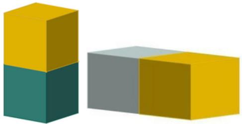

Contoh dua kubus yang tidak bersisian: 

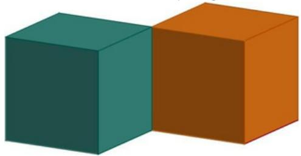

A. 24 

B. 28 

C. 30 

D. 42 

Jawab: C. 30 

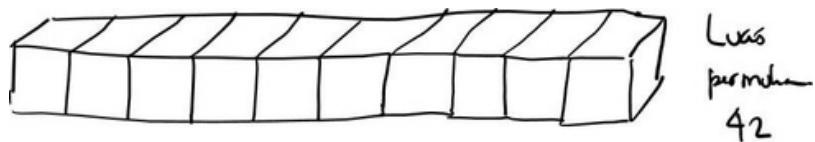

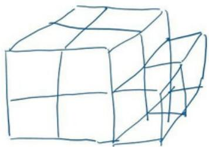

Luay permuhan-

$$
\begin{array}{l} = 4 \times 6 + 6 \\ = 3 0 \\ \end{array}
$$

## Soal OSN Kabupaten Matematika

## 24. Perhatikan gambar berikut:

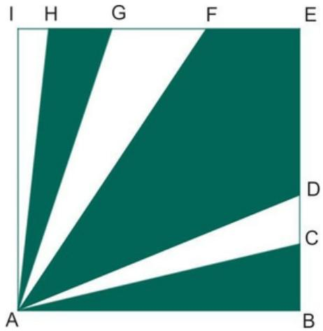

Jika luas persegi ABEI 49 cm dan daerah yang diarsir dalam persegi adalah 35 cm maka $^{2}$ panjang BC + DE + EF + GH = ... cm. 

A. 9 

B. 10 

C. 12 

D. 14 

Jawab: C. 12 

Luas persegi = 49 

$$
s ^ {2} = 4 9 \Rightarrow s = 7
$$

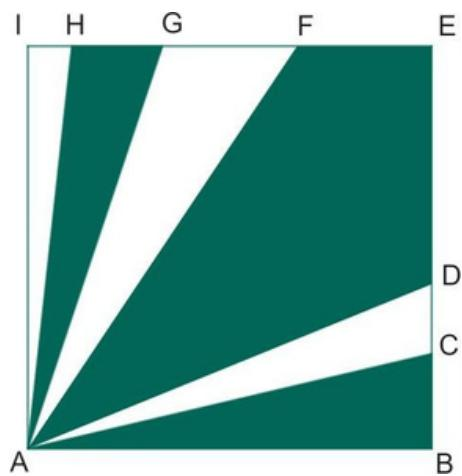

$$
L \Delta A G H = \frac {1}{2} G H. 7 = 3, 5 G H
$$

$$
L \Delta A E F = \frac {1}{2} E F. 7 = 3, 5 E F
$$

$$
L \Delta A D E = \frac {1}{2} D E. 7 = 3, 5 D E
$$

$$
L \triangle A B C = \frac {1}{2} B C. 7 = 3, 5 B C
$$

Luas daerah yang diarsir : 

$$
3, 5 G H + 3, 5 E F + 3, 5 D E + 3, 5 B C = 4 2
$$

$$
3, 5 (G H + E F + D E + B C) = 4 2
$$

$$
(G H + E F + D E + B C) = 1 2
$$

## Soal OSN Kabupaten Matematika

25. Sepuluh anak membentuk kelompok bermain yang masing-masing terdiri dari empat anak dan enam anak. Rata-rata usia kelompok empat anak adalah 6 tahun, dan rata-rata usia kelompok enam anak adalah 6,5 tahun. Jika satu anak dari masing-masing kelompok ditukarkan, maka rata-rata usia kedua kelompok sama. Selisih usia kedua anak yang ditukarkan adalah ... tahun. 

A. 1,2 

B. 1,0 

C. 0,5 

D. 0,25 

Jawab: A. 1,2 

Misalkan usia yang dipertukarkan adalah A dan B 

Total usia kelompok empat anak = 4 x 6 = 24 

Total usia kelompok enam anak = 6 x 6,5 = 39 

$$
\frac {2 4 - A + B}{4} = \frac {3 9 - B + A}{6}
$$

$$
\begin{array}{l} 1 4 4 - 6 A + 6 B = 1 5 6 - 4 B + 4 A \\ 1 0 B - 1 0 A = 1 5 6 - 1 4 4 \\ 1 0 B - 1 0 A = 1 2 \\ B - A = 1, 2 \\ \end{array}
$$

26. Bilangan genap lima angka akan disusun dari angka-angka 1, 2, 3, dan 5, dengan ketentuan sebagai berikut: 

a. semua angka harus digunakan 

b. angka 5 boleh muncul maksimal dua kali 

c. angka 2 hanya muncul satu kali. 

Banyak susunan bilangan genap yang mungkin adalah .... 

A. 12 

B. 24 

C. 36 

D. 42 

## Soal OSN Kabupaten Matematika

## Jawab: C. 36

- Karena bilangan yang akan dibentuk adalah bilangan genap, maka angka terakhir (satuan) haruslah angka 2. Kita akan mempertimbangkan posisi angka 5. 

- Angka 5 muncul satu kali Angka terakhir harus 2. Kita memiliki 4 posisi tersisa untuk diisi oleh angka 1, 3, dan 5. Banyak cara menyusun 3 angka berbeda dalam 4 posisi adalah permutasi 

$$
P (4, 3) = 4! / (4 - 3)!
$$

$$
= 4 \times 3 \times 2 = 2 4.
$$

- Angka 5 muncul dua kali Angka terakhir harus 2. 4 posisi tersisa untuk diisi oleh angka 1, 3, 5, dan 5. Banyak cara menyusun 4 angka ini dengan 2 angka yang sama adalah 4!/1!×1!×2!=24/2=12. 

• Total cara = 24 + 12 = 36 

- Jadi, banyak cara bilangan genap 5 angka yang mungkin terbentuk adalah 36 cara. 

27. Bilangan-bilangan disusun dengan pola sebagai berikut: 12, 20, 30, 42, 56, 72, 90, .... 

Jika angka-angka penyusun pada bilangan ke-15 dijumlahkan maka hasilnya adalah ... 

A. 8 

B. 9 

C. 11 

D. 12 

## Jawab: B. 9

- rumus umum $^{2}$ untuk suku ke-n dari pola bilangan ini adalah: Un=(n+2)(n+3)=n +5n+6 

- Suku ke-15, 

$$
\mathrm{U} 1 5 = (1 5 + 2) (1 5 + 3) = 1 7 \times 1 8
$$

• Mari kita hitung nilai 17×18: 17×18=306 

• Jadi, bilangan ke-15 dalam pola ini adalah 306. 

Menjumlahkan angka-angka pada suku ke-15, yaitu 306: 3+0+6=9 

## Soal OSN Kabupaten Matematika

28. Hasil dari $\frac{45+3^{2025(4^{2}-1)}}{3+3^{2025}}$ adalah.... 

The result of $\frac{45+3^{2025(4^{2}-1)}}{3+3^{2025}}$ is.... 

A. 5 

B. 10 

C. 15 

D. 20 

Jawab: C.15 

$$
\frac {4 5 + 3 ^ {2 0 2 5 (4 ^ {2} - 1)}}{3 + 3 ^ {2 0 2 5}} = \frac {4 5 + 3 ^ {2 0 2 5 (1 6 - 1)}}{3 + 3 ^ {2 0 2 5}}
$$

$$
= \frac {4 5 + 1 5 \times 3 ^ {2 0 2 5}}{3 + 3 ^ {2 0 2 5}}
$$

$$
= \frac {1 5 (3 + 3 ^ {2 0 2 5})}{3 + 3 ^ {2 0 2 5}}
$$

$$
= 1 5
$$

29. Andika berbelanja di toko alat-alat tulis membeli beberapa barang yaitu sepuluh buku tulis, lima pensil, satu penggaris dan satu kotak pensil. Harga satu buku Rp5.000,00; satu pensil atau satu penggaris Rp2000,00; dan satu kotak pensil Rp30.000,00. Jika toko memberikan diskon 10% untuk buku dan 5% untuk kotak pensil, maka jumlah yang harus dibayar oleh Andika adalah .... 

A. Rp92.000,00 

B. Rp88.400,00 

C. Rp85.500,00 

D. Rp83.800,00 

Jawab: C. Rp85.500,00 

Harga 10 buku tulis dengan diskon 10% adalah 10*5000*90%=45.000 

Harga 5 pensil = 5*2000=10000 Harga 1 penggaris =2000 

Harga kotak pensil dengan diskon 5% = 30000*95%=28.500 Jumlah yang harus dibayar oleh Andika = 45.000+10.000+2.000+28.500=85.500 

Keterangan pengecoh A jumlah tanpa diskon, B seluruhnya diskon 5%, D seluruhnya diskon 10%. 

## Soal OSN Kabupaten Matematika

30. Diberikan tiga bilangan bulat positif a, b, c, dengan a: b = b: c = c: a. Hasil dari 

$$
\frac {(2 0 0 \times a) + (1 0 0 \times b) + (2 5 0 \times c)}{(3 \times b) + (4 \times c) - 2 a}
$$

adalah.... 

A. 100 

B. 110 

C. 120 

D. 130 

Jawab: B. 110 

Dari soal diketahui 

$$
a: b = b: c = c: a \text {maka} a 3 = b 3 = c 3
$$

Karena a, b, c positif maka a = b = c, sehingga 

$$
\begin{array}{l} \frac {(2 0 0 \times a) + (1 0 0 \times b) + (2 5 0 \times c)}{(3 \times b) + (4 \times c) - 2 a} \\ = \frac {(2 0 0 \times a) + (1 0 0 \times b) + (2 5 0 \times c)}{(3 \times b) + (4 \times c) - 2 a} \\ = \frac {5 0 0 a}{5 a} = 1 1 0 \\ \end{array}
$$

2 