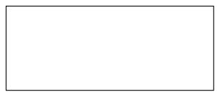
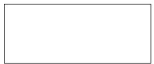
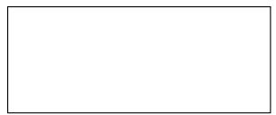
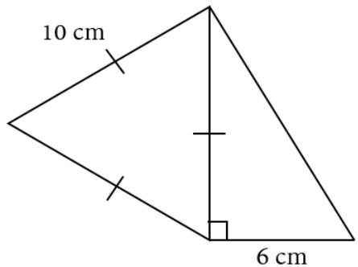
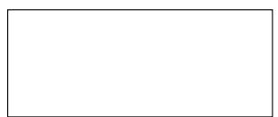
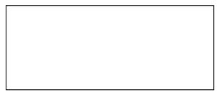
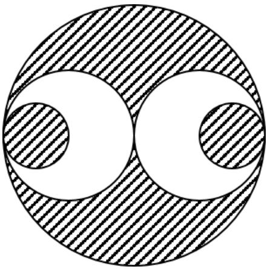

## Arsip Soal OSN Matematika SD/MI Tingkat Kecamatan Tahun 2010

Disusun oleh Tim OSN Provinsi Kalimantan Barat 

Diunduh melalui situs mathcyber1997.com 

## I. Bagian Tes 1

1. Tujuh puluh persen dari 2 hari adalah · · · menit. 

2. Sekarang adalah hari Minggu. Hari apakah 2006 hari mendatang? 

3. Bilangan yang tepat berada di antara $\frac { 6 } { 7 }$ dan $\frac { 7 } { 8 }$ adalah 

4. Hasil dari 3, 25 × 5% adalah · · · · 

5. Volume sebuah kerucut sama dengan volume bola. Jika tinggi kerucut sama dengan panjang jari-jari bola, maka jari-jari kerucut sama dengan · · · kali panjangnya dari jari-jari bola. 

6. Keuntungan menjual 100 jeruk sebesar 25% dari harga beli. Jika 100 jeruk itu dibeli seharga Rp25.000,00, maka rata-rata harga jual sebuah jeruk adalah · · · · 

7. Angka satuan dari $3 ^ { 2 1 }$ adalah · · · · 

8. Sebuah lingkaran dan persegi memiliki ukuran luas yang sama. Jika panjang jari-jari lingkaran 10 cm, maka panjang sisi persegi itu adalah · · · cm (π = 3, 14). 

9. Hasil dari $2 0 1 1 ^ { 2 } - 2 0 1 0 ^ { 2 }$ adalah · · · · 

10. Rata-rata nilai ulangan matematika dari 5 orang siswa adalah 6, 8. Setelah nilai satu orang siswa lagi dimasukkan, rata-rata berubah menjadi 7, 0. Berapakah nilai siswa yang dimasukkan tadi? 

11. Suatu segitiga sama kaki memiliki sudut di antara kaki pengapit sebesar 120◦. Jika panjang salah satu kakinya 10 cm, maka ukuran alas segitiga tersebut adalah · · · cm. 

12. Total jumlah usia dari sebuah keluarga yang terdiri dari 5 orang adalah 92 tahun. Berapakah total jumlah usia mereka 5 tahun yang lalu jika anggota keluarga termuda sekarang usianya 6 tahun? 

13. Nilai dari $\left( { \frac { 1 } { 2 8 4 } } + { \frac { 1 } { 1 4 2 } } + { \frac { 1 } { 7 1 } } + { \frac { 1 } { 4 } } + { \frac { 1 } { 2 } } \right) \times { \frac { 5 6 8 } { 4 4 0 } }$ adalah · · · · 

14. Perbandingan antara usia Ani, Nia, dan Ina adalah 4 : 5 : 6. Jika usia Ina 6 tahun lebih muda dari usia Ani, maka total usia mereka sekarang adalah · · · tahun. 

15. Setiap membeli 4 bungkus kacang, pembeli mendapat 1 bungkus kacang yang sama secara gratis, berlaku kelipatan. Jika saya ingin mendapat 14 bungkus kacang, berapa banyak bungkus kacang yang harus saya beli? 

16. Gunakan operasi +, −, ×, atau ÷ untuk melengkapi perhitungan berikut agar menjadi bernilai benar. 

<table><tr><td>13</td><td></td><td>2</td><td></td><td>5</td><td>=</td><td>6</td></tr></table>

17. Zaki membaca suatu buku matematika. Ketika dibuka, tampak dua halaman buku yang hasil kalinya 1892. Jumlah dua halaman yang terbuka adalah · · · · 

18. Satu kali ayunan sepeda sama dengan satu kali putaran roda sepeda. Jika panjang diameter roda 1 m dan jarak tempuh 2 km, maka banyak ayunan yang harus dilakukan oleh pengendara sepeda adalah · · · · 

19. Hasil dari $( 1 1 + 1 2 + 1 3 + \cdot \cdot \cdot + 3 4 + 3 5 ) - ( 2 5 + 2 4 + 2 3 +$ $\cdots + 9 + 8 )$ adalah · · · · 

20. Tentukan panjang tongkat kayu yang diperlukan untuk membuat kerangka berikut jika kerangka tersebut terdiri dari segitiga sama sisi dan segitiga siku-siku. 

## II. Bagian Tes 2

1. Gambar berikut menunjukkan sebuah lingkaran besar, dua buah lingkaran sedang, dan dua buah lingkaran kecil. 

Diketahui jari-jari lingkaran besar 10 cm. Tentukan luas daerah yang diarsir berikut jika panjang diameter lingkaran kecil sama dengan seperempat lingkaran besar dan diameter lingkaran sedang sama dengan setengah diameter lingkaran besar $( \pi = 3 , 1 4 )$ . 

2. A dan B merupakan bilangan bulat positif. $\frac { A } { 1 2 }$ dan $\frac { B } { 8 }$ adalah pecahan biasa paling sederhana. Jika ${ \frac { A } { 1 2 } } + { \frac { B } { 8 } } = { \frac { 1 9 } { 2 4 } }$ maka tentukan nilai $A + B$ . 

3. Carilah hasil akhir (dalam pecahan biasa) dari operasi hitung campuran berikut. 

$$
\left(0, 25\% \times 1500 + \frac {3}{4} - 8, 5\right) \div \frac {1}{2}
$$

4. Luas sebuah persegi sama dengan luas sebuah lingkaran. Tentukan perbandingan keliling persegi dan keliling lingkaran $\left( \pi = { \frac { 2 2 } { 7 } } \right)$ 

5. Seorang anak akan memasang nomor kendaraan yang terdiri dari tiga angka, yaitu 2, 4, dan 6. Tentukan banyak nomor kendaraan berbeda yang dapat dibuat. 

6. Ayah akan membuat akuarium mini terbuka dan terbuat dari kaca. Tebal kacanya 5 mm. Jika akuarium yang diinginkan berbentuk kubus dengan volume 8000 mm3, maka volume kaca yang diperlukan adalah · · · mm3. 

## Kunjungi mathcyber1997.com untuk mendapatkan arsip soal lainnya