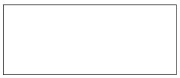
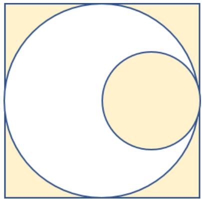
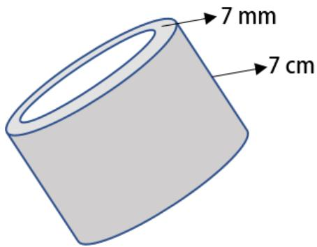
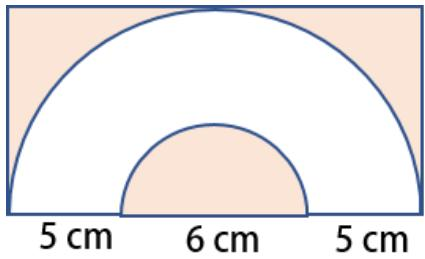

## Arsip Soal OSN Matematika SD/MI Tingkat Kecamatan Tahun 2011

Disusun oleh Tim OSN Provinsi Kalimantan Barat 

Diunduh melalui situs mathcyber1997.com 

## I. Bagian Tes 1

1. Lima setengah persen dari 1 ton adalah · · · kg. 

2. Sebuah kaleng susu kental manis tertulis neto 150 ml. Ayah telah mengonsumsi susu tersebut sepertiganya, sedangkan adik meminta susu setengah bagian dari ayah. Banyak susu yang dikonsumsi ayah dan adik secara keseluruhan adalah · · · ml. 

3. Bilangan yang tepat berada di antara $\frac { 2 } { 3 }$ dan $\frac 3 4$ adalah 

4. Umur ayah 3 kalinya dari umur Ahmad. Umur ibu lima tahun lebih muda dari ayah. Sekarang umur ibu 25 tahun. Umur Ahmad adalah · · · tahun. 

5. Roda sepeda yang berdiameter 1 meter menggelinding sebanyak 100 putaran. Jarak yang ditempuh roda tersebut adalah · · · · 

6. Harga baju wanita lebih mahal 50% dari harga baju laki-laki. Jika harga baju laki-laki Rp50.000,00, maka harga baju wanita adalah · · · · 

7. Bilangan bulat yang paling dekat dengan nilai $\frac { 5 } { 2 } + 2 + \frac { 4 } { 7 } \div \frac { 1 } { 4 }$ 7 adalah · · · · 

8. Dalam suatu kompetisi matematika, Anis menempati urutan ke-13 dari atas dan urutan ke-789 dari bawah. Berapa jumlah peserta kompetisi matematika itu? 

9. Urutan huruf ke-500 dari barisan huruf REALISTIKREALISTIKREALISTIK· · · adalah · · · · 

10. Hasil dari 9 + 99 + 999 + · · · + 9 999 999 999 adalah · · · · 

11. Sebuah layang-layang memiliki sudut sebesar 120◦ dan 30◦, sedangkan dua sudut lainnya berukuran sama. Besar kedua sudut itu masing-masing adalah · · · · 

12. Rata-rata dari bilangan prima yang kurang dari 30 adalah · · · · 

13. Nilai rata-rata dari 3 mata pelajaran adalah 14. Nilai rata-rata dari 7 pelajaran lainnya adalah 20. Berapakah nilai rata-rata gabungan dari 10 mata pelajaran tersebut? 

14. Di kelas 3 terdapat 56 siswa laki-laki dan 49 siswa perempuan. Perbandingan banyaknya siswa laki-laki dan siswa perempuan adalah · · · · 

15. Sebuah jembatan gantung dicat oleh 16 orang pekerja dalam waktu 12 hari. Apabila dicat oleh 24 orang pekerja, maka waktu yang diperlukan adalah · · · hari. 

16. Pak Kadri memiliki lima buah truk pengangkut pasir. Muatan truk A dan B masing-masing 2,5 ton, sedangkan muatan truk C dan D masing-masing 3 ton. Truk E memuat 1 ton lebihnya dari muatan rata-rata 4 truk lainnya. Berapa ton muatan truk E? 

17. Jika $n = 5$ , berapakah nilai dari $1 2 n - 1 4 n + 5 0 ?$ 

18. Hasil dari $( 1 + 2 + 3 + \cdot \cdot \cdot + 2 4 + 2 5 ) - ( 2 0 + 1 9 + 1 8 + \cdot \cdot \cdot + 6 + 5 )$ adalah · · · · 

19. Hasil dari $3 3 3 3 3 \div 1 1 1 1 \times 2 2 2 2 = \cdots { } .$ 

## II. Bagian Tes 2

1. Tentukan luas daerah yang diarsir pada gambar berikut jika panjang diameter lingkaran kecil sama dengan setengah dari panjang diameter lingkaran besar, serta diketahui bahwa jari-jari lingkaran kecil panjangnya 10 cm dan $\pi = 3$ , 14. 

2. Jika kita menuliskan bilangan 1 sampai dengan 401, berapakah jumlah dari seluruh bilangan ganjilnya? 

3. Carilah hasil akhir (dalam pecahan biasa) dari operasi hitung campuran berikut. 

$$
0, 6 \times 1250\% - 1\frac{2}{3} + 2, 125
$$

4. Sebuah televisi dibeli ayah dengan diskon 20%. Harga televisi di label adalah Rp1.000.000,00. Beberapa hari kemudian, televisi itu dijualnya sehingga ayah mendapat untung 20%. Harga televisi yang dijual ayah adalah · · · · 

5. Guru olahraga di suatu sekolah akan membentuk tim ganda putra dari 4 orang siswa laki-laki. Berapa banyak tim berbeda yang dapat terbentuk? 

6. Tentukan luas permukaan kulit dari potongan paralon yang berdiameter luar 21 cm berikut. Asumsi $\pi = { \frac { 2 2 } { 7 } }$ 

7. Luas daerah yang diarsir pada gambar berikut adalah $\cdot \cdot \cdot ( \pi = 3 , 1 4 )$ . 

8. Ayah memiliki kertas yang berbentuk persegi panjang dengan ukuran paniang 20 cm dan 15 cm. Jika kertas tersebut dibuat lingkaran secara maksimal, maka sisa kertas yang tidak digunakan seluas · · · cm2. 

## Kunjungi mathcyber1997.com untuk mendapatkan arsip soal lainnya