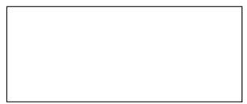
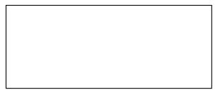
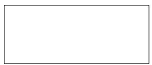
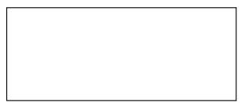
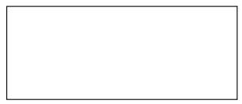
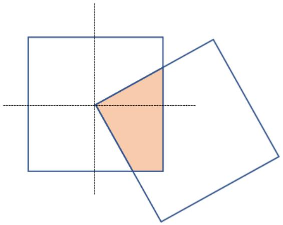

## Arsip Soal OSN Matematika SD/MI Tingkat Kecamatan Tahun 2012

Disusun oleh Tim OSN Provinsi Kalimantan Barat 

Diunduh melalui situs mathcyber1997.com 

## I. Bagian Tes 1

1. Tiga per empat bagian dari 30% sama dengan · · · · 

2. Hasil dari ${ \frac { 6 } { 7 } } - 2 { \frac { 1 } { 3 } } \times 1 2 = \cdots .$ · 

3. Bilangan yang tepat berada di antara $\frac { 9 } { 1 1 }$ dan $\frac { 1 0 } { 1 2 }$ adalah 

4. Jika panjang sisi suatu segitiga sama sisi adalah 10 cm, maka luasnya adalah $\cdots \mathrm { c m ^ { 2 } }$ . 

5. Layang-layang merupakan bangun datar berdimensi · · · · 

6. Keuntungan dari penjualan 68 buah apel adalah Rp40.000,00. Jika sebanyak 15% dari keseluruhan buah apel tidak terjual, maka rata-rata keuntungan tiap apel dari keseluruhan apel adalah · · · · 

7. Angka satuan dari $3 ^ { 4 4 }$ adalah · · · · 

8. Luas juring lingkaran dengan besar sudut $3 0 ^ { \circ }$ adalah $2 5 { \frac { 2 } { 3 } } \operatorname { c m } ^ { 2 }$ . Panjang diameter lingkaran tersebut adalah 

9. Hasil dari $2 0 1 1 ^ { 2 } - 2 0 0 1 ^ { 2 }$ adalah · · · · 

10. Rata-rata ulangan matematika untuk 20 orang siswa adalah 7, 2. Setelah nilai siswa ke-21 diikutkan, rata-rata nilai mereka menjadi 7, 0. Nilai ulangan matematika siswa ke-21 itu adalah · · · · 

11. Mobil dengan kecepatan rata-rata 90 km/jam bergerak dari Batulayang ke Pasir Panjang dan dalam perjalanan berhenti istirahat selama 40 menit. Sepeda motor juga bergerak dari Batulayang ke Pasir Panjang dengan kecepatan 60 km/jam tanpa istirahat. Jika jarak tempuh 180 km, maka kendaraan yang tiba lebih dulu adalah · · · · 

12. Tiga puluh persen dari keuntungan yang ada akan disumbangkan ke panti asuhan. Jika untung yang diperoleh sebesar 25% dari modal, maka besar persentase sumbangan kepada panti asuhan bila dihubungkan dengan modal adalah · · · · 

13. Hasil dari $\left( { \frac { 1 } { 2 8 4 } } + { \frac { 1 } { 1 4 2 } } + { \frac { 1 } { 7 1 } } + { \frac { 1 } { 4 } } + { \frac { 1 } { 2 } } \right) \times { \frac { 5 6 8 } { 4 4 0 } }$ adalah · · · · 

14. Perbandingan usia Ani, Nia, dan Ija adalah $4 : 5 : 6$ . Jika usia Ani 4 tahun lebih muda dari usia Nia, maka total usia mereka bertiga adalah · · · tahun. 

15. Hasil dari $\frac { 1 0 0 , 1 } { 1 , 0 0 1 } + \frac { 1 0 , 0 1 } { 1 0 0 1 }$ bila dinyatakan dalam pecahan campuran adalah · · · · 

16. Bentuk pecahan biasa paling sederhana dari 0, 234234234 · · · adalah · · · · 

17. Banyaknya bilangan ganjil 4 angka yang dapat dibentuk dari angka 1, 3, 5, dan 7 tanpa ada angka yang berulang adalah · · · · 

18. Panjang sisi suatu persegi sama dengan panjang jari-jari suatu lingkaran. Perbandingan keliling lingkaran terhadap keliling persegi adalah · · · · 

19. Hasil dari 1 + 3 + 5 + 7 + · · · + 97 + 99 sama dengan · · · · 

20. Banyaknya angka 1 yang diperlukan untuk menulis bilangan dari 1 sampai 200 adalah · · · · 

## II. Bagian Tes 2

1. Berapakah nilai dari $1 - 2 - 3 + 4 + 5 - 6 - 7 + 8 + 9 - \cdot \cdot \cdot - 9 9 + 1 0 0 ?$ 

2. Jika ${ \frac { 3 } { A } } + 5 \div { \frac { 2 } { 7 } } = 4$ , maka tentukan nilai A. 

3. Sebuah kubus memiliki volume 1 liter. Tentukan volume bola terbesar yang dapat dimasukkan ke dalam kubus tersebut. 

4. Seorang wanita menghabiskan $\frac { 2 } { 3 }$ dari jumlah uangnya, kemudian dia kehilangan $\frac { 2 } { 3 }$ dari sisa uangnya. Jika uang yang dimilikinya sekarang Rp4.000,00, maka berapakah uang wanita itu mula-mula? 

5. Diketahui dua dari tiga bilangan adalah $\frac { 1 } { 2 }$ dan ${ \frac { 1 } { 3 } } .$ . Berapakah satu bilangan lainnya agar rata-rata dari tiga bilangan itu adalah 1? 

6. Dua buah persegi dengan panjang sisi 20 cm saling bertindih seperti tampak pada gambar di bawah. Berapakah luas daerah yang diarsir? 

Kunjungi mathcyber1997.com untuk mendapatkan arsip soal lainnya 