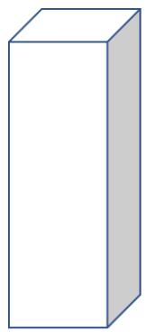
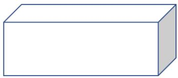
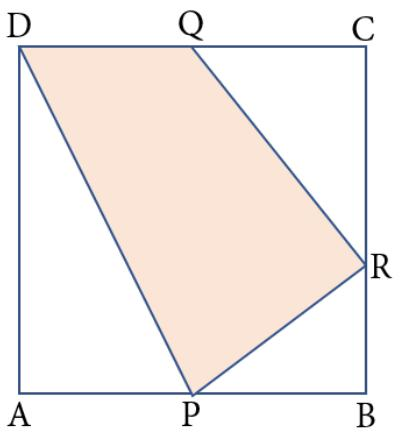
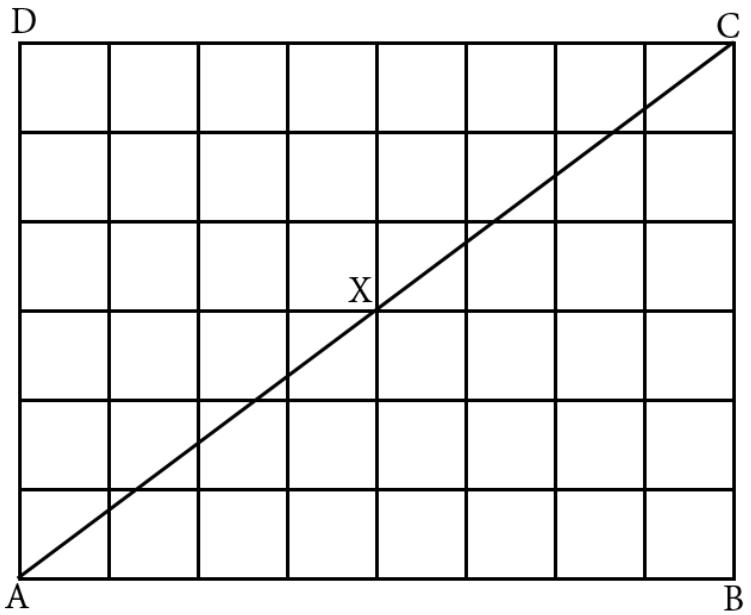
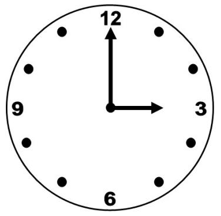
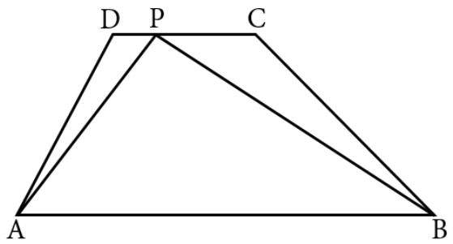
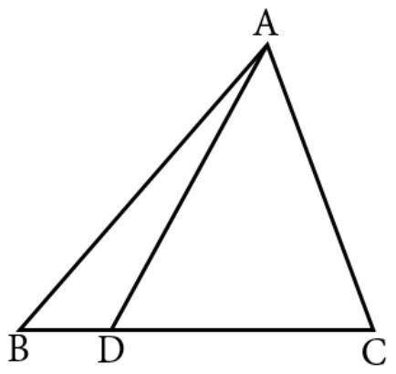
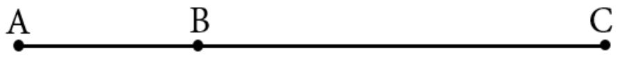

## Arsip Soal OSN Matematika SD/MI Tingkat Nasional Tahun 2015

Diunduh melalui situs mathcyber1997.com 

1. Andi mempunyai enam bilangan, yaitu 15, 16, 18, 19, 20, dan 31. Dia memberi tahu Budi bahwa ia akan menghapus salah satu dari enam bilangan tersebut, dan lima bilangan sisanya ketika dijumlahkan akan habis dibagi 3. Bilangan yang akan dihapus oleh Andi adalah · · · · 

2. Sebuah kubus dipotong menjadi dua buah balok. Jika perbandingan volume kedua balok tersebut adalah 1 : 2, maka perbandingan luas permukaannya adalah · · · · 

3. Gunakan angka 1 sampai dengan 6 masing-masing tepat sekali untuk membentuk dua bilangan yang terdiri atas 3 angka. Kedua bilangan tersebut lalu dikalikan. Hasil perkalian terbesar yang mungkin adalah · · · · 

4. Pak Budi berkata pada anaknya yang besok akan berulang tahun, ”Lucu ya, hari ini kalau digit pada umur saya dibalik, kita peroleh umur kamu, tetapi besok umur kaku setengahnya dari umur saya.” Umur Pak Budi adalah · · · tahun. 

5. Misalkan sekarang uang koin yang beredar adalah koin Rp100,00, Rp200,00, Rp500,00, dan Rp1.000,00. Harga barang-barang jajanan di sekolah Elisa merupakan kelipatan Rp100,00 dengan harga jajanan termahalnya Rp1.000,00. Suatu hari Elisa membawa sejumlah uang koin ke sekolah. Dengan uang yang dibawa, dia bisa membeli satu jajanan manapun juga tanpa memerlukan kembalian. Paling sedikit banyaknya uang koin yang dibawa Elisa adalah · · · keping. 

6. Sebuah wadah berbentuk balok dengan alas persegi berukuran 10 cm $\times 1 0$ cm dan tinggi 40 cm, berisi air dengan ketinggian 32 cm. Saat wadah direbahkan, ketinggian air adalah · · · · 

Posisi berdiri

Posisi Rebah

7. Penjumlahan pecahan di antara empat pecahan ${ \frac { 1 } { 3 } } , ~ { \frac { 1 } { 9 } } , ~ { \frac { 1 } { 2 7 } }$ , 9 , , dan $\frac { 1 } { 8 1 }$ menghasilkan berbagai bilangan. Sebagai contoh, bilangan $\frac { 4 } { 9 }$ dapat diperoleh dengan menjumlahkan dua pecahan ${ \frac { 1 } { 3 } } + { \frac { 1 } { 9 } }$ atau empat pecahan yaitu ${ \frac { 1 } { 9 } } + { \frac { 1 } { 9 } } + { \frac { 1 } { 9 } } + { \frac { 1 } { 9 } }$ Bilangan $\frac { 7 0 } { 8 1 }$ dapat diperoleh dengan menjumlahkan paling sedikit · · · pecahan. 

8. ABCD is a square. P is the midpoint of AB and $Q$ is the midpoint of CD, as can be seen in the following figure. 

R lies on $B C$ such that $B R = { \frac { 1 } { 3 } } B C$ . The ratio of the area of the shaded region to the area of the unshaded region is · · · · 

9. The area of a rectangle is 72 cm2 and its perimeter is 54 cm. If the measure of the length and width are integers, then the difference of its length and width is · · · cm. 

10. Suatu kotak berisi sejumlah kartu bernomor. Ada satu kartu bernomor 1, dua kartu bernomor 2, tiga kartu bernomor 3, dan seterusnya sampai dua puluh kartu bernomor 20. Agar dapat dipastikan bahwa kartu yang kita ambil dari kotak tersebut ada 10 kartu bernomor sama, paling tidak kita harus mengambil sebanyak · · · kartu. 

11. Persegi panjang ABCD berukuran $8 \times 6$ terdiri atas 48 persegi-persegi kecil identik yang dibentuk dari ruas garis-garis vertikal dan horizontal seperti tampak pada gambar. 

Diagonal AC melalui tiga titik yang merupakan perpotongan ruas garis vertikal dan horizontal, yaitu titik $A , X$ , dan C. Banyaknya titik yang dilalui diagonal persegi panjang serupa berukuran $4 8 \times 3 6$ adalah · · · · 

12. Terdapat lima macam uang kertas yang dimiliki Pak Firman, yaitu lembaran uang pecahan bernilai Rp1.000,00, Rp5.000,00, Rp10.000,00, Rp50.000,00, dan Rp100.000,00. Pada suatu hari, Pak Firman mengambilnya uangnya sebanyak 41 lembar dengan total Rp128.000,00. Ia masih ingat dari lima macam uang kertas yang dimilikinya ada pecahan uang yang tidak diambilnya dan ia mengambil pecahan uang Rp5.000,00 sebanyak 5 lembar. Banyaknya pecahan uang bernilai Rp1.000,00 yang diambil Pak Firman adalah · · · lembar. 

13. Gambar di bawah ini menunjukkan bahwa pada pukul 03.00 jarum panjang dan jarum pendek membentuk sudut 90◦. Pada pukul 03.25, besar sudut lancip yang dibentuk oleh kedua jarum adalah · · · · 

14. Amir is looking for all positive integers which satisfy the following properties. 

a. They are three-digit numbers. 

b. There is at least digit 7 in each number. 

c. There is no digit 0 in each number. 

How many numbers that satisfy the properties? 

15. Diketahui pada trapesium ABCD, AB sejajar CD. Pada trapesium tersebut dibentuk $\triangle A B P$ dengan P terletak pada sisi CD. Jika panjang sisi AB sama dengan tiga kali panjang sisi CD, maka perbandingan luas segitiga ABP dan luas trapesium ABC D adalah · · · · 

16. Anto was trying to compute the value of $9 ^ { 1 5 }$ and he found that it is equal to 205.891.132.094.6m9. What is the value of m? 

17. Tanggal 21 Mei 2015 dapat ditulis dalam bentuk 21-05-2015. Jumlah empat angka pertama (yang menyatakan tanggal dan bulan), yaitu $2 + 1 + 0 + 5 = 8$ sama dengan jumlah empat angka terakhir (yang menyatakan tahun), yaitu $2 + 0 + 1 + 5 = 8 .$ . Banyaknya tanggal di tahun 2015 yang memiliki karakteristik seperti itu adalah · · · · 

18. Tuti menjumlahkan bilangan 1, 3, 5, 7, · · · , 2015. Sementara itu, Irma menjumlahkan bilangan 2, 4, 6, 8, · · · , 2014. Selisih nilai yang diperoleh Tuti dan Irma adalah · · · · 

19. D is a point on BC, a side of triangle ABC, such that $A C = C D , \angle C A B =$ $\angle A B C + 4 5 ^ { \circ }$ . The measure of $\angle B A D$ is · · · · 

20. Misalkan titik A, B, dan C segaris. Jarak antara A ke C dibanding jarak antara B ke C adalah 7 : 5. 

Pada saat yang bersamaan, Amir berada di titik A dan Budi yang berada di titik B berlari menuju titik C. Untuk mencapai titik C, Amir membutuhkan waktu 7 menit dan Budi membutuhkan waktu 10 menit. Amir menyusul Budi setelah mereka berlari selama · · · menit. 

21. Empat titik A, B, C, dan D terletak pada suatu bidang. Panjang AB sama dengan 15 cm dan BC tegak lurus AC. Jika panjang $A D = B D = C D$ , maka panjang $A D = \cdots { \mathrm { ~ c m } } .$ . 

22. Jumlah tabungan A dan B adalah 15 juta rupiah, B dan C 20 juta rupiah, C dan D 17 juta rupiah, D dan E 21 juta rupiah, serta A dan E 10 juta rupiah. Tabungan terbanyak dimiliki oleh · · · 

23. Diketahui dua titik A dan B pada suatu bidang. Jarak kedua titik itu 8 cm. Banyaknya garis yang berjarak 5 cm dari A dan berjarak 3 cm dari B adalah · · · · 

24. Ibu guru menuliskan bilangan yang lebih kecil dari 50.000 di papan tulis. Murid pertama menyatakan bahwa bilangan tersebut habis dibagi 2. Murid kedua menyatakan bilangan tersebut habis dibagi 3, dan seterusnya sampai murid ke-12 menyatakan bilangan tersebut habis dibagi 13. Ibu guru menyatakan pernyataan 10 muridnya benar dan 2 lainnya salah. Ibu guru juga memberitahu bahwa dua bilangan yang tidak membagi bilangan yang ditulis tersebut berurutan. Bilangan yang ditulis ibu guru adalah · · · · 

## Kunjungi mathcyber1997.com untuk mendapatkan arsip soal lainnya