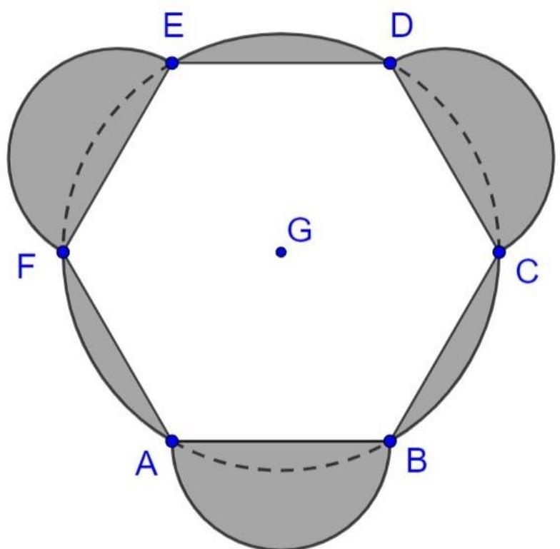
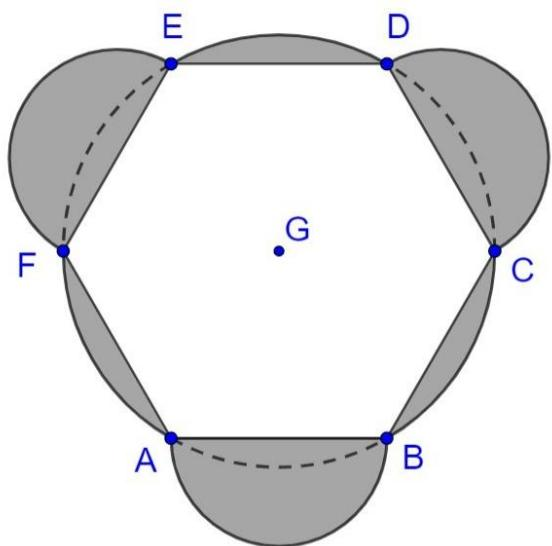
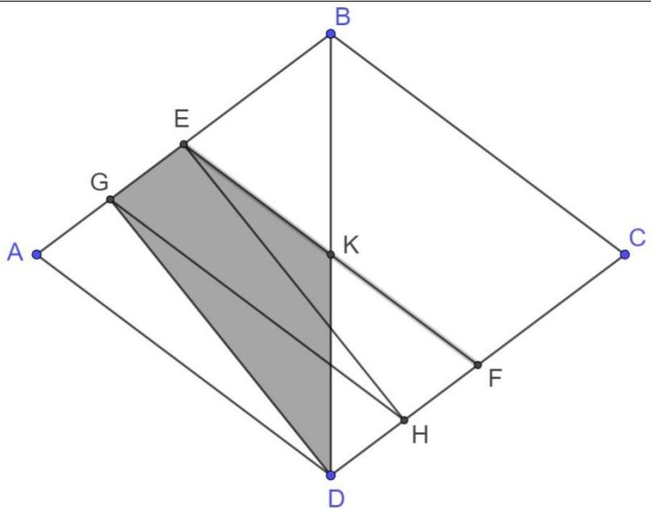
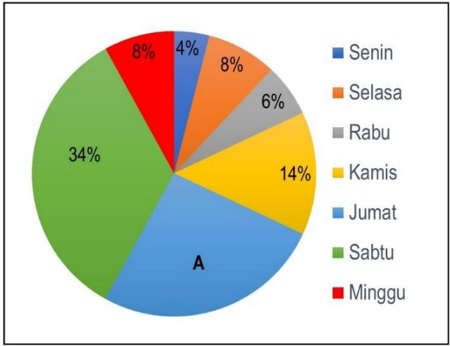

INDIKATOR DAN SOAL KSN 2021 URAIAN

<table><tr><td>No.</td><td>Tingkat Kesulitan</td><td>Soal</td><td colspan="3">Jawaban</td></tr><tr><td>1.</td><td>Mudah</td><td>Perhatikan gambar berikut dengan cermat.Diketahui lingkaran yang berpusat di G dengan diameter 56 cm. Titik A, B, C, D, E, dan F berada pada lingkaran sehingga membentuk segienam beraturan ABCDEF. Sisi AB, CD, dan EF merupakan diameter lingkaran kecil. Tentukan keliling daerah yang diarsir.</td><td colspan="3">Penyelesaian:Jika dibuat garis AD, BE dan CF maka segienam beraturan ABCDEF akan terbagi menjadi 6 segitiga samasisi.Panjang sisi segienam sama sisi sama dengan jari-jari lingkaran yaitu 28 cm ....(0,5)Keliling segienam = <eq>28 \times 6 = 168</eq>Keliling Lingkaran besar =<eq>2 \times \pi \times r = 2 \times \frac{22}{7} \times 28 = 176</eq>......(0,5)busur AF + busur BC + busur DE =<eq>\frac{\text{kel.lingkaran besar}}{2} = \frac{176}{2} = 88</eq> ......(0,5)Diameter lingkaran kecil = 28 cm</td></tr><tr><td></td><td></td><td></td><td colspan="3">Busur AB = setengah lingkaran kecil= <eq>\frac{1}{2} \times 2 \times \frac{22}{7} \times 14 = 44</eq> ..... (0,5)Busur AB + Busur DC + busur EF = 3 ×busur AB = 3 × <eq>\left( \frac{1}{2} \times 2 \times \frac{22}{7} \times 14 \right) = 132</eq> ..... (0,5)Keliling daerah yang diarsir = keliling segienam ABCDEF + (3 x busur AF) + (3 ×busur AB) = 168 + 88 + 132 = 388 cm ..... (0,5)Jawaban benar tetapi tidak menjelaskan/menguraikan skor..... (1).</td></tr><tr><td>2.</td><td>Sukar</td><td>Perhatikan gambar belah ketupat ABCD. Titik E di tengah AB dan titik G di tengah AE. Titik F di tengah CD dan titik H di tengah DF.Jika BD = 6 cm, AB = 5 cm maka tentukan luas daerah yang diarsir.</td><td colspan="3">Tinggi segitiga sama kaki ABD = <eq>\sqrt{5^{2} - 3^{2}} = \sqrt{16} = 4</eq> ..... (0,5)Luas belah ketupat = 2 x Luas segitiga samakaki = 2 x <eq>\frac{1}{2}</eq> x a x t =2 x <eq>\frac{1}{2}</eq> x 6 x 4 = 24 ..... (0,5)Luas tiap segitiga yang kongruen dengan ADG adalah = <eq>\frac{24}{8} = 3</eq> ..... (0,5)Luas segitiga DFK= <eq>\frac{1}{2} \times DK \times tinggi = \frac{1}{2} \times 3 \times \left( \frac{1}{2} CK \right) = \frac{1}{2} \times 3 \times 2 = 3</eq> ..... (0,5)Luas daerah yang diarsir = Luas DGH+Luas GHE+Luas HEF-Luas DFK=.3×Luas ADG-Luas DFK=3 × 3 - 3 = 6 ..... (1)Jika hanya menjawab tanpa menguraikan skor (1)</td></tr><tr><td>3.</td><td>Mudah</td><td>Aksa, Budi dan Caca membaca buku kumpulan dongeng. Aksa membaca dari halaman 34 sampai dengan 58. Budi membaca dari halaman 75 sampai dengan 125, dan Caca membaca dari halaman 170 sampai dengan 271. Jumlah total seluruh halaman buku yang di baca oleh mereka adalah ....</td><td colspan="3">Jawab :Jumlah halaman yang di baca aksa = <eq>58 - 34 + 1 = 25</eq> poin 0,75Jumlah halaman yang di baca budi = <eq>125 - 75 + 1 = 51</eq> poin 0,75Jumlah halaman yang di baca caca = <eq>271 - 170 + 1 = 102</eq> poin 0,75Maka jumlah halaman yang di baca mereka = <eq>25 + 51 + 102 = 178</eq> poin 0,75Jika menjawab benar tanpa menguraikan skor 1</td></tr><tr><td>4.</td><td>Sedang</td><td>Tentukan jumlah seluruh bilangan antara 6 dan 99 yang habis dibagi 7 tetapi tidak habis dibagi 4.</td><td colspan="3">Jawab:Cara I</td></tr><tr><td></td><td></td><td>Find the sum of all numbers between 6 and 99 which are divisible by 7 but not divisible by 4.</td><td colspan="3">Bilangan di antara 6 dan 99 yang habis dibagi 7 adalah 7, 14, 21, 28, ..., 98, sehingga jumlahnya adalah <eq>7+14+21+28+...+98 = 735</eq>......(1)Bilangan di antara 6 dan 99 yang habis dibagi 7 dan 4 adalah 28, 56, 84, sehingga jumlahnya adalah <eq>28+56+84 = 168</eq>......(1)Dengan demikian, jumlah bilangan di antara 6 dan 99 yang habis dibagi 7 tetapi tidak habis dibagi 4 adalah c = 735 – 168 = 567 ......(1)Cara IIBilangan di antara 6 dan 99 yang habis dibagi 7 tetapi tidak habis dibagi 4 adalah7, 14, 21, 35,42, 49,63,70, 77, 91, 98. ...(1.5)Hasil penjumlahannya adalah<eq>7+14+21+35+42+49+63+70+77+91+98=567</eq> (1.5)Jika menjawab benar tanpa menguraikan skor (1)</td></tr><tr><td>5.</td><td>Sedang</td><td>Piala Dunia sepak bola dilangsungkan setiap 4 tahun sekali. Piala Dunia pertama diadakan pada tahun 1930. Dalam sejarahnya Piala Dunia pernah tidak diadakan 2 kali karena perang dunia II. Tepat satu tahun setelah perayaan satu abad kemerdekaan Indonesia, tim Nasional Sepakbola Indonesia diharapkan bisa mengikuti putaran final Piala Dunia pada tahun tersebut. Tentukan Piala Dunia keberapa yang ingin diikuti tim nasional Indonesia.</td><td colspan="3">Tahun penyelenggaraan piala dunia membentuk barisan aritmatika dengan beda 4 tahun.Tahun Piala dunia pertama = <eq>u_{1} = 1930 = (4 \times 1) + 1926</eq>Tahun Piala dunia kedua = <eq>u_{2} = 1934 = (4 \times 2) + 1926</eq>Sehingga piala dunia ke-n = <eq>u_{n} = (4 \times n) + 1926 = 4n + 1926</eq> ......(1)Indonesia merayakan 1 abad kemerdekaan pada tahun 2045. Ini berarti akan diadakan piala dunia tahun 2046.Jika <eq>U_{n} = 2046</eq> maka2046 = 4n + 19264n = 120n = 30......(1)Jadi 2046 berdasarkan rumus merupakan piala dunia yang ke-30. Akan tetapi karena ada 2 piala dunia yang batal diadakan maka piala dunia yang diikuti menjadi piala dunia yang ke-28.......(1)Jika menjawab benar tanpa menguraikan skor (1)</td></tr><tr><td>6.</td><td>sukar</td><td>Terdapat lima kotak A, B, C, D, dan E berisi buah dengan berat masing-masing 7 kg, 3 kg, 6 kg, 2 kg, dan 18 kg. Setiap kotak hanya berisi satu jenis buah, yaitu apel atau pisang. Jika berat total semua buah pisang adalah 3 kali berat semua buah apel dan kotak B berisi buah pisang, maka tentukan kotak mana yang berisi apel.</td><td colspan="3">Jumlahan semua berat kotak = 7 kg + 3 kg + 6 kg + 2 kg + 18 kg = 36 kg = berat pisang + berat apel ......(0.5)Pisang = 3 x apelPisang + apel = 3 apel + apel4 apel = 36 kgApel = 9 kg dan pisang =27 kg ......(1)Maka terdapat dua kotak yang berisi apel yaitu kotak A dan kotak D ......(1.5)Jika menjawab benar tanpa menguraikan skor (1)</td></tr><tr><td rowspan="4">7.</td><td rowspan="4">Sedang</td><td rowspan="4">Data penjualan masker pelindung dari Covid-19 selama tujuh hari dari suatu Apotek disajikan dalam diagram lingkaran sebagai berikut.</td><td colspan="3">Jawab4%+8%+6%+14%+A+34%+8%=100%74%+A=100% maka A=26% ......(1)Sehingga:</td></tr><tr><td>Senin</td><td>4%</td><td>6</td></tr><tr><td>Selasa</td><td>8%</td><td>12</td></tr><tr><td>Rabu</td><td>6%</td><td>9</td></tr></table>

<table><tr><td>No.</td><td>Tingka t Kesulitan</td><td>Soal</td><td colspan="4">Jawaban</td></tr><tr><td rowspan="6"></td><td rowspan="6"></td><td rowspan="6">Jika total penjualan masker tersebut dari hari Senin sampai Minggu adalah 150 kotak, maka tentukan rata-rata penjualan masker hari Jumat, Sabtu, dan Minggu.</td><td>Kamis</td><td>14%</td><td>21</td><td rowspan="5"></td></tr><tr><td>Jumat</td><td>A=26%</td><td>39......(1)</td></tr><tr><td>Sabtu</td><td>34%</td><td>51</td></tr><tr><td>Minggu</td><td>8%</td><td>12</td></tr><tr><td></td><td>100%</td><td>150</td></tr><tr><td colspan="4">Maka rata-rata penjualan Jumat Sabtu, dan Minggu adalah : (39+51+12)/3=34 kotak ......(1)Jika menjawab benar tanpa menguraikan skor (1)</td></tr><tr><td>8.</td><td>Sukar</td><td>Usia sembilan orang diurutkan dari yang termuda sampai tertua. Lima tahun yang lalu rata-rata usia lima orang pertama adalah 39 tahun, dan rata-rata usia lima orang terakhir adalah 63 tahun. Jika sekarang rata-rata usia 9 orang ini sama dengan usia orang yang ke lima, maka tentukan usia minimum orang tertua saat ini.</td><td colspan="4">Jawab:Jumlah usia 5 orang termuda 5 tahun yang lalu adalah 39 × 5 = 195Maka jumlah usia 5 orang termuda saat ini adalah 195 + 25 = 220 ......(0,5)Jumlah usia 5 orang tertua 5 tahun yang lalu 63 × 5 = 315Maka jumlah usia 5 orang tertua saat ini adalah 315 + 25 = 340 ......(0,5)Berarti saat ini jumlah usia lima orang termuda ditambah usia lima orang tertua adalah 220 + 340 = 560, maka orang ke-5 terhitung usianya dua kali ......(0,5)</td></tr><tr><td></td><td></td><td></td><td colspan="4">Misalkan S adalah jumlah usia 9 orang saat ini.Maka rata-rata usia kesembilan orang tersebut adalah <eq>\frac{1}{9}S = usia\ orang\ ke - 5</eq> ......(0,5)Jadi <eq>S + \frac{1}{9}S = 560</eq><eq>S = 560 \times \frac{9}{10} = 504</eq>Orang ke-5 memiliki usia <eq>\frac{504}{9} = 56</eq> ......(0,5)Jumlah usia 4 orang tertua adalah 340 – 56 = 284 sehingga rata-ratanya adalah 71.Jadi usia minimum orang tertua adalah 71. ......(0,5)Jika menjawab benar tanpa menguraikan skor (1)</td></tr><tr><td>9.</td><td>Sedang</td><td>Terdapat dua kotak yaitu kotak I dan kotak II yang berisi kartu mainan. Kotak I berisi 8 kartu yang bertuliskan angka 1, 2, 3, 4, 5, 6, 7 dan 8. Kotak II berisi 9 kartu yang bertuliskan huruf A, E, I, O, U, W, X, Y, dan Z. Semua kartu di kotak I akan dipasangkan dengan kartu di kotak II dengan ketentuan sebagai berikut:i. Kartu angka ganjil di kotak I dipasangkan dengan kartu huruf konsonan di kotak II.ii. Kartu angka genap di kotak I dipasangkan dengan kartu huruf vokal di kotak II.Tentukan banyak cara memasangkan semua kartu di kotak I dengan kartu dikotak II.</td><td colspan="4">Banyaknya cara memasangkan kartu angka ganjil (angka 1, 3, 5, dan 7) ke kartu konsonan (W, X, Y, dan Z) adalah <eq>4 \times 3 \times 2 \times 1 = 24</eq> ......(1)Banyaknya cara memasangkan kartu angka genap (angka 2, 4, 6, dan 8) ke kartu vokal (A, E, I, O dan U) adalah <eq>5 \times 4 \times 3 \times 2 = 120</eq> ......(1)Jadi banyaknya cara adalah <eq>24 \times 120 = 2880</eq> ......(1)Jika menjawab benar tanpa menguraikan skor (1)</td></tr><tr><td>10.</td><td>Sukar</td><td>Suatu bilangan asli a disebut bilangan seimbang bila terdapat bilangan asli b sehingga a – b dan a + b adalah bilangan kuadrat. Sebagai contoh 68 adalah bilangan seimbang karena <eq>68 + 32 = 100 = 10^{2}</eq> dan <eq>68 - 32 = 36 = 6^{2}</eq>. Tentukan banyaknya bilangan seimbang yang kurang dari 68.</td><td colspan="4">Jawab :Cara I:Misalkan a adalah bilangan seimbang maka ada bilangan b sehingga a – b dan a + b adalah bilangan kuadrat.Misalkan <eq>a - b = p^{2}</eq> dan <eq>a + b = q^{2}</eq> sehingga diperoleh</td></tr><tr><td></td><td></td><td></td><td colspan="4"><eq>a = \frac{p^{2} + q^{2}}{2}</eq>Karena <eq>a</eq> bilangan asli maka <eq>p^{2} + q^{2}</eq> genap sehingga <eq>p^{2}</eq> dan <eq>q^{2}</eq> sama-sama genap atau <eq>p^{2}</eq> dan <eq>q^{2}</eq> sama-sama ganjili. Jika <eq>p = 1</eq> maka <eq>q</eq> ada 5 kemungkinanii. Jika <eq>p = 3</eq> maka <eq>q</eq> ada 4 kemungkinaniii. Jika <eq>p = 5</eq> maka <eq>q</eq> ada 2 kemungkinan .....(1,25)iv. Jika <eq>p = 0</eq> maka <eq>q</eq> ada 5 kemungkinanv. Jika <eq>p = 2</eq> maka <eq>q</eq> ada 4 kemungkinanvi. Jika <eq>p = 4</eq> maka <eq>q</eq> ada 3 kemungkinan .....(1,25)Jadi terdapat 23 bilangan seimbang yang kurang dari 23 .....(0,5)Cara II:<eq>2+2 = 4 = 2^{2}</eq> dan <eq>2 - 2 = 0</eq><eq>5 + 4 = 9 = 3^{2}</eq> dan <eq>5 - 4 = 1 = 1^{2}</eq><eq>8 + 8 = 16 = 4^{2}</eq> dan <eq>8 - 8 = 0</eq><eq>10 + 6 = 16 = 4^{2}</eq> dan <eq>10 - 6 = 4 = 2^{2}</eq><eq>13 + 12 = 25 = 5^{2}</eq> dan <eq>13 - 12 = 1 = 1^{2}</eq><eq>17 + 8 = 25 = 5^{2}</eq> dan <eq>17 - 8 = 9 = 3^{2}</eq><eq>18 + 18 = 36 = 6^{2}</eq> dan <eq>18 - 18 = 0</eq><eq>20 + 16 = 36 = 6^{2}</eq> dan <eq>20 - 16 = 4 = 2^{2}</eq><eq>25 + 24 = 49 = 7^{2}</eq> dan <eq>25 - 24 = 1 = 1^{2}</eq><eq>26 + 10 = 36 = 6^{2}</eq> dan <eq>26 - 10 = 16 = 4^{2}</eq><eq>29 + 20 = 49 = 7^{2}</eq> dan <eq>29 - 20 = 4 = 2^{2}</eq><eq>32 + 32 = 64 = 8^{2}</eq> dan <eq>32 - 32 = 0</eq><eq>34 + 30 = 64 = 8^{2}</eq> dan <eq>34 - 30 = 4 = 2^{2}</eq><eq>37 + 12 = 49 = 7^{2}</eq> dan <eq>37 - 12 = 25 = 5^{2}</eq><eq>40 + 24 = 64 = 8^{2}</eq> dan <eq>40 - 24 = 16 = 4^{2}</eq><eq>41 + 40 = 81 = 9^{2}</eq> dan <eq>41 - 40 = 1 = 1^{2}</eq></td></tr><tr><td></td><td></td><td></td><td colspan="4"><eq>45 + 36 = 81 = 9^{2}</eq> dan <eq>45 - 36 = 9 = 3^{2}</eq><eq>50 + 50 = 100 = 10^{2}</eq> dan <eq>50 - 50 = 0</eq><eq>52 + 48 = 100 = 10^{2}</eq> dan <eq>52 - 48 = 4 = 2^{2}</eq><eq>53 + 28 = 81 = 9^{2}</eq> dan <eq>53 - 28 = 25 = 5^{2}</eq><eq>58 + 42 = 100 = 10^{2}</eq> dan <eq>58 - 42 = 16 = 4^{2}</eq><eq>61 + 60 = 121 = 11^{2}</eq> dan <eq>61 - 60 = 1 = 1^{2}</eq><eq>65 + 16 = 81 = 9^{2}</eq> dan <eq>65 - 16 = 49 = 7^{2}</eq><eq>65 + 56 = 121 = 11^{2}</eq> dan <eq>65 - 56 = 9 = 3^{2}</eq>Terdapat 23 kemungkinan, jika terdapat bilangan seimbang yang sama dihitung satu kemungkinanMenjawab kurang dari 5 kemungkinan....(0,5)Menjawab 5 - 10 kemungkinan....(1)Menjawab 11 - 15 kemungkinan....(1,5)Menjawab 16 - 20 kemungkinan....(2)Menjawab 21-22 kemungkinan....(2,5)Menjawab 23 kemungkinan....(3)Jika menjawab benar tanpa menguraikan skor (0,5)</td></tr></table>