## Indikator dan Soal KSN 2021 Tingkat Nasional

## Isian Singkat

<table><tr><td>No</td><td>SOAL</td><td>Kategori</td><td colspan="5">JAWABAN</td></tr><tr><td>1.2.</td><td>Dua buah jam dinding disetel pada hari dan jam yang sama.Setelah 24 jam, jam dinding pertama lebih lambat 12 detik sedangkan jam dinding kedua lebih cepat 36 detik. Kedua jam dinding tersebut akan berbeda 15 menit setelah ... jam.Perhatikan petak <eq>n \times n</eq> yang berisi pola bilangan sebagai berikut: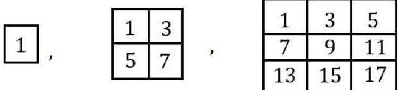,....Pola ke-1 Pola ke-2 Pola ke-3Pola bilangan yang terletak di pojok kanan bawah pada petak ke-1 adalah 1, pada petak ke-2 adalah 7, dan pada petak ke-3 adalah 17. Maka bilangan yang terletak di pojok kanan bawah pada petak ke-25 adalah ...</td><td>MudahMudah</td><td colspan="5">Jawaban : 450Dalam 24 jam, kedua jam selisih <eq>12 + 36 = 48</eq> detik atau 48/60 menit.Maka kedua jam akan berbeda 15 menit setelah :<eq>24 \text{ jam} = \frac{48}{60} \text{ menit}</eq><eq>x \text{ jam} = 15 \text{ menit}</eq><eq>24 \times 60 \text{ menit} = \frac{48}{60} \text{ menit}</eq><eq>x \text{ menit} = 15 \text{ menit}</eq><eq>x = \frac{60 \times 15 \times (24 \times 60)}{48} \text{ menit}</eq><eq>x = 27000 \text{ menit}</eq><eq>x = 450 \text{ jam}</eq>Jawaban : 1249Bilangan pojok kanan 1, 7, 17, 31, ...<eq>1 = 2 \times 1^{2} - 1</eq><eq>7 = 2 \times 2^{2} - 1</eq><eq>17 = 2 \times 3^{2} - 1</eq><eq>31 = 2 \times 4^{2} - 1</eq>Sehinggan diperoleh pola <eq>Un = 2 \times n^{2} - 1</eq>Bilangan pada pojok kanan bawah petak ke-25 adalah 2 (25x25) <eq>-1 = 1249</eq>.</td></tr><tr><td>3.</td><td>Perhatikan gambar berikut.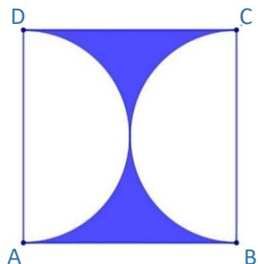ABCD adalah persegi dengan panjang sisinya 21 cm. AD dan BC adalah diameter lingkaran. Maka keliling daerah yang diarsir adalah ... cm. <eq>(\pi = \frac{22}{7})</eq></td><td>Mudah</td><td colspan="5">Jawaban : 108Keliling lingkaran = <eq>2\pi r = 66</eq> cmPanjang <eq>AB + CD = 21 + 21 = 42</eq> cmJadi keliling keseluruhan = 108 cm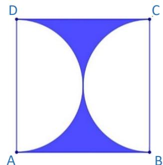</td></tr><tr><td>4.</td><td>Pak Aldi ingin merenovasi lantai rumahnya yang berbentuk persegi panjang dengan ukuran 30 m × 12 m. Rumah tersebut terdiri dari dua ruangan yang sama besar. Bila ruangan I menggunakan lapisan lantai keramik berukukan 25 cm × 25 cm dan ruangan II menggunakan keramik berukuran 50 cm × 50 cm. Maka jumlah minimal keramik yang terpasang ... lusin.</td><td>Mudah</td><td colspan="5">Jawaban : 300Ukuran lantai rumah yang akan dipasang keramik= 30 m × 12 m= 3000 cm × 1200 cm.Ukuran lantai rumah di bagi menjadi 2 bagian sama besar yang akan di pasang keramik jenis I dan II.Sehingga ukuran ruangan = <eq>\frac{3000}{2}</eq> × 1200= 1500 cm × 1200 cmBanyaknya keramik jenis I= <eq>\frac{1500\ cm \times 1200\ cm}{25\ cm \times 25\ cm}</eq>= 60 × 48= 2880 buah= 2880 : 12= 240 lusinBanyaknya keramik jenis II= <eq>\frac{1500\ cm \times 1200\ cm}{50\ cm \times 50\ cm}</eq>= 30 × 24= 720 buah= 720 : 12= 60 lusinJadi, jumlah minimal keramik= 240 + 60= 300 lusin</td></tr><tr><td>5.</td><td>Kota 1 dan kota 5 dihubungkan oleh beberapa jalan melalui kota 2, 3 atau 4.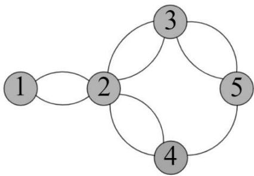Satu bus antarkota berangkat dari kota 1 ke kota 5 dan kembali ke kota 1. Banyak alternatif rute perjalanan yang dapat dipilih dengan tidak melalui jalan yang sama (boleh melalui kota yang sama) adalah ... kemungkinan.</td><td>Sedang</td><td colspan="5">Jawaban : 40Kemungkinan rute perjalanan:K1--- K2--- K3--- K5 --- K3 --- K2 --- K12 . 2 . 2 . 1 . 1 . 1 = 8K1--- K2--- K3--- K5 --- K4 --- K2 --- K12 . 2 . 2 . 1 . 2 . 1 = 16K1--- K2--- K4--- K5 --- K3 --- K2 --- K12 . 2 . 1 . 2 . 2 . 1 = 16Jadi, banyak rute perjalanan adalah 8+16+16 = 40</td></tr><tr><td rowspan="5">6.</td><td rowspan="5">Berikut ini adalah grafik pengguna media sosial pada suatu negara pada tahun 2020 – 2021.</td><td rowspan="5">Mudah</td><td colspan="5">Jawaban : 14,07Sesuai data pada grafik</td></tr><tr><td>MediaSosial</td><td>TH20</td><td>TH21</td><td>SLS</td><td>% naik</td></tr><tr><td>FB</td><td>820</td><td>860</td><td>40</td><td>4.88</td></tr><tr><td>IG</td><td>790</td><td>880</td><td>90</td><td>11.39</td></tr><tr><td>LN</td><td>440</td><td>500</td><td>60</td><td>13.64</td></tr></table>

<table><tr><td>Media Sosial</td><td>TH20</td><td>TH21</td><td>SLS</td><td>% naik</td></tr><tr><td>FB</td><td>820</td><td>860</td><td>40</td><td>4.88</td></tr><tr><td>IG</td><td>790</td><td>880</td><td>90</td><td>11.39</td></tr><tr><td>LN</td><td>440</td><td>500</td><td>60</td><td>13.64</td></tr></table>

<table><tr><td>No</td><td>SOAL</td><td>Kategori</td><td colspan="6">JAWABAN</td></tr><tr><td rowspan="8"></td><td rowspan="8">DATA MEDIA SOSIAL TERPOPULER2020-2021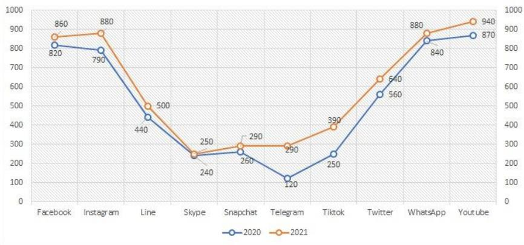Dari grafik tersebut persentase kenaikan pengguna media sosial dari tahun 2020 ke tahun 2021 adalah ...%.</td><td rowspan="8"></td><td rowspan="8"></td><td>SY</td><td>240</td><td>250</td><td>10</td><td>4.17</td></tr><tr><td>SP</td><td>260</td><td>290</td><td>30</td><td>11.54</td></tr><tr><td>TG</td><td>120</td><td>290</td><td>170</td><td>141.67</td></tr><tr><td>TT</td><td>250</td><td>390</td><td>140</td><td>56.00</td></tr><tr><td>TW</td><td>560</td><td>640</td><td>80</td><td>14.29</td></tr><tr><td>WA</td><td>840</td><td>880</td><td>40</td><td>4.76</td></tr><tr><td>YT</td><td>870</td><td>940</td><td>70</td><td>8.05</td></tr><tr><td>Total</td><td>5190</td><td>5920</td><td>730</td><td>14.07</td></tr><tr><td>7.</td><td>Ayu mengerjakan soal matematika 7 menit lebih cepat dari Banu. Sedangkan Banu mengerjakan lebih lambat 5 menit dari Cantika. Cantika mengerjakan 2 menit lebih cepat dari Dino. Jika Dino mampu menyelesaikan pekerjaannya 2 kali lebih cepat daripada Ayu. Rata-rata waktu yang diperlukan oleh mereka berempat untuk menyelesaikan soal matematika adalah ... menit.</td><td>Sedang</td><td colspan="6">Jawaban : 7,25Misalkan:Ayu = aBanu = bCantika = cDino = dBerdasarkan uraian di dapat:a = b - 7b = c + 5c = d - 2d = 2aLalu subtitusikana = b-7=(c+5)-7=((d-2)+5)-7=((2a-2)+5)-7)= 2a - 4a = 4b = 11d = 8c = 6rata - rata = <eq>\frac{4 + 11 + 6 + 8}{4} = 7,25</eq></td></tr><tr><td>8.9.</td><td colspan="3">Misalkan a, b, c dan d adalah bilangan yang memenuhi:5 - 2 × a = 26 - 3 × b = 07 - 4 × c = 28 - 5 × d = 1Nilai a + b + c + d = ...Given the numbers a, b, c and d that satisfy the following conditions:5 - 2 × a = 26 - 3 × b = 07 - 4 × c = 28 - 5 × d = 1The value of a + b + c + d equals ...Bilangan asli terkecil jika ditambah dengan 888 hasilnya habis dibagi 12, 14, dan 18 adalah ....The smallest natural number when added by 888 is a number which can be divided by 12, 14, and 18. The number is ...</td><td>Mudah</td><td colspan="6">Jawaban : 6, 15<eq>\frac{3}{2} + 2 + \frac{5}{4} + \frac{7}{5} = \frac{30 + 40 + 25 + 28}{20} = \frac{123}{20}</eq>= 6,15</td></tr><tr><td></td><td colspan="3"></td><td>Sedang</td><td colspan="6">Jawaban : 120Misalkan bilangan asli terkecil = <eq>x</eq><eq>888 + x = y</eq><eq>x &lt; y</eq>Cari dahulu KPK dari 12, 14 dan 18<eq>12 = 2^{2} \times 3</eq><eq>14 = 2 \times 7</eq><eq>18 = 2 \times 3^{2}</eq>KPK = <eq>2^{2} \times 3^{2} \times 7 = 252</eq><eq>252a = y, a\ bilangan\ asli</eq><eq>a = 1 \Rightarrow 252 \times 1 = 252</eq><eq>a = 2 \Rightarrow 252 \times 2 = 504</eq><eq>a = 3 \Rightarrow 252 \times 3 = 756</eq><eq>a = 4 \Rightarrow 252 \times 4 = 1008</eq>Nilai <eq>a</eq> yang memenuhi adalah <eq>a = 4</eq> dan <eq>y = 1008</eq>Maka nilai <eq>x</eq><eq>888 + x = 1008</eq><eq>x = 1008 - 888</eq><eq>x = 120</eq></td></tr><tr><td>10.</td><td colspan="3">Perhatikan gambar berikut.ABC dan DEF adalah bangun segitiga. D pada sisi AB, E pada sisi BC dan F pada sisi AC.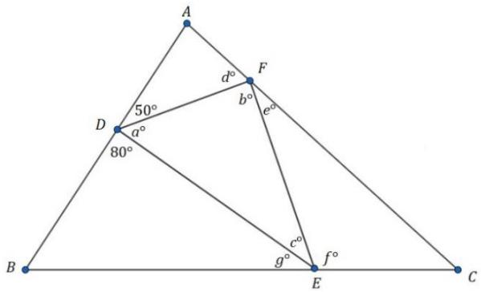Besar <eq>d^{\circ} + e^{\circ} + f^{\circ} + g^{\circ} = \cdots ^{\circ}</eq>Let ABC and DEF are triangles. Points D, E, and F in the line segments AB, BC, and AC, respectively.The sum of <eq>d^{\circ}, e^{\circ}, f^{\circ}</eq> and <eq>g^{\circ}</eq> is ...°</td><td>Sedang</td><td colspan="6">Jawaban : 230Penyelesaian<eq>a^{\circ} = 180^{\circ} - 80^{\circ} - 50^{\circ} = 50^{\circ}</eq><eq>a^{\circ} + b^{\circ} + c^{\circ} = 180^{\circ}</eq><eq>50^{\circ} + b^{\circ} + c^{\circ} = 180^{\circ}</eq><eq>b^{\circ} + c^{\circ} = 130^{\circ}</eq><eq>b^{\circ} + d^{\circ} + e^{\circ} = 180^{\circ}</eq><eq>c^{\circ} + f^{\circ} + g^{\circ} = 180^{\circ}</eq><eq>b^{\circ} + d^{\circ} + e^{\circ} + c^{\circ} + f^{\circ} + g^{\circ} = 360</eq><eq>b^{\circ} + c^{\circ} + d^{\circ} + e^{\circ} + f^{\circ} + g^{\circ} = 360</eq><eq>130^{\circ} + d^{\circ} + e^{\circ} + f^{\circ} + g^{\circ} = 360</eq><eq>d^{\circ} + e^{\circ} + f^{\circ} + g^{\circ} = 230</eq></td></tr><tr><td>11.</td><td colspan="3">Berikut ini cara membentuk kata COVID19 dengan menghubungkan huruf atau angka yang berdekatan.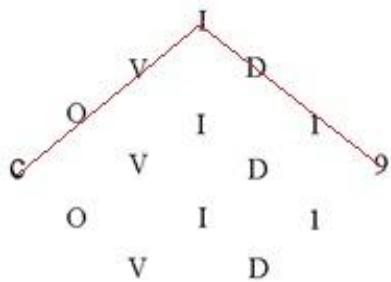I I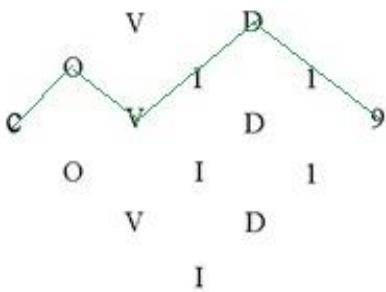Banyak cara (selain contoh) membentuk kata “COVID19” pada gambar tersebut dengan menghubungkan huruf atau angka yang berdekatan adalah ... cara.</td><td>Sedang</td><td colspan="6">Jawaban : 32Covid atas<eq>1 \times 2 \times 2 \times 2 \times 2 \times 1 \times 1 = 16</eq>Covid bawah <eq>1 \times 2 \times 2 \times 2 \times 2 \times 1 \times 1 = 16</eq>Yang beririsan <eq>1 \times 1 \times 1 \times 2 \times 1 \times 1 \times 1 = 2</eq>Total = 16 + 16 + 2 = 34Jawaban = 34 - 2 (sebagai contoh) = 32</td></tr><tr><td>12.</td><td colspan="3">Diberikan bilangan-bilangan seperti tampak pada gambar berikut: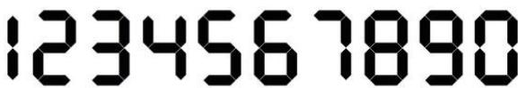Bilangan Rotasi adalah bilangan yang jika diputar 180 derajat hasilnya merupakan suatu bilangan.</td><td>Sukar</td><td colspan="6">Jawaban : 306Untuk membentuk bilangan rotasi angka yang bisa dipakai adalah 0,1,2,5,6,8,9.Karena hasil rotasi bilangan rotasi merupakan bilangan di antara 1000 dan 2021 maka bilangan rotasi yang diminta merupakan bilangan 4 angka.</td></tr><tr><td rowspan="4"></td><td colspan="3">Contoh:</td><td rowspan="4"></td><td colspan="6" rowspan="4">Kasus bilangan 4 angka __ __ __ __Jika digit satuannya 1 yaitu bilangan dengan bentuk __ ____ 1, makai. digit puluhan ada 7 kemungkinan :0,1,2,5,6,8,9ii. digit ratusan ada 7 kemungkinan :0,1,2,5,6,8,9iii. digit ribuan ada 6 kemungkinan: 1,2, 5,6, 8,9Jadi banyaknya rotasi 4 angka yang diakhiri 1 adalah <eq>6 \times 7 \times 7 = 294</eq>Jika digit satuannya 2 yaitu bilangan dengan bentuk __ ____ 2, makai. digit puluhan kemungkinannya hanya 0,ii. digit ratusan kemungkinannya adalah 0, 1 atau 2.Jika digit ratusan 2 maka digit ribuannya adalah 0 atau1 tapi angka yang terbentuk adalah 0202 dan 1202.Kedua bilangan ini tidak memenuhi.Jika digit ratusan 1 maka digit ribuannya kemungkinannya adalah 1,2,5,6,8,9Jika digit ratusan 0 maka digit ribuannya kemungkinannya adalah 1,2,5,6,8,9Banyaknya bilangan rotasi 4 angka dalam yang diakhiri2 adalah <eq>6 + 6 = 12</eq> bilangan.Banyaknya bilangan rotasi yang diminta adalah <eq>294 + 12 = 306</eq> bilangan.</td></tr><tr><td>25</td><td>Jika diputar 180 derajat menjadi</td><td colspan="4">52</td></tr><tr><td>36</td><td>Jika diputar 180 derajat menjadi</td><td colspan="4">9E</td></tr><tr><td colspan="6">Jadi 25 merupakan bilangan rotasi, sedangkan 36 bukan merupakan bilangan rotasi.Banyak Bilangan Rotasi yang hasil rotasinya lebih dari 1000 dan kurang dari 2021 adalah ... .</td></tr><tr><td>13.</td><td>Dua kotak masing-masing berisi 6 buah mangga, mempunyai rata-rata berat 0,45 kg dan 0,48 kg. Sebuah mangga di kotak I dan sebuah mangga di kotak II ditukarkan, sehingga rata-rata berat mangga pada kedua kotak menjadi sama. Selisih berat kedua mangga yang saling ditukar adalah ... ons.</td><td>Sedang</td><td colspan="6">Jawaban : 0,9Misalkan mangga yang ditukar nilainya adalah a dan b, maka: (6 x 0,45) - a + b = (6 x 0,48) - b + a(2,7) - a + b = (2,88) - b + a- a + b + b - a = 2,88 - 2,7- 2a + 2b = 0,18b - a = 0,09 kg= 0,9 ons</td></tr><tr><td>14.</td><td>Misalkan a, b, c, d, e adalah bilangan prima yang memenuhi(a + b + c)(d + e) = 3553Maka nilai terbesar yang mungkin dari a, b, c, d, e adalah ...</td><td>Sedang</td><td colspan="6">Jawab: 181Faktor prima dari 3553 adalah 11,17 dan 19. Sehingga nilai yang mungkin untuk a + b + c, d + e adalah sebagai berikut:a + b + c d + e11 32317 20919 187323 11209 17187 19Karena d, e bilangan prima, maka salah satu dari d atau e haruslah bilangan prima genap yaitu 2.Misalkan d=2Untuk d + e = 323, maka e=321 (bukan prima)Untuk d+e=209, maka e=207(bukan prima)</td></tr></table>

<table><tr><td>a + b + c</td><td>d + e</td></tr><tr><td>11</td><td>323</td></tr><tr><td>17</td><td>209</td></tr><tr><td>19</td><td>187</td></tr><tr><td>323</td><td>11</td></tr><tr><td>209</td><td>17</td></tr><tr><td>187</td><td>19</td></tr></table>

<table><tr><td>No</td><td>SOAL</td><td>Kategori</td><td colspan="12">JAWABAN</td></tr><tr><td></td><td></td><td></td><td colspan="12">Untuk d+e = 187, maka e=185(bukan prima).Untuk d+e=11, maka e=9(bukan prima)Untuk d+e=17, maka e=15(bukan prima)Untuk d+e=19, maka e=17(prima).Jadi yang mungkin hanya <eq>d + e = 19</eq>,<eq>a + b + c = 187</eq>.Supaya diperoleh bilangan prima terbesar dari <eq>a</eq>,<eq>b</eq>,<eq>c</eq>,<eq>d</eq> dan <eq>e</eq>, maka<eq>a = 3</eq>,<eq>b = 3</eq>,<eq>c = 181</eq>.Jadi bilangan prima terbesar yang mungkin adalah 181.</td></tr><tr><td>15.</td><td><eq>\left( \frac{2x5+2}{3x6+2} \right) \cdot \left( \frac{4x7+2}{5x8+2} \right) \cdot \left( \frac{6x9+2}{7x10+2} \right) \cdot \dots \cdot \left( \frac{20x23+2}{21x24+2} \right) = \dots</eq></td><td>Sukar</td><td colspan="12">Jawaban :<eq>\frac{3}{23}</eq><eq>n(n + 3) + 2 = n^{2} + 3n + 2 = (n + 1)(n + 2)</eq><eq>\frac{2x5+2}{3x6+2} \cdot \frac{4x7+2}{5x8+2} \cdot \frac{6x9+2}{7x10+2} \cdot \frac{8x11+2}{9x12+2} \dots \frac{20x23+2}{21x24+2} = \frac{3x4}{4x5} \frac{5x6}{6x7} \frac{7x8}{8x9} \dots \frac{21x22}{22x23}</eq><eq>= \frac{3}{23}</eq></td></tr><tr><td>16.</td><td>Misalkan <eq>abcde</eq> adalah bilangan lima digit berbeda sehingga bilangan dua digit <eq>ab</eq>,<eq>bc</eq>,<eq>cd</eq>,<eq>de</eq> merupakan bilangan prima.Selisih antara bilangan <eq>abcde</eq> terbesar dan terkecil yang mungkin adalah ...</td><td>Sedang</td><td colspan="12">Jawaban : 66552Untuk mendapatkan bilangan <eq>abcde</eq> terbesar yang memenuhi <eq>ab</eq>,<eq>bc</eq>,<eq>cd</eq>,<eq>de</eq> bilangan prima, maka dipilih ab bilangan prima 2 angka terbesar, yaitu 89 dan 97 (Jika 97 tidak mungkin karena digit akan berulang), jadi 89 sehingga a = 8 dan b = 9.</td></tr><tr><td></td><td></td><td></td><td colspan="12">9c dipilih bilangan prima terbesar yang mungkin, yaitu 97 jadi c=7,7d bilangan prima terbesar, yaitu 73 jadi d=3,3e bilangan prima terbesar yaitu 31 atau 37 (37 tidak mungkin) maka e=1.Sehingga bilangan terbesar abcde adalah 89731.Untuk mendapatkan bilangan abcde terkecil yang memenuhi ab, bc, cd, de bilangan prima, maka dipilih ab bilangan prima 2 angka terkecil, yaitu 13, 17, 19, 23, 29.b, c, d, e ganjil dan tidak sama dengan 5. Sehingga b, c, d, dan e harus 1, 3, 7, 9. Sehingga a harus genap. Supaya ab bilangan prima terkecil dan a nya genap maka a = 2. Supaya menjadi bilangan terkecil maka ab = 23, bc = 31, cd = 17, dan de = 79.Jadi didapat 23179Sehingga selisih antara bilangan terbesar dan terkecil adalah 89731 - 23179 = 66552</td></tr><tr><td rowspan="6">17.</td><td rowspan="6">Misalkan diberikan pola bilangan berikut ini:x, 18, 36, 76, 149, 266, y. Nilai dari <eq>x^{2} + y^{2}</eq> adalah ...</td><td rowspan="6">Sukar</td><td colspan="12">Jawaban : 191965Perhatikan bahwa:</td></tr><tr><td>X</td><td></td><td>18</td><td></td><td>36</td><td></td><td>76</td><td></td><td>149</td><td></td><td>266</td><td></td></tr><tr><td></td><td>18-x</td><td></td><td>18</td><td></td><td>40</td><td></td><td>73</td><td></td><td>117</td><td></td><td>y-266</td></tr><tr><td></td><td></td><td>11</td><td></td><td>22</td><td></td><td>33</td><td></td><td>44</td><td></td><td>55</td><td></td></tr><tr><td></td><td>11</td><td></td><td>11</td><td></td><td>11</td><td></td><td>11</td><td></td><td>11</td><td></td><td>11</td></tr><tr><td colspan="12">Sehingga diperoleh:<eq>18 - x = 18 - 11</eq><eq>x = 11</eq>dan<eq>y - 266 = 117 + 55</eq><eq>y = 438</eq>Nilai dari <eq>x^{2} + y^{2}</eq> adalah 191965</td></tr><tr><td>18.</td><td>Perhatikan gambar berikut dengan cermat.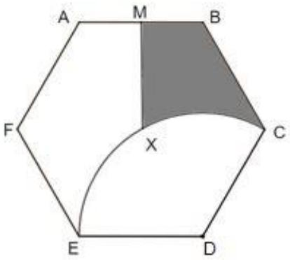Luas segienam beraturan ABCDEF adalah 1 satuan luas. <eq>M</eq> adalah titik tengah AB. Titik <eq>D</eq> merupakan pusat lingkaran yang melewati titik C dan E. Titik X merupakan pusat segienam ABCDEF. Luas daerah yang diarsir adalah ...</td><td>Sukar</td><td colspan="12">Jawaban : <eq>\frac{5}{12} - \frac{1}{27}\pi\sqrt{3}</eq>Misalkan sisi segienam ABCDEF adalah <eq>s</eq>. Segienam beraturan dapat dibagi menjadi 6 bagian segigitiga sama sisi yang kongruen.Dengan menggunakan Pythagoras kita peroleh tinggi segitiga sama sisi adalah <eq>\frac{1}{2}s\sqrt{3}</eq>. Karena luas segitiga tersebut adalah <eq>\frac{1}{6}</eq> makakalas <eq>\times</eq> tinggi<eq>\frac{1}{2} = \frac{\frac{1}{2}s\sqrt{3} \times s}{2} = \frac{1}{6}</eq><eq>s^{2} = \frac{2}{9}\sqrt{3}</eq>Perhatikan gambar berikut:</td></tr><tr><td></td><td>Catatan, jika jawaban:<eq>2\pi</eq> ditulis 2 pi<eq>\sqrt{a}</eq> ditulis akar <eq>a</eq><eq>a^{3}</eq> ditulis <eq>a</eq> pangkat 3<eq>60^{\circ}</eq> ditulis 60 derajat<eq>\frac{a}{b}</eq> ditulis <eq>a/b</eq></td><td></td><td colspan="12">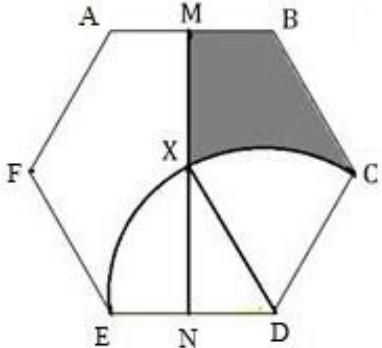Luas daerah yang diarsir = Luas <eq>BCDNM - Luas</eq> <eq>DNC</eq>Luas <eq>DXC</eq>Luas <eq>BCDNM = \frac{1}{2}</eq> segienam = <eq>\frac{1}{2}</eq>Luas <eq>DNC = \frac{1}{2} \left( \frac{1}{6} \right) = \frac{1}{12}</eq>Luas <eq>DXC = \frac{60}{360} \pi s^{2} = \frac{1}{6} \pi \left( \frac{2}{9} \sqrt{3} \right) = \frac{1}{27} \pi \sqrt{3}</eq>Jadi luas yang diarsir = <eq>\frac{1}{2} - \frac{1}{12} - \frac{1}{27} \pi \sqrt{3}</eq>= <eq>\frac{5}{12} - \frac{1}{27} \pi \sqrt{3}</eq></td></tr><tr><td>19.</td><td>Perhatikan sketsa vas bunga berikut ini, vas bunga tersebut merupakan gabungan dari dua kerucut.</td><td>Sukar</td><td colspan="12">Jawaban: <eq>37\pi</eq>Berdasarkan konsep proporsi Euclid, maka jari-jari lingkaran terkecil adalah <eq>\frac{1}{2}</eq> cm.Misalkan:<eq>V_{1}</eq> = volume kerucut terpancung besar</td></tr><tr><td></td><td>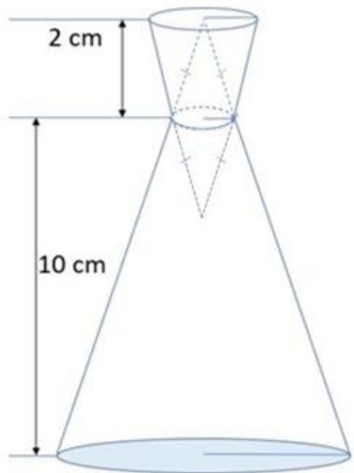Jika diameter bagian bawah dan atas vas bunga berturut-turut 6 cm dan 2 cm maka volume vas bunga adalah ... <eq>cm^3</eq>.</td><td></td><td colspan="12"><eq>V_2 = \text{volume kerucut terpancung kecil}</eq><eq>V\ker\text{cut terpancung} = \frac{1}{3}\pi t(R^2 + R \cdot r + r^2)</eq>Sehingga:<eq>V_1 = \frac{10}{3}\pi \left(3^2 + 3 \cdot \frac{1}{2} + \frac{1}{4}\right)</eq><eq>V_1 = \frac{10}{3}\pi \left(9 + \frac{6}{4} + \frac{1}{4}\right)</eq><eq>V_1 = \frac{10}{3}\pi \left(\frac{43}{4}\right)</eq><eq>V_1 = \frac{430}{12}\pi</eq><eq>V_2 = \frac{2}{3}\pi \left(1^2 + 1 \cdot \frac{1}{2} + \frac{1}{4}\right)</eq><eq>V_2 = \frac{2}{3}\pi \left(\frac{7}{4}\right)</eq><eq>V_2 = \frac{14}{12}\pi</eq>Maka volume vas bunga:<eq>V_T = V_1 + V_2</eq><eq>= \frac{430}{12}\pi + \frac{14}{12}\pi</eq><eq>= \frac{444}{12}\pi</eq><eq>= 37\pi</eq></td></tr><tr><td>20.</td><td>Pada permainan catur, langkah kuda menyerupai huruf L seperti gambar berikut.</td><td>Sukar</td><td colspan="12">Jawaban : 10</td></tr></table>

<table><tr><td>No</td><td colspan="2">SOAL</td><td>Kategori</td><td>JAWABAN</td></tr><tr><td rowspan="6"></td><td>5</td><td rowspan="5">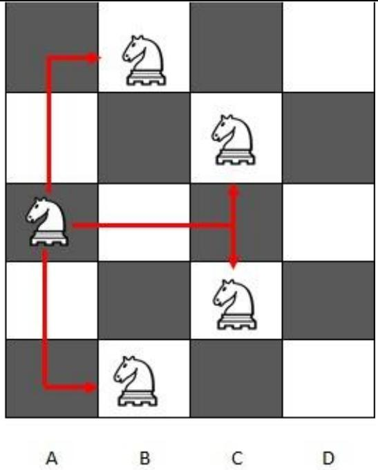</td><td rowspan="6"></td><td rowspan="6">Langkahnya dari A2 – C3 – D1 – B2 – D3 – C1 – B3 – A1 – C2 – A3 – B1Karena kuda dari petak putih dan berakhir di petak putih maka banyaknya petak yang ditempati kuda haruslah ganjil.Jumlah petak yang ditempati kuda maksimal 11, sehingga banyaknya langkah genap yaitu 10 langkah.</td></tr><tr><td>4</td></tr><tr><td>3</td></tr><tr><td>2</td></tr><tr><td>1</td></tr><tr><td colspan="2">Langkah kuda dari titik A3 ke B1 dapat ditulis A3-B1.Langkah kuda dari titik A3 ke B5 dapat ditulis A3-B5.Langkah kuda dari titik A3 ke C2 dapat ditulis A3-C2.Langkah kuda dari titik A3 ke C4 dapat ditulis A3-C4.Misalkan kuda bergerak di dalam petak berukuran 3 x 4 seperti di bawah ini.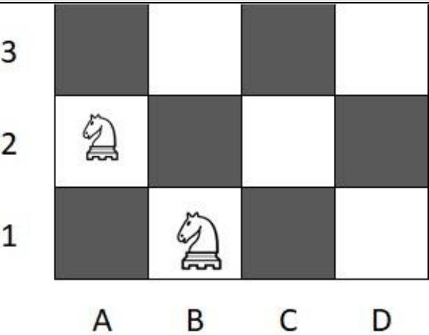Jika posisi awal kuda putih pada petak A2 dan akan melangkah menuju petak B1, maka banyak langkah maksimal dengan syarat tidak boleh menempati petak yang sama adalah ... langkah.</td></tr><tr><td>21.</td><td>Kelompok data yang terdiri dari empat bilangan asli yang berbeda a, b, c, dan d, yang memenuhi:i. <eq>a &lt; b &lt; c &lt; d</eq>ii. Rata-ratanya = c +1iii. Faktor persekutuan keempat bilangan hanya 1iv. Data terbesar adalah 23Nilai c terbesar dari semua kelompok yang mungkin adalah ...</td><td>Sukar</td><td colspan="2">Jawaban : 16Karena data terbesar adalah 23 maka rata-rata keempat data maksimal adalah 23.Jika rata-rata = 23 maka data yang mungkin hanya 23, 23, 23, 23 (tidak memenuhi)Jika rata-rata = 22 maka c = 21 sehingga kelompok data yang mungkin adalah 23, 21, 22, 22 (tidak memenuhi)Jika rata-rata = 21 maka c = 20 sehingga kelompok data yang mungkin adalah 23, 20, 19, 22 (tidak memenuhi)Jika rata-rata = 20 maka c = 19 sehingga kelompok data yang mungkin adalah 23, 20, 19, 18 (tidak memenuhi)Jika rata-rata = 19 maka c = 18 sehingga kelompok data yang mungkin adalah 23, 18, 18, 17 (tidak memenuhi)Jika rata-rata = 18 maka c = 17 sehingga kelompok data yang mungkin adalah 23, 17, 16, 16 (tidak memenuhi)Jika rata-rata = 17 maka c = 16 sehingga kelompok data yang mungkin adalah 23, 16, 15, 14 (memenuhi)Jadi nilai c maksimum yang mungkin adalah 16.</td></tr><tr><td>22.</td><td>Irma memiliki ayah, ibu, kakek, dan nenek. Pada tahun 2021 rata-rata usia mereka berlima adalah 33. Usia kakek lebih tua 5 tahun dari usia nenek. Usia rata-rata ayah, ibu, dan Irma adalah 20. Nenek lahir pada tahun ....</td><td>Sukar</td><td colspan="2">Jawaban: 1971<eq>Xk = Xn + 5</eq><eq>\frac{Xa+Xi+Xr+Xk+Xn}{5} = 33</eq><eq>Xa + Xi + Xr + Xk + Xn = 165</eq><eq>\frac{Xa+Xi+Xr}{3} = 20</eq><eq>Xa + Xi + Xr = 60</eq>Sehingga<eq>Xa + Xi + Xr + Xk + Xn = 165</eq><eq>60 + Xk + Xn = 165</eq><eq>Xk + Xn = 105</eq><eq>(Xn + 5) + Xn = 105</eq><eq>2Xn = 105 - 5</eq><eq>Xn = 50</eq>Maka nenek lahir pada tahun= 2021 – 50= 1971</td></tr></table>