## USULAN SOAL KSN TINGKAT NASIONAL BIDANG MATEMATIKA TAHUN 2021

## SOAL EKSPLORASI

<table><tr><td>NO</td><td colspan="4">SOAL</td><td colspan="5">JAWABAN</td></tr><tr><td rowspan="10">1</td><td colspan="4" rowspan="10">Diberikan empat bejana A, B C dan D, masing-masing dengan volume 3,5, 8 dan 12 satuan volume. seperti pada gambar berikut.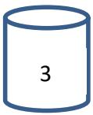 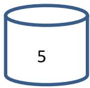 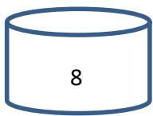 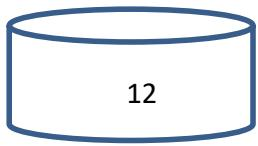A B C DKeempat bejana tersebut berisi cairan berturut-turut 2, 3, 5 dan 8 satuan volume seperti pada gambar berikut.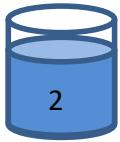 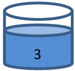 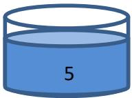 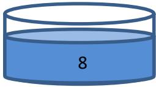A B C DKalian diminta untuk memindahkan cairan pada keempat bejana tersebut dengan cara menuangkan isinya dari satu bejana ke bejana yang lain, sehingga bejana A, B, C dan D tersebut berturut-turut berisi 3, 2, 6 dan 7 satuan volume.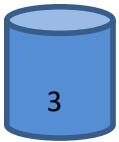 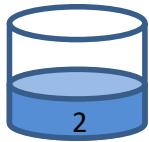 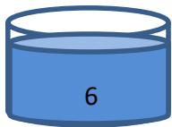 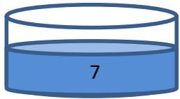A B C DTuliskan setiap langkah kegiatan yang kalian lakukan pada lembar kerja yang telah disediakan sehingga mendapatkan banyak langkah paling sedikit.(Sebelum menjawab simak dan perhatikan video berikut)LINK</td><td colspan="5">Jawab :Langkah terpendek sebagai berikut.</td></tr><tr><td colspan="4">Isi Pada Bejana berukuran(satuan volume)</td><td rowspan="2">Langkah kegiatan</td></tr><tr><td>A</td><td>B</td><td>C</td><td>D</td></tr><tr><td>2</td><td>3</td><td>5</td><td>8</td><td>Kondisi awal</td></tr><tr><td>0</td><td>5</td><td>5</td><td>8</td><td>Memindahkan semua isi bejana A ke bejana B</td></tr><tr><td>0</td><td>1</td><td>5</td><td>12</td><td>Memindahkan Sebagian cairan pada bejana B ke bejana D sehingga bejana D menjadi penuh.</td></tr><tr><td>0</td><td>0</td><td>6</td><td>12</td><td>Memindahkan seluruh isi pada bejana B ke Bejana C</td></tr><tr><td>0</td><td>5</td><td>6</td><td>7</td><td>Memenuhi bejana B dengan memindahkan sebagian cairan pada bejana D</td></tr><tr><td>3</td><td>2</td><td>6</td><td>7</td><td>Memenuhi bejana A dengan Sebagian cairan pada bejana B</td></tr><tr><td colspan="5">Menuliskan 5 langkah atau kurang untuk memperoleh 3,2,6,7 dengan benar bernilai 6Menuliskan 6 langkah untuk memperoleh 3,2,6,7 dengan benar bernilai 5Menuliskan 7-8 langkah untuk memperoleh 3,2,6,7 dengan benar bernilai 4Menuliskan 9-10 langkah untuk memperoleh 3,2,6,7 dengan benar bernilai 3Menuliskan 11-12 langkah untuk memperoleh 3,2,6,7 dengan benar bernilai 2Menuliskan 13-15 langkah untuk memperoleh 3,2,6,7 dengan benar bernilai 1Menuliskan lebih dari 15 langkah atau tidak menghasilkan 3,2,6,7 dengan benar bernilai 0.Setiap langkah yang tidak sesuai aturan dikurangi 0,5 (tidak ada nilai negative)</td></tr><tr><td>2</td><td>Gambar berikut merupakan cakram kode rahasia yang berfungsi untuk mengubah suatu bilangan menjadi bilangan yang baru. Bilangan 35oleh kode 24 diubah menjadi 51 dengan cara memutar searah jarum jam sejauh bilangan kode.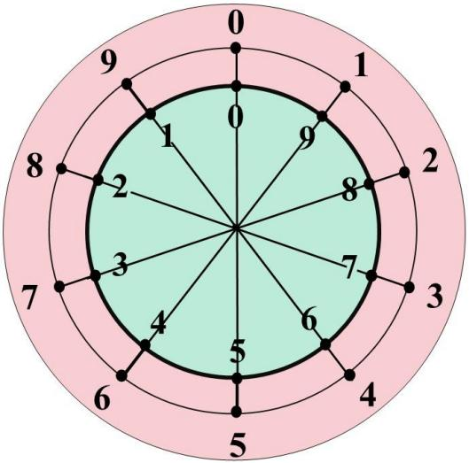Dengan aturan yang sama maka,a. Bilangan 2021 oleh kode 3215 diubah menjadi ....b. Bilangan 2021 oleh kode ... diubah menjadi 2021.c. Bilangan ... oleh kode 2574 diubah menjadi 2021.(Sebelum menjawab simak dan perhatikan video berikut)LINK</td><td colspan="8">Jawab :a. 2021 dengan kode 3215 menjadi:<eq>2 \rightarrow (3) \rightarrow 5</eq>,<eq>0 \rightarrow (2) \rightarrow 8</eq>,<eq>2 \rightarrow (1) \rightarrow 7</eq>,<eq>1 \rightarrow (5) \rightarrow 4</eq>.Jadi bilangan <eq>2021 \rightarrow (3215) \rightarrow 5874</eq>.Jawab: 5874b. 2021 oleh kode 6068 menjadi<eq>2 \rightarrow (6) \rightarrow 2</eq>,<eq>0 \rightarrow (0) \rightarrow 0</eq>,<eq>2 \rightarrow (6) \rightarrow 2</eq><eq>1 \rightarrow (8) \rightarrow 1</eq>Jadi bilangan <eq>2021 \rightarrow (6068) \rightarrow 2021</eq>.Jawab: 6068c. <eq>p \rightarrow (2) \rightarrow 2</eq>, jadi <eq>p = 6</eq><eq>q \rightarrow (5) \rightarrow 0</eq>, jadi <eq>q = 5</eq><eq>r \rightarrow (7) \rightarrow 2</eq>, jadi <eq>r = 1</eq><eq>s \rightarrow (4) \rightarrow 1</eq>, jadi <eq>s = 5</eq>Jadi bilangan pqrs oleh kode (2574) yang diubah menjadi 2021 adalah 2574.Jawab: 6515.Penilaian:Benar jawaban a nilai 1Benar jawaban b nilai 2,5Benar jawaban c nilai 2,5</td></tr></table>

3 

Perhatikan gambar berikut : 

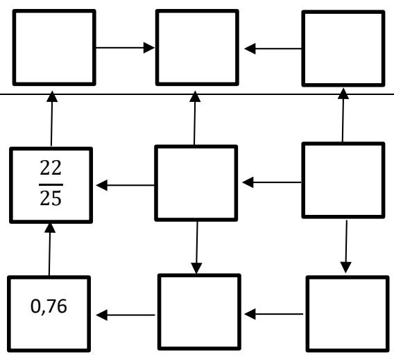

Pada petak-petak yang kosong akan diisi bilangan-bilangan sebagai berikut. 

$$
45\% ;3^{2} ;3 \frac{1}{2} ;0,425 ; 2 ;0,65 ; \frac{1}{5}
$$

Jika arah panah menunjukkan bilangan kecil ke bilangan besar, maka tuliskan semua cara yang mungkin untuk mengisi bilangan-bilangan ke dalam petak tersebut ! 

Jawab : 

$$
\begin{array}{l} 45 \mid \% = 0,45 \\ 3 ^ {2} \bigg | = 9 \\ 3 \frac {1}{2} = 3, 5 \\ \end{array}
$$

$$
\frac {2 2}{2 5} \quad = 0, 8 8
$$

$$
\frac {1}{5} \quad = 0, 2
$$

Lalu mengurutkan dari bilangan terkecil ke bilangan terbesar yaitu : 

$$
\frac {1}{5}; 0, 4 2 5; 4 5 \%; 0, 6 5; 0, 7 6; \frac {2 2}{2 5}; 2; 3 \frac {1}{2}; 3 ^ {2}
$$

Maka banyak cara meletakkan bilangan : 

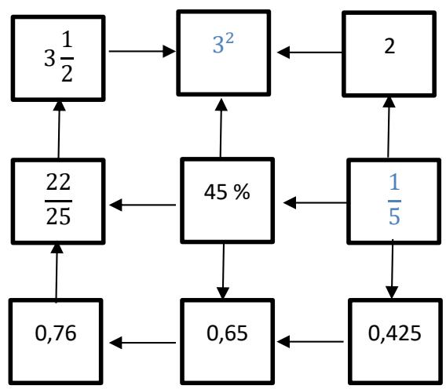

(skor 1,5)

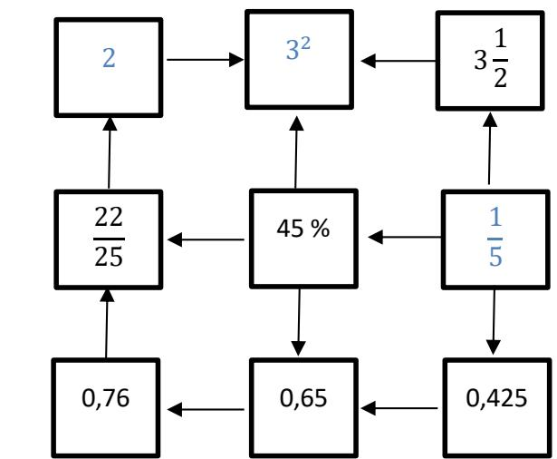

(skor 1,5)

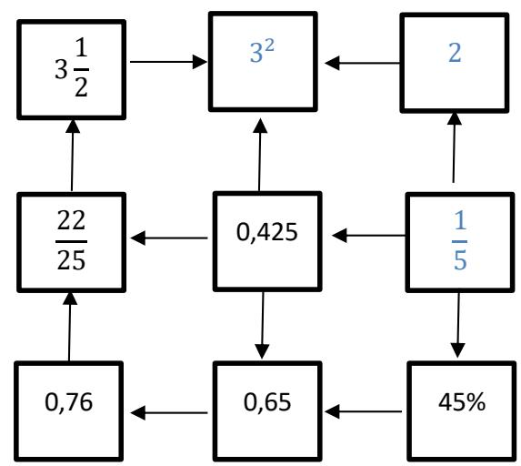

(skor 1,5)

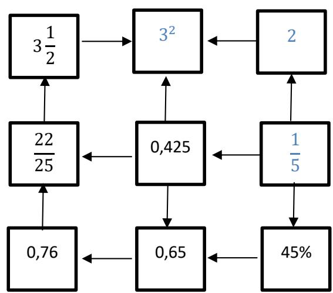

(skor 1,5) jika ada kotak yang salah dari tiap bagannya dikurangi 0,2

Ada Empat kemungkinan 

Total skor 6 

<table><tr><td></td><td colspan="7"></td><td colspan="4"></td></tr><tr><td>45</td><td colspan="7">Misalkan diberikan timbangan dan anak timbangan yang terdiri dari 3 anak timbangan berat 0,5 ons, 3 anak timbangan berat 1 ons, 3 anak timbangan berat 2 ons, 3 anak timbangan berat 0,5 kg, dan 3 anak timbangan berat 1 kg. Tentukan sebanyak mungkin cara menggunakan anak timbangan tersebut untuk menimbang tepung seberat 2750 gram.Sebelum menjawab simak dan perhatikan video berikut https://drive.google.com/file/d/1jykyqCdf6bQcglWIHBfnb8s5Q1Ngi 7J4/view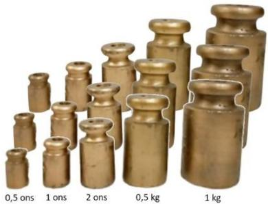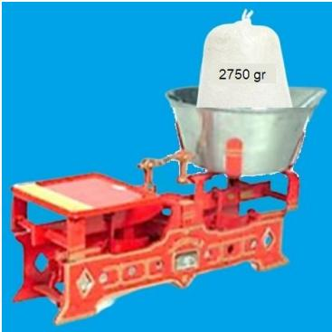Gambar berikut menyatakan peta suatu tempat rekreasi.</td><td colspan="4">J awab: 14 cara<eq>2750 = 2 \times 1000 + 500 + 200 + 50</eq><eq>2750 = 2 \times 1000 + 500 + 2 \times 100 + 50</eq><eq>2750 = 2 \times 1000 + 500 + 100 + 3 \times 50</eq><eq>2750 = 2 \times 1000 + 3 \times 200 + 100 + 50</eq><eq>2750 = 2 \times 1000 + 3 \times 200 + 3 \times 50</eq><eq>2750 = 2 \times 1000 + 2 \times 200 + 3 \times 100 + 50</eq><eq>2750 = 1000 + 2 \times 500 + 3 \times 200 + 100 + 50</eq><eq>2750 = 1000 + 2 \times 500 + 3 \times 200 + 3 \times 50</eq><eq>2750 = 1000 + 2 \times 500 + 2 \times 200 + 3 \times 100 + 50</eq>Menuliskan 9 cara dengan benar bernilai 5Menuliskan 7-8 cara dengan benar bernilai 4Menuliskan 5-6 cara dengan benar bernilai 3Menuliskan 3-4 cara dengan benar bernilai 2Menuliskan 1-2 cara dengan benar bernilai 1Menuliskan 0 cara atau menuliskan cara tapi salah bernilai 0.</td></tr><tr><td></td><td colspan="7"></td><td colspan="4">Jawab:a. Jalan terpendek (7 kemungkinan)(9,16,23,24,25,26,27)(9,10,17,24,25,26,27)(9,10,17,18,25,26,27)(9,10,11,18,25,26,27)(9,10,11,18,19,20,27)(9,10,11,12,13,20,27)(9,10,11,12,19,20,27)Jika benar 2, skor 0,5Jika benar 4, skor 1Jika benar 6, skor 1,5.Jika benar semua, 7 kemungkinan skor 2.b. Jalan yang melalui wahana terluar (8 kemungkinan)(9,8,15,22,29,30,31,32,33,34,27)(9,8,15,22,29,30,31,32,33,34,35,28,27)(9,8,1,2,3,4,5,6,7,14,21,28,27)(9,8,1,2,3,4,5,6,7,14,21,28,35,34,27)</td></tr><tr><td rowspan="4"></td><td colspan="7">Titik-titik pada gambar menyatakan tempat wahana bermain dan garis menyatakan jalan yang menghubungkan antar wahana. Wahana dengan titik berwarna biru adalah wahana terluar yang ada pada tempat rekreasi.Berikut contoh kemungkinan dua jalan dari wahana 9 ke wahana 20.</td><td colspan="4" rowspan="2">(9, 2,3,4,5,6,7,14,21,28,27)(9, 2,3,4,5,6,7,14,21,28,35,34,27)(9,2,1,8,15,22,29,30,31,32,33,34,27)(9,2,1,8,15,22,29,30,31,32,33,34,35,28,27)Jika benar kurang dari 1-2, skor 0,5Jika benar 3-5, skor 1Jika benar 6-7, skor 1,5.Jika benar semua, 8 kemungkinan skor 2.c. Jalan terpanjang (2 kemungkinan)9,16,23,30,29,22,15,8,1,2,3,4,5,6,7,14,13,12,11,10,17,18,19,20,21,28,35,34,33,32,31,24,25,26,279,16,15,8,1,2,3,4,5,6,7,14,13,12,11,10,17,18,19,20,21,28,35,34,33,32,31,30,29,22,23,24,25,26,27Jawaban betul skor 2.</td></tr><tr><td>9</td><td>10</td><td>11</td><td>12</td><td>13</td><td>20</td><td></td><td></td></tr><tr><td>9</td><td>10</td><td>11</td><td>12</td><td>13</td><td>14</td><td>21</td><td>20</td><td></td><td></td><td></td></tr><tr><td colspan="10">Ani akan pergi dari wahana 9 ke wahana 27. Jika dalam perjalanan Ani tidak boleh melewati wahana yang sama dua kali,a. Tuliskan semua kemungkinan jalan terpendek yang dilalui Ani.b. Tuliskan semua kemungkinan jalan yang dapat dilalui, jika Ani hanya memilih melewati wahana-wahana terluar.c. Tuliskan semua kemungkinan jalan terpanjang yang dilalui Ani</td><td></td></tr><tr><td rowspan="14">6</td><td colspan="7">Dari sebarang bilangan dua angka dapat dibentuk bilangan lain dengan cara mengalikan angka-angka pembentuknya. Proses tersebut dapat dilakukan berulang sampai menghasilkan bilangan satu angka. Sebagai contoh perhatikan tabel berikut ini.</td><td colspan="3">Jawab</td><td></td></tr><tr><td colspan="2" rowspan="12">Bilangan 2 angka</td><td colspan="2" rowspan="5">Langkah 1</td><td colspan="2" rowspan="5">Langkah 2</td><td rowspan="5">Langkah 3</td><td>Bilangan 2 angka</td><td>Langkah 1</td><td>Langkah 2</td><td></td></tr><tr><td>16</td><td>1 x 6 = 6</td><td></td><td></td></tr><tr><td>23</td><td>2 x 3 = 6</td><td></td><td></td></tr><tr><td>28</td><td>2 x 8 = 16</td><td>1 x 6 = 6</td><td></td></tr><tr><td>32</td><td>3 x 2 = 6</td><td></td><td></td></tr><tr><td rowspan="3">89</td><td rowspan="3">8 x 9 = 72</td><td colspan="2" rowspan="3">7 x 2 = 14</td><td rowspan="3">1 x 4 = 4</td><td>44</td><td>4 x 4 = 16</td><td>1 x 6 = 6</td><td></td></tr><tr><td>47</td><td>4 x 7 = 28</td><td>2 x 8 = 16</td><td></td></tr><tr><td>48</td><td>4 x 8 = 32</td><td>3 x 2 = 6</td><td></td></tr><tr><td rowspan="4">18</td><td rowspan="4">1 x 8 = 8</td><td colspan="2" rowspan="4"></td><td rowspan="4"></td><td>61</td><td>6 x 1 = 6</td><td></td><td></td></tr><tr><td>68</td><td>6 x 8 = 48</td><td>4 x 8 = 32</td><td></td></tr><tr><td>74</td><td>7 x 4 = 28</td><td>2 x 8 = 16</td><td></td></tr><tr><td rowspan="2">82</td><td rowspan="2">8 x 2 = 16</td><td rowspan="2">1 x 6 = 6</td><td></td></tr><tr><td colspan="7">Bilangan 89 berhenti di angka 4, bilangan 25 berhenti di angka 0, dan bilangan 18 berhenti di angka 8.</td><td></td></tr></table>

<table><tr><td>9</td><td>10</td><td>11</td><td>12</td><td>13</td><td>20</td></tr></table>

<table><tr><td>9</td><td>10</td><td>11</td><td>12</td><td>13</td><td>14</td><td>21</td><td>20</td></tr></table>

<table><tr><td>Bilangan 2 angka</td><td>Langkah 1</td><td>Langkah 2</td><td>Langkah 3</td></tr><tr><td>89</td><td>8 x 9 = 72</td><td>7 x 2 = 14</td><td>1 x 4 = 4</td></tr><tr><td>25</td><td>2 x 5 = 10</td><td>1 x 0 = 0</td><td></td></tr><tr><td>18</td><td>1 x 8 = 8</td><td></td><td></td></tr></table>

<table><tr><td>Bilangan 2 angka</td><td>Langkah 1</td><td>Langkah 2</td><td>Langkah 3</td></tr><tr><td>16</td><td><eq>1 \times 6 = 6</eq></td><td></td><td></td></tr><tr><td>23</td><td><eq>2 \times 3 = 6</eq></td><td></td><td></td></tr><tr><td>28</td><td><eq>2 \times 8 = 16</eq></td><td><eq>1 \times 6 = 6</eq></td><td></td></tr><tr><td>32</td><td><eq>3 \times 2 = 6</eq></td><td></td><td></td></tr><tr><td>44</td><td><eq>4 \times 4 = 16</eq></td><td><eq>1 \times 6 = 6</eq></td><td></td></tr><tr><td>47</td><td><eq>4 \times 7 = 28</eq></td><td><eq>2 \times 8 = 16</eq></td><td><eq>1 \times 6 = 6</eq></td></tr><tr><td>48</td><td><eq>4 \times 8 = 32</eq></td><td><eq>3 \times 2 = 6</eq></td><td></td></tr><tr><td>61</td><td><eq>6 \times 1 = 6</eq></td><td></td><td></td></tr><tr><td>68</td><td><eq>6 \times 8 = 48</eq></td><td><eq>4 \times 8 = 32</eq></td><td><eq>3 \times 2 = 6</eq></td></tr><tr><td>74</td><td><eq>7 \times 4 = 28</eq></td><td><eq>2 \times 8 = 16</eq></td><td><eq>1 \times 6 = 6</eq></td></tr><tr><td>82</td><td><eq>8 \times 2 = 16</eq></td><td><eq>1 \times 6 = 6</eq></td><td></td></tr></table>

<table><tr><td rowspan="3"></td><td rowspan="3">Tentukan semua bilangan dua angka yang berhenti pada bilangan 6.</td><td>84</td><td>8 x 4 = 32</td><td>3 x 2 = 6</td><td></td></tr><tr><td>86</td><td>8 x 6 = 48</td><td>4 x 8 = 32</td><td>3 x 2 = 6</td></tr><tr><td colspan="4">Bilangan 2 angka yang berhenti pada bilangan 6 ada sebanyak 13 bilangan yaitu 16, 23, 28, 32, 44, 47, 48, 61, 68, 74, 82, 84, 86Penilaian :Jika menjawab 13 Bilangan (6)Jika menjawab 11-12 Bilangan (5)Jika menjawab 9-10 Bilangan (4)Jika menjawab 6-8 Bilangan (3)Jika menjawab 4-5 Bilangan (2)Jika menjawab 1-3 Bilangan (1)</td></tr><tr><td>7</td><td>Perhatikan gambar berikut.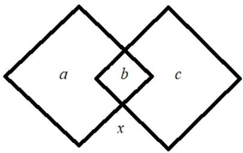Diketahui a,b,c,dan x adalah empat bilangan bulat. X merupakan hasil operasi hitung a,b,dan c. Dengan operasi hitung yang sama, diperoleh tiga hasil sebagai berikut.</td><td colspan="3">Jawaban:a. 2 kemungkinan bentuk persamaan1) <eq>x = a \times c + b = c \times a + b = b + a \times c = b + c \times a</eq>2) <eq>x = a \times b - c</eq>b. Untuk persamaan <eq>x = a \times c + b</eq> nilai <eq>p = 3</eq> dan <eq>q = 42</eq>.Untuk persamaan <eq>x = a \times b - c</eq> nilai <eq>p = 12</eq> dan <eq>q = 50</eq>Penjelasan:Kemungkinan persamaan dari gambar pertama adalah:×,+ dan +,×</td><td>a) <eq>7 \times 15 + 8 = 113</eq>b) <eq>7 \times 8 + 15 = 71</eq></td></tr></table>

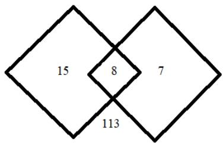

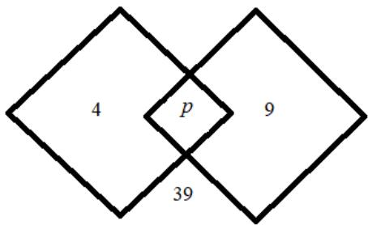

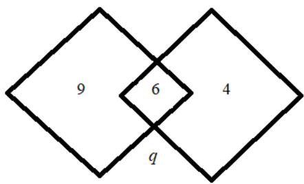

Tentukan: 

a. Operasi hitung yang mungkin. 

b. Nilai-nilai p dan q. 

<table><tr><td></td><td>c) 8 × 15 + 7 = 127</td></tr><tr><td>×,-</td><td>d) 7 × 15 - 8 = 97e) 7 × 8 - 15 = 41f) 8 × 15 - 7 = 113</td></tr><tr><td>-,×</td><td>g) 7 - 15 × 8 = -113h) 15 - 8 × 7 = -41i) 8 - 15 × 7 - 97</td></tr><tr><td>+, - dan -, +</td><td>j) 7 + 15 - 8 = 14k) 7 + 8 - 15 = 0l) 8 + 15 - 7 = 16</td></tr><tr><td>×,×</td><td>m) 7 × 15 × 8 = 840</td></tr><tr><td>+, +</td><td>n) 7 + 15 + 8 = 30</td></tr><tr><td>-, -</td><td>o) 7 - 15 - 8 = -16p) 8 - 15 - 7 = -14q) 15 - 7 - 8 = 0</td></tr></table>

Berdasarkan semua kemungkinan operasi kita peroleh dua kemungkinan operasi yaitu 

1. $a \times c + b$ atau ?? × ?? + ?? atau $b + a \times c$ atau $b + c \times a$ 

2. ?? × ?? − ?? atau ?? × ?? − ?? 

Untuk operasi pertama kita peroleh 

$$
4 \times 9 + p = 3 9 \Leftrightarrow p = 3
$$

$$
9 \times 4 + 6 = q \Leftrightarrow 4 2
$$

Untuk operasi kedua kita peroleh 

$$
4 \times p - 9 = 3 9 \Leftrightarrow p = 1 2
$$

<table><tr><td></td><td></td><td colspan="5"><eq>9 \times 6 - 4 = q \Leftrightarrow q = 50</eq>a) Skor 6 jika berhasil mendapatkan semua bentuk operasi/persamaan yang tepat dan menemukan nilai p dan q yang diminta.b) Skor 5 jika berhasil mendapatkan semua operasi/persamaan yang tepat dan menjawab benar salah satu dari p dan q.c) Skor 4 jika berhasil mendapatkan bentuk operasi/persamaan tetapi tidak menjawab dengan benar kedua nilai p dan qd) Skor 3 jika mendapatkan sebagian operasi yang benar dan menjawab benar nilai p dan q.e) Skor 2 jika menuliskan kemungkinan beberapa bentuk operasi yang benar.f) Skor 1 jika hanya menuliskan jawaban p dan q benar/salah tanpa disertai persamaaan.Skor 0 kalau tidak diisi</td></tr><tr><td rowspan="3">8</td><td rowspan="3">Diberikan bangun datar persegi dengan ukuran sisinya 2 satuan panjang sebanyak sembilan buah dan segitiga sama sisi dengan ukuran sisinya 2 satuan panjang sebanyak delapan buah. Dengan menggunakan bangun datar yang telah disediakan. Buatlah suatu bangun ruang yang memiliki luas permukaan semaksimal mungkin.a. Gambarkan bangun ruang yang kalian bentuk pada lembar jawaban yang telah disediakan.b. Tuliskan luas permukaan dari bangun tersebut.(Sebelum menjawab simak dan perhatikan video berikut)LINK</td><td colspan="5">Jawab :</td></tr><tr><td>No</td><td>Bangun Ruang</td><td>Banyak Persegi</td><td>Banyak Segitiga</td><td>Luas Permukaa</td></tr><tr><td>1</td><td>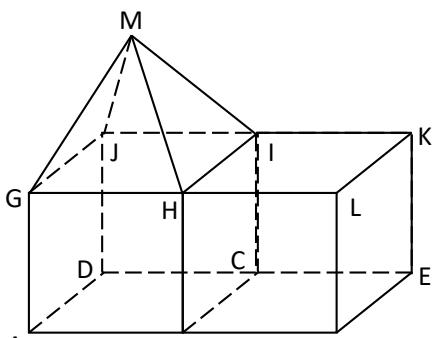</td><td>9</td><td>4</td><td>(9 x 4) + (4 x 1,73)= 36 + 6,92= 42,96 satuar luas</td></tr></table>

<table><tr><td rowspan="3"></td><td rowspan="3"></td><td></td><td>Keterangan :BCIH dan GHIJ kosong</td><td></td><td></td><td></td><td></td></tr><tr><td>2</td><td>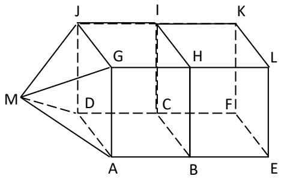Keterangan :BCIH dan ADJG kosong</td><td>9</td><td>4</td><td>(9 x 4) + (4 x 1,73)= 36 + 6,92= 42,96 satuan luas</td><td></td></tr><tr><td>3</td><td>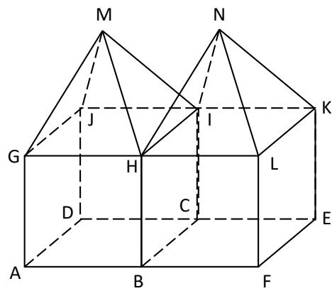Keterangan :BCIH, GHIJ, dan HIKL kosong</td><td>8</td><td>8</td><td>(8 x 4) + (8 x 1,73)= 32 + 13,84= 45,84 satuan luas</td><td></td></tr><tr><td rowspan="2"></td><td rowspan="2"></td><td>4</td><td>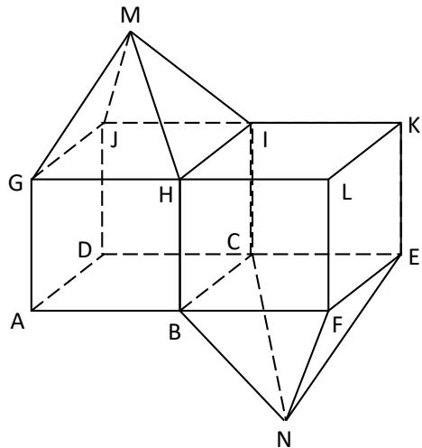Keterangan :BCIH, GHIJ, dan BCEF kosong</td><td>8</td><td>8</td><td>(8 x 4) + (8 x 1,73)= 32 + 13,84= 45,84 satuan luas</td><td></td></tr><tr><td>5</td><td>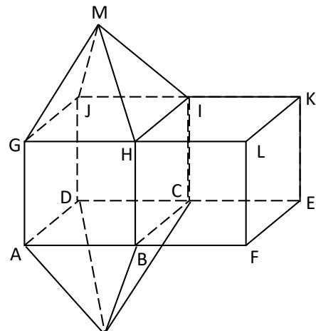</td><td>8</td><td>8</td><td>(8 x 4) + (8 x 1,73)= 32 + 13,84= 45,84 satuan luas</td><td></td></tr></table>

<table><tr><td></td><td>Keterangan:BCIH, GHIJ, dan ABCD kosong</td><td></td><td></td><td></td><td></td></tr><tr><td>6</td><td>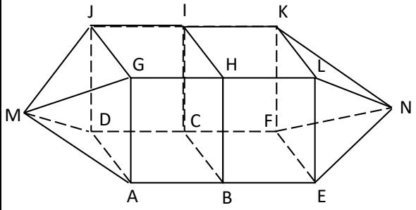Keterangan:ADJG, BCIH, dan EFKL kosong</td><td>8</td><td>8</td><td>(8 x 4) + (8 x 1,73)= 32 + 13,84= 45,84 satuan luas</td><td></td></tr><tr><td>7</td><td>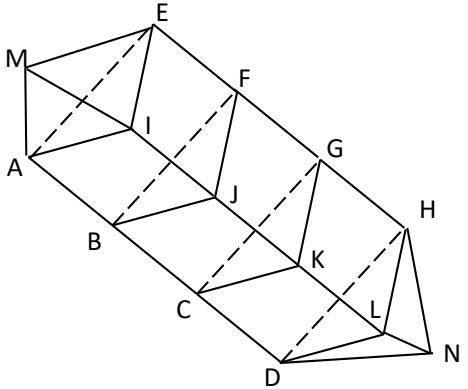Keterangan:AEI, BFJ, CGK, dan DHL kosong</td><td>9</td><td>6</td><td>(9 x 4) + (6 x 1,73)= 36 + 10,38= 46,38 satuan luas</td><td></td></tr></table>

<table><tr><td></td><td>Catatan :Luas Persegi : 2 x 2 = 4Luas Segitiga Sama Sisi : 1/2 x 2 x <eq>\sqrt{3} = \sqrt{3} = 1,73</eq>PenilaianJika menggambar bangun ruang dengan benar menggunakan :9 persegi dan 8 segitiga (6)9 Persegi dan 6 segitiga (5)8 Persegi dan 8 segitiga (3)9 Persegi dan 4 segitiga (1)Jika tidak menuliskan luas permukaannya maka di kurangi 0,5 point</td></tr></table>