<table><tr><td>No</td><td>Soal</td></tr><tr><td>1</td><td>Isilah petak-petak dengan bilangan sehingga operasi penjumlahan berikut bernilai benar. Jumlah ketiga bilangan pada petak tersebut adalah ....<eq>\square</eq> 3 64 □ 4 +6 3 □</td></tr><tr><td>2</td><td>Banyak bilangan yang merupakan kelipatan persekutuan dari 5 dan 11 yang kurang dari 1000 adalah ....</td></tr><tr><td>3</td><td>Faktor prima dari bilangan 45 adalah 5 dan 3 dengan jumlah faktor-faktor prima tersebut adalah 8.Bilangan puluhan terbesar yang memiliki tepat dua faktor prima dan jumlah faktor-faktor primanya terkecil adalah ....</td></tr><tr><td>4</td><td>Andi lahir hari Senin bulan Januari. Dia akan mengadakan acara ulang tahun dan mengundang teman-teman sekolahnya sebanyak 200 siswa. Berapa paling sedikit Andi harus mengundang teman-temannya agar selalu ada anak yang diundang memiliki hari dan bulan lahir yang sama dengan Andi atau teman lainnya?</td></tr><tr><td>5</td><td>Perhatikan 15 petak berikut. Tiga dari petak tersebut telah terisi bilangan. Jika jumlah dari setiap empat bilangan pada petak yang berurutan adalah sama, maka nilai <eq>x + y = \cdots</eq>.<eq>\square</eq> <eq>\square</eq> <eq>x</eq> <eq>\square</eq> <eq>\square</eq> <eq>\square</eq> <eq>\square</eq> <eq>\square</eq> <eq>\square</eq> <eq>\square</eq> <eq>\square</eq> <eq>\square</eq> <eq>\square</eq> <eq>\square</eq> <eq>\square</eq> <eq>\square</eq> <eq>\square</eq> <eq>\square</eq> <eq>\square</eq> <eq>\square</eq> <eq>\square</eq> <eq>\square</eq> <eq>\square</eq> <eq>\blacksquare</eq> <eq>\blacksquare</eq> <eq>\blacksquare</eq> <eq>\blacksquare</eq> <eq>\blacksquare</eq> <eq>\blacksquare</eq> <eq>\blacksquare</eq> <eq>\blacksquare</eq> <eq>\blacksquare</eq> <eq>\blacksquare</eq> <eq>\blacksquare</eq> <eq>\blacksquare</eq> <eq>\blacksquare</eq> <eq>\blacksquare</eq> <eq>\blacksquare</eq><eq>\blacksquare</eq> <eq>\blacksquare</eq> <eq>\blacksquare</eq> <eq>\blacksquare</eq> <eq>\blacksquare</eq> <eq>\blacksquare</eq> <eq>\blacksquare</eq> <eq>\blacksquare</eq> <eq>\blacksquare</eq> <eq>\blacksquare</eq> <eq>\blacksquare</eq> <eq>\blacksquare</eq> <eq>\blacksquare</eq> <eq>\blacksquare</eq> <eq>\square</eq> <eq>\blacksquare</eq> <eq>\blacksquare</eq> <eq>\blacksquare</eq> <eq>\blacksquare</eq> <eq>\blacksquare</eq> <eq>\blacksquare</eq> <eq>\blacksquare</eq> <eq>\blacksquare</eq> <eq>\blacksquare</eq> <eq>\blacksquare</eq> <eq>\blacksquare</eq> <eq>\blacksquare</eq> <eq>\blacksquare</eq> <eq>b</eq> <eq>b</eq> <eq>b</eq> <eq>b</eq> <eq>b</eq> <eq>b</eq> <eq>b</eq> <eq>b</eq> <eq>b</eq> <eq>b</eq> <eq>b</eq> <eq>b</eq> <eq>b</eq> <eq>b</eq> <eq>b</eq> <eq>b</eq> <eq>b</eq> <eq>b</eq> <eq>b</eq> <eq>b</eq> <eq>b</eq> <eq>b</eq> <eq>b</eq> <eq>b</eq> <eq>b</eq> <eq>d</eq> <eq>d</eq> <eq>d</eq> <eq>d</eq> <eq>d</eq> <eq>d</eq> <eq>d</eq> <eq>d</eq> <eq>d</eq> <eq>d</eq> <eq>d</eq> <eq>d</eq> <eq>d</eq> <eq>d</eq> <eq>d</eq> <eq>d</eq> <eq>d</eq> <eq>d</eq> <eq>d</eq> <eq>d</eq> <eq>d</eq> <eq>d</eq> <eq>d</eq> <eq>d</eq> <eq>d</eq> <eq>d</eq> <eq>d</eq> <eq>d</eq> <eq>d</eq> <eq>d</eq> <eq>d</eq> <eq>d</eq> <eq>d</eq> <eq>d</eq> <eq>d</eq> <eq>d</eq> <eq>d</eq> <eq>d</eq> <eq>d</eq> <eq>d</eq> <eq>d</eq> <eq>d</eq> <eq>d</eq> <eq>d</eq> <eq>d</eq> <eq>d</eq> <eq>d</eq> <eq>d</eq> <eq>d</eq> <eq>d</eq> <eq>c</eq> <eq>c</eq> <eq>c</eq> <eq>c</eq> <eq>c</eq> <eq>c</eq> <eq>c</eq> <eq>c</eq> <eq>c</eq> <eq>c</eq> <eq>c</eq> <eq>c</eq> <eq>c</eq> <eq>c</eq> <eq>c</eq> <eq>c</eq> <eq>c</eq> <eq>c</eq> <eq>c</eq> <eq>c</eq> <eq>c</eq> <eq>c</eq> <eq>c</eq> <eq>c</eq> <eq>c</eq> <eq>d</eq> <eq>d</eq> <eq>d</eq> <eq>d</eq> <eq>d</eq> <eq>d</eq> <eq>d</eq> <eq>d</eq> <eq>d</eq> <eq>d</eq> <eq>d</eq> <eq>d</eq> <eq>d</eq> <eq>d</eq> <eq>d</eq> <eq>d</eq> <eq>d</eq> <eq>d</eq> <eq>d</eq> <eq>d</eq> <eq>d</eq> <eq>d</eq> <eq>d</eq> <eq>d</eq> <eq>e</eq> <eq>e</eq> <eq>e</eq> <eq>e</eq> <eq>e</eq> <eq>e</eq> <eq>e</eq> <eq>e</eq> <eq>e</eq> <eq>e</eq> <eq>e</eq> <eq>e</eq> <eq>e</eq> <eq>e</eq> <eq>e</eq> <eq>e</eq> <eq>e</eq> <eq>e</eq> <eq>e</eq> <eq>e</eq> <eq>e</eq> <eq>e</eq> <eq>e</eq> <eq>e</eq> <eq>e</eq> <eq>f</eq> <eq>f</eq> <eq>f</eq> <eq>f</eq> <eq>f</eq> <eq>f</eq> <eq>f</eq> <eq>f</eq> <eq>f</eq> <eq>f</eq> <eq>f</eq> <eq>f</eq> <eq>f</eq> <eq>f</eq> <eq>f</eq> <eq>f</eq> <eq>f</eq> <eq>f</eq> <eq>f</eq> <eq>f</eq> <eq>f</eq> <eq>f</eq> <eq>f</eq> <eq>f</eq> <eq>f</eq> <eq>g</eq> <eq>g</eq> <eq>g</eq> <eq>g</eq> <eq>g</eq> <eq>g</eq> <eq>g</eq> <eq>g</eq> <eq>g</eq> <eq>g</eq> <eq>g</eq> <eq>g</eq> <eq>g</eq> <eq>g</eq> <eq>g</eq> <eq>g</eq> <eq>g</eq> <eq>g</eq> <eq>g</eq> <eq>g</eq> <eq>g</eq> <eq>g</eq> <eq>g</eq> <eq>g</eq> <eq>g</eq> <eq>h</eq> <eq>h</eq> <eq>h</eq> <eq>h</eq> <eq>h</eq> <eq>h</eq> <eq>h</eq> <eq>h</eq> <eq>h</eq> <eq>h</eq> <eq>h</eq> <eq>h</eq> <eq>h</eq> <eq>h</eq> <eq>h</eq> <eq>h</eq> <eq>h</eq> <eq>h</eq> <eq>h</eq> <eq>h</eq> <eq>h</eq> <eq>h</eq> <eq>h</eq> <eq>h</eq> <eq>h</eq> <eq>l</eq> <eq>l</eq> <eq>l</eq> <eq>l</eq> <eq>l</eq> <eq>l</eq> <eq>l</eq> <eq>l</eq> <eq>l</eq> <eq>l</eq> <eq>l</eq> <eq>l</eq> <eq>l</eq> <eq>l</eq> <eq>l</eq> <eq>l</eq> <eq>l</eq> <eq>l</eq> <eq>l</eq> <eq>l</eq> <eq>l</eq> <eq>l</eq> <eq>l</eq> <eq>l</eq> <eq>l</eq> <eq>n</eq> <eq>n</eq> <eq>n</eq> <eq>n</eq> <eq>n</eq> <eq>n</eq> <eq>n</eq> <eq>n</eq> <eq>n</eq> <eq>n</eq> <eq>n</eq> <eq>n</eq> <eq>n</eq> <eq>n</eq> <eq>n</eq> <eq>n</eq> <eq>n</eq> <eq>n</eq> <eq>n</eq> <eq>n</eq> <eq>n</eq> <eq>n</eq> <eq>n</eq> <eq>n</eq> <eq>n</eq> <eq>m</eq> <eq>m</eq> <eq>m</eq> <eq>m</eq> <eq>m</eq> <eq>m</eq> <eq>m</eq> <eq>m</eq> <eq>m</eq> <eq>m</eq> <eq>m</eq> <eq>m</eq> <eq>m</eq> <eq>m</eq> <eq>m</eq> <eq>m</eq> <eq>m</eq> <eq>m</eq> <eq>m</eq> <eq>m</eq> <eq>m</eq> <eq>m</eq> <eq>m</eq> <eq>m</eq> <eq>m</eq> <eq>n</eq> <eq>n</eq> <eq>n</eq> <eq>n</eq> <eq>n</eq> <eq>n</eq> <eq>n</eq> <eq>n</eq> <eq>n</eq> <eq>n</eq> <eq>n</eq> <eq>n</eq> <eq>n</eq> <eq>n</eq> <eq>n</eq> <eq>n</eq> <eq>n</eq> <eq>n</eq> <eq>n</eq> <eq>n</eq> <eq>n</eq> <eq>n</eq> <eq>n</eq> <eq>n</eq> <eq>n</eq> <eq>n</eq> <eq>n</eq> <eq>n</eq> <eq>n</eq> <eq>n</eq> <eq>n</eq> <eq>n</eq> <eq>n</eq> <eq>n</eq> <eq>n</eq> <eq>n</eq> <eq>n</eq> <eq>n</eq> <eq>n</eq> <eq>n</eq> <eq>n</eq> <eq>n</eq> <eq>n</eq> <eq>n</eq> <eq>n</eq> <eq>n</eq> <eq>n</eq> <eq>n</eq> <eq>n</eq> <eq>u</eq> <eq>u</eq> <eq>u</eq> <eq>u</eq> <eq>u</eq> <eq>u</eq> <eq>u</eq> <eq>u</eq> <eq>u</eq> <eq>u</eq> <eq>u</eq> <eq>u</eq> <eq>u</eq> <eq>u</eq> <eq>u</eq> <eq>u</eq> <eq>u</eq> <eq>u</eq> <eq>u</eq> <eq>u</eq> <eq>u</eq> <eq>u</eq> <eq>u</eq> <eq>u</eq> <eq>u</eq> <eq>u</eq> <eq>u</eq> <eq>u</eq> <eq>u</eq> <eq>u</eq> <eq>u</eq> <eq>u</eq> <eq>u</eq> <eq>u</eq> <eq>u</eq> <eq>u</eq> <eq>u</eq> <eq>u</eq> <eq>u</eq> <eq>u</eq> <eq>u</eq> <eq>u</eq> <eq>u</eq> <eq>u</eq> <eq>u</eq> <eq>u</eq> <eq>u</eq> <eq>u</eq> <eq>u</eq> <eq>u</eq> <eq>v</eq> <eq>v</eq> <eq>v</eq> <eq>v</eq> <eq>v</eq> <eq>v</eq> <eq>v</eq> <eq>v</eq> <eq>v</eq> <eq>v</eq> <eq>v</eq> <eq>v</eq> <eq>v</eq> <eq>v</eq> <eq>v</eq> <eq>v</eq> <eq>v</eq> <eq>v</eq> <eq>v</eq> <eq>v</eq> <eq>v</eq> <eq>v</eq> <eq>v</eq> <eq>v</eq> <eq>v</eq> <eq>v</eq> <eq>v</eq> <eq>v</eq> <eq>v</eq> <eq>v</eq> <eq>v</eq> <eq>v</eq> <eq>v</eq> <eq>v</eq> <eq>v</eq> <eq>v</eq> <eq>v</eq> <eq>v</eq> <eq>v</eq> <eq>v</eq> <eq>v</eq> <eq>v</eq> <eq>v</eq> <eq>v</eq> <eq>v</eq> <eq>v</eq> <eq>v</eq> <eq>v</eq> <eq>v</eq> <eq>v</eq> <eq>u</eq> <eq>u</eq> <eq>u</eq> <eq>u</eq> <eq>u</eq> <eq>u</eq> <eq>u</eq> <eq>u</eq> <eq>u</eq> <eq>u</eq> <eq>u</eq> <eq>u</eq> <eq>u</eq> <eq>u</eq> <eq>u</eq> <eq>u</eq> <eq>u</eq> <eq>u</eq> <eq>u</eq> <eq>u</eq> <eq>u</eq> <eq>u</eq> <eq>u</eq> <eq>u</eq> <eq>w</eq> <eq>w</eq> <eq>w</eq> <eq>w</eq> <eq>w</eq> <eq>w</eq> <eq>w</eq> <eq>w</eq> <eq>w</eq> <eq>w</eq> <eq>w</eq> <eq>w</eq> <eq>w</eq> <eq>w</eq> <eq>w</eq> <eq>w</eq> <eq>w</eq> <eq>w</eq> <eq>w</eq> <eq>w</eq> <eq>w</eq> <eq>w</eq> <eq>w</eq> <eq>w</eq> <eq>w</eq> <eq>u</eq> <eq>u</eq> <eq>u</eq> <eq>u</eq> <eq>u</eq> <eq>u</eq> <eq>u</eq> <eq>u</eq> <eq>u</eq> <eq>u</eq> <eq>u</eq> <eq>u</eq> <eq>u</eq> <eq>u</eq> <eq>u</eq> <eq>u</eq> <eq>u</eq> <eq>u</eq> <eq>u</eq> <eq>u</eq> <eq>u</eq> <eq>u</eq> <eq>u</eq> <eq>u</eq> <eq>a</eq> <eq>a</eq> <eq>a</eq> <eq>a</eq> <eq>a</eq> <eq>a</eq> <eq>a</eq> <eq>a</eq> <eq>a</eq> <eq>a</eq> <eq>a</eq> <eq>a</eq> <eq>a</eq> <eq>a</eq> <eq>a</eq> <eq>a</eq> <eq>a</eq> <eq>a</eq> <eq>a</eq> <eq>a</eq> <eq>a</eq> <eq>a</eq> <eq>a</eq> <eq>a</eq> <eq>a</eq> <eq>a</eq><eq>a</eq><eq>b</eq><eq>b</eq><eq>b</eq><eq>b</eq><eq>b</eq><eq>b</eq><eq>b</eq><eq>b</eq><eq>b</eq><eq>b</eq><eq>b</eq><eq>b</eq><eq>b</eq><eq>b</eq><eq>b</eq><eq>b</eq><eq>b</eq><eq>b</eq><eq>b</eq><eq>b</eq><eq>b</eq><eq>b</eq><eq>b</eq><eq>b</eq><eq>b</eq><eq>h</eq><eq>h</eq><eq>h</eq><eq>h</eq><eq>h</eq><eq>h</eq><eq>h</eq><eq>h</eq><eq>h</eq><eq>h</eq><eq>h</eq><eq>h</eq><eq>h</eq><eq>h</eq><eq>h</eq><eq>h</eq><eq>h</eq><eq>h</eq><eq>h</eq><eq>h</eq><eq>h</eq><eq>h</eq><eq>h</eq><eq>h</eq><eq>h</eq><eq>b</eq><eq>b</eq><eq>b</eq><eq>b</eq><eq>b</eq><eq>b</eq><eq>b</eq><eq>b</eq><eq>b</eq><eq>b</eq><eq>b</eq><eq>b</eq><eq>b</eq><eq>b</eq><eq>b</eq><eq>b</eq><eq>b</eq><eq>b</eq><eq>b</eq><eq>b</eq><eq>b</eq><eq>b</eq><eq>b</eq><eq>b</eq><eq>d</eq><eq>d</eq><eq>d</eq><eq>d</eq><eq>d</eq><eq>d</eq><eq>d</eq><eq>d</eq><eq>d</eq><eq>d</eq><eq>d</eq><eq>d</eq><eq>d</eq><eq>d</eq><eq>d</eq><eq>d</eq><eq>d</eq><eq>d</eq><eq>d</eq><eq>d</eq><eq>d</eq><eq>d</eq><eq>d</eq><eq>d</eq><eq>d</eq><eq>d</eq>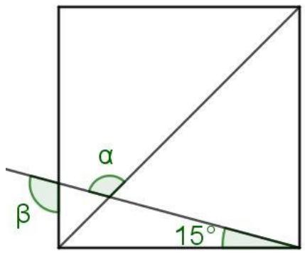</td></tr><tr><td>13</td><td>Garis bagi sudut adalah garis yang membagi suatu sudut menjadi dua sudut yang sama besar.Perhatikan gambar di bawah ini.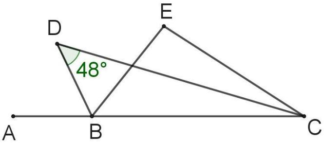Jika BD merupakan garis bagi sudut ABE, CD merupakan garis bagi sudut BCE, maka besar sudut BEC adalah ... derajat.</td></tr><tr><td>14</td><td>Karton berbentuk persegi panjang dengan ukuran panjang = 8 inch, lebar = 4 inch dibuat hiasan dinding berbentuk bangun datar seperti tampak pada gambar. Luas hiasan dinding tersebut adalah ...inch2.</td></tr></table>

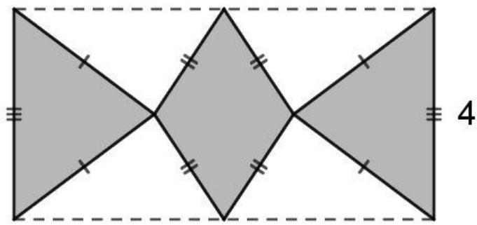

15 Ruas garis CD tegak lurus AE dan Ruas garis BE tegak lurus AC, jari-jari lingkaran luar dan dalam adalah masing-masing 2 cm dan 1 cm denganhttps://www.calonguru.com/ sudut EAC adalah 60o. Jika DF = BF maka Luas ∆CEF ditambah Luas ∆BDF adalah … cm2. 

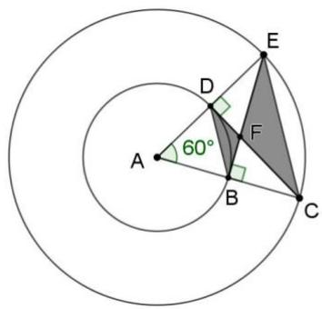

16 Berikut merupakan tabel nilai ujian matematika. 

<table><tr><td>Nilai</td><td>Banyak Siswa</td></tr><tr><td>20</td><td>1</td></tr><tr><td>30</td><td>3</td></tr><tr><td>40</td><td>2</td></tr><tr><td>50</td><td>x</td></tr><tr><td>60</td><td>7</td></tr><tr><td>70</td><td>6</td></tr><tr><td>80</td><td>5</td></tr><tr><td>90</td><td>2</td></tr><tr><td>100</td><td>1</td></tr></table>

<table><tr><td></td><td colspan="3">Jika banyak siswa yang memperoleh nilai kurang dari 70 adalah 18 orang, maka siswa yang memperoleh nilai 50 adalah ... persen.</td></tr><tr><td>17</td><td colspan="3">Siska memiliki data berupa 10 bilangan asli yang berbeda dengan rata-rata 20. Jika x adalah data terbesar yang dimiliki Siska, maka nilai maksimum yang mungkin dari x adalah ....</td></tr><tr><td>18</td><td colspan="3">Wendy memiliki 10 bilangan dengan rata-rata 120. Jika setiap data ditambah dengan 10 bilangan prima pertama secara berurutan, maka rata-rata data terbaru adalah ....</td></tr><tr><td>19</td><td colspan="3">Lintasan lari seperti tampak pada gambar berikut. Saat mendatar kecepatan seorang pelari adalah konstan 8 km per jam. Pada tanjakan pertama kecepatan pelari turun 25 persen dari kecepatan mendatar, sedangkan pada tanjakan kedua kecepatan pelari turun 50 persen dari kecepatan mendatar. Bila panjang lintasan mendatar dan menanjak adalah sama, serta pelari dari start sampai finish menempuhnya dalam 4 jam, maka panjang lintasan dari start sampai finish adalah ... km.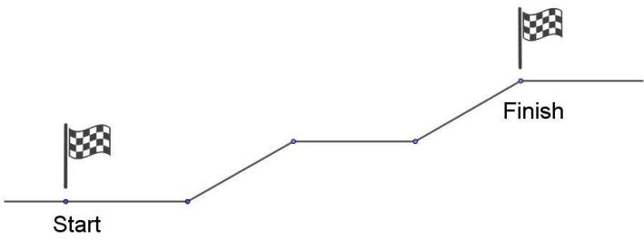</td></tr><tr><td>20</td><td colspan="3">Rafa dan Soni adalah teman sekelas dari kelas I sampai kelas VI. Ketika kelas I, Rafa dan Soni memiliki tinggi badan yang sama. Ketika kelas III, tinggi Rafa bertambah 10%, tinggi Soni bertambah 10 cm. Ketika kelas VI tinggi Soni bertambah 10%, sedangkan tinggi Rafa bertambah 10 cm dibandingkan sewaktu kelas III. Perbedaan tinggi Rafa dan Soni ketika kelas VI adalah ... cm</td></tr><tr><td>21</td><td colspan="3">Lima orang nelayan menyewa satu perahu untuk pergi memancing. Perahu tersebut hanya dapat memuat 3 orang. Jika setiap hari mereka pergi memancing bertiga, maka banyak kelompok nelayan berbeda yang bisa pergi memancing adalah ... kelompok.</td></tr><tr><td>22</td><td colspan="3">Banyak langkah minimal memindah bola dari tiang A ke tiang B sehingga semua bola berpindah ke tiang B dan warna bola berselang-seling adalah...(memindahkan 1 bola dari satu tiang ke tiang yang lain dihitung satu langkah)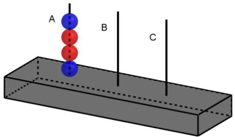</td></tr><tr><td>23</td><td colspan="3">Diketahui <eq>p, q, r</eq> merupakan bilangan bulat dimana <eq>4 \leq p &lt; 6, q &gt; 3</eq>, dan <eq>r \geq 0</eq>. Jika <eq>2p + \frac{1}{2}q + r = 12</eq>, maka banyak susunan berbeda bilangan-bilangan <eq>p, q</eq>, dan <eq>r</eq> adalah ....</td></tr><tr><td>24</td><td colspan="3">Empat kartu bertuliskan huruf J, E, N, dan O disusun sehingga membentuk kode tertentu. Jika kode-kode disusun secaraalfabetis(tersusun menurut abjad) maka EJNO berada di urutan pertama sedangkan ONJE berada di urutan terakhir. Kode yang berada di urutan ke-15 adalah ....</td></tr><tr><td>25No</td><td colspan="3">Diberikan 8 titik seperti pada gambar berikut.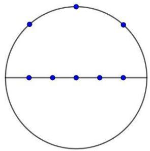Banyak segitiga berbeda yang dapat dibuat dengan menggunakan tiga dari delapan titik tersebut sebagai titik-titik sudutnya adalah .... segitiga.Soal</td></tr><tr><td>1</td><td colspan="3">Perhatikan pola berikut.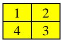 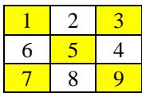 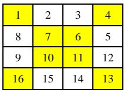 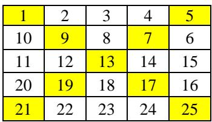Pola 1 Pola 2 Pola 3 Pola 4Jumlah bilangan pada petak-petak warna kuning:Pada pola 1 adalah 10Pada pola 2 adalah 25Pada pola 3 adalah 68Pada pola 4 adalah 117Hitung jumlah bilangan pada petak-petak warna kuning pola 7.</td></tr><tr><td>2</td><td colspan="3">Tulis semua bilangan empat digit 5A3B yang habis dibagi 18.</td></tr><tr><td>3</td><td colspan="3">Bu Hanum membeli baju dengan harga grosir secara online. Harga per lusin baju tersebut adalah Rp1.200.000,00 dengan ongkos kirim Rp10.000,00 per kg. Satu lusin baju tersebut memiliki berat 3,5 kg. Bu Hanum membeli 2 lusin baju dan akan menjual kembali dengan harga satuan Rp150.000,00. Berapakah keuntungan yang diperoleh Bu Hanum, jika seluruh baju terjual?</td></tr><tr><td rowspan="2">4</td><td colspan="3">Bu Eti membuat roti di empat hari yang berbeda. Tabel berikut menunjukkan komposisi Roti Coklat (C) dan Roti Keju (K) yang dibuat oleh bu Eti.Hari Komposisi RotiSenin CKCCKKKSelasa KCCKCCKKRabu KCKCKKamis CKKCCCCKKKK</td></tr><tr><td colspan="3">Hitung persentase tertinggi Roti Coklat yang dibuat bu Eti dari empat hari tersebut.</td></tr><tr><td>5</td><td colspan="3">Diketahui operasi bilangan <eq>a * b = \frac{a+b}{2}</eq>, dan (<eq>( ( ( 0 * c ) * c ) * c ) * c</eq>) * <eq>c</eq> = 1. Tentukan nilai <eq>c</eq>.</td></tr></table>

<table><tr><td>Hari</td><td>Komposisi Roti</td></tr><tr><td>Senin</td><td>CKCCKKK</td></tr><tr><td>Selasa</td><td>KCCKCCKKK</td></tr><tr><td>Rabu</td><td>KCKCK</td></tr><tr><td>Kamis</td><td>CKKCCCCKKKK</td></tr></table>

<table><tr><td>No</td><td colspan="3">Soal</td></tr><tr><td></td><td colspan="3"></td></tr><tr><td>6</td><td colspan="3">Sebuah bak air dengan ukuran <eq>60 \, cm \times 60 \, cm \times 70 \, cm</eq> dalam kondisi kosong. Jika setiap pukul 05.00 bak selesai diisi 45 liter air dan kemudian digunakan untuk mandi mulai pukul 06.00 sehingga pada malam hari berkurang 22 liter, maka pada hari ke berapa dan kapan waktu tepatnya pertama kali bak air akan terisi penuh?</td></tr><tr><td>7</td><td colspan="3">The area of a rectangle ABCD is <eq>14 \, cm^{2}</eq>. It’s consisting of eight identical squares. Find the shaded area.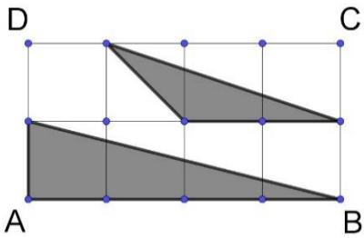</td></tr><tr><td>8</td><td colspan="3">Perhatikan gambar berikut.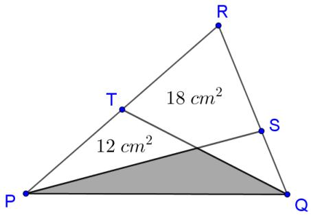Jika panjang <eq>QS: SR = 3:5</eq> dan <eq>T</eq> titik tengah PR, hitunglah luas daerah yang diarsir.</td></tr><tr><td>9</td><td colspan="3">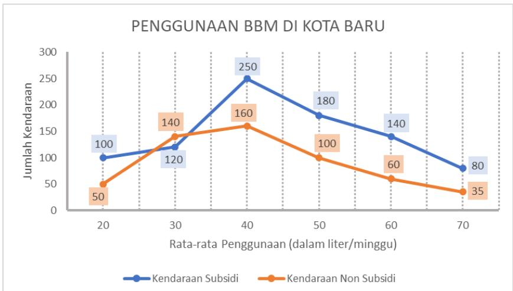Grafik di atas menunjukkan data jumlah kendaraan yang menggunakan Bahan Bakar Minyak (BBM) subsidi maupun non subsidi di Kota Baru. Jika harga BBM subsidi Rp10.000,00 sedangkan harga BBM non subsidi Rp13.000,00, maka berapakah selisih pendapatan per minggu penjualan BBM subsidi dan non subsidi?</td></tr><tr><td>10</td><td colspan="3">Pak Anton memberikan ulangan harian pada kelas A,B dan C dengan perbandingan banyak siswa 13:11:11. Rentang nilai yang diberikan pak Anton adalah 0 – 100. Jika perbandingan nilai rata-rata ulangan kelas A,B dan C adalah 3:2:4, maka tentukan nilai rata-rata terbesar seluruh siswa yang mungkin.</td></tr><tr><td rowspan="8">11</td><td colspan="3">Suatu balapan mobil diikuti lima pembalap, masing-masing menempuh lintasan yang berbeda. Berikut data panjang lintasan dan waktu tempuh kelima pembalap.</td></tr><tr><td>Nama Pembalap</td><td>Panjang lintasan yang dilalui (Meter)</td><td>Waktu tempuh (Menit)</td></tr><tr><td>Ayrton Senna</td><td>54.000</td><td>20</td></tr><tr><td>Michael Schumacher</td><td>45.000</td><td>15</td></tr><tr><td>Lewis Hamilton</td><td>63.000</td><td>30</td></tr><tr><td>Ananda Mikola</td><td>49.000</td><td>a</td></tr><tr><td>Fernando Alonso</td><td>52.000</td><td>26</td></tr><tr><td colspan="3">Bila rata-rata kecepatan dari lima pembalap adalah 147 km/jam, tentukan waktu yang dibutuhkan Ananda Mikola untuk menempuh lintasannya.</td></tr><tr><td>12</td><td colspan="3">Tentukan banyak bilangan ribuan ABCD yang memenuhi semua syarat berikut: i. A, B, C dan D bilangan berbeda ii. A + C bilangan kuadrat iii. B + D bilangan prima iv. Bilangan ABCD kelipatan 9</td></tr><tr><td>13</td><td colspan="3">Diberikan 11 daerah segienam seperti pada gambar. Setiap segienam akan diisi tepat satu dari tiga pilihan huruf: A, B, atau C sehingga setiap dua segienam yang memiliki sisi persekuutuan diberikan huruf yang berbeda. Tentukan banyaknya semua kemungkinan pemberian huruf. 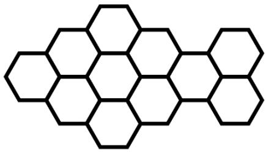</td></tr></table>

## SOAL NOMOR 1

Perhatikan bilangan 1 sampai 12 pada Jam dinding berikut. Angka-angka pada bilangan jam tersebut dapat dikelompokkan menjadi 3, sehingga banyak bilangan minimal 3 serta jumlah bilangan pada masing-masing kelompok tersebut adalah 25, 26 dan 27 seperti gambar berikut: 

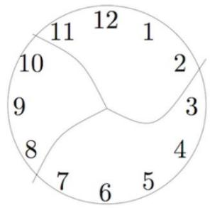

Perhatikan bahwa bilangan 25 jika dibagi 3 bersisa 1, 26 jika dibagi 3 bersisa 2 dan 27 jika dibagi 3 bersisa 0. 

Temukan semua kelompok bilangan pada jam dinding sehingga jika anggota kelompoknya dijumlahkan dan dibagi 3 bersisa 0,1 dan 2. Buatlah ttps://www.calonguru.com/ kelompok bilangan pada lembar Jawab yang tersedia. 

## SOAL NOMOR 2

Perhatikan 4 buah petak 5x1 yang sudah berisi angka-angka. Anda diminta memindahkan angka-angka pada petak tersebut sehingga angka yang ttps://www.calonguru.com/ sama berada pada satu kolom yang sama. Anda bisa memindahkan angka di atas angka yang ada sehingga angka tersebut sama atau kurang dari ttps://www.calonguru.com/ angka di bawahnya. Tuliskan setiap Langkah pemindahan pada lembar jawaban yang telah disediakan. 

<table><tr><td></td><td></td><td></td><td></td></tr><tr><td>3</td><td>2</td><td>1</td><td>1</td></tr><tr><td>1</td><td>4</td><td>4</td><td>2</td></tr><tr><td>2</td><td>3</td><td>3</td><td>4</td></tr><tr><td>1</td><td>2</td><td>3</td><td>4</td></tr></table>

## SOAL NOMOR 3

Paman memiliki lantai yang berbentuk seperti gambar berikut 

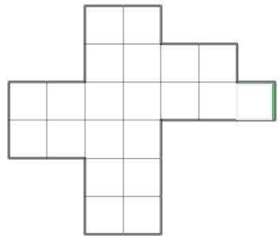

Paman akan memasang menutupi lantai tersebut dengan menggunakan 7 ubin merah, 7 ubin biru dan 7 ubin hijau. https://www.calonguru.com/ https://w 

Pasangkan bentuk lantai-lantai berikut masing-masing dengan 7 ubin merah, 7 ubin biru dan 7 ubin hijau, tetapi beberapa ubin sudah https://www.calonguru.com/ https://www.calonguru. ditentukan tempat memasang nya sebagai berikut. Pemasangan ubin dilakukan dengan cara yang sama, yaitu ubin yang bersisian memiliki warna yang berbeda.https://www 

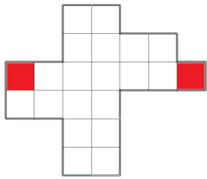

2 ubin merah sudah ditetapkan tempat pemasangannya

B

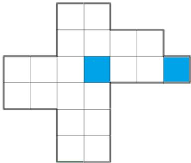

2 ubin biru sudah ditetapkan tempat pemasangannya

(Ket.: biru diganti kuning)

C

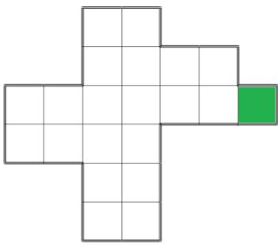

1 ubin hijau sudah ditetapkan tempat pemasangannya dan setiap persegi 2 x 2 memuat 3 warna ubin berbeda.

## SOAL NOMOR 4

Perhatikan petak 7x6 yang berisi bilangan-bilangan berikut. Kalian diminta mengelompokkan 3 petak yang bersisian sehingga jumlah bilangan pada kelompok tersebut prima. Carilah sebanyak mungkin kelompok-kelompok tersebut sehingga tidak ada petak yang berada pada 2 atau lebih kelompok yang berbeda. Tandai tiap kelompok yang kalian peroleh.https://www.calonguru.com/ 

<table><tr><td>Soal</td><td>Contoh menandai kelompok yang diperoleh</td></tr><tr><td>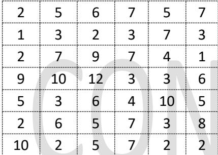</td><td>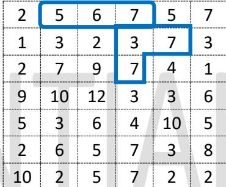</td></tr></table>

## SOAL NOMOR 5

Letakan semua bilangan 1, 2, 3, 4, 5, dan 6 pada petak $\mathsf { X } _ { 1 } , \mathsf { X } _ { 2 } , \mathsf { X } _ { 3 }$ dan pada garis $e _ { 1 } , e _ { 2 } , e _ { 3 }$ sehingga jumlahan tiga bilangan yang menempati dua petak dan satu garis yang menghubungkan kedua petak tersebut sama. Jumlahan tersebut disebut dengan angka ajaib. Tuliskan posisi bilangan yang https://www.calonguru.com/ mungkin sehingga diperoleh 

A. Angka Ajaib 9ttps://www. 

B. Angka Ajaib 10 

C. Angka Ajaib 11 

D. Angka Ajaib 12tps://www. 

Pada lembar Jawab yang tersedia. 

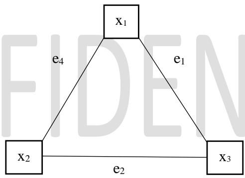

## SOAL NOMOR 6

Diberikan 18 batang korek api yang disusun menjadi 9 segitiga kecil sebagai berikut. 

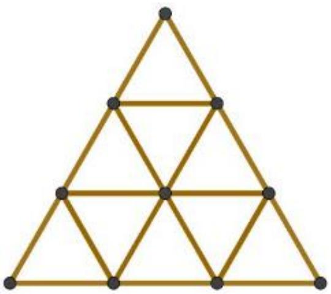

Gambar 1

A. Dari Gambar 1, ambil 4 batang korek api sehingga sisa susunan memiliki segitiga terkecil sebanyak mungkin. Gambarkan sisa susunan tersebut pada lembar jawabhttps://ww 

B. Dari Gambar 1, ambil 5 batang korek api sehingga sisa susunan memiliki segitiga terkecil sebanyak mungkin. Gambarkan sisa susunan tersebut pada lembar Jawab 

C. Dari Gambar 1, ambil 6 batang korek api sehingga sisa susunan memiliki segitiga terkecil sebanyak mungkin. Gambarkan sisa susunan tersebut https://www.calonguru.com/ pada lembar jawab 