## OSN 2024

## OLIMPIADE SAINS NASIONAL

Jakarta, 5 - 11 Agustus 2024 

## MATEMATIKA SD TES EKSPLORASI

## EKSPLORASI

Waktu : 120 menit 

## ww.calonguru. BELAJAR

BALAI PENGEMBANGAN TALENTA INDONESIA 

PUSAT PRESTASI NASIONAL 

KEMENTERIAN PENDIDIKAN, KEBUDAYAAN, 

RISET, DAN TEKNOLOGI 

# Petunjuk Pengerjaan Soal Eksplorasi OSN SD Bidang Matematika Tahun 2024

1. Tuliskan kode peserta di setiap lembar jawab. 

2. Tuliskan nama, sekolah, kabupaten/kotamadya, dan provinsi asal di se-https://www.calonguru.com/ tiap jawaban pada lembar jawab yang tersedia. 

3. Tes eksplorasi terdiri dari enam soal. Masing-masing soal maksimal bernilai enam jika dijawab dengan lengkap dan benar. 

4. Periksa paket soal dan mintalah soal pengganti jika halaman soal tidak lengkap, tulisan tidak terbaca atau gambar tidak jelas kepada petugashttps://www.calonguru.com/ pengawas. 

5. Gunakan area kosong pada lembar soal untuk melakukan perhitungan. 

6. Waktu yang disediakan untuk mengerjakan semua soal adalah 120 menit. 

7. Tulislah jawaban yang sesuai pada lembar jawaban yang telah disediakan. 

8. Peserta diperkenankan menggunakan alat peraga yang diberikan dalam menjawab setiap pertanyaan (jika diperlukan). Pilihlah alat peraga yang sesuai untuk setiap soalnya. 

9. Bekerjalah dengan cermat dan rapi. 

10. Tuliskan jawaban dengan menggunakan pulpen tinta hitam atau biru atau alat tulis yang disediakan panitia, bukan pensil. 

11. Mulailah bekerja setelah pengawas memberi tanda mulai dan berhentilah bekerja setelah pengawas memberi tanda berhenti.https://www.calonguru.com/ 

12. Selama tes berlangsung, peserta dilarang:https://www.calonguru.co 

(a) Menanyakan jawaban soal kepada siapapun;https://www.calonguru.com/ 

(b) Menggunakan catatan, alat bantu hitung, dan buku (kecuali ka-https://www.calonguru.com/ mus Inggris-Indonesia); 

(c) Bekerjasama dengan peserta lain; 

(d) Memberi atau menerima bantuan dalam menjawab soal; 

(e) Memperlihatkan pekerjaan sendiri kepada peserta lain atau melihat pekerjaan peserta lain; 

(f) Membawa naskah soal keluar dari ruang ujian;https://www.calonguru.com/ 

(g) Menggantikan atau digantikan oleh orang lain. 

Jika peserta melakukan salah satu pelanggaran tersebut, maka yanghttps://www.calonguru.com/ bersangkutan didiskualifikasi. 

SELAMAT BEKERJA 

## SOAL EKSPLORASI

1. Diberikan menara Hanoi dan 4 kubus. Masing-masing kubus tertulis be-https://www.calonguru.com/ ratnya yaitu: ${ \begin{array} { l } { { \frac { 6 } { 7 } } } \end{array} } k g , 7 5 1 \ g , { \frac { 7 0 } { 8 } }$ ons, dan ${ \begin{array} { l } { { \frac { 5 } { 6 } } } \end{array} } k g .$ . Pasangkan kubus di tiang I dari bawah ke atas dengan susunan 56 kg, 708 ons, 751 g, dan 67 kg.com/ 

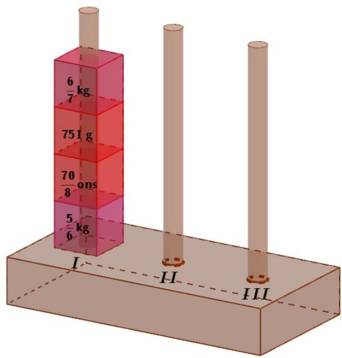

Pindahkan susunan kubus pada tiang I ke tiang III dengan syarat: 

a. Kubus hanya boleh dipindahkan satu-persatu. 

b. Pemindahan satu kubus dihitung sebagai satu langkah. 

c. Susunan kubus di tiang I bebas. 

d. Susunan kubus di tiang II dan III harus diletakkan berurutan darihttps://www.calonguru.com/ berat ke ringan dari bawah ke atas.tps://www.calonguru.co 

e. Terakhir, semua kubus harus tersusun di tiang III.https://www.calonguru.com/ 

Carilah banyak langkah minimal memindahkan susunan kubus dari tiang I ke tiang III. Tuliskan setiap langkah yang kalian lakukan pada lembar jawab yang tersedia. 

2. Diberikan 24 keping segitiga sama sisi bernomor sebagai berikut. 

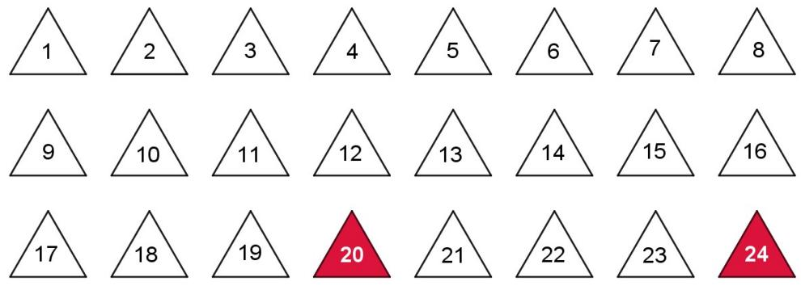

Susunlah dua segitiga sama sisi yang masing-masing terdiri dari empat keping, dengan keping bernomor 20 dan 24 berada di tengah seperti gambar berikut, sehingga $a + b + c = 2 0$ dan $d + e + f = 2 4$ . 

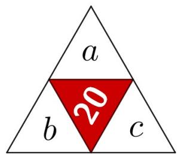

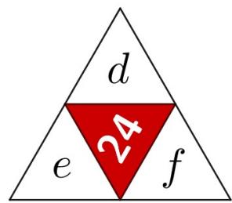

Pertanyaan: 

a. Misalkan https:// $D = a \times b \times c + d \times e \times f$ . Cari enam keping segitigam/ $a , b , c , d , e$ dan f agar D maksimum. 

b. Ulangi pertanyaan a. untuk mencari D maksimum berikutnya dengan syarat enam keping segitiga yang sudah terpakai di a. tidak boleh digunakan lagi.https://www.ca 

Tuliskan susunan-susunan tersebut pada lembar jawab yang tersedia.https://www.calonguru.com/ 

3. Diberikan 27 kubus satuan yang berwarna kuning, merah, dan hijau de-https://www.calonguru.com/ ngan masing-masing sebanyak 9. Susunlah kubus-kubus satuan tersebut menjadi kubus $3 \times 3 \times 3$ sehingga tidak terdapat dua kubus dengan warna sama yang bersisian.ttps://www.ca 

Berikut contoh dua kubus warna hijau yang bersisian. 

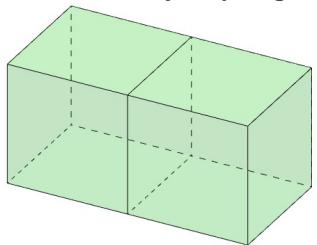

Berikut contoh dua kubus warna hijau yang tidak bersisian. 

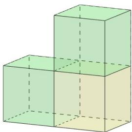

Gambarkan susunan tersebut dengan memberikan warna pada lembar jawab yang tersedia. 

4. Warnailah sepuluh persegi yang bersisian pada gambar di bawah ini,https://www.calonguru.com/ sehingga membentuk satu bangun datar yang kelilingnya maksimal. Buatlah sebanyak mungkin bangun yang terbentuk pada lembar jawab yanghttps://www.calonguru.com/ tersedia.https:/ 

<table><tr><td></td><td></td><td></td><td></td></tr><tr><td></td><td></td><td></td><td></td></tr><tr><td></td><td></td><td></td><td></td></tr><tr><td></td><td></td><td></td><td></td></tr></table>

Bangun yang memiliki bentuk sama bila diputar atau dicerminkan memiliki bentuk sama dianggap satu bangun. Berikut adalah contoh pewarnaan bangun yang dihitung satu. 

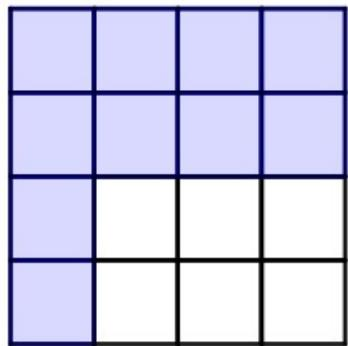

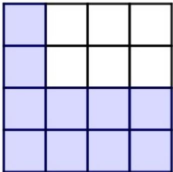

5. Diberikan enam persegi panjang A, B, C, D, E, dan F. Masing-masing persegi panjang tersebut dituliskan bilangan bulat pada keempat sisinya sebagai berikut. 

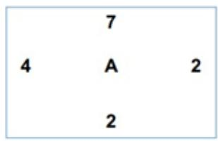

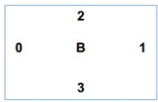

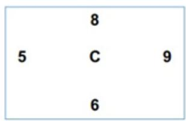

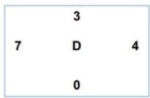

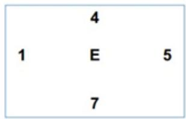

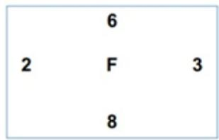

Susunlah persegi panjang tersebut sebanyak mungkin ke dalam masing-tps://www.calonguru.com/ masing bentuk Posisi 1, 2, 3, 4, 5, dan 6 sebagai berikut.tps://www.calonguru.com/ 

a. Pilih dua persegi panjang dan susun seperti Posisi 1 berikut ini,ps://www.calonguru.com/ sisi yang bersisian memiliki angka yang sama. Buatlah Posisi 1 sebanyak mungkin. 

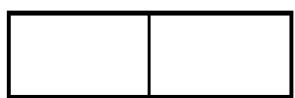

Posisi1

b. Pilih dua persegi panjang dan susun seperti Posisi 2 berikut ini, sisi yang bersisian memiliki angka yang sama. Buatlah Posisi 2 sebanyak mungkin. 

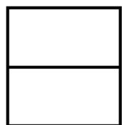

Posisi 2

c. Pilih tiga persegi panjang dan susun seperti Posisi 3 berikut ini, sisi yang bersisian memiliki angka yang sama. Buatlah Posisi 3 sebanyak mungkin.ps://www.cal 

<table><tr><td></td><td></td><td></td></tr></table>

u.com

d. Pilih empat persegi panjang dan susun seperti Posisi 4 berikut ini, sisi yang bersisian memiliki angka yang sama. Buatlah Posisi 4 sebanyak mungkin. 

<table><tr><td></td><td></td><td></td></tr><tr><td></td><td colspan="2"></td></tr></table>

Posisi 4

e. Pilih lima persegi panjang dan susun seperti Posisi 5 berikut ini, sisi yang bersisian memiliki angka yang sama. Buatlah Posisi 5 sebanyak mungkin. 

<table><tr><td></td><td></td><td></td></tr><tr><td></td><td></td><td></td></tr></table>

u.com

f. Pilih enam persegi panjang dan susun seperti Posisi 6 berikut ini, sisi yang bersisian memiliki angka yang sama. Buatlah Posisi 6 sebanyak mungkin.s://www.calo 

<table><tr><td></td><td></td><td></td></tr><tr><td></td><td></td><td></td></tr></table>

Posisi 6

6. Diberikan angka 0, 1, 2, 3, 4, 5, 6, 7, 8, 9 masing-masing sebanyak dua. Sebagian angka telah diletakkan seperti pada gambar berikut. 

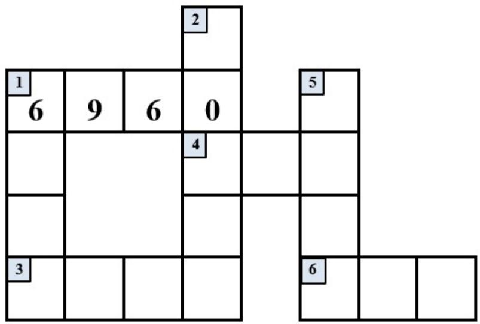

Letakkan sisa angka-angka tersebut pada petak-petak di atas sehingga memenuhi pernyataan-pernyataan berikut. 

<table><tr><td colspan="2">Mendatar</td><td colspan="2">Menurun</td></tr><tr><td>3</td><td>Bilangan ribuan kelipatan 15 yang angka-angkanya prima.</td><td>1</td><td>Bilangan genap yang tepat memiliki 2 faktor prima.</td></tr><tr><td>4</td><td>Bilangan Palindrom kuadrat.</td><td>2</td><td>Bilangan ganjil kelipatan 9.</td></tr><tr><td>6</td><td>Bilangan Palindrom kubik.</td><td>5</td><td>Bilangan yang habis dibagi 37 dan 73.</td></tr></table>

Keterangan: Palindrom adalah rangkaian bilangan yang terbaca sama, baik dari kiri maupun kanan 