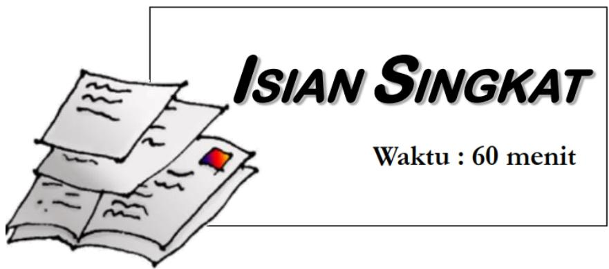
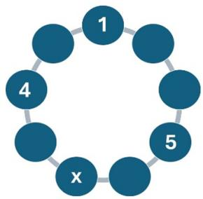
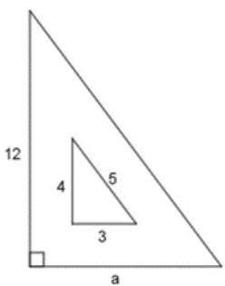
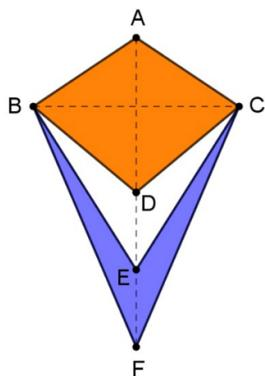
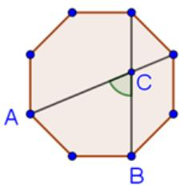
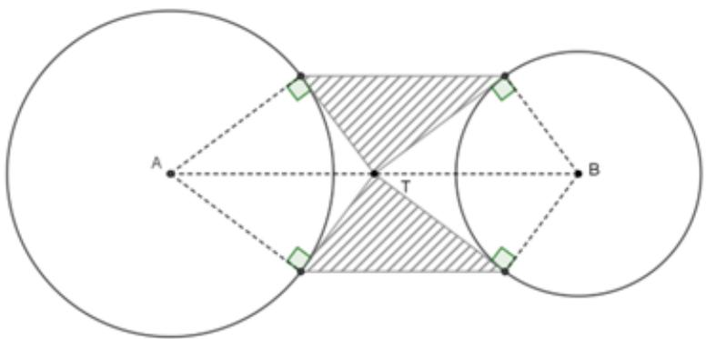
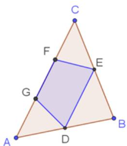
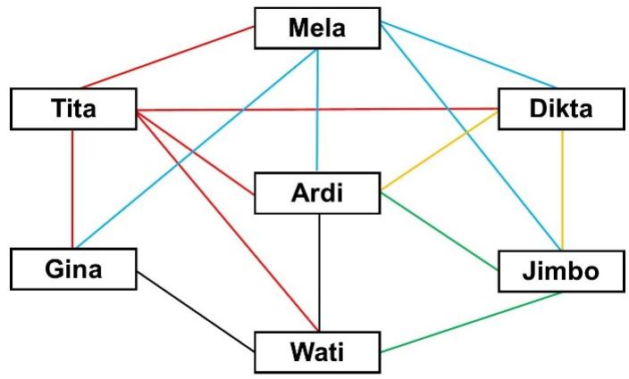

## MATEMATIKA SD TES TEORI I

## MERDEKA BELAJAR

BALAI PENGEMBANGAN TALENTA INDONESIA PUSAT PRESTASI NASIONAL KEMENTERIAN PENDIDIKAN, KEBUDAYAAN, RISET, DAN TEKNOLOGI 

# Petunjuk Pengerjaan Soal Isian Singkat OSN SD Bidang Matematika Tahun 2024tps://www.calonguru.com/

1. Tuliskan kode peserta, nama, nama sekolah, kabupaten/kotamadya, dan provinsi asal di lembar jawab yang telah disediakan. 

2. Tes isian singkat terdiri dari 25 soal. Masing-masing soal bernilai satu jika dijawab dengan benar dan bernilai 0, jika jawaban salah atau tidakps://www.calonguru.com/ dijawab. 

3. Periksa paket soal dan mintalah soal pengganti jika halaman soal tidak lengkap, tulisan tidak terbaca atau gambar tidak jelas kepada petugas pengawas. 

4. Gunakan area kosong pada lembar soal untuk melakukan corat-coret perhitungan. 

5. Waktu yang disediakan untuk mengerjakan semua soal adalah 60 menit. 

6. Beberapa soal ditulis menggunakan Bahasa Inggris. Peserta diperbolehkan menjawabnya menggunakan Bahasa Indonesia. 

7. Tulislah hanya jawaban akhir tepat di dalam petak yang disediakan pada lembar jawaban.tps://www. 

8. Bekerjalah dengan cermat dan rapi.https://www.calonguru.co 

9. Jawaban hendaknya kalian tuliskan dengan menggunakan pulpen tinta hitam atau biru, bukan pensil. 

10. Mulailah bekerja setelah pengawas memberi tanda mulai dan berhentilah bekerja setelah pengawas memberi tanda berhenti. 

11. Selama tes berlangsung, peserta dilarang: 

(a) Menanyakan jawaban soal kepada siapapun; 

(b) Menggunakan catatan, alat bantu hitung, dan buku (kecuali ka-https://www.calonguru.com/ mus Inggris-Indonesia); 

(c) Bekerjasama dengan peserta lain; 

(d) Memberi atau menerima bantuan dalam menjawab soal; 

(e) Memperlihatkan pekerjaan sendiri kepada peserta lain atau melihathttps://www.calonguru.com/ pekerjaan peserta lain;ps://www.calon 

(f) Membawa naskah soal keluar dari ruang ujian; 

(g) Menggantikan atau digantikan oleh orang lain.https://www.calonguru.com/ 

Jika peserta melakukan salah satu pelanggaran tersebut, maka yanghttps://www.calonguru.com/ bersangkutan didiskualifikasi. 

SELAMAT BEKERJA 

## SOAL ISIAN SINGKAT

1. Gida menuliskan bilangan 1, 2, 3, 4, 5, 6, 7, 8, dan 9 pada tiap-tiap lingkaran di bawah ini. Bilangan 1, 4, dan 5 sebagai patokan untuk meletakan bi-tps://www.calonguru.com/ langan lainnya. Setiap jumlah dua bilangan pada lingkaran terdekattps://www.calonguru.com/ tidak habis dibagi 3, 5, dan 7. Bilangan x adalah · · · . 

2. Perhatikan dua buah segitiga siku-siku berikut: 

Jika perbandingan luas segitiga bagian dalam dan luar sebesar $1 : 5 :$ , maka panjang sisi a adalah · · · satuan panjang. 

3. Arhan rutin latihan basket 1 jam 15 menit selama 5 hari dan 1 jam 30 menit selama 3 hari. Rata-rata latihan Arhan selama 9 hari adalah 85 menit perhari. Lama waktu latihan Arhan pada hari ke sembilan adalah · · · menit. 

4. Kejuaraan perebutan Piala Thomas 2024, Indonesia memiliki 6 pemain badminton spesialis ganda putra yaitu A, B, C, D, E dan F . Banyak tim ganda putra yang dapat dibentuk oleh Indonesia adalah · · · .https://www.calonguru.com/ 

5. Let a and b are positive integers. If https://www.calonguru $\frac { 2 3 \times a } { 5 \times b } = 2 0 . 2 4$ then the smallest value ofh $a + b$ is · · · .s://w 

6. Ani, Badu dan Jamil mengikuti latihan piano di tempat yang sama. Ani,https://www.calonguru.com/ Badu dan Jamil mengikuti latihan piano berturut-turut setiap 3, 4 dan 6 hari sekali. Jika Ani, Badu, dan Jamil berlatih bersama-sama pada hari Senin, maka setelah itu mereka akan berlatih bersama-sama pertama kali pada hari · · · . 

7. If $p = 3 5$ and $q = 7 7$ , then the greatest prime factor of $1 7 \times ( 6 \times p + 4 \times q )$ equals to · · · .tps://www 

8. Perhatikan layang-layang ABFC yang luasnya 100 https://www.calonguru.com/ $c m ^ { 2 }$ 

Jika BC: $\mathrm { A F = 1 { : } 2 }$ , DE: EF= 1:1 dan D titik tengah AF, maka luas daerah berwarna putih adalah $\cdots \ c m ^ { 2 }$ . 

9. Berikut adalah data ukuran sepatu siswa di SD Permata Bunda kelas I V, V, dan V I . 

<table><tr><td>No</td><td>Ukuran sepatu</td><td>Banyak siswa</td></tr><tr><td>1</td><td>35</td><td>5</td></tr><tr><td>2</td><td>36</td><td>9</td></tr><tr><td>3</td><td>37</td><td>17</td></tr><tr><td>4</td><td>38</td><td>15</td></tr><tr><td>5</td><td>39</td><td>21</td></tr><tr><td>6</td><td>40</td><td>13</td></tr><tr><td>7</td><td>41</td><td>9</td></tr><tr><td>8</td><td>42</td><td>3</td></tr></table>

Nilai tengah dari data ukuran sepatu tersebut adalah · · · . 

10. Toni mengikuti seleksi calon peserta OSN tingkat sekolah. Untuk diterima sebagai peserta, dia harus mengikuti 5 kali tes dengan syarat:https://www.calonguru.com/ 

- rata-rata dari 5 kali tes paling sedikit 85,5;ttps://www.calonguru.com/ 

- selisih nilai terbesar dan terkecil paling sedikit 7.ttps://www.calonguru.com/ 

Toni sudah mengikuti tes sebanyak 4 kali dengan nilai 82, 83, 87 dan 85.https://www.calonguru.com/ Nilai yang diperolah Toni setiap tes adalah bilangan bulat. Agar Tonihttps://www.calonguru.com/ diterima sebagai peserta OSN, maka nilai tes kelima yang harus dicapai Toni paling sedikit adalah · · · . 

11. Gambar berikut merupakan segi delapan beraturan. 

Besar sudut ACB sama dengan · · · derajat. 

12. Dua bilangan positif jumlahnya sama dengan 6, pangkat tiga bilangan pertama sama dengan pangkat enam bilangan kedua. Hasil kali kedua bilangan tersebut adalah · · · .ttps://www.calongu 

13. Hasil penjumlahan semua bilangan genap yang bukan kelipatan 3 danhttps://www.calonguru.com/ kurang dari 201 adalah · · · . 

14. Pak Doni memberikan tugas kepada murid-muridnya untuk memberikan warna pada gambar di bawah ini. Setiap bangun yang bersisian tidak boleh diberikan warna yang sama (dua bangun bersisian jika memiliki paling sedikit satu sisi yang sama). Segi lima hanya boleh diberi warna merah, kuning atau biru, sedangkan segi empat hanya boleh diberikan warna hijau atau ungu. 

Banyak susunan warna yang mungkin dibuat oleh murid-murid Pak Doni adalah · · · . 

15. Banyak bilangan ratusan yang dibentuk dari tiga angka berbeda dari 2, 3, 5 dan 6 serta habis dibagi 4 adalah · · · . 

16. Pak Sutejo memiliki lahan perkebunan. Setengah lahannya ditanami kopi dan sepertiga ditanami coklat. Seperlima sisa lahan ditanami sayu-https://www.calonguru.com/ ran. Jika sisa lahan setelah ditanami kopi, coklat dan sayuran adalah 600 $m ^ { 2 }$ , maka luas lahan Pak Sutejo yang ditanami coklat adalah · · · $m ^ { 2 }$ . 

17. Yulia lahir pada hari Kamis bulan Juli tahun 2023. Ulang tahun Yulia ke-17 bertepatan pada hari · · · . 

18. Perhatikan gambar berikut. 

Diketahui lingkaran dengan titik pusat A dan B berturut-turut berjarijari 4 cm dan $3 ~ c m$ . Jika T titik tengah ruas garis AB dan jarak dua titik pusat lingkaran 10 cm, maka luas daerah yang diarsir adalah · · ·https://www.calongur $c m ^ { 2 }$ . 

19. Diketahui segitiga ABC. Titik D dan E berturut-turut titik tengah ABhttps://www.calongur dan BC, titik F dan G pada AC sehingga $\mathrm { C F } = \mathrm { F G } = \mathrm { G A }$ . Jika luas segitiga $\mathrm { A B C } = 1 2 c m ^ { 2 }$ , maka luas segiempathttps $\mathrm { D E F G } = \cdot \cdot \cdot \ c m ^ { 2 }$ . 

20. Suatu bilangan kuadrat sempurna, terdiri dari empat angka, dua angka pertama adalah sama, dan dua angka terakhir juga sama. Bilangan tersebut adalah · · · .tps://www.cal 

21. Jumlah tabungan Fauzan, Afifah dan Annisa adalah Rp2.620.000, 00.https://www.calonguru.com/ Tabungan Fauzan 125% dari tabungan Afifah dan tabungan Fauzan 90% dari tabungan Annisa. Perbandingan tabungan Afifah dan Annisa adalah · · · .tps://ww 

22. Perahu kecil meninggalkan perahu besar ke arah utara menuju suatuhttps://www.calonguru.com/ target dengan kecepatan 80 km/jam. Pada saat yang sama perahu besar bergerak ke arah timur dengan kecepatan 40 km $, / j a m$ . Apabila perahu kecil hanya mempunyai bahan bakar yang cukup untuk 4 jam, maka jarak maksimum target yang dituju agar ia kembali ke perahu besar adalah · · · . 

23. Berikut ini adalah diagram yang menggambarkan hari kunjungan ke perpustakaan sekolah. 

Garis sewarna menunjukkan hari berkunjung yang sama. Selain Ardi, siswa-siswa yang pernah berkunjung bersama dengan setiap siswa yang lain adalah · · · . 

24. Di suatu negara, plat mobil terdiri dari 3 digit berbeda dipilih dari angka 1, 2, 3, 4, 6 dan 8, diikuti 2 huruf berbeda dipilih dari kata MOBILER. Jika nomor plat harus memuat angka 4, 8 dan M, maka banyak plat berbeda adalah · · · . 

25. Tim pelari estafet Petir beranggotakan A, B, C, D, E dan F yang berturut-https://www.calonguru.com/ turut memiliki kemampuan berlari 8, 10, 12, 10, 6 dan 5 meter per detik. Pelatih Tim Petir memilih lima wakil untuk bertanding melawan Timhttps://www.calonguru.com/ Kilat. Tim Kilat memiliki waktu terbaik untuk lintasan 5 × 80 meterhttps://www.calonguru.com/ yaitu 54 detik. Agar tim Petir dapat mengalahkan Tim Kilat dengan selisih waktu paling sedikit 2 detik, maka banyak kombinasi lima pelari Tim Petir yang dapat dibentuk adalah · · · .https://www.calonguru.com/ 